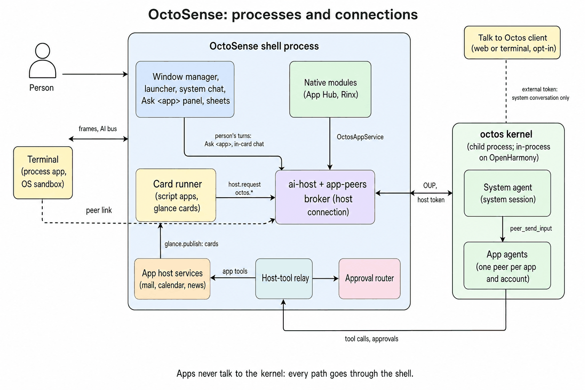
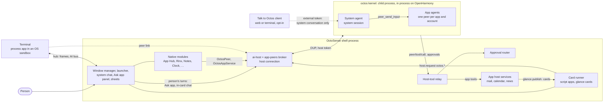
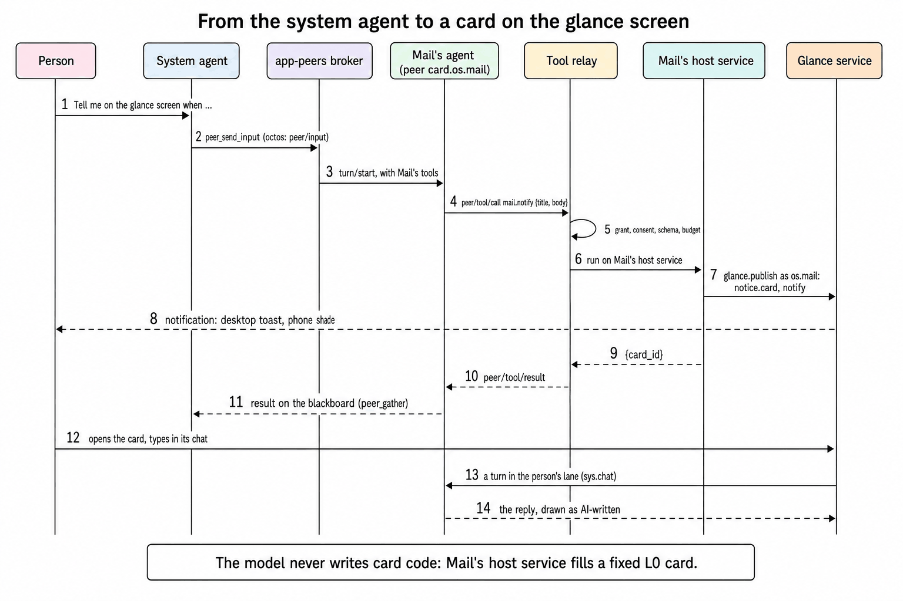
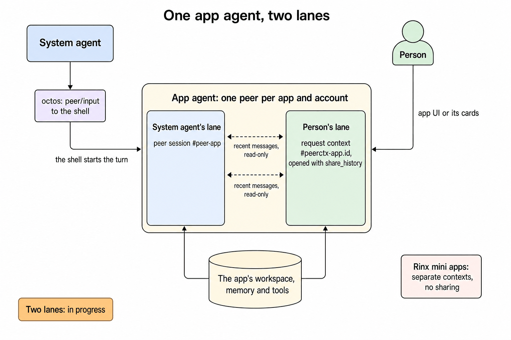
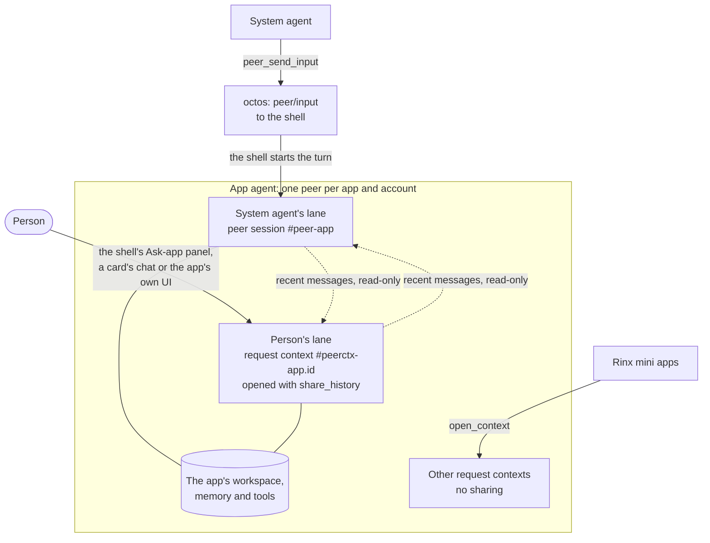
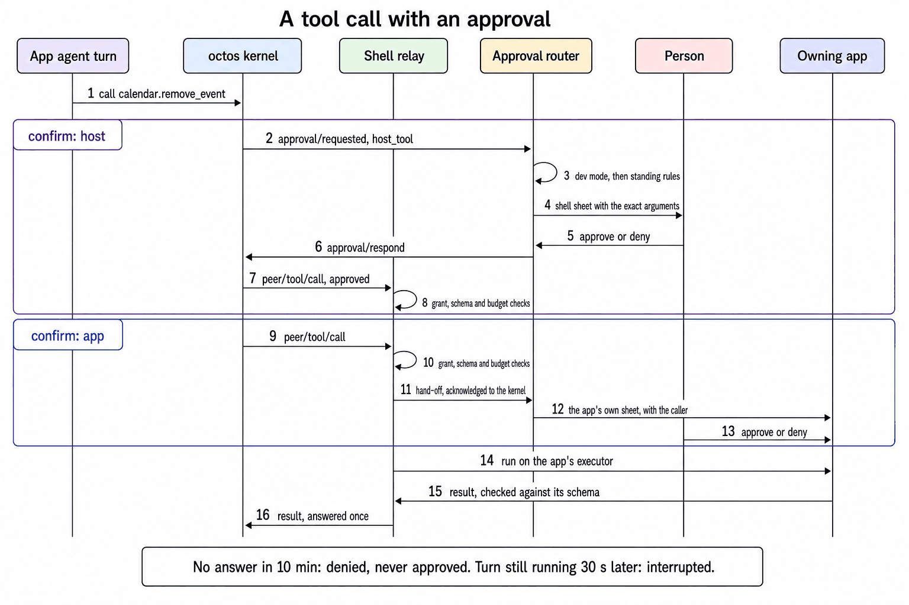
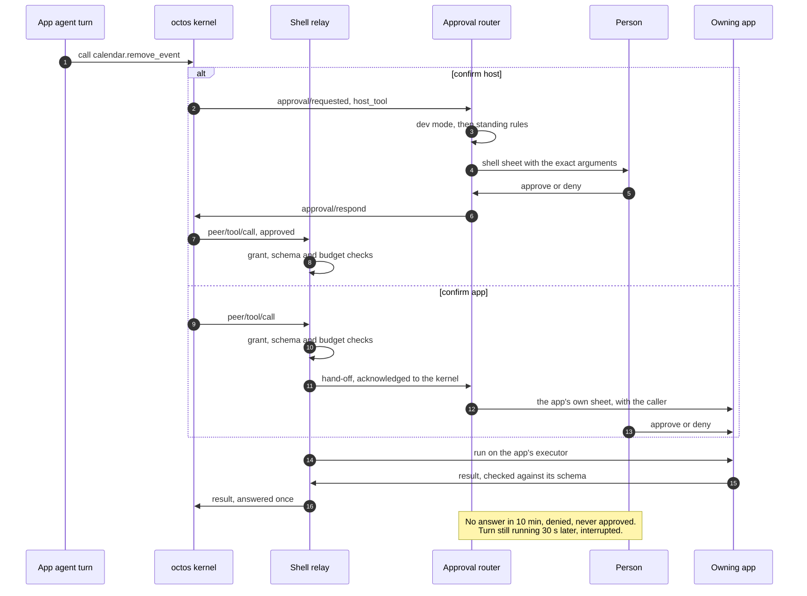

# OctoSense


English | [简体中文](README.zh-CN.md)

OctoSense is an agent shell that runs on top of an ordinary operating system. On screen it is a launcher and apps that look like the ones you know. Behind them, one AI kernel runs a **system agent** that works for the person and an **app agent** for each app that has one. Agents reach apps, and risky actions reach the person, only through the shell.

This repository holds the shell, its services, the system apps, and the three products built from them. Most native apps come from other repositories: the OctoSense fork of Makepad, App Hub and Rinx ([What it depends on](#what-it-depends-on)).

| Product | What it is | Where |
| --- | --- | --- |
| **OctoSense desktop** | The shell as one Makepad window on macOS (Windows and Linux untested) | [`desktop/`](desktop/README.md) |
| **OctoSense Home** | The phone shell, an ordinary Home app for any Android phone (also OpenHarmony and the iOS simulator) | [`phone/`](phone/README.md) |
| **OctoSense ROM** | LineageOS 22.2 for the OnePlus 6 with Home, the privileged system bridge, Quickstep and SystemUI preinstalled | [`rom/`](rom/README.md) |

> **Building an app?** You don't need this repository to build, check or publish one. Start with [OctoScript-App-Design-Flow](https://github.com/OctoSense-org/OctoScript-App-Design-Flow) (`AGENTS.md`, then `docs/QUICKSTART.md`) and [OctoSense-App-Hub](https://github.com/OctoSense-org/OctoSense-App-Hub). The system apps in [`apps/`](apps/README.md) are complete examples. Build the desktop shell from here only to try your app in a shell before you publish it ([PUBLISHING §4](https://github.com/OctoSense-org/OctoScript-App-Design-Flow/blob/main/docs/PUBLISHING.md#4-rehearse-the-store-path-locally)).

## Key concepts

| Term | What it means here |
| --- | --- |
| **octos** | An open-source agent kernel written in Rust ([octos-org/octos](https://github.com/octos-org/octos)). It runs agent *sessions*: a conversation with a model, with its own tools, memory and workspace folder. A session can own other sessions, called *peers*. OctoSense runs one octos per device. |
| **OUP** | The octos UI protocol: JSON-RPC 2.0 messages (`octos-ui/v1alpha1`) between octos and its clients, normally over the kernel's stdin and stdout. |
| **Shell** | The one OctoSense process on a device. It draws everything, hosts the apps and holds the only full connection to octos. Desktop and phone build the same crate, `crates/shell`. |
| **System agent** | The person's assistant: one octos session that owns and supervises every app agent. |
| **App agent** | An octos peer for one app and one account, so Mail with two accounts has two agents. Each has its own memory, transcript, model and tool list, and usually a folder to work in. |
| **Lane** | One of an app agent's two conversations, which run side by side: the system agent's lane, and the person's lane, which also carries the turns the app starts itself. |
| **Native app** | A Rust app built with Makepad and listed in [`native-apps.json`](native-apps.json). It runs inside the shell as a module, or as its own sandboxed process (the Terminal on the desktop). |
| **Script app** | An OctoScript bundle: a manifest, a UI written in Splash (Makepad's UI script language) and, optionally, its agent's tools in `tools.json`. It reaches the shell only through `host.request`. The system apps (Mail, Calendar, News and the rest) and every store app are script apps. |
| **Card runner** | App Hub's runtime for script apps, inside the shell process: one isolated script VM per app instance, with its own file jail and quota. |
| **Host service** | Rust code in the shell that answers one family of `host.request` calls (`mail.*`, `calendar.*`) and runs that app's agent tools. |
| **Peer link** | How native apps other than Rinx talk to their own agent through the shell: Makepad's `OctosPeer` client, carried over the app's hub connection when it is a process, or over an in-memory channel when it is a module. |
| **Glance card** | A small card an app or its agent posts to the glance panel (desktop) or glance page (phone). It is either an L0 card (declarations only: the host fills in the data, and there are no expressions or calls) or a Splash script. |
| **Approval router** | The shell code that decides whether a tool call runs, needs the person, or is refused. |

To read the code in order, start with [From an app window to an agent turn](docs/architecture-walkthrough.md). The [product walkthrough](desktop/docs/code-walkthrough.md) adds how to run each product.

Connected App Hub samples share a host-owned GitHub/Google OAuth service, without an OctoSense account. Start with the [service and sample guide](crates/oauth-service/README.md) and [ADR 0010](docs/adr/0010-shared-oauth-and-connected-apps.md). GitHub Notes reuses Rinx’s Markdown editor; Inbox Assistant and Google Calendar are ordinary bundles. **Provider login requires distributor-supplied OAuth registrations.** Existing beta.2 downloads contain none; an operator must supply the private host `oauth/clients.json` override or build with the [registration settings](crates/oauth-service/README.md#configure-a-release-maintainers). Ordinary app users should receive a configured build. A [macOS test-account Calendar login/save](tools/connected-e2e/evidence/calendar-login-20261007.json) passed on its recorded build; this is not public Google verification. Google sign-in on Android still needs its native adapter.

## How it fits together

One shell process per device, one octos kernel per shell, and every agent is a session in that kernel. The shell is the kernel's only full client. It starts octos and holds its host token, starts every app agent's turns, relays every call to an app's tools, and owns every approval. Apps never talk to the kernel.



<details><summary>Text version (Mermaid)</summary>



</details>

- **The shell** hosts the window manager, the native apps, the Card runner with the script apps, the system chat, the approval router and the host-tool relay. Its AI side is [`crates/ai-host`](crates/ai-host/README.md), with the [app-peers broker](crates/app-peers/README.md) that drives each app agent.
- **The octos kernel** ([`crates/kernel`](crates/kernel/README.md)) starts on its first connection and exits with the shell. On the desktop and Android it is a child process that speaks OUP over stdio; on OpenHarmony it runs inside the shell; iOS has none. The person picks models and enters keys in the **AI providers** app, on host sheets. Keys stay with the shell (in the macOS keychain, elsewhere in a file in the shell's own data) and never reach an app.
- **Process apps** run outside the shell in an OS sandbox (Seatbelt on macOS, Landlock and seccomp on Linux, none yet on Windows). Today those are the Terminal and Task (Task Manager, which has no agent), on a desktop built from a checkout; release packages don't ship their binaries yet, so there the Terminal runs inside the shell and Task is absent. The Terminal sends its frames over the shell's local hub and reaches its agent over the peer link on the same connection.
- **External clients** (Talk to Octos, opt-in) can use the system conversation from a browser or a terminal with a limited token. They get no app agent, no `peer/*` method and no host tool.

The opt-in AppCard prototype is the one exception to all this: it opens its own kernel connection instead of going through the broker. For the full picture with code paths, read [docs/architecture.md](docs/architecture.md); for the trust model and how to test the AI services locally, [docs/ai-services.md](docs/ai-services.md); for the decisions behind it, [ADR 0004](docs/adr/0004-native-apps-hosting-and-peers.md).

### The system agent and the app agents

**The system agent** is the octos session `_main:api:octosense#system`. The person talks to it in the system chat: F8 or the dock's Assistant icon on the desktop, the Assistant tile on the phone. It has two sets of tools:

- **Its own kernel tools**, the fixed list in [`SYSTEM_AGENT_TOOLS`](crates/kernel/src/system_tools.rs): the `peer_*` tools to supervise app agents, plus files in its own workspace, memory, questions to the person and web search. octos's own shell tools are never on it.
- **Host tools from the shell**: `agents.list` and `agents.ask` to find app agents and ask the person to allow one, `agents.provision` and `agents.status` to run Mail's new-mail automation, `terminal.run` while Setup's Command execution switch is on and the Terminal runs as its own sandboxed process, and the read tools native apps share with it (the table's last column).

The system agent can never approve a tool call; only the person can.

**An app agent** exists once the person allows it, on a sheet shown once per app. When it runs depends on the kind of app:

- A **script app's** agent is prepared as soon as it is allowed, and again at each startup, with the app's tools registered, so the system agent's `peer_list` sees it even while the app is closed.
- A **native app's** agent belongs to the app's open window and is live only while the app is open; its memory and transcript persist between openings. Its tools run in that window too: with Notes closed, a call answers "Open Notes first".

Signing out keeps an agent. Removing the account or uninstalling the app erases its transcripts and memory.

These apps have an agent:

| App | Kind | Its agent's own tools | What the system agent may call |
| --- | --- | --- | --- |
| Rinx (Matrix chat) | native, in the shell | octos's file, memory and web tools | – |
| Terminal (desktop) | native; its own process in a checkout build, inside the shell in a release package | `terminal.read_screen`, `terminal.read_scrollback` | `terminal.run`, only while it runs as its own sandboxed process, behind Setup's switch, approved per command |
| Calculator, Clock, Notes, Reminders, Weather | native, in the shell | each app's read tools | the same read tools |
| App Hub | native, in the shell | `apphub.search`, `apphub.installed`, `apphub.updates`, read only: installs and updates stay on App Hub's own screens | the same read tools |
| Mail | script app | `mail.*` tools scoped to the signed-in account: reads, cards (`mail.publish_card`), and reply drafts it can propose but never send | – |
| Calendar | script app | `calendar.events`, `calendar.add_event`, `calendar.remove_event` (asks first), `calendar.notify`, `calendar.agenda` | – |
| News | script app | `news.list`, `news.read`, `news.notify` | – |
| Photos, Maps, YouTube; Camera on phones | script apps | `<app>.notify` | – |

AI providers has no agent.

### How the system agent and an app agent talk

The system agent never runs an app's tools itself. It asks the app's agent to do the work:

1. The system agent calls `peer_send_input` with the request in plain words.
2. octos does not run that turn on its own. It passes it to the shell as a `peer/input` event.
3. The shell starts the turn on the app agent's session, with the app's tools, memory and approval rules. It refuses the input if the person has not allowed the agent or the account is signed out.
4. The result lands on the peers' shared *blackboard*, where the system agent reads it with `peer_gather`.

Here the person asks for a heads-up on the glance screen, and Mail's agent posts a card:



<details><summary>Text version (Mermaid)</summary>

```mermaid
sequenceDiagram
  autonumber
  actor P as Person
  participant S as System agent
  participant B as Shell: app-peers broker
  participant A as Mail's agent (kernel-issued peer)
  participant R as Shell: tool relay
  participant M as Mail's host service
  participant G as Shell: glance service
  P->>S: "Tell me on the glance screen when ..."
  S->>B: peer_send_input (octos delivers peer/input)
  B->>A: turn/start on the peer's session, with Mail's tools
  A->>R: peer/tool/call mail.notify {title, body}
  R->>R: grant, consent, schema, budget
  R->>M: run on Mail's host service
  M->>G: glance.publish as os.mail: notice.card, notify
  G-->>P: desktop: a toast and the glance panel; phone: a shade notification
  M-->>R: {card_id}
  R-->>A: peer/tool/result
  A-->>S: the turn's result on the blackboard (peer_gather)
```

</details>

The `<app>.notify` tools fill a fixed card template ([`notice.card`](crates/shell/resources/glance/notice.card), or Calendar's [event and agenda cards](apps/calendar/host-service/resources)), so the model writes only the text. Mail also has `mail.publish_card`, which takes a card the model wrote and checks it before publishing. Either way the shell publishes as the app and requires its `glance` permission.

Mail's agent can also start on its own. Once the person has signed in, allowed Mail's agent and asked the system agent to turn on new-mail processing (`agents.provision`), the host syncs the inbox independently of model turns and queues each new message for the agent. The agent reads the message with its scoped tools and decides whether to post a card. The [Mail event walkthrough](docs/mail-agent-events.md) describes this built-in path. Independently installed Gmail apps can declare an account-bound `<app namespace>.new_message` trigger through the connected-app service; see the [OAuth guide](crates/oauth-service/README.md).

### One app agent, two lanes

The system agent and the person talk to the same app agent, each in a lane of their own:



<details><summary>Text version (Mermaid)</summary>



</details>

- **The system agent's lane** is the peer's own session, `…#peer-<app>`.
- **The person's lane** is a request context, `…#peerctx-<app>.<id>`, opened with `share_history`. The person's turns run there, and so do the turns the app starts itself.

The lanes run in parallel, so the person never waits behind a system agent task. Each turn sees the other lane's recent messages as read-only context, and every message is labelled with its speaker (`[from the person: Mail]`, `[from the system agent]`). The person's turns also leave their results on the blackboard, so the system agent knows what was done. Rinx mini apps get private contexts of their own (`open_context`), shared with neither lane.

### Talking to an app's agent yourself

The person can talk to any app's agent directly. These turns run in the person's lane with the app's tools, memory and approvals, just as the system agent's turns do.

| Where | How |
| --- | --- |
| **"Ask &lt;app&gt;"** panel | A shell panel for every app with an agent, opened from the bar's "Ask &lt;app&gt;" button or with Shift+F8. On the desktop it opens beside the system chat. The phone draws it full screen but has no touch control for it yet. |
| **In-card chat** | Open a card from an app with an agent and switch to its Chat tab, or type in a card that declares `sys.chat` ([below](#in-card-chat)). |
| **The app's own UI** | An app can open the person's lane itself ([next section](#how-an-app-uses-its-agent)), though no shipped app does yet; for all of them the "Ask &lt;app&gt;" panel is the way in. |

The panel asks for consent first and shows both lanes, each message with its speaker. Its Stop button ends only the person's own turn. [docs/architecture.md §2](docs/architecture.md#2-agents) covers the rest of its behavior.

### How an app uses its agent

An app reaches its agent only through the shell, never through the raw kernel protocol, and the shell stamps the app's identity on every call.

| Kind of app | API | Used by |
| --- | --- | --- |
| Script app | `host.request("octos.session.open" / "octos.session.history" / "octos.turn.start" / "octos.turn.interrupt")`, limited to the names its manifest declares | store apps. The system apps declare none: the shell drives their agents. |
| Native app, in the shell or as a process | Makepad's `OctosPeer` client over the peer link: open the link, then `serve_tools` to answer the agent's calls to the app's own tools. The same code works in either hosting. | Calculator, Clock, Notes, Reminders, Weather, Terminal |
| Native app with the injected service | `OctosAppService`: `open_conversation` for the person's lane, `open_context` for a private context | Rinx, which uses only `open_context`, for its mini apps |

For a script app, the smallest useful integration is two capabilities in the manifest:

```json
"capabilities": ["octos.session.open", "octos.turn.start"]
```

and a few lines of Splash that open the person's lane and send one turn:

```splash
fn ask(){
    ui.answer.set_text("Waiting for the assistant…")
    host.request("octos.session.open", {}, fn(s){
        if !s.is_ok {
            ui.answer.set_text("Assistant unavailable: " + s.error)
            return
        }
        host.request("octos.turn.start", {text: ui.prompt.text()}, fn(r){
            if r.is_ok { ui.answer.set_text(r.data.text) }
            else { ui.answer.set_text("Assistant unavailable: " + r.error) }
        })
    })
}
```

In a shell with a kernel, the first call asks the person to allow the app's agent. Treat "unavailable" as a normal state: the device may have no kernel (iOS) or no provider, or the person may have said no. This example and the rest of the API are in Design Flow's [AI-SERVICES guide](https://github.com/OctoSense-org/OctoScript-App-Design-Flow/blob/main/docs/AI-SERVICES.md#a-minimal-call-and-handling-unavailable).

### What an app gives its agent

An agent can only work with what its app hands it. A script app declares all of this in its bundle; a native app declares it in its `native-apps.json` entry.

- **A declaration.** The manifest's `agent` block names the kernel tools the agent may use (the system apps ask only for `ask_user_question`), the model features it needs (`tool_calling`) and, optionally, an `AGENT.md` with instructions and skills, which the shell sends with every turn. A native app's entry also says which of its tools its own agent may call (`own_tools`) and which the system agent may call (`system_tools`).
- **Tools.** `tools.json` describes each tool, named `<app>.<tool>`: its input schema, its `risk` (`read`, `act` or `destructive`), who confirms it (`confirm: host` for a shell sheet, `app` for the app's own sheet) and whether other apps' agents may use it (`shareable`).
- **Something to run the tools.** A declared tool needs an executor: the app's host service (Mail, Calendar, News), the shell's notice service (`<app>.notify` for the other system apps) or a native app's open window. Store apps have no host service, and a tool marked `implemented_by: "app"` has no executor in the Card runner yet. So today a store app's agent can talk, ask questions and read its folder, but cannot act through tools of its own.
- **Data.** The agent works in its account's folder, `apps/<app id>/accounts/<account hash>/` (a single `device` folder for an app without accounts), and reads it with the host's read-only `files.list`, `files.read` and `files.search` (on Unix). A script app can declare `storage.agent_workspace: "none"` to give its agent no folder, so it sees only what its tools return; a native app's agent gets its folder either way. No agent sees another account's folder.
- **Memory.** Each agent has its own memory namespace, `app/<app>/acct-<hash>`, erased with the account.
- **A way to reach the person.** With the `glance` permission, its tools can publish cards.
- **Events** (only Mail, for now). A `triggers.events` entry lets Mail's agent react to new mail without being asked, guided by its `AGENT.md` and a triage skill.

The steps for adding a tool (manifest, `tools.json`, grant, handler, approval path) are in [AGENTS.md](AGENTS.md#architecture-documentation-and-code-walkthroughs), and the design is [ADR 0002](docs/adr/0002-event-driven-app-agents.md).

### A tool call with an approval



<details><summary>Text version (Mermaid)</summary>



</details>

- **The relay** ([`crates/shell/src/host_tools/`](crates/shell/src/host_tools/)) receives every `peer/tool/call`. It checks that this caller may use this tool, validates the arguments against the tool's schema and charges the caller's budget (by default 32 tool calls a turn and 1000 a day). Only then does it run the tool in the app that owns it: a native app's open window, a script app's host service, or a process app over its peer link. It checks the result against the schema too.
- **The approval router** ([`crates/shell/src/approvals/`](crates/shell/src/approvals/)) decides in a fixed order. Developer mode, which only the person can turn on, approves routed calls for the apps it covers. A `confirm: app` tool goes to the app's own sheet. Calls that must always ask, such as a Terminal command, go straight to a sheet. Everything else may be decided by the person's standing rules, and otherwise a shell sheet shows the exact arguments. Every decision is written to an audit log. [architecture.md §5](docs/architecture.md#5-approvals) gives the full order. Sending mail is outside this order: the person always approves the exact message on a host-owned review, by touch on the phone, and developer mode cannot skip it.
- **Deadlines.** An approval or question nobody answers in 10 minutes is denied, never approved. If the turn is still running 30 seconds later, the shell interrupts it so the next turn can start.

### Cards and questions

An app with the `glance` permission publishes cards as itself (`glance.publish`, `glance.withdraw`, `glance.list`); the shell takes the publisher from the caller, never from the arguments. A card runs under its app's own permissions, so a button pressed in a card is the app's own action, not an agent tool call. The desktop README describes [the glance panel](desktop/README.md#the-glance-panel) where cards appear. On the phone, a card's notification opens that card's workspace, or the glance page if the card is gone.

#### In-card chat

A card can carry a conversation with its app's agent, which answers in the person's lane:

- **An opened card** becomes a workspace: full screen on the phone, a centred window on the desktop. If the publishing app has an agent, the workspace has **Card** and **Chat** tabs, even when the card declares no chat. The shell gives the agent the card's data and local state as context, bound to the account that published it, and the chat uses only the app's existing tools and consent.
- **Mail reply cards** have **Email** and **Chat** tabs over one saved draft. The agent can edit the draft and propose sending it, but only the person sends, by approving the exact message on a host-owned review with a physical touch. Developer mode cannot skip that review, and desktop approval is not built yet. [Composed Mail cards](docs/mail-composable-cards.md) has the details and the phone test results.
- **A card that declares `sys.chat(app, thread, fields)`** keeps its declared thread.

The shell owns every transcript, kept in the app's account folder, and records as the person's only what the person typed. Model-written text is marked as AI-written and never runs as an action. See [`crates/l0-chat`](crates/l0-chat/README.md).

#### Questions

An agent's `ask_user_question` appears where its turn came from: in the app's conversation for the person's and the app's own turns, in the system chat for the system agent's. Only the person answers, on a shell surface.

## Why it stays light on memory and CPU

A phone runs the shell, the kernel, up to a dozen app agents and their apps at the same time. These design choices keep that cheap:

- **One kernel, and agents are sessions.** Every agent lives in the same octos kernel. There, an agent is stored state (its transcript, memory and blackboard entries) plus Tokio tasks while a turn runs. No agent has a process of its own.
- **One connection to the kernel.** The system chat and every app agent's broker share a single stream to the kernel. A small router ([`crates/kernel/src/router.rs`](crates/kernel/src/router.rs)) gives each request a unique id and sends each notification to the consumers of its session.
- **Threads per service, not per turn.** Turns are Tokio tasks. In the shell, the kernel service runs on one two-worker Tokio runtime, each live agent's broker on a one-thread runtime of its own (so a slow agent cannot stall another agent or the UI), and the system chat on one thread that wakes the UI through Makepad's `SignalToUI` only when something changed. The octos child process (desktop and Android) uses Tokio's default runtime, one worker per CPU core.
- **Started on demand, stopped when idle.** The kernel starts on its first connection: at startup if the person has already allowed a script app's agent, otherwise when an agent or the system chat first needs it. The system chat connects only while its pane is open or a turn is running. With Talk to Octos off, the kernel stops when its last connection closes. An app with no granted agent gets no broker and no peer.
- **Apps share the shell process.** Script apps are isolates in one Card runner and native apps are modules, so most apps cost no process of their own. A script error stays inside its isolate, and a native module's panic is caught at the module boundary. Only an app declared as its own process (the Terminal, for its OS sandbox, and Task, which has no module) runs as one, where its binary is available.
- **Zero-copy frames for process apps.** The Terminal's frames reach the shell as shared GPU surfaces: IOSurface on macOS, D3D11 shared handles on Windows, DMA_BUF on Linux. On Linux the shell starts the Terminal as a process only in a Vulkan build in a Wayland session, and runs it inside the shell otherwise. Task has no module, so it runs as a process on Linux either way; where the GL driver cannot export a DMA_BUF, its frames are copied.

## Layout

| Path | What it is |
| --- | --- |
| [`desktop/`](desktop/README.md) | Desktop packaging, package `octosense`: the entry point (`src/main.rs` only), catalogs (`config/apps.json`), the window-manager sync from upstream Makepad (`upstream/`, `scripts/upstream.py`), the desktop's system-app selection. |
| [`phone/`](phone/README.md) | The Home app, package `octosense-home` (APK id `dev.makepad.octosense`): the entry point, the built-in Settings app, Android, OpenHarmony and iOS packaging, the phone side of the system bridge (`android/`), the phone's system-app selection. |
| [`rom/`](rom/README.md) | The OnePlus 6 ROM image only: `vendor/`, `patches/`, image, flash and OTA scripts, the Home APK build scripts, `web-installer/`, product tests. |
| `crates/shell/` | The shell, package `octosense-shell`: window manager, app hosting, the system chat and "Ask &lt;app&gt;" panel, the host-tool relay and approval router, the phone layer, themes, wallpapers and icons. |
| [`crates/ai-host/`](crates/ai-host/README.md) | The shell's AI services behind one entry point, package `octosense-ai-host`: the kernel service, the `llm` and `model` services, and the `octos` host service that gives each script app its agent (`card.<app id>`). |
| [`crates/kernel/`](crates/kernel/README.md) | The octos kernel as a shell service, package `octosense-kernel`: one per process, configured by AI providers, shared by every consumer; the system agent's exact tool list. |
| [`crates/app-peers/`](crates/app-peers/README.md) | The app-agent broker, package `octosense-app-peers`: one peer per (app, account), its two lanes, its tools, `peer/input`, deadlines, purge. |
| [`crates/l0-chat/`](crates/l0-chat/README.md) | The host side of an L0 card's in-card chat (`sys.chat`), package `octosense-l0-chat`. |
| [`crates/toolbox/`](crates/toolbox/README.md) | The system toolbox, package `octosense-toolbox`: workflow templates and `mod.research`, offered to app agents behind the `toolbox-peers` feature. |
| [`apps/`](apps/README.md) | The system apps (News, Photos, Maps, Camera, Mail, Calendar, AI providers, YouTube) as script apps, their host services (`mail`, `calendar`, `news`, `llm`), `apps/reference`, and the opt-in AppCard assistant. |
| [`native-apps.json`](native-apps.json) | Every native app: where its code comes from, how it is hosted on each platform, and its agent. `tools/native_apps.py` generates the shell's code and Cargo entries from it. |
| `tools/` | `setup.py` (the pinned framework sources), the reviewed Makepad runtime patch (`runtime-patches/`), `kernel-artifact.py` (the octos kernel build), `check-shell-graph.sh` (dependency-graph guards). |
| [`docs/`](docs/architecture.md) | The architecture, the code walkthroughs and the [ADRs](docs/adr/README.md). |
| `Cargo.toml`, `Cargo.lock`, `native-runtime.lock.json`, `runtime-patches.lock.json` | One workspace. Every external dependency is pinned once; the runtime locks name the OctoScript-Makepad release and the reviewed patch on top of Makepad. |

The shell exists once, in `crates/shell` ([ADR 0001](docs/adr/0001-one-octosense-repository.md)): desktop and phone differ by target and features, not by copies of the source. CI fails if a shell source file appears in two crates.

## What it depends on

Pinned exactly once, in the root `Cargo.toml` and the runtime locks:

| Repository | Role |
| --- | --- |
| [makepad (OctoSense fork)](https://github.com/OctoSense-org/makepad) | The UI framework, the `cargo-makepad` packager and the native apps Calculator, Clock, Notes, Reminders, Weather, Terminal, Sheets and Task. Checked out in `.sources/makepad`, plus the reviewed runtime patch. |
| [OctoScript-Makepad](https://github.com/OctoSense-org/OctoScript-Makepad), [OctoScript](https://github.com/OctoSense-org/OctoScript) | The runtime release that names the Makepad and OctoScript revisions (`native-runtime.lock.json`). |
| [OctoSense-App-Hub](https://github.com/OctoSense-org/OctoSense-App-Hub) | The signed catalog, the store, and the Card runner that contains every script app. |
| [octos](https://github.com/octos-org/octos) | The agent kernel. Android bundles it in the APK as `liboctos.so`; the desktop runs the packaged `octos-kernel` beside the shell, checked against this revision (`tools/kernel-artifact.py --host --stage` builds it). |
| [Rinx](https://github.com/hagency-org/Rinx) | Matrix chats and mini apps, hosted as a native module. |

Related, not build inputs: [OctoScript-App-Design-Flow](https://github.com/OctoSense-org/OctoScript-App-Design-Flow) (how apps are built and published), [OctoScript-Android](https://github.com/OctoSense-org/OctoScript-Android) and [OctoScript-OH](https://github.com/OctoSense-org/OctoScript-OH) (other renderers), the [OctoSense website](https://github.com/OctoSense-org/octosense-org.github.io).

## Set up

Stable Rust (`cargo` in `~/.cargo/bin`), Git, Python 3.9+ (3.11 for `desktop/scripts/upstream.py`) and, on macOS, the Xcode Command Line Tools. Makepad and OctoScript resolve to checkouts in `.sources/` (git-ignored) that the setup script prepares at the pinned revisions:

```sh
git clone https://github.com/OctoSense-org/OctoSense.git
cd OctoSense
python3 tools/setup.py                  # prepare .sources/ (makepad, octoscript, octoscript-makepad)
python3 tools/setup.py --check --cargo  # verify: one Makepad, App Hub, octos and Rinx in the graph
```

`--update` moves clean checkouts after the locks change; `--cache DIR` borrows Git objects from existing clones (`DIR/makepad`, `DIR/octoscript`, `DIR/octoscript-makepad`). Local changes in `.sources/` are preserved.

<details><summary><b>Already have clones of these repositories?</b> Use them as a hub.</summary>

Keep one clone of each on the machine and make every `.sources/` entry a `git worktree` of it, so there is one object store per repository and no stale copy. Name the directory that holds the clones (as `<dir>/makepad`, `<dir>/octoscript`, `<dir>/octoscript-makepad`) once, in `~/.config/octosense/sources.json`:

```json
{ "hub": "/path/to/clones" }
```

or per run with `--hub DIR` or `OCTOSENSE_SOURCES_HUB=DIR`. Setup then fetches each pinned revision into that clone and runs `git worktree add --detach .sources/<name> <rev>` instead of cloning; `--update` moves the worktrees. Without a hub (CI, a fresh machine) it clones as before, and `--no-hub` forces that. A `.sources/` entry that is already a full clone is reported, not deleted; `--convert` replaces it with a worktree when it holds no local work.

Before deleting a checkout of this repository, remove its `.sources/` worktrees so the clones keep no stale entries:

```sh
python3 tools/setup.py --remove-worktrees   # git worktree remove + prune in each clone; stops on local work
git worktree remove <this checkout>         # if it is itself a worktree
```

</details>

## Build

**Desktop** (from the root or `desktop/`; details in [desktop/README.md](desktop/README.md)):

```sh
cargo run --release -p octosense
cargo check --locked -p octosense --features mobile-apps                        # the set phones link
cargo check --locked -p octosense -p octosense-appcard --features mobile-apps,app-appcard
```

The assistant needs the octos kernel beside the shell: `python3 tools/kernel-artifact.py --host --stage target/release` builds the pinned revision and stages it, once per octos pin. The desktop refuses a staged kernel of another revision and says so ([Build and run](desktop/README.md#build-and-run)). Without one, the desktop runs without an assistant.

**Phone** (from `phone/`, which selects the phone's system apps; details in [phone/README.md](phone/README.md)):

```sh
cd phone
cargo run --release -p octosense-home --features mobile-only    # Home in a phone-sized window
cargo check --locked -p octosense-home --features mobile-apps
python3 ../rom/scripts/build-home.py --help                     # the Home and Bridge APK pair, liboctos.so bundled
```

**ROM image** (Linux build host, external LineageOS tree; not in CI): [rom/README.md](rom/README.md).

## CI

Path-filtered workflows in `.github/workflows/`, so a change runs only the jobs its paths need:

| Workflow | Runs for | Checks |
| --- | --- | --- |
| `desktop.yml` | `desktop/`, `crates/`, `apps/`, the workspace files, `tools/` | compiles the desktop (default, `mobile-apps`, `mobile-apps,app-appcard`), the shell graph guards, one copy of every shell source, the `tools/` tests |
| `phone.yml` | `phone/`, `crates/`, `apps/`, the workspace files, `tools/` | compiles Home and its bundled modules, the shell graph guards, and runs the tests of the shell, Home, the AI services, App Hub admission and runtime policy on macOS |
| `apps.yml` | `apps/`, `crates/`, the workspace files, `tools/setup.py` | the kernel service, app peers, AI providers config, the Mail and `llm` host services, the shell's AI services, AppCard |
| `rom.yml` | `rom/`, `phone/android/`, the phone's Android resources and tests, `tools/kernel-artifact.py` | product tests, the generated Agent Binder client, the web installer |
| `release-desktop.yml` | a `desktop-v*` tag, a manual run, or a pull request that changes the packaging | unsigned desktop packages for macOS, Windows and Linux and the private-path scan; for a tag, signing and a draft release ([desktop/README.md](desktop/README.md#release-builds)) |

Each workflow's graph check (`tools/setup.py --check --cargo`) asserts one Makepad, one App Hub, one octos and one Rinx in the locked graph. `tools/ci-local.sh` runs the same steps on your own machine ([docs/local-ci.md](docs/local-ci.md)).

## Releases

Each product is tagged on its own: `desktop-v*`, `home-v*` (the APK) and `rom-v*` (the image), with build receipts that record the repository commit. A `desktop-v*` tag builds the desktop packages (`.dmg`, Windows installer, `.deb`, `.AppImage`) into a draft release ([Release builds](desktop/README.md#release-builds)). System apps ship only inside the shells, admitted by digest. [rom/docs/updates.md](rom/docs/updates.md) explains how phones find ROM updates.

## Contributing

`main` is protected: every change goes through a pull request, and force pushes are blocked. One change is one pull request, across `desktop/`, `phone/`, `crates/` and `apps/` as needed. Rules for people and coding agents are in [AGENTS.md](AGENTS.md).

## License

Apache License 2.0 ([LICENSE](LICENSE), [NOTICE](NOTICE)). Source copied from Makepad keeps its MIT notice ([LICENSES/](LICENSES)). Dependencies keep their own licenses.
