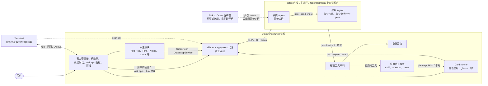
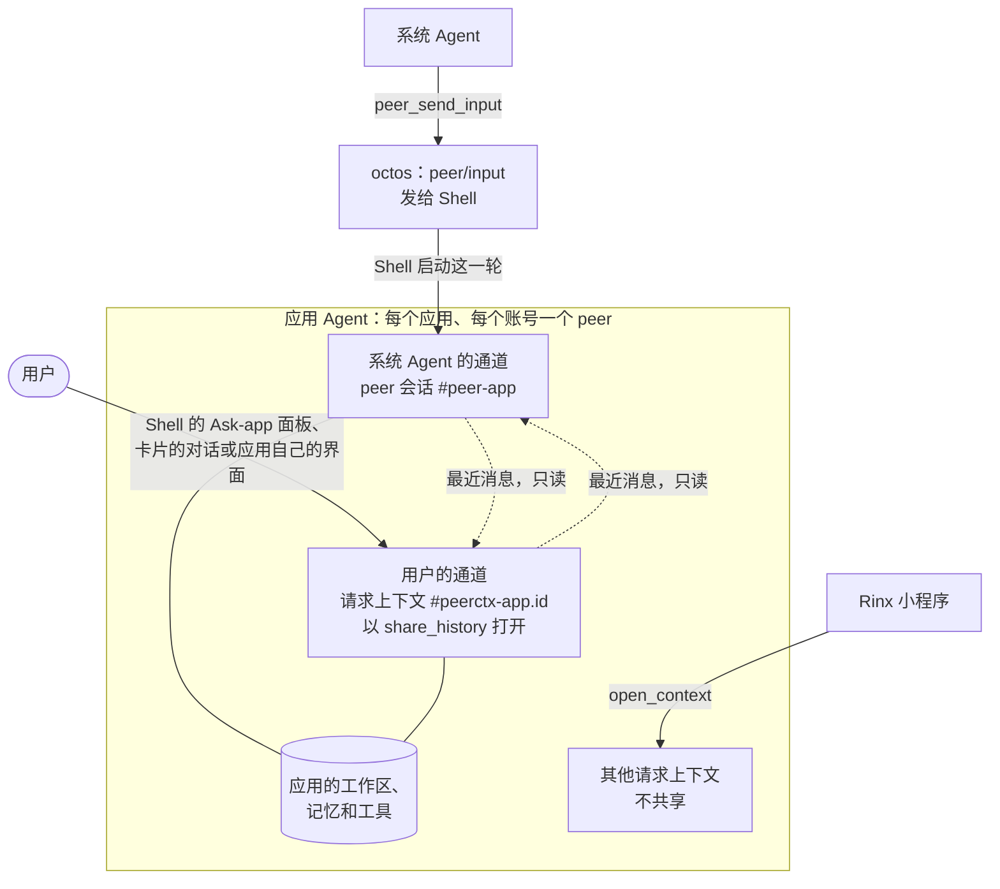
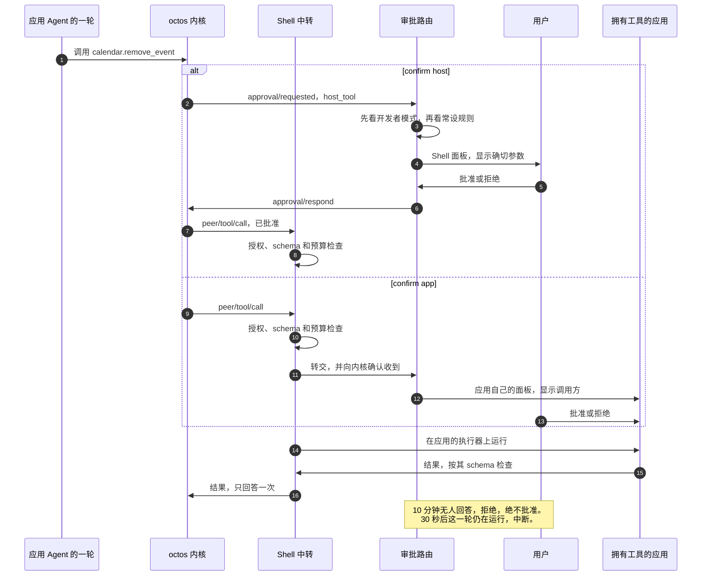

# OctoSense

[English](README.md) | 简体中文

OctoSense 是运行在普通操作系统之上的 Agent Shell。从屏幕上看，它就是你熟悉的启动器和应用；在它们背后，一个 AI 内核运行着为用户做事的**系统 Agent**，以及每个应用各自的**应用 Agent**。Agent 要动用应用、有风险的操作要找用户，都只能经过 Shell。

本仓库存放 Shell、Shell 服务、系统应用，以及由它们构建的三个产品。大多数原生应用来自其他仓库：OctoSense 的 Makepad fork、App Hub 和 Rinx（见[依赖](#依赖)）。

| 产品 | 是什么 | 位置 |
| --- | --- | --- |
| **OctoSense 桌面端** | 在 macOS 上作为一个 Makepad 窗口运行的 Shell（Windows 和 Linux 未经测试） | [`desktop/`](desktop/README.zh-CN.md) |
| **OctoSense Home** | 手机 Shell，可作为普通 Home 应用安装在任意 Android 手机上（也支持 OpenHarmony 和 iOS 模拟器） | [`phone/`](phone/README.zh-CN.md) |
| **OctoSense ROM** | 面向 OnePlus 6 的 LineageOS 22.2，预装 Home、具有系统权限的系统桥、Quickstep 和 SystemUI | [`rom/`](rom/README.zh-CN.md) |

> **要开发 OctoSense 应用？** 开发、检查或发布应用都不需要本仓库。请从 [OctoScript-App-Design-Flow](https://github.com/OctoSense-org/OctoScript-App-Design-Flow)（先读 `AGENTS.md`，再读 `docs/QUICKSTART.md`）和 [OctoSense-App-Hub](https://github.com/OctoSense-org/OctoSense-App-Hub) 开始。[`apps/`](apps/README.zh-CN.md) 中的系统应用就是完整的示例。只有想在发布前先在 Shell 里试用自己的应用时，才需要从这里构建桌面端 Shell（[PUBLISHING §4](https://github.com/OctoSense-org/OctoScript-App-Design-Flow/blob/main/docs/PUBLISHING.md#4-rehearse-the-store-path-locally)）。

## 关键概念

| 术语 | 在这里的含义 |
| --- | --- |
| **octos** | 用 Rust 编写的开源 Agent 内核（[octos-org/octos](https://github.com/octos-org/octos)）。它运行 Agent **会话**：一段与模型的对话，带有自己的工具、记忆和工作区文件夹。一个会话可以拥有其他会话，称为 **peer**。OctoSense 每台设备运行一个 octos。 |
| **OUP** | octos UI 协议：octos 与其客户端之间的 JSON-RPC 2.0 消息（`octos-ui/v1alpha1`），通常经由内核的 stdin 和 stdout 传递。 |
| **Shell** | 设备上唯一的 OctoSense 进程。它绘制全部界面、托管应用，并持有与 octos 之间唯一的完整连接。桌面端和手机端构建的是同一个 crate：`crates/shell`。 |
| **系统 Agent** | 用户的助手：一个 octos 会话，拥有并监督所有应用 Agent。 |
| **应用 Agent** | 对应某个应用、某个账号的一个 octos peer，所以登录了两个账号的邮件应用有两个 Agent。每个 Agent 有自己的记忆、对话记录、模型和工具列表，通常还有一个工作用的文件夹。 |
| **通道** | 应用 Agent 并行进行的两段对话之一：系统 Agent 的通道，以及用户的通道；应用自己发起的回合也走用户的通道。 |
| **原生应用** | 用 Makepad 构建、登记在 [`native-apps.json`](native-apps.json) 中的 Rust 应用。它作为模块运行在 Shell 内，或作为独立的沙箱进程运行（桌面端的 Terminal）。 |
| **脚本应用** | 一个 OctoScript 应用包：manifest、用 Splash（Makepad 的界面脚本语言）编写的界面，以及可选的、写在 `tools.json` 里的 Agent 工具。它只能通过 `host.request` 访问 Shell。系统应用（邮件、日历、新闻等）和所有商店应用都是脚本应用。 |
| **Card runner** | App Hub 运行脚本应用的环境，位于 Shell 进程内：每个应用实例一个隔离的脚本虚拟机，有自己的文件 jail 和配额。 |
| **宿主服务** | Shell 中的 Rust 代码，负责应答某一族 `host.request` 调用（`mail.*`、`calendar.*`），并执行该应用的 Agent 工具。 |
| **peer link** | 除 Rinx 外，原生应用经 Shell 与自己的 Agent 通信的方式：使用 Makepad 的 `OctosPeer` 客户端；应用是进程时走它的 hub 连接，是模块时走一条内存中的通道。 |
| **glance 卡片** | 应用或它的 Agent 发到 glance 面板（桌面端）或 glance 页面（手机端）上的小卡片。它要么是 L0 卡片（只有声明：数据由宿主填入，没有表达式，也没有调用），要么是 Splash 脚本。 |
| **审批路由** | Shell 中决定一次工具调用是直接运行、需要用户确认还是被拒绝的代码。 |

想按顺序读源码，请从[从应用窗口到 Agent 回合](docs/architecture-walkthrough.zh-CN.md)开始。[产品导读](desktop/docs/code-walkthrough.zh-CN.md)补充了各个产品的运行方式。

## 整体如何运作

每台设备一个 Shell 进程，每个 Shell 一个 octos 内核，每个 Agent 都是这个内核中的一个会话。Shell 是内核唯一的完整客户端：它启动 octos 并持有宿主 token，启动每个应用 Agent 的回合，转交每一次对应用工具的调用，并掌管所有审批。应用从不直接与内核通信。


<details><summary>文字版（Mermaid）</summary>



</details>

- **Shell** 承载窗口管理器、原生应用、运行脚本应用的 Card runner、系统对话、审批路由和宿主工具中转。它的 AI 部分是 [`crates/ai-host`](crates/ai-host/README.md)，其中的 [app-peers 代理](crates/app-peers/README.md)负责驱动每个应用 Agent。
- **octos 内核**（[`crates/kernel`](crates/kernel/README.zh-CN.md)）在第一个连接到来时启动，随 Shell 一起退出。桌面端和 Android 上，它是通过 stdio 讲 OUP 的子进程；OpenHarmony 上，它在 Shell 进程内运行；iOS 上没有内核。用户在 **AI providers** 应用中、在宿主面板上选择模型并输入密钥。密钥留在 Shell 一侧（macOS 上存入钥匙串，其他平台存入仅所有者可读的文件），永远不会到达应用。
- **进程应用**在 Shell 之外运行，处在系统沙箱中（macOS 上是 Seatbelt，Linux 上是 Landlock 和 seccomp，Windows 上尚未实现）。目前只有桌面端的 Terminal 是进程应用。它通过 Shell 的本地 hub 发送画面，并通过同一连接上的 peer link 使用自己的 Agent。
- **外部客户端**（Talk to Octos，需手动开启）可以凭受限的 token 从浏览器或终端使用系统对话，但拿不到任何应用 Agent、`peer/*` 方法或宿主工具。

可选的 AppCard 原型是唯一的例外：它不经过代理，而是自己打开内核连接。想看带代码路径的完整说明，请读 [docs/architecture.zh-CN.md](docs/architecture.zh-CN.md)；信任模型以及如何在本地测试 AI 服务，见 [docs/ai-services.zh-CN.md](docs/ai-services.zh-CN.md)；背后的决策见 [ADR 0004（英文）](docs/adr/0004-native-apps-hosting-and-peers.md)。

### 系统 Agent 与应用 Agent

**系统 Agent** 是 octos 会话 `_main:api:octosense#system`。用户在系统对话中与它交谈：桌面端按 F8 或点 Dock 上的 Assistant 图标，手机上点 Assistant 磁贴。它有两组工具：

- **它自己的内核工具**，即 [`SYSTEM_AGENT_TOOLS`](crates/kernel/src/system_tools.rs) 中固定的列表：用于监督应用 Agent 的 `peer_*` 工具，以及自己工作区里的文件、记忆、向用户提问和网页搜索。octos 自带的 shell 工具永远不在其中。
- **Shell 为它注册的宿主工具**：`agents.list` 和 `agents.ask` 用来查找应用 Agent、请用户允许某个 Agent；`agents.provision` 和 `agents.status` 用来运行邮件的新邮件自动处理；Setup 中的 Command execution 开关打开时还有 `terminal.run`；以及原生应用共享给它的只读工具（见下表最后一列）。

系统 Agent 永远不能批准工具调用，只有用户可以。

**应用 Agent** 要等用户允许后才会存在，每个应用只问一次。它何时运行取决于应用的类型：

- **脚本应用**的 Agent 在 Shell 启动时就准备好，并注册了应用的工具，所以即使应用没有打开，系统 Agent 的 `peer_list` 也能看到它。
- **原生应用**的 Agent 属于应用已打开的窗口，只在应用打开期间运行；它的记忆和对话记录在两次打开之间会保留。它的工具也在那个窗口里运行：Notes 没打开时，调用会回答 “Open Notes first”。

退出登录会保留 Agent；删除账号或卸载应用会清除它的对话记录和记忆。

以下应用有 Agent：

| 应用 | 类型 | 它的 Agent 自己的工具 | 系统 Agent 可以调用 |
| --- | --- | --- | --- |
| Rinx（Matrix 聊天） | 原生，在 Shell 内 | octos 的文件、记忆和网页工具 | – |
| Terminal（桌面端） | 原生，独立进程 | `terminal.read_screen`、`terminal.read_scrollback` | `terminal.run`，受 Setup 开关控制，每条命令都要批准 |
| Calculator、Clock、Notes、Reminders、Weather | 原生，在 Shell 内 | 各自的只读工具 | 同样的只读工具 |
| 邮件 | 脚本应用 | 绑定当前登录账号的 `mail.*` 工具，包括 `mail.publish_card` | – |
| 日历 | 脚本应用 | `calendar.events`、`calendar.add_event`、`calendar.remove_event`（先问用户）、`calendar.notify`、`calendar.agenda` | – |
| 新闻 | 脚本应用 | `news.list`、`news.read`、`news.notify` | – |
| 相册、地图、YouTube；手机上的相机 | 脚本应用 | `<app>.notify` | – |

App Hub 和 AI providers 没有 Agent。

### 系统 Agent 如何与应用 Agent 通信

系统 Agent 从不自己执行应用的工具，而是请应用的 Agent 去做：

1. 系统 Agent 调用 `peer_send_input`，用普通的话写下请求。
2. octos 不自己运行这一轮，而是把它作为 `peer/input` 事件交给 Shell。
3. Shell 在应用 Agent 的会话上启动这一轮，带着应用的工具、记忆和审批规则。如果用户没有允许这个 Agent，或者账号已退出登录，Shell 会拒绝这次输入。
4. 结果写到 peer 共享的**黑板**上，系统 Agent 用 `peer_gather` 读取。

下图中，用户请系统 Agent 在 glance 屏幕上提醒自己，邮件的 Agent 随后发出一张卡片：


<details><summary>文字版（Mermaid）</summary>

```mermaid
sequenceDiagram
  autonumber
  actor P as Person
  participant S as System agent
  participant B as Shell: app-peers broker
  participant A as Mail's agent (kernel-issued peer)
  participant R as Shell: tool relay
  participant M as Mail's host service
  participant G as Shell: glance service
  P->>S: "Tell me on the glance screen when ..."
  S->>B: peer_send_input (octos delivers peer/input)
  B->>A: turn/start on the peer's session, with Mail's tools
  A->>R: peer/tool/call mail.notify {title, body}
  R->>R: grant, consent, schema, budget
  R->>M: run on Mail's host service
  M->>G: glance.publish as os.mail: notice.card, notify
  G-->>P: desktop: a toast and the glance panel; phone: a shade notification
  M-->>R: {card_id}
  R-->>A: peer/tool/result
  A-->>S: the turn's result on the blackboard (peer_gather)
```

</details>

`<app>.notify` 工具填充固定的卡片模板（[`notice.card`](crates/shell/resources/glance/notice.card)，或日历的[日程与议程卡片](apps/calendar/host-service/resources)），模型只负责文字。邮件另有 `mail.publish_card`，它接收模型编写的卡片，检查后再发布。无论哪种方式，Shell 都以应用的身份发布，并要求应用拥有 `glance` 权限。

邮件的 Agent 也可以自己启动。用户登录、允许邮件的 Agent，并请系统 Agent 打开新邮件处理（`agents.provision`）之后，宿主会在后台同步收件箱，每来一封新邮件就启动一次 Agent。Agent 用绑定账号的工具读取邮件，自己判断要不要发卡片。其他应用还没有事件；详见[邮件事件导读](docs/mail-agent-events.zh-CN.md)。

在 Android 上点击卡片通知会打开准确对应的展开卡片；过期通知回退到 Glance。

### 一个应用 Agent，两条通道

系统 Agent 和用户与同一个应用 Agent 对话，但各走各的通道：


<details><summary>文字版（Mermaid）</summary>



</details>

- **系统 Agent 的通道**是 peer 自己的会话 `…#peer-<app>`。
- **用户的通道**是一个以 `share_history` 打开的请求上下文 `…#peerctx-<app>.<id>`。用户的回合在这里运行，应用自己发起的回合也在这里运行。

两条通道并行运行，用户永远不必排在系统 Agent 的任务后面。每一轮都会以只读上下文的形式看到另一条通道最近的消息，每条消息都标明说话者（`[from the person: Mail]`、`[from the system agent]`）。用户的回合也会把结果留在黑板上，系统 Agent 由此知道用户做了什么。Rinx 小程序有各自私有的上下文（`open_context`），不与任一通道共享。

### 直接与应用的 Agent 对话

用户可以直接与任何应用的 Agent 对话。这些回合在用户的通道里运行，和系统 Agent 的回合一样，带着应用的工具、记忆和审批。

| 入口 | 怎么用 |
| --- | --- |
| **“Ask &lt;app&gt;”** 面板 | Shell 为每个有 Agent 的应用提供的面板，从顶栏的 “Ask &lt;app&gt;” 按钮或按 Shift+F8 打开。桌面端上它出现在系统对话旁边。手机上它全屏显示，但还没有可以打开它的触控入口。 |
| **卡内对话** | 在有 Agent 的卡片工作区打开 Chat，或在显式声明 `sys.chat` 的卡片里输入（[见下文](#卡内对话)）。 |
| **应用自己的界面** | 应用可以自己打开用户的通道（[见下一节](#应用如何使用自己的-agent)）。Rinx 绘制自己的助手界面；其他应用通过 “Ask &lt;app&gt;” 面板进入。 |

面板会先征得同意，然后显示两条通道，每条消息都标明说话者。面板上的“停止”只结束用户自己的回合。面板的其他行为见 [docs/architecture.zh-CN.md 第 2 节](docs/architecture.zh-CN.md#2-agent)。

### 应用如何使用自己的 Agent

应用只能经过 Shell 访问自己的 Agent，从不直接使用内核协议；Shell 会在每次调用上标注应用的身份。

| 应用类型 | 接口 | 谁在用 |
| --- | --- | --- |
| 脚本应用 | `host.request("octos.session.open" / "octos.session.history" / "octos.turn.start" / "octos.turn.interrupt")`，限于 manifest 声明的名称 | 商店应用。系统应用都没有声明：它们的 Agent 由 Shell 驱动。 |
| 原生应用（在 Shell 内或作为进程） | Makepad 的 `OctosPeer` 客户端，经由 peer link：先打开链接，再用 `serve_tools` 应答 Agent 对应用自身工具的调用。同一份代码在两种托管方式下都能用。 | Calculator、Clock、Notes、Reminders、Weather、Terminal |
| 使用注入服务的原生应用 | `OctosAppService`：`open_conversation` 打开用户的通道，`open_context` 打开私有上下文 | Rinx |

对脚本应用来说，最小可用的接入只需要在 manifest 中申请两个能力：

```json
"capabilities": ["octos.session.open", "octos.turn.start"]
```

再写几行 Splash，打开用户的通道并发送一轮：

```splash
fn ask(){
    ui.answer.set_text("Waiting for the assistant…")
    host.request("octos.session.open", {}, fn(s){
        if !s.is_ok {
            ui.answer.set_text("Assistant unavailable: " + s.error)
            return
        }
        host.request("octos.turn.start", {text: ui.prompt.text()}, fn(r){
            if r.is_ok { ui.answer.set_text(r.data.text) }
            else { ui.answer.set_text("Assistant unavailable: " + r.error) }
        })
    })
}
```

在托管了内核的 Shell 中，第一次调用会请用户允许这个应用的 Agent。请把“不可用”当作正常状态处理：设备可能没有内核（iOS）或没有配置提供方，用户也可能拒绝了。这个示例和完整接口见 Design Flow 的 [AI-SERVICES 指南](https://github.com/OctoSense-org/OctoScript-App-Design-Flow/blob/main/docs/AI-SERVICES.zh-CN.md#最小调用示例与不可用状态)。

### 应用要给 Agent 提供什么

Agent 能做什么，取决于应用交给它什么。脚本应用把这些都声明在应用包里；原生应用则声明在 `native-apps.json` 的条目里。

- **声明。** manifest 的 `agent` 块列出 Agent 可用的内核工具（系统应用只申请了 `ask_user_question`）、需要的模型能力（`tool_calling`），以及可选的、写有指令的 `AGENT.md`。原生应用的条目还会说明它自己的 Agent 可以调用它的哪些工具（`own_tools`），系统 Agent 又可以调用哪些（`system_tools`）。
- **工具。** `tools.json` 描述每个工具（命名为 `<app>.<tool>`）：输入 schema、`risk`（`read`、`act` 或 `destructive`）、由谁确认（`confirm: host` 用 Shell 面板，`app` 用应用自己的面板），以及其他应用的 Agent 能否使用（`shareable`）。
- **执行工具的地方。** 声明了的工具还需要执行者：应用的宿主服务（邮件、日历、新闻）、Shell 的通知服务（其他系统应用的 `<app>.notify`），或原生应用已打开的窗口。商店应用没有宿主服务，而标为 `implemented_by: "app"` 的工具在 Card runner 中还没有执行器。所以目前商店应用的 Agent 能对话、能提问、能读取自己的文件夹，但还不能通过自己的工具做事。
- **数据。** 默认情况下，Agent 在它所属账号的文件夹 `apps/<app id>/accounts/<account hash>/` 中工作（不区分账号的应用只有一个 `device` 文件夹），并用宿主的只读工具 `files.list`、`files.read` 和 `files.search`（Unix 上）读取它。应用也可以声明 `storage.agent_workspace: "none"`；Calculator、Clock、Notes、Reminders、Weather 和 Terminal 就是这样，它们的 Agent 只能看到自己的工具返回的内容。任何 Agent 都看不到别的账号的文件夹。
- **记忆。** 每个 Agent 有自己的记忆命名空间 `app/<app>/acct-<hash>`，随账号一起清除。
- **联系用户的方式。** 有了 `glance` 权限，它的工具就能发布卡片。
- **事件**（目前只有邮件）。一个 `triggers.events` 条目、一项技能和 `AGENT.md`，让邮件的 Agent 不等人开口就能处理新邮件；在这些回合里，Shell 会附上已接纳的指令和技能文本。

新增一个工具的步骤（manifest、`tools.json`、授权、处理代码、审批路径）见 [AGENTS.md（英文）](AGENTS.md#architecture-documentation-and-code-walkthroughs)，设计见 [ADR 0002（英文）](docs/adr/0002-event-driven-app-agents.md)。

### 一次带审批的工具调用


<details><summary>文字版（Mermaid）</summary>



</details>

- **中转**（[`crates/shell/src/host_tools/`](crates/shell/src/host_tools/)）接收每一个 `peer/tool/call`。它先检查这个调用方能否使用这个工具，按工具的 schema 校验参数，并从调用方的预算中扣除（默认每轮 32 次、每天 1000 次工具调用）；之后才在拥有该工具的应用中运行它：原生应用已打开的窗口、脚本应用的宿主服务，或经 peer link 交给进程应用。结果同样要按 schema 检查。
- **审批路由**（[`crates/shell/src/approvals/`](crates/shell/src/approvals/)）按固定顺序做决定。开发者模式只能由用户打开，它会批准所覆盖应用经路由处理的调用。邮件发送仍要求独立的宿主审核和实体批准；开发者模式和常设规则不能授权发送。`confirm: app` 的工具交给应用自己的面板。必须每次都问的调用（例如 Terminal 的命令）直接弹出面板。其余调用可以由用户的常设规则决定，否则由 Shell 面板展示确切参数，请用户确认。每个决定都会写入审计日志。完整顺序见[导读](docs/architecture-walkthrough.zh-CN.md#审批顺序)。
- **时限。** 10 分钟内无人回答的审批或提问会被拒绝，绝不会被批准。如果 30 秒后这一轮仍在运行，Shell 会中断它，好让下一轮开始。

### 卡片与提问

拥有 `glance` 权限的应用以自己的身份发布卡片（`glance.publish`、`glance.withdraw`、`glance.list`）；Shell 从调用方取得发布者，从不读取参数中的发布者。卡片在应用自己的权限下运行，所以在卡片上按下按钮是应用自己的操作，不是 Agent 的工具调用。卡片显示在桌面端的[一览面板](desktop/README.zh-CN.md#一览面板)中，桌面端 README 对它有详细说明。

#### 卡内对话

在手机上，紧凑的 Glance 摘要展开为驻留的全屏工作区。有 Agent 的发布者即使没有内嵌 `sys.chat`，也会获得 **Card / Chat**；宿主把会话绑定到发布时的账户，并提供有大小限制的卡片数据和 L0 本地状态。生成源码保持不变。本地选项是上下文，不代表外部操作已经完成；聊天只使用应用已有的工具和同意权限。没有 Agent 的卡片不显示 Chat 页签。

携带宿主签发 `draft_id` 的 Mail 回复卡片使用 **Email / Chat**，共用一份已保存草稿。用户要求的聊天修改通过绑定修订号的凭证保存，最终审核读取确切的已保存收件人、主题和正文。即使在开发者模式，发送仍只能由可信 Android 实体触摸批准；桌面／无障碍发送审批暂缓。DeepSeek／MiniMax 实机结果、格式失败及重试、剩余 UX 限制见[组合 Mail 卡片](docs/mail-composable-cards.zh-CN.md)。

显式 `sys.chat(app, thread, fields)` 保留声明的线程。对话记录由宿主保存在应用账户文件夹中，只有用户亲手输入的内容才记为用户的话。旧的 [`mail-request.card`](crates/shell/resources/glance/mail-request.card) 在 `OCTOSENSE_GLANCE_DEMO=mail` 下仍使用固定回答。详见 [`crates/l0-chat`](crates/l0-chat/README.zh-CN.md) 和 [`glance_chat.rs`](crates/shell/src/glance_chat.rs)。

#### 提问

Agent 的 `ask_user_question` 出现在这一轮的来处：用户和应用自己发起的回合在应用的对话中提问，系统 Agent 发起的回合在系统对话中提问。只有用户能回答，而且只能在 Shell 界面上回答。

## 为什么它省内存、省算力

一部手机要同时运行 Shell、内核、最多十来个应用 Agent 以及它们的应用。下面这些设计让这件事并不昂贵：

- **一个内核，Agent 只是会话。** 所有 Agent 都在同一个 octos 内核里。在内核中，一个 Agent 就是一份存储的状态（对话记录、记忆和黑板条目），加上运行回合时的 Tokio 任务。没有哪个 Agent 独占一个进程。
- **到内核只有一条连接。** 系统对话和每个应用 Agent 的代理共用一条通往内核的流。一个小小的路由器（[`crates/kernel/src/router.rs`](crates/kernel/src/router.rs)）为每个请求分配唯一的 id，并把每条通知只发给关心该会话的使用方。
- **线程按服务分配，而不是按回合。** 回合是 Tokio 任务。在 Shell 中，内核服务运行在一个有两个工作线程的 Tokio 运行时上，每个活跃应用 Agent 的代理有自己的单线程运行时（所以一个慢吞吞的 Agent 拖不住别的 Agent，也拖不住界面），系统对话则用一个线程，只在有变化时才通过 Makepad 的 `SignalToUI` 唤醒界面。octos 子进程（桌面端和 Android）使用 Tokio 的默认运行时，每个 CPU 核心一个工作线程。
- **按需启动，空闲即停。** 内核在第一个连接到来时启动：如果用户已经允许过某个脚本应用的 Agent，就在 Shell 启动时；否则在某个 Agent 或系统对话第一次需要它时。系统对话只在面板打开或有回合运行时才保持连接。Talk to Octos 关闭时，最后一个连接断开，内核就停止。没有获准 Agent 的应用既没有代理，也没有 peer。
- **应用共享 Shell 进程。** 脚本应用是同一个 Card runner 中的隔离环境，原生应用是模块，所以大多数应用不单独占用进程。脚本出错只影响它自己的隔离环境，原生模块的 panic 在模块边界被捕获。只有需要系统沙箱的应用才作为独立进程运行。
- **进程应用的画面零拷贝。** Terminal 的画面以共享 GPU 表面的形式到达 Shell：macOS 上是 IOSurface，Windows 上是 D3D11 共享句柄，Linux 配 Vulkan 时是 DMA_BUF。在只能靠 CPU 拷贝的环境（Linux 配 OpenGL）中，所有应用都改在 Shell 内运行。

## 目录结构

| 路径 | 内容 |
| --- | --- |
| [`desktop/`](desktop/README.zh-CN.md) | 桌面端打包，package `octosense`：入口（只有 `src/main.rs`）、应用目录（`config/apps.json`）、从上游 Makepad 同步窗口管理器（`upstream/`、`scripts/upstream.py`），以及桌面端的系统应用选择。 |
| [`phone/`](phone/README.zh-CN.md) | Home 应用，package `octosense-home`（APK id `dev.makepad.octosense`）：入口、内置设置应用、Android、OpenHarmony 和 iOS 打包、系统桥的手机端（`android/`），以及手机端的系统应用选择。 |
| [`rom/`](rom/README.zh-CN.md) | 仅 OnePlus 6 ROM 镜像：`vendor/`、`patches/`、镜像/刷机/OTA 脚本、Home APK 构建脚本、`web-installer/`、产品测试。 |
| `crates/shell/` | Shell，package `octosense-shell`：窗口管理器、应用托管、系统对话和 “Ask &lt;app&gt;” 面板、宿主工具中转和审批路由、手机层，以及主题、壁纸和图标。 |
| [`crates/ai-host/`](crates/ai-host/README.md) | Shell 的 AI 服务，统一入口，package `octosense-ai-host`：内核服务、`llm` 与 `model` 服务，以及为每个脚本应用提供 Agent（`card.<应用 id>`）的 `octos` 宿主服务。 |
| [`crates/kernel/`](crates/kernel/README.zh-CN.md) | 作为 Shell 服务的 octos 内核，package `octosense-kernel`：每个进程一个，由 AI providers 配置，供所有使用方共享；以及系统 Agent 的精确工具列表。 |
| [`crates/app-peers/`](crates/app-peers/README.md) | 应用 Agent 的代理，package `octosense-app-peers`：每个（应用，账号）一个 peer，它的两条通道、工具、`peer/input`、时限和清除。 |
| [`crates/l0-chat/`](crates/l0-chat/README.md) | L0 卡片卡内对话（`sys.chat`）的宿主一侧，package `octosense-l0-chat`。 |
| [`crates/toolbox/`](crates/toolbox/README.md) | 系统工具箱，package `octosense-toolbox`：工作流模板和 `mod.research`，在 `toolbox-peers` 特性下提供给应用 Agent。 |
| [`apps/`](apps/README.zh-CN.md) | 系统应用（新闻、相册、地图、相机、邮件、日历、AI providers、YouTube），均为脚本应用；它们的宿主服务（`mail`、`calendar`、`news`、`llm`）；`apps/reference`；以及需显式启用的 AppCard 助手。 |
| [`native-apps.json`](native-apps.json) | 所有原生应用：代码来自哪里、在各平台上如何托管，以及它的 Agent。`tools/native_apps.py` 据此生成 Shell 的代码和 Cargo 条目。 |
| `tools/` | `setup.py`（锁定版本的框架源码）、经审查的 Makepad 运行时补丁（`runtime-patches/`）、`kernel-artifact.py`（构建 octos 内核）、`check-shell-graph.sh`（依赖图检查）。 |
| [`docs/`](docs/architecture.zh-CN.md) | 架构说明、代码导读和[架构决策记录](docs/adr/README.zh-CN.md)。 |
| `Cargo.toml`、`Cargo.lock`、`native-runtime.lock.json`、`runtime-patches.lock.json` | 一个工作区。所有外部依赖都只锁定一次；运行时锁文件指定 OctoScript-Makepad 发行版和 Makepad 之上经审查的补丁。 |

Shell 只有一份，位于 `crates/shell`（[ADR 0001（英文）](docs/adr/0001-one-octosense-repository.md)）：桌面端与手机端以目标平台和 feature 区分，而不是各持一份源码副本。若某个 Shell 源文件同时出现在两个 crate 中，CI 会失败。

## 依赖

只在根目录 `Cargo.toml` 和运行时锁文件中锁定一次：

| 仓库 | 作用 |
| --- | --- |
| [makepad（OctoSense fork）](https://github.com/OctoSense-org/makepad) | UI 框架、`cargo-makepad` 打包工具，以及原生应用 Calculator、Clock、Notes、Reminders、Weather、Terminal、Sheets 和 Task。检出到 `.sources/makepad`，并应用经审查的运行时补丁。 |
| [OctoScript-Makepad](https://github.com/OctoSense-org/OctoScript-Makepad)、[OctoScript](https://github.com/OctoSense-org/OctoScript) | 指定 Makepad 和 OctoScript 版本的运行时发行版（`native-runtime.lock.json`）。 |
| [OctoSense-App-Hub](https://github.com/OctoSense-org/OctoSense-App-Hub) | 签名目录、商店，以及隔离运行每个脚本应用的 Card runner。 |
| [octos](https://github.com/octos-org/octos) | Agent 内核。Android 上 APK 以 `liboctos.so` 形式内置它；桌面端运行 Shell 旁随附的 `octos-kernel`，并核对其版本与此处固定的一致（由 `tools/kernel-artifact.py --host --stage` 构建）。 |
| [Rinx](https://github.com/hagency-org/Rinx) | Matrix 聊天与小程序，作为原生模块托管。 |

相关但不参与构建：[OctoScript-App-Design-Flow](https://github.com/OctoSense-org/OctoScript-App-Design-Flow)（如何构建和发布应用）、[OctoScript-Android](https://github.com/OctoSense-org/OctoScript-Android) 和 [OctoScript-OH](https://github.com/OctoSense-org/OctoScript-OH)（其他渲染后端）、[OctoSense 网站](https://github.com/OctoSense-org/octosense-org.github.io)。

## 环境准备

需要稳定版 Rust（`cargo` 位于 `~/.cargo/bin`）、Git、Python 3.9+（`desktop/scripts/upstream.py` 需要 3.11），macOS 上还需要 Xcode Command Line Tools。Makepad 和 OctoScript 解析到 `.sources/`（已被 git 忽略）中的检出，由环境准备脚本按锁定版本准备好：

```sh
git clone https://github.com/OctoSense-org/OctoSense.git
cd OctoSense
python3 tools/setup.py                  # prepare .sources/ (makepad, octoscript, octoscript-makepad)
python3 tools/setup.py --check --cargo  # verify: one Makepad, App Hub, octos and Rinx in the graph
```

锁文件变化后，`--update` 会把没有本地修改的检出移到新版本；`--cache DIR` 从已有克隆（`DIR/makepad`、`DIR/octoscript`、`DIR/octoscript-makepad`）借用 Git 对象。`.sources/` 中的本地修改会被保留。

<details><summary><b>本机已有这些仓库的克隆？</b>把它们用作 hub。</summary>

每个仓库在本机只保留一个克隆，`.sources/` 中的每一项都作为它的 `git worktree`，这样每个仓库只有一个对象库，不会出现过时的副本。在 `~/.config/octosense/sources.json` 中一次性写明存放克隆的目录（其中为 `<dir>/makepad`、`<dir>/octoscript`、`<dir>/octoscript-makepad`）：

```json
{ "hub": "/path/to/clones" }
```

也可以每次运行时用 `--hub DIR` 或 `OCTOSENSE_SOURCES_HUB=DIR` 指定。之后环境准备脚本会把锁定的版本 fetch 到该克隆，并运行 `git worktree add --detach .sources/<name> <rev>`，而不是重新克隆；`--update` 会移动这些 worktree。未配置 hub 时（CI、新机器）仍像以前一样克隆，`--no-hub` 可强制如此。`.sources/` 中已经是完整克隆的项只会被报告，不会被删除；其中没有本地工作时，`--convert` 会把它替换为 worktree。

删除本仓库的某个检出之前，先移除它的 `.sources/` worktree，免得各克隆里留下失效的记录：

```sh
python3 tools/setup.py --remove-worktrees   # git worktree remove + prune in each clone; stops on local work
git worktree remove <this checkout>         # if it is itself a worktree
```

</details>

## 构建

**桌面端**（在根目录或 `desktop/` 中运行；详见 [desktop/README.zh-CN.md](desktop/README.zh-CN.md)）：

```sh
cargo run --release -p octosense
cargo check --locked -p octosense --features mobile-apps                        # the set phones link
cargo check --locked -p octosense -p octosense-appcard --features mobile-apps,app-appcard
```

助手需要 Shell 旁的 octos 内核：`python3 tools/kernel-artifact.py --host --stage target/release` 构建固定版本并放到该处，每个 octos 固定版本做一次。桌面端会拒绝版本不符的内核并说明原因（[构建与运行](desktop/README.zh-CN.md#构建与运行)）。没有内核时，桌面端在没有助手的情况下运行。

**手机端**（在 `phone/` 中运行，它会选择手机端的系统应用；详见 [phone/README.zh-CN.md](phone/README.zh-CN.md)）：

```sh
cd phone
cargo run --release -p octosense-home --features mobile-only    # Home in a phone-sized window
cargo check --locked -p octosense-home --features mobile-apps
python3 ../rom/scripts/build-home.py --help                     # the Home and Bridge APK pair, liboctos.so bundled
```

**ROM 镜像**（Linux 构建主机，外部 LineageOS 源码树；不在 CI 中）：[rom/README.zh-CN.md](rom/README.zh-CN.md)。

## CI

`.github/workflows/` 中的工作流按路径过滤，每次改动只运行其路径需要的任务：

| 工作流 | 触发路径 | 检查内容 |
| --- | --- | --- |
| `desktop.yml` | `desktop/`、`crates/`、`apps/`、工作区文件、`tools/` | 编译桌面端（默认、`mobile-apps`、`mobile-apps,app-appcard`），Shell 依赖图检查，每个 Shell 源文件只有一份，`tools/` 的测试 |
| `phone.yml` | `phone/`、`crates/`、`apps/`、工作区文件、`tools/` | 在 macOS 上编译 Home 及其内置模块，Shell 依赖图检查，并运行 Shell、Home、AI 服务、App Hub 准入和运行时策略的测试 |
| `apps.yml` | `apps/`、`crates/`、工作区文件、`tools/setup.py` | 内核服务、app peers、AI providers 配置、邮件与 `llm` 宿主服务、Shell 的 AI 服务、AppCard |
| `rom.yml` | `rom/`、`phone/android/`、手机端的 Android 资源与测试、`tools/kernel-artifact.py` | 产品测试、生成的 Agent Binder 客户端、网页安装器 |
| `release-desktop.yml` | `desktop-v*` 标签、手动运行，或修改打包的 pull request | macOS、Windows、Linux 的未签名桌面包和私有路径扫描；对标签还会签名并生成草稿 release（[desktop/README.zh-CN.md](desktop/README.zh-CN.md#发布构建)） |

每个工作流的依赖图检查（`tools/setup.py --check --cargo`）确保锁定的依赖图中只有一个 Makepad、一个 App Hub、一个 octos 和一个 Rinx。`tools/ci-local.sh` 可以在你自己的机器上运行同样的步骤（[docs/local-ci.md（英文）](docs/local-ci.md)）。

## 发布

每个产品单独打标签：`desktop-v*`、`home-v*`（APK）和 `rom-v*`（镜像），构建回执记录仓库提交。`desktop-v*` 标签会把桌面包（`.dmg`、Windows 安装包、`.deb`、`.AppImage`）构建到草稿 release 中（[发布构建](desktop/README.zh-CN.md#发布构建)）。系统应用只随 Shell 一起发布，按摘要准入。手机如何获取 ROM 更新，见 [rom/docs/updates.md（英文）](rom/docs/updates.md)。

## 参与贡献

`main` 受保护：每个改动都要通过 pull request，禁止强制推送。一个改动就是一个 pull request，按需同时修改 `desktop/`、`phone/`、`crates/` 和 `apps/`。面向人和编码 Agent 的规则见 [AGENTS.md（英文）](AGENTS.md)。

## 许可证

Apache License 2.0（[LICENSE](LICENSE)、[NOTICE](NOTICE)）。从 Makepad 复制的源码保留其 MIT 声明（[LICENSES/](LICENSES)）。依赖项保留各自的许可证。
