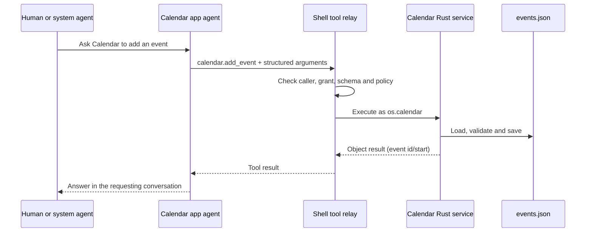

# Walking through the desktop, Home, ROM and system apps

English | [简体中文](code-walkthrough.zh-CN.md)

This is a source-reading tutorial for a Rust developer who is new to OctoSense.
Paths below are relative to the repository root. The companion
[agent architecture walkthrough](../../docs/architecture-walkthrough.md) follows
the kernel, peers, tools and Tokio tasks in more detail.

The launch recipes below are **unverified in this documentation review**: their
package names, features and entry points were checked against source, but no GUI,
Android APK, ROM image or device was launched. Existing dated validation records
remain separate evidence. Run setup as described in the root README before using
Cargo; reuse existing framework clones with the sources-hub configuration.

## 1. Start with the nouns

| Name | What actually runs |
| --- | --- |
| Desktop | The `octosense` executable; a thin entry point for `octosense-shell`. |
| Home | The `octosense-home` executable/APK; the same shell plus built-in Settings and platform integration. |
| Native app | Rust implementing Makepad's `AppModule`, or a separate executable hosted through the window-manager protocol. |
| OctoScript app | An admitted `manifest.json` + `main.splash` bundle, interpreted inside App Hub's Card runner. |
| Host service | Rust code that performs a specific operation for an attributed app and returns data. It need not use a model. |
| App agent | A model-driven octos peer scoped to an app/account, with a workspace, sessions and explicitly granted tools. |
| System agent | The shell's assistant, with its own tool policy and delegation tools. |
| ROM privileged agent | An Android Java/Binder service for platform operations. It is a different component from the model-driven system agent. |

A Rust `trait` describes an interface; `impl AppModule` supplies one implementation.
A `Widget` handles UI events and drawing. Neither implies a thread, an LLM nor a
Tokio task. Likewise, a Splash file can be a native widget description or a
contained app's program: the host and its policy determine the authority.
Here `main.splash` runs on Makepad Script/Splash. The separate Octoscript L0
parser/checker and `.card` lowering path are not the parser for that program.
“OctoScript app” is the product name used by these guides, not a claim that
these two language implementations are identical.

## 2. Run the smallest native example

From the repository root, after setup:

```sh
# An ordinary standalone Reference window.
cargo run --locked -p octosense-reference

# Reference linked into the desktop and opened as a module.
MAKEPAD_WM_TEST_APP=reference cargo run --locked -p octosense --features app-reference -- --module reference

# The normal desktop product (App Hub, Rinx, Terminal, kernel integration).
cargo run --locked --release -p octosense
```

These are development recipes, **unverified here**. To inspect UI without taking
over the screen, add `MAKEPAD_HIDE_WINDOWS=1 MAKEPAD_REMOTE=8000` and use the
Makepad control endpoints documented by `/help`; end the run through `/quit`.
`--module` selects hosting; `MAKEPAD_WM_TEST_APP` requests startup launch.

Read these files in order:

1. [`apps/reference/src/lib.rs`](../../apps/reference/src/lib.rs):
   `ReferenceView` holds `count: usize`; `handle_event` receives button/text
   actions and changes labels. `draw_walk` delegates drawing to the contained
   `View`. This is ordinary UI state, with no agent involved.
2. The same file's `ReferenceModule`: `register` makes its widget type known to
   the VM; `create` returns `InstanceParts` containing a root widget, a service
   executor and shutdown callback. The executor says “Reference has no tools”.
   A native app does not automatically acquire an agent.
3. [`native-apps.json`](../../native-apps.json): Reference's source, feature,
   hosting, storage and empty agent grants. This manifest generates the native
   app registry and Cargo feature blocks; do not edit the generated blocks.
4. [`desktop/src/main.rs`](../src/main.rs): imports the shell's `App` and calls
   `octosense_main!`. In [`crates/shell/src/lib.rs`](../../crates/shell/src/lib.rs),
   that macro delegates to Makepad's `app_main!` and selects the package directory.
5. Follow `App::launch_app_with_args` in that shell file. It finds a registered
   app, checks script-app identity/admission where applicable, prepares storage,
   optionally focuses an existing window, then chooses module or process hosting.
6. [`crates/shell/src/module_host.rs`](../../crates/shell/src/module_host.rs),
   `ModuleHost::create`: establishes an instance scope, storage namespace, reply
   handles, viewport and VM, then builds the module. Agent services are injected
   only when declared and granted by host policy.

For process hosting, continue to
[`crates/shell/src/clients.rs`](../../crates/shell/src/clients.rs) and
[`crates/process-apps`](../../crates/process-apps). The shell starts a child,
connects the window-manager protocol, forwards input and displays its surface.
That child process is independent of any octos peer. Terminal normally uses this
path on macOS/Windows and with Vulkan in a Linux Wayland session; its module
fallback and overrides are described in the [desktop README](../README.md).

## 3. Run and follow a script bundle

The normal desktop already contains the selected system bundles. Open News or
Calendar from the launcher. A standalone preview uses the App Hub repository's
`card-host`; from an App Hub checkout after its own setup:

```sh
# Replace the example path with your OctoSense checkout.
cargo run --locked --release -p octosense-card-host --bin card-host -- --bundle /path/to/OctoSense/apps/news/bundle --system
```

This recipe is **unverified here**. `--system` admits the shipped `os.*` bundle;
it does not give the preview the shell's host services or agent UI. In particular,
Mail requires the shell's service. A source-backed desktop recipe is:

```sh
MAKEPAD_APP_CONFIG='{"mail_demo":true}' cargo run --locked --release -p octosense
```

The demo account uses password `demo`; its sends stay in the demo. New store apps
belong in OctoScript-App-Design-Flow, then App Hub's admission/publishing flow.
Use a local catalog to test the real shell installation path; see
[the desktop local-catalog recipe](../README.md#try-your-own-app-before-it-is-published).

Read [`desktop/system-apps.json`](../system-apps.json) and
[`phone/system-apps.json`](../../phone/system-apps.json): these select bundles
from `apps/`. Follow [`crates/shell/src/apps.rs`](../../crates/shell/src/apps.rs)
for launcher entries, `agent_apps` and `register_host_services`. The linked App
Hub `CARD_MODULE` is a native host for those interpreted programs. It is distinct
from the opt-in AppCard assistant module.

An app's manifest requests capabilities; admission converts those requests into
a policy. A script's `host.request(...)` is checked under that app's identity.
It is not arbitrary Rust execution and not automatically an LLM tool call.
App Hub's `crates/appstore/src/services.rs` defines `HostService`, `ServiceCall`
and replies. `ServiceCall` carries the app identity and host directory; a service
can check both the method and caller before doing work.

## 4. Follow real data through a tool, not through the model

Start with [`apps/calendar/bundle/tools.json`](../../apps/calendar/bundle/tools.json)
and [`apps/calendar/host-service/src/lib.rs`](../../apps/calendar/host-service/src/lib.rs).
The JSON declares tools and schemas; it contains no implementation. The Rust
`CalendarService` implements the host-service interface; `handle` dispatches
methods, while `load`/`save` own `<host_dir>/calendar/events.json`.

For “add an event”, the path is:



Read [`crates/shell/src/host_tools/script_apps.rs`](../../crates/shell/src/host_tools/script_apps.rs)
for tool loading and `HostServiceExecutor`, then `host_tools/relay.rs` for
authorization. `calendar.remove_event` is destructive and needs the configured
host confirmation. `calendar.notify`/`agenda` fill fixed `.card` resources and
call the publisher installed by `register_host_services`; the shell checks the
app's `glance` grant. The model supplies arguments, not executable card code.

Do not confuse these three stores/interfaces:

| Boundary | Actual access |
| --- | --- |
| Script storage | The app's storage capability and jail; only the runtime's allowed APIs. |
| Agent workspace | The peer's app/account directory; only explicitly granted file tools, confined by shell policy. It is not a mount of every host-service database. |
| Host-service database | Rust-owned data such as Calendar events, Mail cache and credentials, or News cache; accessed through explicitly exposed methods/tools. Secrets stay with host-owned sheets and vaults. |

Current examples deliberately differ. News declares `news.list` and `news.read`.
Mail's **agent tool file declares only `mail.notify`**: the service's UI methods
`mail.list`, `mail.message` and `mail.send` are not thereby agent tools. Calendar's
window currently explains how to ask its agent; it does not list/edit events
through a script `calendar` capability, which App Hub does not expose.

Cross-app access also needs explicit declarations: the requesting agent asks for
a dotted tool name in `agent.tools`; the owner must offer a shareable tool, and
the relay must grant and execute it under the right identities. App Hub admission
also checks `HostLimits.offered_tools`; arbitrary dotted names such as
`mail.send` are not offered by default, so editing `agent.tools` alone does
not make the bundle admissible. A writable
workspace or a chat message does not grant another app's files, credentials or
API. See the companion walkthrough for system-agent delegation and current
limits on reverse requests from an app agent to the system agent.

## 5. Where a person talks to the app agent

The shell draws an **Ask &lt;app&gt;** panel for agent-enabled apps. On desktop,
focus the app and use the bar, Shift+F8, or “Ask this app's agent” in the menu.
First-use consent precedes preparation of its peer. F8 opens the system agent;
`agents.ask` requests consent/preparation, then `peer_send_input` delegates work
and `peer_gather` retrieves the answer. A card's `sys.chat` can also address its app
agent. Phone touch navigation has no equivalent panel-opening control yet.

Follow `crates/shell/src/app_chat/`, `crates/shell/src/system_chat/`,
`crates/shell/src/agents.rs`, `crates/ai-host/src/contained.rs` and
`crates/app-peers/`. The human conversation and system-agent conversation have
separate lanes/sessions on the app's peer; the panel's Stop interrupts the
human's turn. “One peer” does not mean “one shared transcript”, “one OS thread”
or “one Tokio task”. The Makepad event loop handles UI; broker/kernel work and
notifications cross their own channels. The companion walkthrough maps those
channels and kernel tasks to source symbols.

The kernel must also be configured: `octos-core` links the integration but does
not manufacture a desktop `octos` executable or a provider credential. Supply a
compatible `OCTOS_APP_CORE_BIN`, configure AI providers and use the
[kernel guide](../../crates/kernel/README.md). Android packages bundle
`liboctos.so`; desktop and Android normally run a child kernel, while
OpenHarmony uses the in-process core. These are kernel hosting choices, separate
from whether the app UI is a module or child process.

## 6. Home adds Settings around the shared shell

Run Cargo **from `phone/`**, because its `.cargo/config.toml` selects the phone's
bundles. From that directory, the desktop preview recipe (**unverified here**) is:

```sh
cargo run --locked --release -p octosense-home --features mobile-only
# Add Reference/Sheets too; mobile-only and mobile-apps have different jobs.
cargo run --locked --release -p octosense-home --features mobile-only,mobile-apps
```

[`phone/src/main.rs`](../../phone/src/main.rs) defines `App` with `#[deref]
shell: ShellApp` plus `SettingsRuntime`. Dereferencing lets its implementation
reach shell fields; it does not create another shell process. `install_ext`
registers the trusted Settings module. In `handle_event`, Home first handles
Settings startup/timing and entry intents, lets the shell process the event,
then consumes queued platform packets and Settings requests. Observe that
ordering when debugging a missing Settings update.

Follow `phone/src/settings_app.rs`, `settings_script.rs` and
`settings_script_host_facade.rs`: Settings combines a script-owned controller/UI
with Rust host checks. Its privilege comes from the compiled trusted singleton,
not from a script declaring itself “settings”. `android_settings.rs` dispatches
observations/results by channel. A returned command result and a later observed
platform state are distinct; accepted work must not be displayed as confirmed
platform state prematurely.

On Android, continue into
`phone/resources/android/java/dev/makepad/octosense/MakepadAppExtension.java`,
the clients there, and `phone/android/contracts/`. The System Bridge's
`SystemBridgeService.java` uses Binder callbacks and caller checks. Ordinary
standalone Home has only available Android permissions/roles; installing Home
does not give it ROM privileges. Follow [Home's build instructions](../../phone/README.md#build-and-run)
for APK packaging; a desktop preview proves neither Binder nor device behavior.

## 7. The ROM packages the platform, not another LLM peer

Read [`rom/vendor/octosense/octosense.mk`](../../rom/vendor/octosense/octosense.mk)
and `Android.bp` for product inclusion, then
[`rom/scripts/build-home.py`](../../rom/scripts/build-home.py), `stage-home.py`
and `stage-forks.sh`. Build produces the Home/Bridge APK pair and receipt;
staging verifies and copies artifacts; the LineageOS build produces the image.
Installing, flashing and OTA delivery are separate operations.

The privileged Android service lives in
`rom/vendor/octosense/agent/src/dev/makepad/octosense/agent/AgentPlatformService.java`.
Its `caller` checks Binder UID, allowed package identity and platform signature;
methods use platform backends and report capabilities/results. Its AIDL contract
is `IAgentPlatform.aidl`. It is a Java service with Android lifecycle and Binder
execution, not an octos model loop and not a Rust Tokio app-agent task.

Home's `AgentPlatformClient` connects to that optional ROM service. The System
Bridge, Quickstep, SystemUI, Settings brokers and privileged agent are distinct
Android pieces, not a universal “system agent” API an arbitrary app can call.
Source checks cannot prove that a ROM boots or that its platform integration
works; image/device validation remains **unverified in this review**.

## 8. Keep the older AppCard path separate

`apps/appcard/module/src/lib.rs` adapts the optional AppCard assistant to
`AppModule`; `apps/appcard/app/app` implements its router/composer and generated
cards, with transport/store/render crates beside it. Enable it explicitly with
`--features app-appcard`; defaults and `mobile-apps` leave it out.

AppCard's older routing/composition terminology is not the implementation of
every modern system/app agent. The current system chat, app-chat broker and
contained script agents work without enabling AppCard. Likewise its legacy
`personal-data` mailbox reader is not current Mail's host-service database API.
For learning native hosting, start with Reference; for shipped app-agent tools,
start with Calendar/News; read AppCard when working on that optional product.
