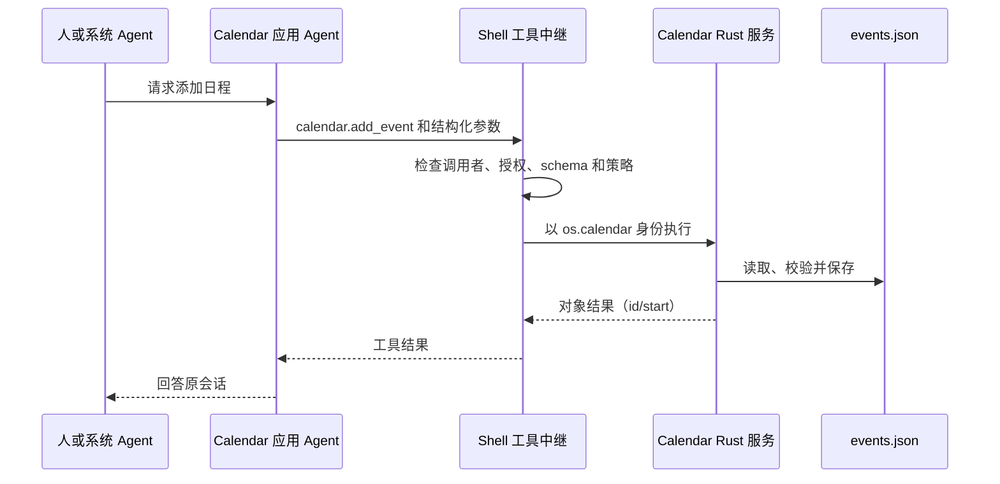

# 桌面、Home、ROM 与系统应用源码导读

[English](code-walkthrough.md) | 简体中文

本文面向刚接触 OctoSense 的 Rust 开发者。文中的源码路径相对于仓库根目录。
[Agent 架构导读](../../docs/architecture-walkthrough.zh-CN.md)进一步追踪内核、Peer、工具和 Tokio 任务。

以下启动配方均为**本次文档审查未验证**：已核对源码中的包名、feature 和入口，但没有启动 GUI、构建 Android APK/ROM 或运行设备测试。已有的带日期验证记录是独立证据。运行 Cargo 前按根目录 README 准备依赖；已有框架克隆时通过 sources hub 复用。

## 1. 先理解几个名称

| 名称 | 实际运行的东西 |
| --- | --- |
| 桌面 | `octosense` 可执行程序，入口很薄，主体是 `octosense-shell`。 |
| Home | `octosense-home` 程序/APK，共用 Shell，加上内置设置和平台集成。 |
| 原生应用 | 实现 Makepad `AppModule` 的 Rust 模块，或通过窗口管理协议托管的独立程序。 |
| OctoScript 应用 | 通过准入的 `manifest.json` + `main.splash` bundle，由 App Hub 的 Card runner 解释执行。 |
| 宿主服务 | 按明确的调用应用身份执行某项操作并返回数据的 Rust 代码，不一定使用模型。 |
| 应用 Agent | octos 中按应用/账号限定的模型 Peer，拥有工作目录、会话及明确授予的工具。 |
| 系统 Agent | Shell 助手，拥有自己的工具策略和委派工具。 |
| ROM 特权 agent | 用于 Android 平台操作的 Java/Binder 服务，与模型驱动的系统 Agent 是不同组件。 |

Rust `trait` 定义接口，`impl AppModule` 实现接口；`Widget` 处理事件和绘图。这些本身不意味着线程、LLM 或 Tokio 任务。Splash 既可描述原生控件，也可作为隔离应用程序；其权限取决于宿主和策略。这里的 `main.splash` 使用 Makepad Script/Splash；独立的 Octoscript L0 解析/检查器及 `.card` 转换路径不是该程序的解析器。“OctoScript 应用”是这些指南采用的产品名称，不表示两套语言实现相同。

## 2. 从最小原生例子开始

准备依赖后，在仓库根目录运行（**本次未验证**）：

```sh
# 独立的 Reference 窗口。
cargo run --locked -p octosense-reference

# 链接到桌面中，并在启动后打开。
MAKEPAD_WM_TEST_APP=reference cargo run --locked -p octosense --features app-reference -- --module reference

# 标准桌面产品。
cargo run --locked --release -p octosense
```

无需占用屏幕时，添加 `MAKEPAD_HIDE_WINDOWS=1 MAKEPAD_REMOTE=8000`，通过 `/help` 描述的 Makepad 控制接口检查界面，并用 `/quit` 退出。`--module` 选择托管方式，`MAKEPAD_WM_TEST_APP` 请求启动应用。

按以下顺序读源码：

1. [`apps/reference/src/lib.rs`](../../apps/reference/src/lib.rs)：`ReferenceView` 保存 `count: usize`；`handle_event` 接收按钮和输入动作、更新标签；`draw_walk` 把绘图交给内部 `View`。这是普通 UI 状态，没有 Agent。
2. 同文件的 `ReferenceModule`：`register` 注册控件类型；`create` 返回包含根控件、服务执行器和退出回调的 `InstanceParts`。执行器明确返回“Reference has no tools”。原生应用不会自动拥有 Agent。
3. [`native-apps.json`](../../native-apps.json)：声明 Reference 的源码、feature、托管、存储和空 Agent 授权。工具根据它生成注册表和 Cargo feature 区块，不要直接改生成部分。
4. [`desktop/src/main.rs`](../src/main.rs)：导入 Shell `App` 并调用 `octosense_main!`。在 [`crates/shell/src/lib.rs`](../../crates/shell/src/lib.rs) 中，该宏委托给 Makepad `app_main!` 并设置包目录。
5. 同文件的 `App::launch_app_with_args`：查找应用，检查脚本应用身份和准入，准备存储，必要时聚焦已有窗口，再选择模块或进程托管。
6. [`crates/shell/src/module_host.rs`](../../crates/shell/src/module_host.rs) 的 `ModuleHost::create`：准备实例范围、存储命名空间、回复句柄、视口和 VM，再创建模块。只有声明且获得策略授权的 Agent 服务才会注入。

进程托管继续看 [`crates/shell/src/clients.rs`](../../crates/shell/src/clients.rs) 和 [`crates/process-apps`](../../crates/process-apps)。Shell 启动子进程，连接窗口管理协议，转发输入并显示其画面。子进程与 octos Peer 是两个独立概念。Terminal 在 macOS/Windows 以及满足 Vulkan + Wayland 条件的 Linux 上通常走进程路径；模块回退和覆盖见[桌面 README](../README.zh-CN.md)。

## 3. 运行并追踪脚本 bundle

标准桌面已包含选定的系统应用，可从启动器打开 News 或 Calendar。单独预览则使用 App Hub 仓库的 `card-host`；在准备好依赖的 App Hub 检出中运行（**本次未验证**）：

```sh
# 将示例路径换成你的 OctoSense 检出目录。
cargo run --locked --release -p octosense-card-host --bin card-host -- --bundle /path/to/OctoSense/apps/news/bundle --system
```

`--system` 接纳内置 `os.*` bundle，但不会给预览器添加 Shell 的宿主服务和 Agent UI。Mail 需要 Shell 的服务，可以在 OctoSense 根目录启用演示邮箱（**本次未验证**）：

```sh
MAKEPAD_APP_CONFIG='{"mail_demo":true}' cargo run --locked --release -p octosense
```

演示账号的密码是 `demo`，发送留在演示环境。新商店应用在 OctoScript-App-Design-Flow 中开发，经 App Hub 准入和发布。用本地目录测试完整安装路径，见[桌面 README](../README.zh-CN.md)。

[`desktop/system-apps.json`](../system-apps.json) 和 [`phone/system-apps.json`](../../phone/system-apps.json) 选择 `apps/` 中的 bundle。再看 [`crates/shell/src/apps.rs`](../../crates/shell/src/apps.rs) 中的启动器条目、`agent_apps` 和 `register_host_services`。App Hub 的 `CARD_MODULE` 是这些解释执行程序的原生宿主，与需显式开启的 AppCard 助手模块不同。

manifest 请求能力，准入将其解析为策略。脚本的 `host.request(...)` 按应用身份检查；它既不是任意 Rust 调用，也不自动成为 LLM 工具调用。App Hub 的 `crates/appstore/src/services.rs` 定义 `HostService`、`ServiceCall` 和回复机制。调用携带应用身份和宿主目录，服务可以在执行前检查方法与调用者。

## 4. 用工具追踪真实数据

从 [`apps/calendar/bundle/tools.json`](../../apps/calendar/bundle/tools.json) 和 [`apps/calendar/host-service/src/lib.rs`](../../apps/calendar/host-service/src/lib.rs) 开始。JSON 声明工具和 schema，不包含实现。Rust `CalendarService` 实现宿主服务接口；`handle` 分派方法，`load`/`save` 管理 `<host_dir>/calendar/events.json`。

“添加日程”的调用链：



[`crates/shell/src/host_tools/script_apps.rs`](../../crates/shell/src/host_tools/script_apps.rs) 加载工具并实现 `HostServiceExecutor`；`host_tools/relay.rs` 负责授权。`calendar.remove_event` 是破坏性操作，需要配置的宿主确认。`calendar.notify`/`agenda` 填入固定 `.card` 模板，调用 `register_host_services` 安装的发布回调，Shell 检查 `glance` 授权。模型提供参数，不编写可执行卡片代码。

必须区分以下边界：

| 边界 | 实际权限 |
| --- | --- |
| 脚本存储 | 应用的 storage 能力和隔离目录，仅使用运行时允许的 API。 |
| Agent 工作目录 | Peer 的应用/账号目录，仅能使用明确授予且受 Shell 策略限制的文件工具；不会挂载所有宿主服务数据库。 |
| 宿主服务数据库 | Rust 管理的 Calendar 日程、Mail 缓存与凭据、News 缓存等，经明确暴露的方法或工具访问；秘密保留在宿主界面和保险库中。 |

当前例子并不相同：News 声明 `news.list` 和 `news.read`；Mail 的 **Agent 工具文件目前只有 `mail.notify`**，服务给 UI 提供的 `mail.list`、`mail.message`、`mail.send` 不会自动成为 Agent 工具。Calendar 窗口目前只是使用说明，不能通过脚本 `calendar` 能力列出或编辑日程，因为 App Hub 尚未提供该能力。

跨应用访问也要显式声明：请求方在 `agent.tools` 中列出带点号的工具名，所有者提供可共享工具，中继授权并以正确身份执行。App Hub 准入还检查 `HostLimits.offered_tools`；默认不提供 `mail.send` 等任意带点名称，因此只改 `agent.tools` 不会让 bundle 自动通过准入。可写工作目录或聊天消息都不能授予另一应用的文件、凭据或 API。系统 Agent 委派及应用反向请求系统 Agent 的当前限制，见配套架构导读。

## 5. 人如何直接与应用 Agent 对话

Shell 为启用 Agent 的应用绘制 **Ask &lt;app&gt;** 面板。桌面上聚焦应用后使用栏按钮、Shift+F8 或菜单的“Ask this app's agent”。首次授权后才准备 Peer。F8 打开系统 Agent，它通过 `agents.ask` 请求同意并准备 peer，然后用 `peer_send_input` 委派、`peer_gather` 获取结果；卡片中的 `sys.chat` 也可以联系所属应用 Agent。手机目前还没有打开该面板的触摸入口。

阅读 `crates/shell/src/app_chat/`、`system_chat/`、`agents.rs`、`crates/ai-host/src/contained.rs` 和 `crates/app-peers/`。人的对话和系统 Agent 的对话使用应用 Peer 上不同的 lane/session；面板 Stop 只中断人的那次运行。“一个 Peer”不等于“一份共享记录”“一个 OS 线程”或“一个 Tokio 任务”。Makepad 事件循环处理 UI，broker/内核和通知通过各自通道工作；配套导读继续映射到具体任务。

还必须配置内核：`octos-core` 链接集成代码，不会自动生成桌面的 `octos` 可执行程序或提供商凭据。配置兼容的 `OCTOS_APP_CORE_BIN`，在 AI providers 中配置模型，参阅[内核指南](../../crates/kernel/README.zh-CN.md)。Android 打包 `liboctos.so`；桌面和 Android 通常运行子进程内核，OpenHarmony 使用进程内内核。内核托管方式与应用 UI 的模块/进程托管是两回事。

## 6. Home 在共用 Shell 外加上设置

在 **`phone/` 中运行 Cargo**，其 `.cargo/config.toml` 会选择手机版 bundle。桌面预览配方（**本次未验证**）：

```sh
cargo run --locked --release -p octosense-home --features mobile-only
# 同时链接 Reference/Sheets；两个 feature 的职责不同。
cargo run --locked --release -p octosense-home --features mobile-only,mobile-apps
```

[`phone/src/main.rs`](../../phone/src/main.rs) 的 `App` 包含 `#[deref] shell: ShellApp` 和 `SettingsRuntime`。解引用让代码可以访问 Shell 字段，并没有再启动一个 Shell 进程。`install_ext` 注册受信任的设置模块。`handle_event` 先处理设置的启动、计时和入口 intent，再让 Shell 处理事件，最后消费平台包和设置请求。调试丢失的更新时要注意这个顺序。

继续看 `phone/src/settings_app.rs`、`settings_script.rs` 和 `settings_script_host_facade.rs`：脚本控制器/UI 与 Rust 宿主校验配合。权限来自编译进来的受信任单例，不是脚本自称“settings”。`android_settings.rs` 根据 channel 分派观测结果和命令回复；已接受命令与随后观测到的平台状态不同，不能提前显示为已生效。

Android 路径继续进入 `phone/resources/android/java/dev/makepad/octosense/MakepadAppExtension.java`、其中调用的客户端和 `phone/android/contracts/`。System Bridge 的 `SystemBridgeService.java` 使用 Binder 回调和调用者检查。独立 Home 只有平台授予的权限/角色，安装 Home 不会获得 ROM 特权。[Home 构建说明](../../phone/README.zh-CN.md)介绍 APK 打包；桌面预览不能证明 Binder 或设备行为。

## 7. ROM 打包平台组件

阅读 [`rom/vendor/octosense/octosense.mk`](../../rom/vendor/octosense/octosense.mk) 和 `Android.bp` 中的产品配置，再看 [`rom/scripts/build-home.py`](../../rom/scripts/build-home.py)、`stage-home.py` 与 `stage-forks.sh`。构建产生 Home/Bridge APK 和回执，staging 校验并复制产物，LineageOS 构建产生镜像；安装、刷机、OTA 是另外的操作。

特权 Android 服务位于 `rom/vendor/octosense/agent/src/dev/makepad/octosense/agent/AgentPlatformService.java`。`caller` 检查 Binder UID、允许的包身份和平台签名；方法调用平台后端并返回能力/结果，AIDL 接口为 `IAgentPlatform.aidl`。它使用 Android 服务生命周期和 Binder 执行机制，不是 octos 模型循环，也不是 Rust Tokio 中的应用 Agent 任务。

Home 的 `AgentPlatformClient` 连接可选 ROM 服务。System Bridge、Quickstep、SystemUI、Settings broker 和特权 agent 是不同 Android 组件，不是任意应用都能调用的统一“系统 Agent”API。本次审查**未验证** ROM 启动和设备集成。

## 8. 单独理解较早的 AppCard 路径

`apps/appcard/module/src/lib.rs` 将可选 AppCard 助手适配为 `AppModule`；`apps/appcard/app/app` 实现 router/composer 和生成卡片，旁边是 transport/store/render crates。显式使用 `--features app-appcard` 开启；默认和 `mobile-apps` 不包含它。

AppCard 较早的路由/组合术语不等于所有当前系统/应用 Agent 的实现。系统聊天、应用聊天 broker 和隔离脚本 Agent 无需开启 AppCard；其旧 `personal-data` 邮箱读取器也不是当前 Mail 宿主服务的数据库 API。学习原生托管先看 Reference，学习已发布的应用工具先看 Calendar/News，修改这个可选产品时再看 AppCard。
