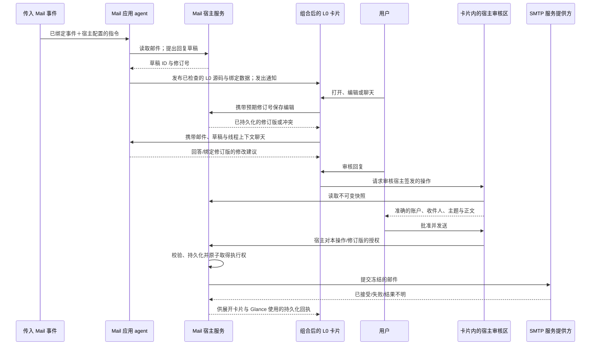

# ADR 0007：可组合的 Mail 卡片：编辑、聊天与经批准的操作

[English](0007-composable-mail-action-cards.md) | 简体中文

- **日期：** 2026-10-04
- **状态：** 实现中。DeepSeek 和 MiniMax 已通过各自修正后的模型卡片操作手机编辑、上下文聊天、接受建议、取消、注入批准拒绝和重启。其余原生/真机检查及用户实体批准发送仍待完成。桌面与无障碍审批暂缓。（*2026-10-06：自 [#347](https://github.com/OctoSense-org/OctoSense/pull/347) 起，桌面输入补丁（`tools/runtime-patches/makepad-desktop-trusted-input.patch`）也信任宿主审阅界面上的亲手点按，即在 macOS 上用鼠标或触控板点击；合成输入和远程输入仍会被拒绝。macOS 路径**未验证**：还没有在 macOS 上实际发送过邮件。Windows、Linux 与无障碍审批仍暂缓。*）
- **范围：** LLM 用可复用的区块组合出一张 L0 Mail 卡片。用户在卡片内阅读邮件、编辑回复、与 Mail 的 agent 聊天，并批准发送。草稿和操作结果在切换视图或重启后仍然保留。
- **相关决策：** [ADR 0002](0002-event-driven-app-agents.md)（传入事件）、[ADR 0004](0004-native-apps-hosting-and-peers.md)（peer 与审批）、[ADR 0005](0005-app-contract.md)（准入）、[ADR 0006](0006-app-studio-on-the-phone.md)（生成与评估），以及[历史 Mail 操作卡片计划](../../apps/mail/docs/2026-10-01-email-action-card-plan.md)。

## 原始背景：从卡片发送当时仍只是演示

物流通知邮件已经可以触发 Mail 的 agent 生成卡片和通知。下一步交互也应同样直接：打开卡片，让 agent 起草回复，编辑内容，检查实际将发送的邮件，然后发送，整个过程无需打开独立的写信界面或审批应用。发布新布局不能抹掉用户的编辑。

这里的**宿主**（host）指 OctoSense 可信的 Rust shell 和 Mail 服务。L0 卡片描述 UI；应用 agent 提议内容并调用获准的工具；宿主负责账户访问、存储和执行。

下表记录实现前的基线，不代表当前支持情况。当前 API、代码路径和验证条件见[组合 Mail 卡片](../mail-composable-cards.zh-CN.md)。

本次源码审查基于 OctoSense `127ae4bd5a5476f0b813179868e61f80748a044e`，其中 Octoscript 固定在 `5991dfae9344589e732b2605b530f788e8bbcd11`，Octoscript-Makepad 固定在 `2cc5ef37d7d6a3d2992673389ce74488f7bb2d87`。

| 现有部分 | 已提供的能力 | 尚缺的能力 |
| --- | --- | --- |
| [L0 组件、事件与插槽](https://github.com/OctoSense-org/Octoscript/blob/5991dfae9344589e732b2605b530f788e8bbcd11/docs/ui-profile-l0.md) | 一张卡片内的带类型组件属性、向父组件路由的事件、命名视图和插槽。 | 导入或嵌入独立发布的卡片是另一项能力。 |
| [Mail 请求示例](../../crates/shell/resources/glance/mail-request.card) | 一张 L0 卡片内的摘要、可编辑草稿和聊天视图。 | `send` 事件只把本地状态改成 `sent`，并不发送邮件。 |
| [Glance 运行时](../../crates/shell/src/glance_card.rs) | 输入事件、组件状态和 `sys.chat` 写入。 | 不执行其他写入。重新发布源码会创建新会话；不同展示位置的状态相互独立。 |
| [卡片聊天适配器](../../crates/shell/src/glance_chat.rs)与[聊天存储](../../crates/l0-chat/src/lib.rs) | 发布者校验、用户输入来源信息和持久化聊天记录。 | 适配器只转发问题，不包含请求携带的历史或邮件/草稿绑定；使用当前选中的账户。 |
| [Mail 服务](../../apps/mail/host-service/src/lib.rs)、[传输层](../../apps/mail/host-service/src/network.rs)与[工具](../../apps/mail/bundle/tools.json) | 按账户隔离的读取，以及宿主/UI 的 SMTP 发送。传输层可以输出回复邮件头。 | 没有持久化且带修订号的草稿、agent 草稿/发送工具或发送记录。服务尚未将回复邮件头传给传输层。 |
| [审批路由器](../../crates/shell/src/approvals/router.rs)与[工具中继](../../crates/shell/src/host_tools/relay.rs) | 等待审批时，中继保留准确的工具参数。 | 可变草稿的 ID 不等于不可变的邮件快照。Mail 尚未注册应用确认处理器；当前开发者模式的处理也先于应用确认。 |

未经修改的 Mail 示例已通过固定版本的 L0 检查器，没有诊断或 lint 提示。这只建立了组合语法的基线，并未验证持久编辑、带上下文的聊天、原生 UI 质量或真实发送。[双模型 Android 卡片测试](../testing/mail-card-actions-2026-10-04.zh-CN.md)验证了本地 Show code/Details/Back 交互，没有验证远程操作。

## 决策

### 1. 将可复用区块组合到一张 L0 卡片中

使用 L0 已有的组件声明、带类型属性、事件参数、命名视图和插槽。模型生成一张经过检查的卡片，包含摘要、回复编辑器、聊天区块，以及进入宿主操作审核的入口。已有的 a2app L0 卡片示例提供可复用的组合方式和默认视觉样式；最终源码和文案仍由模型编写。

无需新增组合语法。构建或生成步骤可以将经过审查的组件定义纳入待检查的卡片源码；本 ADR 不引入运行时导入。视觉上的 `Card` 容器不会嵌入另一张已发布卡片、合并其权限或创建另一个 agent。独立的跨应用卡片嵌入不在本决策范围内。

L0 仍表示语言能力级别。紧凑 Glance、展开卡片和完整应用是展示层次，不是 L0/L1/L2 语言级别。首次实现支持紧凑和展开两种展示；独立的完整 Mail 应用仍是另一种界面。

Glance 显示简短摘要、草稿/发送状态和展开入口。展开卡片包含编辑器、带上下文的聊天和宿主审核区域。它们可以是同一卡片中的不同区块，也可以通过命名视图切换。打开、关闭或切换视图都必须保留草稿。两种展示中的只读状态信息应保持一致。

在手机上，带有宿主 Mail 绑定的卡片，其 shell 箭头会打开同一张已发布卡片的展开面板，包含草稿工具栏和宿主审核区域。关闭后返回 Glance。未绑定卡片仍通过原有入口打开完整应用；Mail 启动图标仍打开独立的 Mail 应用。带绑定的卡片路由已在 OnePlus 6 测试版本上操作验证。0415 还验证了点击真实通知会打开准确绑定的卡片；导航输入不授予发送权限。

组件状态用于临时 UI 选择，例如当前打开哪个区块。业务数据不能依赖 `InstanceStore` 的组件键：模型重排视图时，这些键可能变化；它们也不为独立发布的卡片提供全局命名空间。

### 2. 将卡片绑定到宿主管理的 Mail 数据

宿主为发布内容附加可信绑定。以下是**宿主绑定字段**，由发布适配器在生成数据之外传递，不是模型提供的 L0 参数。实现位于 `mail_card::Binding`：

| 字段 | 含义与归属 |
| --- | --- |
| `publisher` | 已认证的应用身份，初期为 `os.mail`；由宿主提供。 |
| `account` | 创建卡片时已获授权的 Mail 账户。 |
| `source_message` | 账户内的文件夹/邮件身份，适用时包含邮箱代次；由 Mail 解析。 |
| `draft_id`、`draft_revision` | 宿主创建的草稿，以及当前显示的修订号。 |
| `chat_thread` | 宿主为这封邮件/卡片上下文创建的对话身份。 |

模型文本和卡片数据不能覆盖此绑定。生成的源码可以引用通过准入检查的数据/操作句柄，但不能任意选择账户或伪造邮件身份。每次操作时，宿主都根据发布者和绑定账户校验句柄。模型文本始终是标明来源的普通内容；接受 AI 草稿以供审核，不等于批准发送。

切换当前选中的账户不会改变旧卡片的绑定。shell 必须清楚显示卡片绑定的账户，并在账户切换时使待处理的批准失效。后续操作要么明确继续使用仍获授权的原绑定账户，要么显示失败；绝不能悄悄改用新选中的账户。退出登录或撤销授权会阻止该账户的新读取、模型请求和操作。延迟返回的结果仍归属于原绑定，不能更新另一个账户的卡片。

### 3. 持久化保存草稿，并使用修订号

Mail 的宿主服务拥有权威草稿存储。草稿包含账户、源邮件、收件人、主题、正文、回复邮件头、单调递增的修订号和生命周期状态。初期支持向一个经过明确审核的 To 地址发送纯文本回复，与当前 SMTP 传输层一致。多收件人、Cc/Bcc、全部回复、附件、富文本和转发暂缓。若请求的操作需要尚不支持的能力，应在批准前显示此限制；绝不能静默丢弃收件人或附件。

创建回复时，从缓存的源邮件推导收件人及 `In-Reply-To`/`References`。模型可以建议文字，但不能编造传输标识符。收件人或主题可以通过同一受审查的草稿更新流程编辑。

AI 编写的正文通过 Mail 按账户隔离的草稿提议工具，以不可信文本的形式进入存储；不能通过 L0 事件把 `model-copy` 写入宿主存储。卡片通过已准入的绑定读取草稿，并保留 AI 编写标记。对于操作目标、载荷和源参数中的模型文本，继续保留 L0 已有的默认拒绝限制。批准授权的是宿主已保存的准确快照，既不把模型文本重新认定为可信命令，也不要求用户把未经修改的草稿重新输入一遍。

更新草稿时携带预期修订号：只有存储中的修订号仍匹配，更新才能成功。每次成功更新都会递增修订号。持有旧版本的编辑器收到冲突结果，并保留未保存文字以便恢复。后台 agent 的改写仍然是需要用户明确接受的建议。

**原生聊天的例外（2026-10-04）：** 用户在原生 Mail 聊天中要求修改回复时，宿主可为准确的账户、草稿和已保存修订号签发随机的一次性编辑凭证。`mail.suggest_reply` 接收可选的 `edit_token`，直接保存用户要求的正文修改，记录 `model_chat` 来源，并返回 `applied: true` 和新修订号。凭证五分钟后过期，回合结束时撤销；它不能授权发送、修改收件人或覆盖较新的修订版。生成的 NAV、读取卡片和后台回合均不签发凭证。无效凭证直接报错，不降级为建议。这一流程取消了用户在聊天中要求修改后还必须再次接受建议的步骤。

编辑器区分未保存、保存中、已保存和冲突/错误状态。显示的字段尚未持久化，或与待审核修订版不一致时，禁用发送。导航和重新发布不能丢弃尚未保存的输入；应保留到保存成功，或用户明确放弃为止。重启后恢复最后一次已确认持久化的修订版，并报告中断的发送。绝不把未经确认保存的输入标为已保存。

Glance 与展开视图订阅同一份草稿和发送记录。刷新源码可以替换展示，但保留宿主绑定和草稿身份。隐藏或关闭卡片不删除草稿。账户删除遵循 Mail 的数据清除策略；卡片不另存一份凭据或账户存储。

**已完成回复（2026-10-05）：** 当已保存草稿和最后一次发送尝试均为 `accepted`，且最后一次传输回执包含 `accepted: true` 时，宿主移除绑定回复卡片及其通知。SMTP 接受不代表收件人已收到。模型文字、生成数据、阅读、编辑、取消以及发送失败或结果不明都不能使卡片完成。移除状态持久保存，不删除草稿或回执，也不替换用户的撤销操作。已打开的成功审阅界面保留至用户返回。恢复、撤销或重试同一绑定发布都不能让它重新出现。新邮件仍是独立事件，由重要性策略筛选；此修改不合并邮件会话，也不自动完成其他类型应用的卡片。见[验证记录](../testing/mail-completion-2026-10-05.zh-CN.md)。

### 4. 使用带类型的操作引用，在卡片内由宿主负责审批

拟发送的邮件采用**由宿主签发、带类型的操作引用**。它指向某个草稿修订版的不可变快照，以及该操作的身份。不能把向通用发件队列直接追加数据当作授权。若本 ADR 获得接受，这项决策将解决历史计划中尚未确定的 Send 设计选择。

已实现的源为 `sys.mail_review(app, id, fields)`：`set` 请求审核绑定草稿，`clear` 取消待处理审核。`sys.mail_draft(app, id, fields)` 读取草稿并允许单字段编辑；agent 工具为 `mail.propose_reply`、`mail.draft`、`mail.suggest_reply` 和 `mail.propose_send`。卡片可以请求审核通过准入检查的操作引用；只有宿主可以授权执行。所需的能力声明、检查器校验和运行时处理器必须一起加入。已有 L0 组合语法保持不变；处理器实现前，文档不能宣称新操作已经可用。Glance 当前拒绝原生 kit 包，因此仅安装一个 kit 无法提供此功能。

模型可以生成 Review reply 入口，但 shell 在**同一展开卡片界面内**绘制清晰可辨、由宿主管理的审核区域。该区域显示待批准邮件的发送账户、完整收件人、主题和正文，之后是 **Approve & Send**（批准并发送）与取消控件。较长内容可滚动查看。模型不能替换区域内容、隐藏发件人或改写最终控件的标签。仅显示邮件摘要不足以取得批准。

只有可信地激活宿主控件才会产生授权。生成的 Chip、本地 `approved` 状态、聊天中的“是”、工具调用、源码替换或模拟 agent 输入都不能产生授权。无障碍激活必须保留同一条可信路径。实现必须区分真实用户输入与 agent/instrument 注入；普通脚本或导航事件不能证明操作者是人。

授权绑定发布者、账户、草稿 ID、修订号、完整发送快照和操作 ID。修改任何待发送字段、切换账户、取消审核或审核过期，都会使授权失效。执行器在取得发送执行权时，原子地重新检查绑定和修订号。过期批准必须失败，而不是发送更新后的文字。

即使处于开发者模式，或存在长期审批规则，此发送路径也要求用户明确批准。若获得接受，这是 ADR 0004 通用开发者模式行为的一项有限例外。按当前路由器的处理顺序，仅设置 `confirm: app` 不足以保证这一点。

Mail 发送的所有 UI、agent 和服务入口都必须汇聚到此执行器。现有 `host.request("mail.send", ...)` 路径必须迁移到同一授权契约；保留另一条不受保护的路径将违反本决策。agent 可以创建草稿、提议发送，但不能获得自行生成批准或直接调用 SMTP 传输层的工具。

### 5. 持久化记录发送，并如实表示不确定结果

一次批准只授权对某个修订版执行一次操作。每次提交尝试都有宿主签发的操作 ID。调用 SMTP 前，宿主先持久化记录此 ID、本次尝试的稳定 Message-ID 和不可变载荷。原子地取得执行权，防止第二次点击、另一个展示界面或重复工具请求再次启动同一次尝试。针对同一草稿修订版的普通重复提议/发送请求，返回已有尝试及其状态；签发另一个操作引用不能绕过去重。

| 状态 | 宿主向用户表达的含义 |
| --- | --- |
| `draft` | 可编辑草稿；尚未授权发送。 |
| `awaiting_approval` | 某个不可变修订版已可供审核；尚未发送任何内容。 |
| `sending` | 授权已被使用，执行器已取得操作执行权；载荷已冻结。 |
| `accepted` | SMTP 已接受邮件；这不证明收件人已经收到或阅读。 |
| `failed_before_delivery` | 宿主确定提交未达到被接受的阶段；明确重试会创建新的尝试，并要求再次批准。 |
| `outcome_unknown` | 邮件可能已被接受；不得自动重发。 |

明确的 Retry 请求可以创建新的尝试，关联上一次尝试及同一不可变草稿修订版，但前提是没有正在进行的尝试。新尝试需要重新批准。对于 `outcome_unknown`，还要求用户确认已知可能重复发送。普通模型重试或 UI 重试不能创建这种新尝试。`accepted` 尝试永不重试；另一封回复应创建新草稿。

取得执行权后，载荷不能改变。若传输错误导致结果不明，或崩溃后留下未确定结果的 `sending` 记录，应保留原身份，尽可能通过服务提供方/已发送文件夹核对。否则继续显示不确定状态；超时或在已发送文件夹中查无结果，都不能证明发送失败。稳定的 Message-ID 有助于核对，但不能让 SMTP 保证恰好发送一次。

取得执行权前取消，可以阻止发送。SMTP 提交开始后，关闭卡片、取消 agent 回合或退出登录，都不能保证撤回。回执必须表示实际传输结果，而不是 UI 本地状态。即使更新卡片发布失败，或聊天记录保存失败，发送记录仍是权威依据。

### 6. 让聊天以邮件和当前草稿为依据

聊天请求包含可信的账户/邮件绑定、有长度限制的线程历史，以及当前持久化草稿修订版的快照。原生编辑器在进入 Chat 前保存待提交的修改；保存失败时留在编辑器中处理。agent 收到已确认保存的文字，以及适用时上述受限编辑凭证。延迟的回答仍可能具有参考价值，但它针对旧草稿的修改不能自动应用。

手机先显示紧凑的 Glance 摘要。点按后，选中卡片展开为 shell 根视图拥有的全屏工作区，不再受信息流高度、裁剪和边距限制。**Email / Chat** 位于同一行，原邮件在 Email 内查看。[原生邮件页](../../crates/shell/src/mail_clip.rs)读取权威草稿，允许直接编辑收件人、主题和正文并审核准确邮件。[原生聊天](../../crates/shell/src/card_chat.rs)虚拟化消息，输入框固定在键盘上方。已保存的 `model_chat` 修订版驱动宿主的更新状态和跳转按钮，助手文字不能制造保存确认。[展示状态](../../crates/shell/src/card_presentation.rs)在 Makepad 的下一帧循环中运行，不重建会话、不启动应用或 agent。返回时保留同一进程内的草稿、聊天输入和视图状态；来源摘要仍可见时缩回该处，来源不存在或启用减少动态效果时立即切换。关闭时取消审核权限，缓存中不保留发送批准能力。手工输入合并 500 毫秒后保存，导航或审核前立即保存，冲突时保留文字。模型编写的 L0 发布仍是入口。UX 目标仍为 **9/10**，需要功能、键盘、性能和用户证据；构建或原型通过不等于验收通过。

使用现有 broker：每个 `(app, account)` 对应一个应用 peer，peer 内部拥有不同的对话上下文。组件、草稿编辑器和聊天区块不启动内核，也不创建新应用 agent。适配器使用 `card-chat` 标签，broker 为每次对话分配新的上下文 ID。实现已加入明确的邮件/草稿绑定及有限线程历史；原始缺口是这些上下文缺失，而不是 ID 冲突。上下文根据绑定线程的有限历史重建，无需无限期保留一个活跃回合。

系统 agent 的请求和用户的卡片聊天，都按照已有调用者与通道策略到达 Mail 自己的 peer。系统 agent 可以要求 Mail 准备回复并报告结果，但不能代替用户批准回复。Mail 工具仍受账户范围约束；声明某个工具可用，不会扩大另一个应用已获得的权限。

聊天可以解释发送回执或建议更好的草稿，但它绝不是权威草稿存储、投递记录或审批通道。

## 事件与交互流程

传入事件通过用户主动启用的 Mail 分发器，以及宿主配置的指令/技能文本处理，无需系统 agent 或编程助手为每封邮件另行下达指令。模型决定发布卡片还是保持安静；发布从不构成外部操作的授权。

## 归属与实现顺序

| 仓库/区域 | 职责 |
| --- | --- |
| OctoSense：`apps/mail/host-service` | 草稿存储、回复邮件头、修订校验、操作快照、授权验证，以及发送记录/传输。 |
| OctoSense：共享 shell、`crates/l0-chat`、AI host/broker 适配器 | 发布绑定、共享草稿订阅、编辑器适配、带上下文的聊天、宿主审核 UI 和可信审批路由。不在 desktop/phone 中复制源码。 |
| Octoscript | 在 L0 目录/检查器中定义并验证新增的 Mail/操作源和事件契约。保留模型文本来源标记和已有组合语法。 |
| Octoscript-Makepad | 已检查组件和宿主审核边界所需的共享输入/渲染钩子；不负责 Mail 授权。 |
| OctoScript-App-Design-Flow/a2app 示例 | 基于已实现契约提供可复用区块、生成指导和模型评估案例。 |
| OctoSense-App-Hub | 只在新增能力声明有需要时修改准入/schema；拒绝不支持的能力版本。 |
| octos | 保持已有共享内核/peer 模型。本决策无需为每张卡片新增内核，也无需改变 agent 拓扑。 |

按以下顺序实现：

1. 确定具体草稿/操作 schema 和授权接口；使用假传输层实现持久化 Mail 存储、回复邮件头和执行器。暴露 Send 前，先定义可信输入边界。
2. 加入经过检查的 L0 绑定，并用现有组件语法构建组合卡片。接通持久编辑、冲突处理，以及 Glance/展开视图同步。
3. 将聊天绑定到账户、邮件、草稿修订版和线程。agent 建议经过同一个修订 API。
4. 加入宿主审核区域并迁移所有发送入口。只有处理器和调用者权限就绪，才允许草稿/提议操作工具通过准入。
5. 更新 a2app/生成指导，再进行双模型和原生 UI 验收。在所有授权与结果处理条件通过前，保持真实发送不可用。

## 验收条件

**宿主/服务测试：**

- 正确的回复收件人与邮件头；拒绝不支持的收件人/内容组合。
- 过期修订；审批或 agent 改写待处理时用户继续编辑；切换账户与退出登录；尝试改变句柄绑定目标。
- 直接服务调用及开发者模式绕过尝试；取得执行权前取消。即使用户发送的是未经修改的 AI 草稿，模型文案也不能成为批准。
- 两个界面同时批准；重复调用；明确重试与重复提交的区别；SMTP 前存储失败；发送中重启。
- SMTP 接受与投递不确定的区别。任何不明确的结果都不能导致自动重发；新尝试必须取得规定的新批准。

**原生 UI 测试：** 使用 Makepad 的隐藏窗口 instrument 测试真实的组合卡片和审阅界面。覆盖多行与 Unicode 编辑、引号、光标/选区、输入法组合输入、键盘/Back 行为、滚动、焦点，以及浅色/深色主题中的可见触摸目标。编辑期间重新发布、切换视图，然后重新打开卡片并重启 shell。除截图外，还要验证存储值和操作结果。可以通过注入测试控件，但生产实现不能将 agent/instrument 输入视为用户的发送授权；用假传输层或明确仅供测试的路径覆盖此边界。

**OnePlus 6 真机验收：** 使用独立测试包。对配置的 DeepSeek 和 MiniMax 模型，分别通过 AgentMail 向已连接的测试邮箱发送相同的受控物流/请求场景邮件。新邮件必须自动触发 Mail 的 agent，由它编写最终 L0 源码/数据并发布通知。用户打开卡片、编辑回复、围绕该邮件聊天，在卡片内审核并批准，然后确认实际回复具有正确的邮件线程关系，且 Glance/展开卡片中的回执一致。还要取消一次审核，并确认没有提交邮件。评估者根据 instrument/设备证据向模型反馈，不以手写最终卡片替代模型产物，也不为每封邮件的回合手工输入提示。

报告准确的模型 ID、不含秘密的提供方配置标签、仓库/运行时固定版本、生成源码哈希和测试结果。区分本地控件、模拟传输结果和真实投递证据。即使检查器通过，也要记录视觉/交互不足。文档和 UX 审查目标均为至少 4.5/5（A−），同时必须通过功能验收条件；分数不能抵消任何未通过的条件。

**历史验收状态（0414–0416）：** 在测试版本 0414（`57b711ae`）上，两家模型修正后的卡片都操作了编辑、绑定邮件/草稿的真实聊天、明确接受建议、取消、注入批准拒绝和重启。单独的原生 shell 检查也在所述范围内通过。包含 0416 手机回答的最终 agent 审查给 DeepSeek 视觉 4.1/5、限定范围可用性 4.4/5；MiniMax 为 4.2/5 和 4.4/5，两者均未达到目标。

0415（`97a23a3f`）通过 888 项 shell 测试、桌面/手机及依赖图检查。其通知触摸修正在 OnePlus 6 上完成操作：真实浮层打开准确绑定的卡片，已保存草稿仍完整保留。完整手机输入法、选择、主题、触摸目标和失败矩阵覆盖仍不完整。此前 Mail 测试通过 50 项，两个已有的真实服务/环境测试仍被忽略；固定版本 L0/可移植 UI 测试分别通过 315/86 项。

0416（`abf06d8f`）为绑定的卡片聊天请求加入展示指导，11 项聊天测试通过。两家实际模型面对同一条新的只读问题，均以简洁纯文本正确引用已保存备注，没有 Markdown 或原始 ID，修订版 44 及正文不变。再次注入批准后，操作仍待批准；取消后返回草稿。

上述 0416 检查点尚未验证真实发送。后续受控物流演示已经完成实体批准与真实线程回复。此前 Lab 0427 的 Chat / Reply 工作区又通过两家实际模型的预约时间修改、准确审核和人工编辑回读测试；其验证范围与撤回原 UX 评分的说明见[当前工作区验证](../mail-composable-cards.zh-CN.md#回复工作区设计与当前验证)。本次工作区测试没有再执行真实 SMTP。只有 Android 实体触摸屏输入可以授权发送；桌面/无障碍审批仍暂缓。（*2026-10-06：在 macOS 上亲手点按现在也能授权发送，但仍**未验证**：还没有在 macOS 上实际发送过邮件。见文首的状态说明。*）源码哈希、失败尝试及操作工具限制见[当前检查点](../mail-composable-cards.zh-CN.md#历史验证检查点04140416)。两家服务商之间调整过指导和宿主实现，因此这是工程检查，不是受控模型基准。

## 影响与替代方案

这使模型编写的组合保持小而可复用，同时为 Mail 提供持久、可审计的操作路径。代价是新增存储迁移、冲突处理和可信宿主 UI 边界；要让用户看到的草稿与实际发送内容一致，这些成本不可省略。

拼接完整的已发布卡片，会失去清晰的状态和权限归属。完整嵌套卡片托管需要单独的身份与生命周期契约，因此暂缓。原始的可写发件队列，或仅由模型生成的 Send Chip，都不能证明用户批准。把每个操作都跳转到完整 Mail 应用，可以减少部分卡片内集成工作，但无法满足所要求的卡片内编辑、聊天与审批体验。

若获得接受，本 ADR 将取代历史 Mail 计划中尚未确定的 Send 设计选择和临时草稿方案。它不表示 ADR 0002 已全部实现，不授予通用跨应用卡片组合能力，也不宣称无关的日历/支付操作已经可用。
