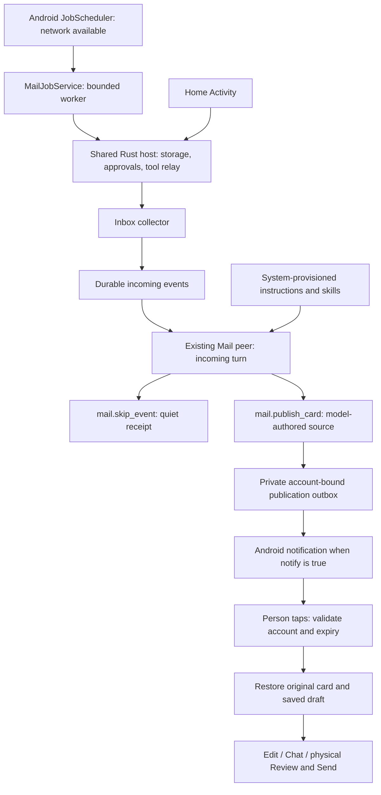

# ADR 0008: Quiet Android Mail jobs and native card notifications

English | [简体中文](0008-quiet-android-mail-jobs.zh-CN.md)

- **Date:** 2026-10-05
- **Status:** Implemented in this change; device acceptance in progress.
- **Scope:** Android Mail only. Extends [ADR 0002](0002-event-driven-app-agents.md) and preserves [ADR 0007](0007-composable-mail-action-cards.md).

## Problem

A Rust thread is not an Android background execution grant. The existing Mail collector and agent could run while the window was open, but Android could deny background networking or kill the process. A pending failed event also prevented collection of later mail. Users should not have to keep the launcher visible to receive important-mail cards.

## Decision

Use one persisted, network-constrained Android `JobScheduler` job for an already consented and provisioned Mail account. Its period is 15 minutes with a 5-minute flex window. The UI keeps the configured collection interval (30–3600 seconds); background timing belongs to Android. This is not IMAP IDLE, push, an exact alarm or a foreground service. Android documents the [period and persistence constraints](https://developer.android.com/reference/android/app/job/JobInfo.Builder#setPeriodic(long,long)) and the [JobService execution and stop contract](https://developer.android.com/reference/android/app/job/JobService#onStopJob(android.app.job.JobParameters)).

`MailJobService` loads the same native library without starting an Activity. `runtime_host::init` initializes storage, the one kernel service, approvals and the tool relay once per process. Headless startup registers Mail and Glance, then prepares only Mail's existing peer. Opening the UI later reuses those services. It never resets approval state, copies credentials, or creates another agent or kernel.

The collector and serialized delivery worker are independent. Collection proceeds despite pending events and model failures. Failed events have individual exponential backoff; waiting events can progress. Delivery pauses one second between attempts. A foreground lifecycle flag or a four-minute job lease permits work on Android. Losing both prevents new work and closes an active turn on its next validity check, within 250 ms under normal scheduling. A network fetch already in flight may settle at the transport timeout; it does not start another turn after cancellation. Durable pending events remain available for the next permitted run.

The native job pumps the same host-tool relay. The UI and job serialize pumping, and service executors retain normal caller, account, consent and tool-grant checks. Calls requiring a person are not approved in the background. SMTP still requires ADR 0007's physical host review. The job cannot manufacture that input.

Syncing does not itself notify. The model applies the existing provisioned importance policy and chooses a card or an explicit skip. Host guidance is not a deterministic spam/importance classifier. Native notifications require `notify: true`, notification permission and an enabled channel; their lock-screen public version omits email content.

A private outbox holds at most 64 publications and 8 MiB. Each record binds the original account, card key, source/data, absolute expiry and delivery/dismissal state. Writes are atomic and owner-only. Restore revalidates the source and active account; a missing draft cannot be rebuilt from cached text. Silent republishes replace the stored source without alerting. Notification intents carry an opaque publication token and grant navigation only. Stable notification tags make a crash between posting and recording delivery replace the same notification rather than add a duplicate. This does not promise exactly-once alerts across every platform failure.

## Consequences and limits

- Doze, standby buckets, quotas and lack of network can delay a job. Force-stop prevents execution until the app is opened again. There is no immediate-delivery promise and no ongoing status notification.
- A job runs at most four minutes and may stop earlier. A large queue or slow model may require multiple periods. Mail retains its existing 128-event queue limit. Glance scrolls all retained cards; its payload-retention budgets do not impose a four-live-card publication quota.
- Disabling the provision, signing out or revoking consent stops agent work; the next foreground reconciliation or job removes the scheduled job. Revoked/inactive/expired card targets do not open.
- The job uses the configured provider and can consume model tokens. No separate per-app provider, general scheduler UI or kernel-native skill system is introduced.
- This adds durable Android Mail publications, not generic persistence of every app's UI or unsent chat input. Other platforms keep their existing lifecycle behavior.
- The ROM and installed Home package are not required to change. Device validation uses the separate MailTest package.

## Code and evidence

Follow [`runtime_host.rs`](../../crates/shell/src/runtime_host.rs), [`agent_events.rs`](../../crates/shell/src/agent_events.rs), [`mail_background.rs`](../../crates/shell/src/mail_background.rs), [`android_mail.rs`](../../phone/src/android_mail.rs), [`MailBackground.java`](../../phone/resources/android/java/dev/makepad/octosense/MailBackground.java) and [`MailJobService.java`](../../phone/resources/android/java/dev/makepad/octosense/MailJobService.java).

Unit and device results belong in the [Mail background test record](../testing/mail-background-2026-10-05.md); a forced JobScheduler run is reported separately from a naturally scheduled run.
