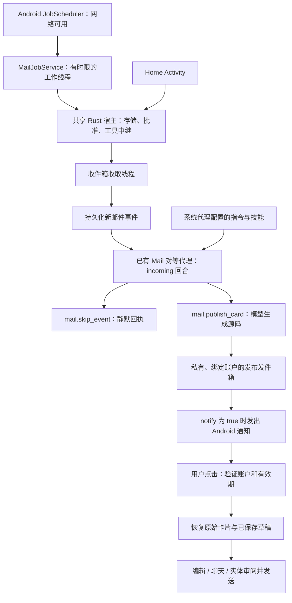

# ADR 0008：Android 静默邮件后台任务与原生卡片通知

[English](0008-quiet-android-mail-jobs.md) | 简体中文

- **日期：** 2026-10-05
- **状态：** 本次变更已实现，设备验收进行中。
- **范围：** 仅 Android Mail。扩展 [ADR 0002（英文）](0002-event-driven-app-agents.md)，保留 [ADR 0007](0007-composable-mail-action-cards.zh-CN.md) 的批准要求。

## 问题

Rust 线程并不等于 Android 后台执行授权。原来的 Mail 收取线程和代理可以在界面打开时运行，但 Android 可能阻止后台联网或终止进程。队首事件失败还会阻止收取后续邮件。用户不应为了收到重要邮件卡片而一直保持启动器可见。

## 决策

为已授权、已配置开启的 Mail 账户注册一个持久化且要求联网的 Android `JobScheduler` 任务，周期 15 分钟、弹性窗口 5 分钟。界面打开时仍使用配置的收取间隔（30–3600 秒）；后台调度由 Android 决定。这不是 IMAP IDLE、推送、精确闹钟或前台服务。Android 官方文档说明了[周期及持久化约束](https://developer.android.com/reference/android/app/job/JobInfo.Builder#setPeriodic(long,long))与 [JobService 执行和停止契约](https://developer.android.com/reference/android/app/job/JobService#onStopJob(android.app.job.JobParameters))。

`MailJobService` 无需启动 Activity 即可加载同一个原生库。`runtime_host::init` 在每个进程内仅初始化一次存储、共享内核服务、批准路由和工具中继。无界面启动仅注册 Mail 与 Glance 服务，然后准备 Mail 已有的对等代理。之后打开界面会复用这些服务，不会重置批准状态、复制凭据或创建第二个代理或内核。

收取线程与串行投递线程独立。即使存在待处理事件或模型失败，仍继续收取。失败事件分别指数退避，其他等待事件可以继续；投递尝试之间间隔一秒。Android 上，前台生命周期标志或四分钟的系统任务租约允许执行。两者都失效后不再启动新工作，正在运行的回合在下一次有效性检查时关闭，正常调度下不超过 250 毫秒。已开始的网络读取可能等待传输超时才结束，但取消后不会再启动模型回合。持久化事件保留给下一次获准执行。

原生任务驱动同一个宿主工具中继。界面与任务串行驱动中继，执行器继续检查调用者、账户、同意状态和工具授权。需要用户决定的操作不会在后台自动获准。SMTP 仍要求 ADR 0007 的实体触摸批准；系统任务不能制造这种输入。

同步本身不产生通知。模型根据已配置的重要性偏好选择发布卡片或明确跳过。宿主指令不是确定性的重要性或垃圾邮件分类器。原生通知要求 `notify: true`、通知权限和启用的频道；锁屏公开版本不包含邮件内容。

私有发件箱最多保存 64 条发布、总计 8 MiB。每条记录绑定原始账户、卡片键、源码及数据、绝对到期时间、投递与关闭状态。写入采用原子操作且仅所有者可访问。恢复时重新验证源码与当前账户；草稿丢失时不能从缓存文本重建。静默重新发布会更新缓存而不提醒。通知 Intent 仅携带不透明发布标识，只允许导航。稳定的通知标签使“发布后、记录已投递前”发生崩溃时替换同一条通知，避免新增重复项；不承诺所有平台故障下严格仅提醒一次。

## 影响与限制

- Doze、待机分组、配额和断网可能延迟任务。强行停止应用后，必须重新打开才会恢复。无即时送达承诺，也无常驻状态通知。
- 每次任务最多四分钟，也可能提前结束。大量积压或较慢模型可能需要多个周期。继续保留 Mail 现有的 128 个待处理事件上限。Glance 可滚动浏览所有保留卡片；负载保留预算不再形成四张存活卡片的发布限制。
- 关闭配置、退出账户或撤销同意会停止代理处理；下一次前台状态核对或任务执行会移除系统任务。已撤销、非当前账户或过期的卡片不能通过通知打开。
- 任务使用已配置的提供商，可能消耗模型 token。本次不增加按应用选模型、通用调度设置界面或内核原生技能系统。
- 本次增加 Android Mail 发布的持久化，不是所有应用界面及未发送聊天输入的通用持久化；其他平台保留原生命周期行为。
- 不要求修改 ROM 或已安装的 Home。设备验证使用独立的 MailTest 测试包。

## 代码与证据

依次阅读 [`runtime_host.rs`](../../crates/shell/src/runtime_host.rs)、[`agent_events.rs`](../../crates/shell/src/agent_events.rs)、[`mail_background.rs`](../../crates/shell/src/mail_background.rs)、[`android_mail.rs`](../../phone/src/android_mail.rs)、[`MailBackground.java`](../../phone/resources/android/java/dev/makepad/octosense/MailBackground.java) 和 [`MailJobService.java`](../../phone/resources/android/java/dev/makepad/octosense/MailJobService.java)。

单元与设备结果记录在[邮件后台测试记录](../testing/mail-background-2026-10-05.zh-CN.md)；通过命令强制运行的 JobScheduler 任务与自然调度执行分开报告。
