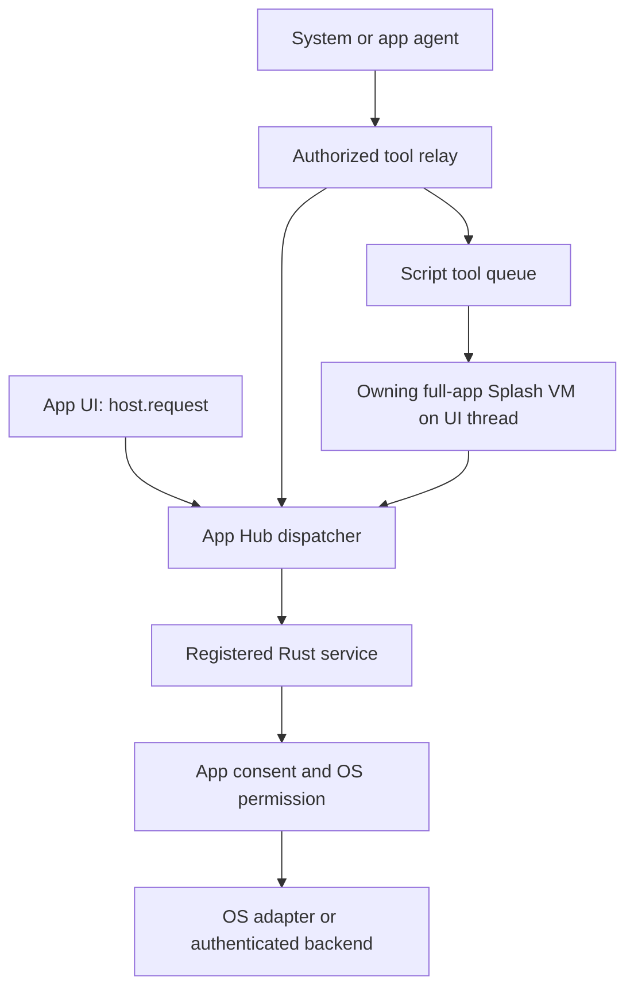

# ADR 0012: Discoverable host APIs for installed apps

English | [简体中文](0012-app-host-api-discovery.zh-CN.md)

- Date: 2026-10-07
- Status: Implemented in source; contract 1.6.0 published. Compatible host release and phone acceptance pending.
- Builds on: [ADR 0004](0004-native-apps-hosting-and-peers.md), [ADR 0005](0005-app-contract.md), [ADR 0010](0010-shared-oauth-and-connected-apps.md).

## Context

An installed script app cannot call a Rust function absent from its host.
App Hub submissions need shared OS and backend services, dependable feature
detection, and execution of their declared app tools. A capability name alone
does not prove that a service exists, supports this platform, has an account,
or has the user's permission.

We defer Wasm, JIT and native-library loading. This decision exposes implemented
host services through the existing `host.request` transport and completes the
bounded script-tool path. It does not promise all OS APIs or new privileges.

## Decision

### One versioned contract

App Hub's contract describes each public method: name, exact ABI major version,
input/output schemas, capability, platforms and agent access. Rust services
register descriptions for methods they implement. Host-owned `.sheet.*` controls
are not public methods. Existing undescribed services remain available under
their existing checks; their absence from discovery is not a universal inventory
of historical methods.

Bundles declare `requires` feature markers and optional `host_api` requirements:

- `host-api-v1` enables the requirement fields and the new device-consent policy;
  it requires the `app_policy.device_consent@1` runtime ABI.
- `backend-api-v1` admits signed backend registration and requires
  `auth.backend.request@1`.
- `script-tools-v1` requires the `app_tools.dispatch@1` runtime ABI.

`host_api.required` blocks install/launch when a method is missing or its ABI
major differs; version 2 does not satisfy a request for version 1.
`host_api.optional` permits installation and requires an app-side fallback.
None of these fields grants a capability.

With the `runtime` capability, apps call `runtime.list` or `runtime.describe`.
The former includes public method descriptions and a `runtime_features` map.
The latter distinguishes callable service methods from `kind: "runtime-abi"`
entries with `callable_via_host_request: false`. For example, discover
`app_tools.dispatch` but do not call it with `host.request`.

Availability, configuration and authorization are separate. Discovery reports
`configured: null` for service methods and requires authorization on each call;
apps use service-specific status/account APIs to learn more. Platform names are
`android`, `macos`, `linux`, `windows`, `ios`, `openharmony` and `web`.

### Host identity and permission boundaries

The host stamps the app/account identity; JSON arguments cannot select another
app's VM, storage root, connection or approval authority. Existing capability,
network and account restrictions still apply. Described denied/foreground-only
methods cannot be laundered through an agent tool or a nonprompting background
request. A background agent cannot approve a native consent sheet.

Device consent is per installed app; the OS grant belongs to the OctoSense
package. The first adapter provides camera/microphone/location permission
status, request and revoke on Android/macOS. The host applies the opt-in gate
before source evaluation, including legacy device widgets and GPS helpers.
Old bundles retain the earlier manifest-based policy. Revocation does not revoke
another app's consent or the OS package grant.

`location.get` is Android-only and returns a last-known fix with
`source: "last_known"`, `timestamp: null`, and `freshness: "unknown"`.
It supplies neither guaranteed fresh coordinates nor background location.
Permission grants do not implement new pickers, calendars or camera-capture
methods; camera UI still uses the existing widget.

### Backend login and business requests

Reuse the host's Google/GitHub/backend authentication and credential vault.
A signed manifest may supply public backend registration and named operations;
app identity comes from admission. Endpoints share one HTTPS origin, operations
have fixed methods/paths and allowed query keys, and callers cannot choose
arbitrary URLs, headers or bearer tokens. The backend still implements its own
public-client PKCE login, registration page, identity and logout endpoints.

`auth.backend.request` reads the current admitted declaration and app-owned
connection. Registration change/removal, withdrawal or authorization change
invalidates access. GET operations can run in the background. Mutations require
a foreground native review of an immutable request and trusted physical input;
a script field or synthetic click cannot approve them. Reviews rejected or cancelled before
approval do not send the request; cancelling cannot undo an approved network operation. This is not an unrestricted HTTP proxy.

### Executable app tools

A bundle's `implemented_by: "app"` tools use its signed declarations and fixed
`app_tool(name, call_id)` hook. `mod.app_tools.request` reads host-stamped arguments
and context; `complete`, `fail` and `active` support bounded asynchronous work.
The runner invokes the hook on the UI thread in the **existing full-app VM and
storage jail**. It does not move a VM into a Tokio task or evaluate model source.

Only one full-app owner registers; Glance does not create another owner.
Closed apps return `app_not_running`. Input/result schemas, 1 MiB payload limits,
16 pending calls per app, 128 per process, a maximum 60-second deadline and VM
instruction/memory limits apply. Closing, account changes and cancellation
invalidate replies. The shell also rechecks admission while a script call is
pending and before forwarding its result; withdrawal or a modified bundle
suppresses that result. This does not unload an already open app's local UI.
Cancellation cannot undo an already-emitted host request.
This ABI does not cold-start/background-start an app or provide script proof
for `confirm: "app"`; use host confirmation.

## Delivery boundary

The changes span App Hub's contract, dispatcher and runner; OctoSense's relay,
auth and device services; and the pinned Makepad consent overlay. Publish and
pin compatible artifacts together before claiming that released hosts support
these requirements. A successful bundle check alone does not prove services run.

Embedded backend login is implemented on macOS/Android; Windows/Linux keep the
separate external-browser authentication path, with platform execution still
requiring acceptance. Embedded `WebReader` is unsupported on Windows/Linux and
must fail visibly. Google Android login remains unsupported. The new device
adapter does not advertise Windows/Linux/iOS support. No broad OS access,
arbitrary Rust/native library execution, or Wasm loading is added.

## Evidence and remaining acceptance

The public dependency graph uses crates.io contract 1.6.0 and the checked-in
App Hub, renderer and runtime pins; no private Cargo overrides are required.
On macOS, `python3 tools/setup.py --check --cargo` and the desktop packaging
check (`cargo check --locked -p octosense --features mobile-apps`) passed.
From `phone/`, both `cargo check --locked -p octosense-home --features mobile-apps`
and `cargo test --locked --features mobile-apps -p octosense-shell --lib` passed
(1,003 tests). Building Home on macOS is not an Android device test.

Real Splash VM tests cover declared handler invocation, shared UI/storage state,
digest tampering, schema failures, ownership, cancellation, account changes,
prompt suppression and instruction limits. Service/protocol tests cover backend
boundaries and device permission policy. These tests do not establish a physical
permission approval, a live installed-app login/write, or a OnePlus 6 journey.
Phone, real-model and per-platform release acceptance remain pending.

The [native Host API Lab](../../tools/fixtures/host-api-lab/README.md) also passed
on macOS: a signed Store-installed app invoked its own Splash tool, read real
OS permission status through the Rust device service, updated its live UI and
returned a bounded result. Native button input reused the same service. The
fixture verified missing API fallback, capability/account/schema refusals,
background callback prompt refusal and closed-app behavior. Its explicit test
caller enters the tool queue directly, so this is not model/peer-consent evidence.

Implementation owners: App Hub `app-contract/src/{host_api,backend}.rs` and
`appstore/src/{host_api,script_tools}.rs`; OctoSense
[`host_tools/script_apps.rs`](../../crates/shell/src/host_tools/script_apps.rs),
[`oauth-service`](../../crates/oauth-service/README.md), and
[`platform_services`](../../crates/shell/src/platform_services/README.md).
