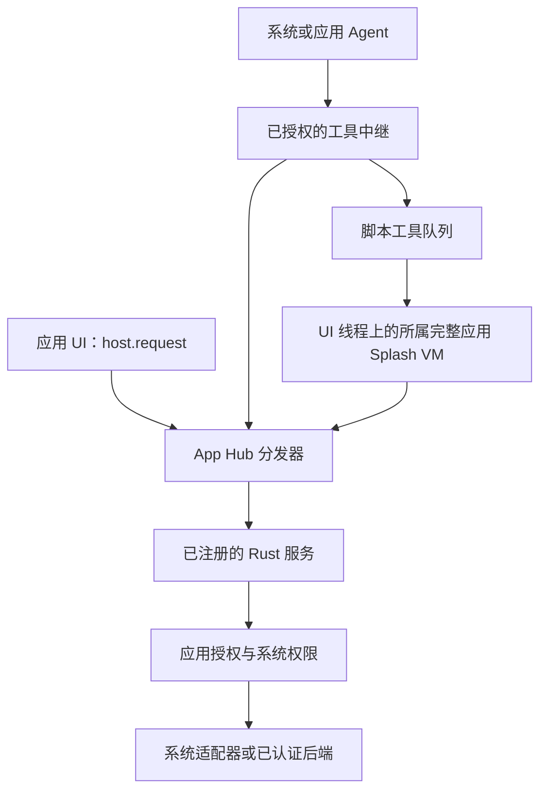

# ADR 0012：面向已安装应用的可发现宿主 API

[English](0012-app-host-api-discovery.md) | 简体中文

- 日期：2026-10-07
- 状态：源码已实现；契约 1.6.0 已发布。兼容宿主发布和手机验收待完成。
- 基于：[ADR 0004](0004-native-apps-hosting-and-peers.md)、[ADR 0005](0005-app-contract.md)、[ADR 0010](0010-shared-oauth-and-connected-apps.zh-CN.md)。

## 背景

已安装的脚本应用不能调用宿主中未编译的 Rust 函数。App Hub 投稿需要共享的
系统和后端服务、可靠的功能发现，以及执行自己声明的应用工具。一个能力名
不能证明服务已经实现、支持当前平台、已连接账户，或已获得用户许可。

暂缓 Wasm、JIT 和原生动态库加载。本决策通过已有 `host.request` 传输暴露已实现
的服务，并补全有界的脚本工具路径；不承诺暴露所有系统 API，也不增加系统特权。

## 决策

### 一个带版本的契约

App Hub 契约描述每个公开方法的名称、精确 ABI 主版本、输入/输出 schema、
能力、平台与 Agent 访问策略。Rust 服务只注册自己实现的方法描述。
宿主的 `.sheet.*` 控件接口不公开。旧有未描述的服务继续遵循原来的检查，
因此发现接口缺少某个历史方法，不代表宿主一定没有该方法。

应用包通过 `requires` 特性标记及可选的 `host_api` 字段声明要求：

- `host-api-v1` 启用 API 要求字段与新的设备授权策略，要求
  `app_policy.device_consent@1` 运行时 ABI。
- `backend-api-v1` 允许签名后端注册，并要求 `auth.backend.request@1`。
- `script-tools-v1` 要求 `app_tools.dispatch@1` 运行时 ABI。

`host_api.required` 中的方法不存在或 ABI 主版本不符时，拒绝安装/启动；
版本 2 不满足版本 1 的要求。`host_api.optional` 不阻止安装，应用必须提供降级
路径。这些字段本身都不授予能力。

获得 `runtime` 能力的应用可调用 `runtime.list` 与 `runtime.describe`。
前者返回公开方法描述及 `runtime_features` 映射。后者区分可调用服务与
`kind: "runtime-abi"`、`callable_via_host_request: false` 的 ABI。
例如可以发现 `app_tools.dispatch`，但不能用 `host.request` 调用它。

可用、已配置、已授权是三种状态。发现接口对服务方法返回 `configured: null`，
并要求每次调用重新授权；应用应使用具体服务的状态/账户接口了解详情。
平台名为 `android`、`macos`、`linux`、`windows`、`ios`、`openharmony` 和 `web`。

### 宿主身份与权限边界

身份由宿主填写；JSON 参数不能选择另一应用的 VM、存储根目录、连接或批准权。
现有能力、网络和账户限制仍有效。被描述为禁止 Agent 或仅前台使用的方法，
不能通过 Agent 工具或不能弹窗的后台请求绕过。后台 Agent 不能批准原生授权页。

设备授权属于单个已安装应用；系统授权属于 OctoSense 安装包。首批适配器在
Android/macOS 提供摄像头、麦克风和位置权限的查询、申请与撤销。宿主在执行
应用源码前设置可选的新授权检查，覆盖既有设备控件和 GPS 辅助接口。旧包保留
此前的清单策略。撤销不会撤销其他应用的授权，也不会修改系统对安装包的授权。

`location.get` 仅在 Android 返回最近已知位置，包含 `source: "last_known"`、
`timestamp: null` 和 `freshness: "unknown"`。它不保证新鲜坐标，也不授予后台
定位。权限许可不会凭空实现文件选择器、日历或摄像头拍摄方法；相机 UI 仍使用
已有控件。

### 后端登录与业务请求

复用宿主的 Google/GitHub/后端认证与凭据库。签名清单可以提供公开后端注册信息
和命名操作；应用身份由准入路径决定。端点共享一个 HTTPS 源，操作固定方法、
路径和允许的查询键；调用者不能任意指定 URL、请求头或 bearer 令牌。后端仍需
实现自己的公共客户端 PKCE 登录、注册页面、身份与退出端点。

`auth.backend.request` 读取当前已准入声明及本应用的连接。注册变更/删除、撤回
或授权变化都会使访问失效。GET 可以在后台运行；修改操作要求用户在前台原生
界面审阅不可变请求，并通过真实物理输入批准。脚本字段或合成点击不能批准。
批准前拒绝或取消审阅不会发出请求；取消不能撤销已批准的网络操作。这不是无限制的 HTTP 代理。

### 可执行的应用工具

`implemented_by: "app"` 工具使用签名声明及固定的 `app_tool(name, call_id)`
钩子。`mod.app_tools.request` 读取宿主填写的参数与上下文；`complete`、`fail`
和 `active` 支持有界异步工作。运行器在 UI 线程上进入**既有完整应用 VM 和
存储沙箱**，不会把 VM 搬入 Tokio 任务，也不会执行模型生成的源码。

仅允许一个完整应用实例持有工具；Glance 不创建第二个所有者。应用关闭时返回
`app_not_running`。输入/结果 schema、各 1 MiB 载荷上限、每应用 16 个/进程
128 个待处理调用、最多 60 秒期限，以及 VM 指令/内存限制同时生效。关闭、
账号变化和取消会使回复失效；shell 还会在脚本调用待处理期间及返回结果前
重新检查工具所有者与应用调用方的准入，撤回或篡改应用包后不再返回其结果。这不会卸载已经打开的
本地应用界面。取消不能撤销已经发出的宿主请求。此 ABI 不会
冷启动/后台启动应用，也不提供 `confirm: "app"` 的脚本批准证明；请使用宿主确认。

后台弹窗限制会随分离定时器、任务、暂停线程、排队的控件调用及 HTTP/WebSocket
回调继续生效，包括调用原生设备辅助函数。新的前台调用保留自己的权限。
作用域限制在返回或异常展开后恢复；工具完成不会提升其尚未结束的续体权限。

## 交付边界

改动横跨 App Hub 契约、分发器和运行器，OctoSense 中继、认证及设备服务，以及
固定版本的 Makepad 授权补丁。必须一起发布并固定兼容组件，才能宣称已发布
宿主支持这些要求。通过应用包检查本身不证明服务能够运行。

macOS/Android 实现嵌入式后端登录；Windows/Linux 保留独立的外部浏览器认证
路径，仍需平台执行验收。后续[桌面浏览器扩展](../desktop-embedded-browser.zh-CN.md)为 Windows 和
Linux X11/XWayland 提供普通 `WebReader`；原生 Wayland 或引擎缺失时明确报错。
这不启用嵌入式后端认证。Google Android 登录仍不受支持。新设备适配器不宣称支持
Windows/Linux/iOS。不增加广泛系统访问、任意 Rust/原生动态库执行或 Wasm 加载。

## 证据与待完成验收

公开依赖图使用 crates.io 契约 1.6.0，以及仓库固定的 App Hub、渲染器和运行时
版本，不需要私有 Cargo 覆盖。在 macOS 上，`python3 tools/setup.py --check --cargo`
与桌面打包检查 `cargo check --locked -p octosense --features mobile-apps` 均通过。
在 `phone/` 下运行的 `cargo check --locked -p octosense-home --features mobile-apps`
和 `cargo test --locked --features mobile-apps -p octosense-shell --lib` 均通过
（完整 shell 测试集，当前数量记录于 PR）。在 macOS 上构建 Home 不等于
Android 真机测试。

真实 Splash VM 测试覆盖声明处理函数调用、共享 UI/存储状态、摘要篡改、schema
错误、所有权、取消、账号切换、禁止工具弹出权限页和指令限制。服务/协议测试
覆盖后端边界和设备授权策略。这些测试不证明真实物理授权、已安装应用的实际
登录/写入，或 OnePlus 6 完整流程。手机、真实模型和各平台发布验收仍待完成。

[原生 Host API Lab](../../tools/fixtures/host-api-lab/README.zh-CN.md) 已在 macOS
通过：Store 安装的签名应用执行自己的 Splash 工具，经 Rust 设备服务读取真实
系统权限状态，更新正在运行的界面，并返回有界结果。原生按钮输入也复用了
同一服务。测试验证了缺失 API 的降级、能力/账户/schema 拒绝、后台回调不能
弹出权限面板，以及关闭应用后的行为。显式测试调用方直接进入工具队列，
因此这不是模型或 peer 同意流程的证据。

实现位置：App Hub 的 `app-contract/src/{host_api,backend}.rs` 和
`appstore/src/{host_api,script_tools}.rs`；OctoSense 的
[`host_tools/script_apps.rs`](../../crates/shell/src/host_tools/script_apps.rs)、
[`oauth-service`](../../crates/oauth-service/README.zh-CN.md) 与
[`platform_services`](../../crates/shell/src/platform_services/README.zh-CN.md)。
