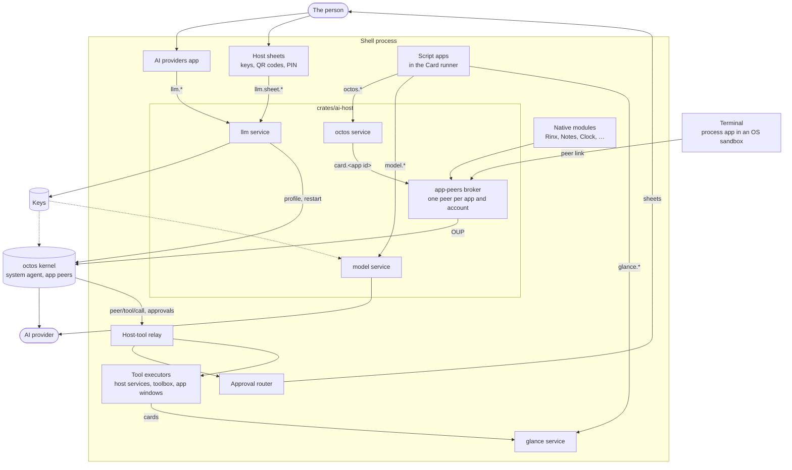

# AI services in OctoSense

English | [简体中文](ai-services.zh-CN.md)

This guide covers the assistant's moving parts in the shell: the octos kernel service, AI providers and where keys live, the services apps call (`octos`, `model`, `glance`) and the system toolbox. It sets out the trust model and ends with how to run and test it all locally. It builds on the README's [key concepts](../README.md#key-concepts). [architecture.md](architecture.md) has the internals, and an app developer needs only Design Flow's [AI-SERVICES guide](https://github.com/OctoSense-org/OctoScript-App-Design-Flow/blob/main/docs/AI-SERVICES.md).

## The moving parts



[`crates/ai-host`](../crates/ai-host/README.md) is the one entry point both shells call. At startup, `start(Host::platform(data_dir))` configures the kernel, installs the host policy, and registers the `llm` and `model` services and, where the shell hosts a kernel, the `octos` service. Around a native module's `create`, `offer` and `finish` hand the new instance the injected assistant service; only Rinx takes it. `shutdown` stops the kernel.

Outside this picture, the opt-in AppCard prototype opens its own kernel connection, and the desktop's AI pane (Makepad's `aichat`) reaches apps' tools over Makepad's AI services bus.

### The kernel service

One octos kernel runs per shell, as a service in [`crates/kernel`](../crates/kernel/README.md). It starts when the first consumer connects, and `launch.rs` decides where it comes from:

| Platform | The kernel | Its core dir |
| --- | --- | --- |
| Desktop | a child process (`serve --stdio`): the binary `OCTOS_APP_CORE_BIN` names, else the packaged `octos-kernel` whose receipt names the pinned revision; else none | `~/.octosense/octos-home/.octos` |
| Android | a child process: the APK's `liboctos.so` | `<app data dir>/octos-home/.octos` |
| OpenHarmony | inside the shell (`octos_cli::embedded::serve_io`) | `<app data dir>/octos-home/.octos` |
| iOS | none: providers are saved, but no app gets an assistant | – |

A desktop copies provider settings once from the person's own `~/octos-home/.octos` and never writes there. Restarts and idle stops are in [architecture.md §1](architecture.md#the-octos-kernel).

### AI providers and the `llm` host service

**AI providers** (`os.ai-providers`, [`apps/ai-providers/bundle`](../apps/ai-providers/bundle)) is where the person chooses the assistant's models: a primary and fallbacks from octos's model catalog. A PIN-sealed `OCTOS1E` QR code moves them to another device. The app is an ordinary script app with no agent. Its privileged half is the **`llm` host service** ([`apps/ai-providers/host-service`](../apps/ai-providers/host-service/README.md)):

- It writes the kernel's profile, `<core dir>/profiles/_main.json`, then restarts the kernel.
- Keys, PINs and QR codes appear only on its host sheets. Only a sheet may call `llm.sheet.*`; the app sees masked status such as `"set ••••1234"`.
- It serves system apps (`os.*`) only, and no method takes a prompt: `llm.test` sends a fixed one-word ping.

Keys live where the kernel reads them (`vault.rs`): in the login keychain on macOS (service `octos`), in `<core dir>/secrets/<ENV>` (mode 0600) on desktop Linux, and in the profile itself on Windows, Android, iOS and OpenHarmony (mode 0600 on the Unix ones). `OCTOSENSE_LLM_VAULT=file` keeps them in the profile everywhere, as the [local run](#run-and-test-locally) does.

## The trust model

| Rule | How the code holds it |
| --- | --- |
| **Keys stay with the shell.** | Only the `llm` service writes keys; the kernel and the `model` service read them. No `octos.*` call carries a key, and the app-peers contract has no field for one (`ModelInfo`). |
| **Secrets are typed only on host sheets.** | App Hub accepts a `<family>.sheet.*` call only from a host sheet, never from the app. Password fields are inert in a script app, and the App Hub gate refuses a bundle that declares one. |
| **Apps never speak the kernel protocol.** | Apps reach their agents only through the app-peers broker, which stamps the app's identity on every call. |
| **Least privilege, by exact name.** | An app gets the `octos.*` services it declares, that exist and that the host grants. `octos.` or `octos.admin` grants nothing (`crates/app-peers/src/contract.rs`, `hosted.rs`). |
| **Approvals belong to the person.** | Every approval an app's peer raises goes to the shell's router; the app hears only `approval/handled_by_host`. The system agent cannot approve. Developer mode, which only the person turns on, approves routed calls for the apps it covers ([the order](architecture.md#5-approvals)). |
| **Mail leaves only when the person approves the exact message.** | No agent tool sends mail, and `mail.send` refuses. Only a physical touch on Approve & Send, in the host's review of the exact From, To, subject and body, authorizes sending; developer mode and standing rules cannot. That works on Android touchscreens only for now (`mail_review.rs`, [Composed Mail cards](mail-composable-cards.md)). |
| **A turn carries its origin.** | The shell stamps who started a turn on its tool calls and approvals ([below](#the-calls)). |
| **Memory and files belong to one app and account.** | Each peer has its own memory namespace, `app/<app>/acct-<hash>`, and at most its own account's folder. |

How tools are declared, granted and relayed is in [architecture.md §4](architecture.md#4-tools-and-grants).

## What each kind of app can use today

Four kinds of app have agents: Rinx, through the injected service; the other native apps with an agent (Calculator, Clock, Notes, Reminders, Weather and the Terminal), through the peer link ([architecture.md](architecture.md#an-app-and-its-own-agent)); the system script apps, all but AI providers; and store script apps. **Partly** means within the limits named; **–** means it does not apply.

| | Rinx | Other native apps | System script apps | Store script apps |
| --- | --- | --- | --- | --- |
| An agent, once the person allows it | Works, while Rinx is open and signed in | Works, while the app is open | Works, prepared once allowed and at each startup | Works, if its bundle declares one (`octos.*`, an `agent` block or `tools.json`); prepared once allowed and at each startup |
| Its own UI talks to its agent | Partly: `OctosAppService`, only for its mini apps' private contexts; the person uses the "Ask Rinx" panel | Works: `OctosPeer`, though the shipped apps only serve tools over it | – (none declares `octos.*`) | Works: [the `octos` service](#script-apps-and-the-octos-service) |
| Tools of its own for its agent | Not yet: its tools serve only the AI pane | Works: read tools, run in the open window | Works: run on its host service or the shell's notice service | Not yet: no host service or app executor runs them |
| `AGENT.md` and skills sent with every turn | – | – | Works (only Mail ships them) | Works |
| Events that start its agent | Not yet | Not yet | Partly: Mail's new-mail trigger only | Not yet |
| Cards on the glance screen | Not yet | Not yet | Works, with `glance`; Mail's can carry a reply draft | Works, with `glance` |
| Chat about one of its cards | Not yet | Not yet | Works: Card / Chat (Email / Chat for a Mail reply) | Works: Card / Chat |
| One-shot model calls | – | – | Works, with `model` (Photos) | Works, with `model` |
| The system toolbox | Unused¹ | Unused¹ | Unused¹ | Not yet |
| A model chosen for its agent | Not yet² | Not yet² | Not yet² | Not yet² |

¹ Only in builds with the `toolbox-peers` feature, and no app declares `research` or `crawl` yet.

² Every agent runs on the providers set in AI providers; the shell does not read a manifest's `model.needs`.

Kernel tools are granted, not inherited: Rinx's agent keeps octos's file, memory and web tools, a script app's agent only `ask_user_question` (the one App Hub admits), and the other native apps' agents none.

No agent acts outside the device on its own. Mail's agent drafts replies (`mail.propose_reply`, `mail.suggest_reply`) and proposes sending them (`mail.propose_send`), but it has no send tool: the person sends from the host's review ([the trust model](#the-trust-model)).

## Script apps and the `octos` service

A script app talks to its agent through the four calls of the `octos` host service, which `ContainedOctos` serves ([`crates/ai-host/src/contained.rs`](../crates/ai-host/src/contained.rs)). The shell registers it wherever it hosts a kernel, even with the consent gate turned off, so an app hears why it gets nothing. All of an app's calls go to one peer, `card.<app id>`, acting for `device` or, in an app that keeps accounts such as Mail, the signed-in account. The "Ask &lt;app&gt;" panel and the system agent use the same peer.

### The consent gate

`Policy::contained_gate` ([`crates/ai-host/src/lib.rs`](../crates/ai-host/src/lib.rs)) decides whether a call reaches the peer. By default it is `Consent`: the first call from an app the person has not decided on shows the first-use sheet ([`approvals/consent.rs`](../crates/shell/src/approvals/consent.rs)), which says what the agent may read and use and where the model runs. Calls are refused until the person allows the agent. The answer is kept in `approvals/consent.json` in the OctoSense home. `OCTOSENSE_CONTAINED_APPS=1` (`Everyone`) skips the sheet for development, and `0` (`Off`) refuses every call.

Settings lists every app's agent with an off switch. Turning one off releases its peer at once, and a denied app stays denied until the person turns it on there. Developer mode skips the sheet for the apps it covers.

### The calls

An app may call only the `octos.*` names its manifest declares: the Card runner's isolate refuses the rest, and the service checks again (`contained::declared`). The calls work on the app's conversation, the person's lane of its peer ([One app agent, two lanes](../README.md#one-app-agent-two-lanes)):

| Call | Arguments | Answer (`r.data`) |
| --- | --- | --- |
| `octos.session.open` | `{}` | `{open: true, model, …}`; `model` names the provider and model, never a key |
| `octos.session.history` | `{}` | the conversation's `messages`, both lanes merged by time, each with its `lane` and speaker |
| `octos.turn.start` | `{text, trigger?, from?}`, `text` up to 32 KiB | `{turn_id, text, speaker, lane}` once the turn ends |
| `octos.turn.interrupt` | `{}` | `{interrupted, turns}`: the running turns of both lanes stop |

`trigger` says what started the turn: `person` (the app says the person asked), `app`, `schedule` or `background` (its own run), or `incoming` with `from` (content someone else sent). Left out, the turn is `unknown`, the least trusted (`TurnTrigger` in `crates/app-peers/src/contract.rs`). The transcript labels a `person` turn as the person's, but approval rules treat it as the app's own run: only the shell's "Ask &lt;app&gt;" panel vouches for the person. Chat in a card counts as the app's run too, although the shell draws it. Standing rules skip incoming and unknown runs unless a rule opts in.

An app runs one turn at a time, and the broker interrupts a turn after 180 seconds. A script app gets no pushed events, so it reads `octos.session.history`, which includes the system agent's turns. No argument carries an approval decision. Design Flow's guide has [a minimal call](https://github.com/OctoSense-org/OctoScript-App-Design-Flow/blob/main/docs/AI-SERVICES.md#a-minimal-call-and-handling-unavailable).

### Errors

| `r.error` | Cause |
| --- | --- |
| `this app was not granted "octos", which "<service>" needs` | The manifest lacks that name; the isolate answers at once. |
| `no service answers "octos" on this device` | The shell hosts no kernel (iOS). |
| `Waiting for the person to allow this app's agent (OctoSense asks the first time)` | No consent yet, or the person denied it. |
| `The assistant is turned off for apps on this device` | The gate is `Off`. |
| `Unsupported Octos arguments`, `Provide text (at most 32 KiB)` | Arguments outside the table above. |
| `Add an account in the app before using its assistant` | The app keeps accounts and has none yet. |
| `This app already has an assistant turn running` | A second turn while one runs. |
| `no octos kernel: …` | A desktop without a kernel binary ([below](#run-and-test-locally)). |

Design Flow's [Errors](https://github.com/OctoSense-org/OctoScript-App-Design-Flow/blob/main/docs/AI-SERVICES.md#errors) table says what an app should show for each.

## One-shot model calls: the `model` service

Some jobs need one bounded answer rather than an agent; Photos uses one to group photos into memories. An app granted the `model` capability calls `model.complete {task, input, schema, class?, allow_urls?}`, or `model.budget` for its budget ([`complete/`](../apps/ai-providers/host-service/src/complete/mod.rs)):

- It bypasses the kernel: the service reads the same profile and keys and calls the provider itself. The model sees only fixed instructions, the task, the schema and the input.
- `class` is `fast` (the default) or `strong`. The host tries the person's providers in order, that class first. The app learns which class answered, never the provider, model or key.
- The reply must be JSON that validates against `schema`, at most 16 KiB, with no URL unless `allow_urls` is set. A failing reply is retried once, then refused.
- Each app's budget is by default 6 calls a minute, and 100 calls and 100,000 tokens a UTC day, kept in `<apps root>/.host/model/ledger.json`, outside every app's jail.
- A refusal reads `<code>: <sentence>`, with `code` one of `capability`, `no_provider`, `rate`, `budget`, `bad_request`, `invalid_output`, `too_large` or `provider`.

Design Flow's [One-shot model calls](https://github.com/OctoSense-org/OctoScript-App-Design-Flow/blob/main/docs/AI-SERVICES.md#one-shot-model-calls-model) shows a call.

## The system toolbox

The system toolbox ([`crates/toolbox`](../crates/toolbox/README.md)) gives app agents bounded research instead of a browser: fixed OctoScript workflow templates, plus search, page-reading and crawl tools, which the shell offers as host tools owned by `toolbox` ([`toolbox_peers.rs`](../crates/ai-host/src/toolbox_peers.rs)).

- **What each capability grants.** `research` grants `workflow.run`, `workflow.fork`, `toolbox.search` and `toolbox.web_read`; `crawl` grants `toolbox.deep_crawl`.
- **When they are offered.** Only in builds with the `toolbox-peers` feature (the phone's default build, not the desktop's), only after consent; among script apps, for now only to system apps. The system agent gets none.
- **Budget and results.** Templates call the model through the `model` service, so they share the app's budget, and write results to `<apps root>/.host/toolbox/<app>`, where the app cannot forge them.

## Glance cards

An app with the `glance` capability publishes cards to the glance panel (desktop) or glance page (phone) through the `glance` service ([`crates/shell/src/glance.rs`](../crates/shell/src/glance.rs)): `glance.publish`, `glance.withdraw` and `glance.list`. The shell takes the publisher from the caller, never from the arguments, binds the card to the account it was published under, and lets each app publish 6 times a minute. The feed scrolls all retained cards, without a per-app card-count quota. Source/data/lowered-body retention uses payload budgets of 8 MiB per app and 32 MiB overall; pressure retires lower-priority older cards while admitting the new publication. System apps' agents publish through their own tools: `<app>.notify` fills a fixed card template with the model's text, and Mail's `mail.publish_card` checks a card the model wrote and, given a `draft_id`, binds it to a host-owned reply draft.

The phone's feed shows only summaries and runs no generated UI. Opening a card shows its workspace, which keeps its state between openings: full screen on the phone, centred on the desktop. It has Card / Chat tabs when the publisher has an agent, even without `sys.chat`, and Email / Chat over one saved draft for a Mail reply. The README's [Cards and questions](../README.md#cards-and-questions) covers the workspace; [Composed Mail cards](mail-composable-cards.md) covers Mail's drafts, review and tests.

## Run and test locally

Except `--plan`, the commands below are **unverified**.

### Desktop, with a throwaway kernel and profile

1. Build the desktop kernel from the repository root. The helper reads the octos revision from `Cargo.lock` and builds in its own `target/octos-kernel/`, leaving other checkouts alone; `--plan` prints the steps without running them.

   ```sh
   python3 tools/kernel-artifact.py --host --plan
   python3 tools/kernel-artifact.py --host
   ```

2. Run the desktop with its own state, core dir and file vaults, so neither `~/.octosense`, `~/octos-home` nor the login keychain is touched:

   ```sh
   T=$(mktemp -d)
   OCTOS_APP_CORE_BIN="$PWD/target/octos-kernel/target/release/octos" \
   OCTOS_APP_CORE_DIR=$T/octos-home/.octos \
   OCTOSENSE_HOME=$T/state OCTOSENSE_APP_DATA=$T/apps \
   OCTOSENSE_LLM_VAULT=file OCTOSENSE_MAIL_VAULT=file \
     cargo run --release -p octosense
   ```

   The log says `octos: kernel service ready (starts on first use), core dir …`. Without `OCTOS_APP_CORE_BIN` the desktop uses a packaged `octos-kernel` beside the shell (`python3 tools/kernel-artifact.py --host --stage target/release` stages one); with neither, the log says there is no kernel, and AI providers still saves providers.

3. Open AI providers (Start → Settings → AI providers) and add a model with its key. The profile is `$T/octos-home/.octos/profiles/_main.json`; with the file vault the key is in it, so delete `$T` afterwards.
4. Talk to the assistant: F8 opens the system chat, and an app's "Ask &lt;app&gt;" panel reaches that app's agent once you allow it on the first-use sheet. A script app of your own reaches its agent through [the `octos` service](#script-apps-and-the-octos-service), with `OCTOSENSE_CONTAINED_APPS` left unset. AppCard (`--features app-appcard`) is another consumer.

**Hidden windows.** Add `MAKEPAD_HIDE_WINDOWS=1 MAKEPAD_REMOTE=<port>` to drive the shell over the remote bridge without taking the screen ([desktop README § Remote-control bridge](../desktop/README.md#remote-control-bridge)). `desktop/scripts/ai_providers_remote.sh` runs AI providers end to end this way, with fake keys and outbound HTTPS denied; `desktop/scripts/glance_remote.sh` drives the glance panel the same hidden way.

**Tests** (from the repository root):

```sh
cargo test --locked -p octosense-kernel                              # against a stand-in kernel
cargo test --locked -p octosense-app-peers --features octos-core,ws  # the broker, scripted kernel
cargo test --locked -p octosense-ai-host --features octos-core,llm
cargo test --locked -p octosense-shell --lib approvals              # router, rules, sheets, consent, contacts
# The real kernel (build it as in step 1):
OCTOS_CORE_TEST_KERNEL=/path/to/octos cargo test --locked -p octosense-kernel --test real_kernel -- --test-threads=1 --nocapture
OCTOS_APP_PEERS_TEST_KERNEL=/path/to/octos cargo test --locked -p octosense-app-peers --features octos-core --test real_kernel
```

### Phone

- **Android (Home)** bundles the kernel as `liboctos.so`. `rom/scripts/build-home.py` builds the APK pair ([phone/README.md](../phone/README.md)), with [`tools/kernel-artifact.py`](../tools/kernel-artifact.py) at the locked octos revision. The kernel starts on first use.
- Configure providers in OctoSense Settings → Accounts → AI providers, or import a desktop's code (Show QR for phone) by camera, image or pasted text, with its PIN.
- OpenHarmony and iOS: see [the kernel service](#the-kernel-service).

## Source map

| What | Where |
| --- | --- |
| Entry point, host policy, `offer` | [`crates/ai-host/src/lib.rs`](../crates/ai-host/src/lib.rs) |
| The kernel service | [`crates/kernel/src`](../crates/kernel/src) (`launch.rs`, `router.rs`, `system_tools.rs`) |
| App peers: contract, broker, shell side | [`crates/app-peers/src`](../crates/app-peers/src) (`contract.rs`, `broker.rs`, `hosted.rs`) |
| The `octos` service | [`crates/ai-host/src/contained.rs`](../crates/ai-host/src/contained.rs) |
| The `llm` and `model` services, the key vault | [`apps/ai-providers/host-service/src`](../apps/ai-providers/host-service/src) (`lib.rs`, `vault.rs`, `complete/`) |
| Which apps have agents, and their preparation | [`crates/shell/src/apps.rs`](../crates/shell/src/apps.rs) (`agent_apps`), [`crates/shell/src/agents.rs`](../crates/shell/src/agents.rs) |
| Mail drafts and the send review | [`apps/mail/host-service/src/drafts.rs`](../apps/mail/host-service/src/drafts.rs), [`crates/shell/src/mail_review.rs`](../crates/shell/src/mail_review.rs) |
| Everything else | [architecture.md § Source map](architecture.md#source-map) |
