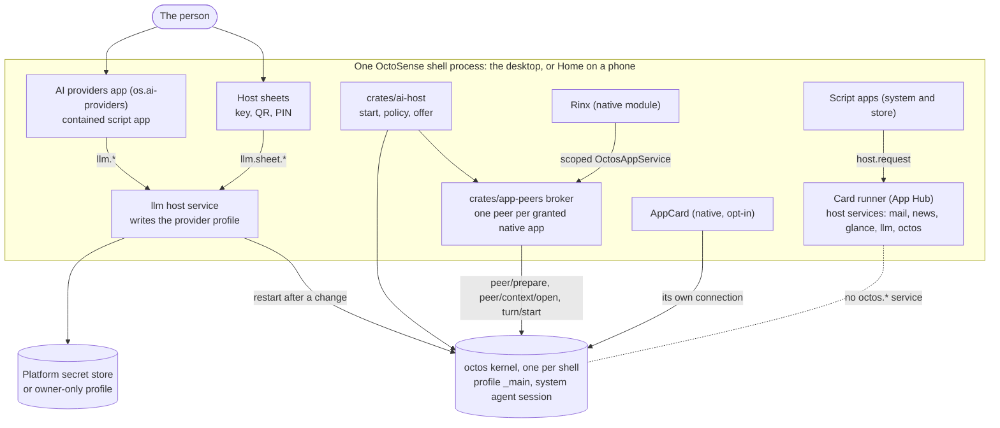

# AI services in OctoSense (octos)

English | [简体中文](ai-services.zh-CN.md)

How the assistant is wired into OctoSense: the [octos](https://github.com/octos-org/octos) agent kernel the shell runs, where the person configures it, which apps may use it and how, and what is planned. It describes `main` as of 2026-09-27 (OctoSense `405139f`, which pins octos `a6ea8505` and OctoSense-App-Hub `46d67e51`). Everything under **Works today** was read in that code; **In progress** means an open pull request; **Planned** means an ADR or an open issue, with nothing merged yet.

This page is about the assistant *inside* OctoSense. Building an app needs no AI service and no particular coding agent: the app harness, [OctoScript-App-Design-Flow](https://github.com/OctoSense-org/OctoScript-App-Design-Flow), works with any agent or none. Its [AI-SERVICES](https://github.com/OctoSense-org/OctoScript-App-Design-Flow/blob/main/docs/AI-SERVICES.md) page is the app developer's short version of this one.

## Contents

- [At a glance](#at-a-glance)
- [Architecture](#architecture)
- [The trust model](#the-trust-model)
- [What each kind of app can use today](#what-each-kind-of-app-can-use-today)
- [Planned: event-driven app agents (ADR 0002)](#planned-event-driven-app-agents-adr-0002)
- [Run and test locally](#run-and-test-locally)
- [Source map](#source-map)

## At a glance

| Piece | Status | Where |
| --- | --- | --- |
| One octos kernel per shell process, started on first use, restarted after a provider change | Works today (desktop with `OCTOS_APP_CORE_BIN`, Android, OpenHarmony; none on iOS) | [`crates/kernel`](../crates/kernel/README.md) |
| AI providers: the person's model providers and keys, keys only on host sheets | Works today | [`apps/ai-providers`](../apps/ai-providers/host-service/README.md) |
| The shell's AI entry point (`start`, policy, per-instance offer, QR import) | Works today | [`crates/ai-host`](../crates/ai-host/README.md) |
| Host-owned app peers: one octos peer per granted native app, owned by the system agent | Works today, for native modules (Rinx) | [`crates/app-peers`](../crates/app-peers/README.md), [Rinx ADR 0007](https://github.com/hagency-org/Rinx/blob/main/docs/adr/0007-host-owned-octos-app-peers.md) |
| AppCard ("Ask anything") on the shell's kernel | Works today, opt-in (`--features app-appcard`), not shipped | [`apps/appcard`](../apps/appcard) |
| A contained script app (system or store) asking the assistant | Available where the shell hosts a kernel: the `octos` host service gives each app its own peer (`card.<app id>`); tool approvals are declined until the Card runner has an approval sheet. `llm` stays provider management for `os.*` apps only | [below](#contained-script-apps-system-and-store) |
| One-shot model calls for contained apps (`model`, `model.complete`) | Coming: the capability is merged in App Hub ([App-Hub#24](https://github.com/OctoSense-org/OctoSense-App-Hub/pull/24)); the OctoSense `model` service is not written yet | [below](#contained-script-apps-system-and-store) |
| News data service (`news`, no model) | Merged ([#69](https://github.com/OctoSense-org/OctoSense/pull/69)); answers `os.*` apps only | [`apps/news/host-service`](../apps/news/host-service/README.md) |
| `glance.publish`: L0 cards on the glance screen | Merged ([#72](https://github.com/OctoSense-org/OctoSense/pull/72)); contained apps cannot reach it yet. In progress: the `glance` capability ([#86](https://github.com/OctoSense-org/OctoSense/pull/86)) and `sys.digest` sources ([#87](https://github.com/OctoSense-org/OctoSense/pull/87)) | [`crates/shell/src/glance.rs`](../crates/shell/src/glance.rs) |
| An app's own agent: `tools.json`, `AGENT.md`, skills, model requirements, triggers | Planned ([ADR 0002](adr/0002-event-driven-app-agents.md), Proposed). App Hub admits the files ([App-Hub#18](https://github.com/OctoSense-org/OctoSense-App-Hub/pull/18)); no shell runs them; the kernel side is open ([octos#2567](https://github.com/octos-org/octos/pull/2567)) | [below](#planned-event-driven-app-agents-adr-0002) |

## Architecture



### The octos kernel: one per shell

The kernel is a **shell service** ([`crates/kernel`](../crates/kernel/README.md), package `octosense-kernel`), not an app. The shell configures it once at startup; nothing runs until the first consumer calls `octosense_kernel::connect()`, and later consumers share the same process. octos holds a single-writer lock on its data dir, so there is one kernel per core dir. When the last connection closes the kernel stops; `shutdown()` stops it with the shell (5 s at most).

How it runs, by platform (`crates/kernel/src/launch.rs`, `KernelSource::platform()` in `crates/ai-host`):

| Platform | Kernel | Core dir (the octos home) |
| --- | --- | --- |
| Desktop (macOS; Windows and Linux untested) | `$OCTOS_APP_CORE_BIN serve --stdio --data-dir <core dir>` (plus `--config <core dir>/config.json` if present). **Without `OCTOS_APP_CORE_BIN` there is no kernel**, and a developer's own `octos serve` is never touched. Packaging the kernel next to the desktop binary is in progress ([#85](https://github.com/OctoSense-org/OctoSense/pull/85)). | `$OCTOS_APP_CORE_DIR`, else `~/octos-home/.octos` |
| Android (Home) | The APK's `liboctos.so serve --stdio`, built by [`tools/kernel-artifact.py`](../tools/kernel-artifact.py) from the octos revision the root `Cargo.toml` pins | `<app data dir>/octos-home/.octos` |
| OpenHarmony | In process (`octos_cli::embedded::serve_io`), because a HAP may not exec | `<app data dir>/octos-home/.octos` |
| iOS | **None.** Providers are still saved; no app gets an assistant | – |

Consumers speak the octos UI Protocol (JSON-RPC frames, as `octos serve --stdio` does) over a `Connection`. Each consumer gets the replies to its own requests and the notifications of its own sessions. When the providers change, the kernel restarts and every connection ends with `CloseReason::Restarted`; a consumer reconnects and reopens its sessions (AppCard's transport is the reference).

### AI providers and the `llm` host service

**AI providers** (`os.ai-providers`, [`apps/ai-providers/bundle`](../apps/ai-providers/bundle)) is where the person chooses the assistant's models: a primary and fallbacks, each from octos's model catalog, with Test connection, and a PIN-protected `OCTOS1E` QR to move them between devices. It opens from **Start → Settings → AI providers** on the desktop and **OctoSense Settings → Accounts → AI providers** on a phone.

It is a contained script app like any other; the privileged half is the **`llm` host service** ([`apps/ai-providers/host-service`](../apps/ai-providers/host-service/README.md)):

- It writes the kernel's profile, `<core dir>/profiles/_main.json` (`config.llm` and the key variables in `config.env_vars`), then restarts the kernel.
- Keys go to the macOS login keychain (service `octos`), on Linux to `<core dir>/secrets/<ENV>` (0600), on Android and iOS into the app-private profile (0600), since octos has no secret store there. `OCTOSENSE_LLM_VAULT=file` keeps them in the profile for development.
- Keys, PINs and QR codes are typed, drawn and scanned only on the service's **host sheets**. Only a sheet may call `llm.sheet.*`; the app sees masked status (`"set ••••1234"`, `"missing"`).
- It serves **`os.*` apps only** (`"llm is for OctoSense's own apps."`). It manages providers; it has no method that sends a prompt to a model.

### `crates/ai-host`: the shell's one entry point

[`crates/ai-host`](../crates/ai-host/README.md) (`octosense-ai-host`) is what both shells call: `start(Host::platform(data_dir))` at startup (configures the kernel, installs the host policy, registers `llm` with the platform's QR import), `handle_event` every event, `offer(module, scope)` / `finish()` around a native module's `create`, and `shutdown()`.

The host **policy** decides which native modules may use the assistant, by exact `octos.*` service name. `Policy::shipped()` grants only `rinx` the four services; there is no per-app toggle for the person yet.

### `crates/app-peers`: host-owned app peers

[`crates/app-peers`](../crates/app-peers/README.md) is the broker between an app and the kernel (Rinx [ADR 0007](https://github.com/hagency-org/Rinx/blob/main/docs/adr/0007-host-owned-octos-app-peers.md); kernel side octos UPCR-2026-034):

- A native module whose declared `octos.*` services the policy grants gets **one octos peer** for the app, created or resumed with `peer/prepare` on the shell's kernel. A module with nothing granted allocates no peer.
- The peer's **owner** is the shell's system agent session, `_main:api:octosense#system`. The kernel mints a host token for the peer; the shell keeps it in `<core dir>/../app-peers` (0600), outside every app's reach.
- The peer's **memory namespace** is `app/<app>/acct-<hash>`: per app and per app account (the hash is a non-secret tag of the account id). The kernel provisions its workspace. A kernel without this contract is refused, never replaced by an ordinary session on the profile's memory.
- The app never sees the kernel protocol. It gets a scoped `OctosAppService` for the instance being created, binds its signed-in account, and opens one **request context** per client instance (`peer/context/open`). A change of account revokes every context of the old account; late events are dropped.
- The operations are `Open`, `History`, `Turn { text }`, `Interrupt` and `Approval { id, approve }`, each gated by its exact service (`octos.session.open`, `octos.session.history`, `octos.turn.start`, `octos.turn.interrupt`; an approval needs `octos.turn.start`). Turns time out after 180 s.

### The system agent

Today the system agent is the **owner** of every app peer: the session that created it and can address it. It does not hold any app's tools, and it cannot answer an app peer's approvals (octos [#2560](https://github.com/octos-org/octos/pull/2560), in the pinned `a6ea8505`). Its larger role in ADR 0002 (supervising app agents, budgets, the kill switch, ranking the glance screen, improving app agents) is **planned**; the glance screen currently orders cards by priority and recency.

### Other assistants in the shell

- **AppCard** ([`apps/appcard`](../apps/appcard)), the "Ask anything" assistant, is a native module that takes its own kernel connection and sessions. It is opt-in (`--features app-appcard`) and not shipped.
- The desktop's **AI pane** seats Makepad's own `aichat` app, which reaches apps' typed tools over the window manager's AI services bus (`crates/shell/src/ai_bus.rs`). Rinx's assistant tools are reached this way today (below). It is separate from the octos app peers.

## The trust model

| Rule | How it holds today |
| --- | --- |
| **Keys stay with the host.** | Only the `llm` service reads or writes keys; they live in the platform vault or the owner-only profile under the kernel's core dir, never in an app's jail. The app-peers contract carries no credentials (`ModelInfo` has none). No `octos.*` service lets an app choose a provider or submit a key. |
| **Secrets are the host's.** | No app collects a password, PIN, key or one-time code, not even to pass it on. The runtime makes a password field inert in a policed isolate, App Hub's gate refuses a bundle that declares one, and services ask on their own sheets (`<family>.sheet.*` is accepted only from the sheet). |
| **Approvals belong to the person, in the owning app.** | A tool approval raised in an app's context is answered only by `ContextOp::Approval` from that app's own UI; the system agent never approves for an app (app-peers policy, octos #2560). Rinx's `send_message` shows the room and the exact text in Rinx's own sheet and sends only on the person's yes. |
| **The system agent drives an app through its app agent.** | It owns the peers but holds no app tools; an app's tools run in the app (Rinx: `src/assistant`, "the system agent never holds these tools itself, it asks Rinx's peer"). |
| **Memory is private per app and account.** | Each peer's memory namespace is `app/<app>/acct-<hash>`; contexts of one account are never restored under another. Promotion to shared memory is planned (ADR 0002 §9). |
| **Least privilege, by exact name.** | An app gets `declared ∩ supported ∩ host policy` services, compared by exact name: `octos.` or `octos.admin` grants nothing. |

## What each kind of app can use today

### Native modules (Rinx-style)

A native module is trusted Rust linked into the shell. **Rinx** ([hagency-org/Rinx](https://github.com/hagency-org/Rinx)) is the reference and, under `Policy::shipped()`, the only one granted the assistant.

1. The module lists the exact services in `capabilities()`, for example all four of `octosense_app_peers::OCTOS_SERVICES`.
2. The shell calls `ai_host::offer(module, &scope)` before `module.create` and `offer.finish()` after it; the returned `Assistant` lives with the instance and releases it when dropped.
3. In `create`, the module claims its service; `None` means hosted without assistant access, and the module must not fall back to a kernel of its own:

   ```rust
   // Option<Arc<dyn OctosAppService>>; None: no assistant for this instance.
   let Some(service) = octosense_app_peers::injection::claim("rinx", &handles.scope.to_string()) else { return };
   service.set_account(Some(&user_id));
   let ctx = service.open_context(ContextSpec { account, instance, services })?;
   ctx.call(ContextOp::Turn { text }, sink)?;   // Data(..)* then Complete(..)
   ctx.close();                                  // instance closed
   service.release();                            // app closed
   ```

4. `availability()` reports `Unavailable` (no kernel, not granted, signed out), `Idle`, `Ready` or `Failed`; the app's ordinary UI keeps working in every state. `settings_entry()` is `Host`: the app offers no provider form of its own and points the person to AI providers.

**Tools.** Rinx defines its assistant tools once (`status`, `list_rooms`, `open_room`, `draft_message`, `read_room`, `open_mini_app`, `send_message`; `src/assistant/mod.rs`). Today the shell reaches them through Rinx's `ServiceExecutor` on the AI services bus. `read_room` asks for a per-room grant on Rinx's read sheet; `send_message` is Destructive and self-confirmed: Rinx's send sheet is the one confirmation. Registering these tools with Rinx's octos peer, so that the peer's own model can call them, waits for the kernel's host-registered tools ([octos#2567](https://github.com/octos-org/octos/pull/2567), open).

**Rinx mini apps.** Rinx hosts reviewed OctoScript mini apps and serves them the same four `octos.*` services, each running instance in its own request context of Rinx's peer ([example](https://github.com/hagency-org/Rinx/tree/main/examples/miniapps/matrix-octos-script)). That is Rinx's own mini-app host, for bundles a person imports into Rinx after review; it is not the App Hub install path.

### Contained script apps (system and store)

A script app runs in App Hub's Card runner and reaches the shell only through `host.request("<family>.<method>", args, fn(r){…})`, for a family its manifest was granted. The services a shell registers today (`crates/shell/src/apps.rs`, `crates/ai-host`):

| Family | Who may call it | What it is |
| --- | --- | --- |
| `mail` | any app granted `mail` | Mail accounts the person signs in to on the host's sheet |
| `llm` | `os.*` apps only | Managing the assistant's providers (`llm.providers`, `llm.add_provider`, `llm.test`, `llm.import_qr`, …); **no prompt or completion method** |
| `news` | `os.*` apps only | News's data service (feeds, ledger, `news.list`, `news.read`, …); no model. The shells' App Hub pin has no `news` capability yet, so the News bundle still fetches on its own |
| `glance` | `os.*` apps only, and no manifest can request `glance` at the shells' App Hub pin | Publishing L0 cards to the glance screen. Today only the shell's `OCTOSENSE_GLANCE_DEMO=1` card reaches it; the capability is [#86](https://github.com/OctoSense-org/OctoSense/pull/86) |
| `model` | – | **Not registered yet.** App Hub `main` admits the `model` capability ([App-Hub#24](https://github.com/OctoSense-org/OctoSense-App-Hub/pull/24)) for a one-shot `model.complete {task, input, schema, class}` (`class` `fast` or `strong`; the host picks the model from the person's providers, validates the reply against the schema, keeps a per-app daily budget; no tools or memory). The OctoSense service is still to come; a call answers `no service answers "model" on this device` (run in `card-host` at App Hub `e8601b8`), and the shells' App Hub pin does not know the name |
| `octos` | any app whose manifest declares the exact `octos.*` names, while the shell hosts a kernel and `Policy::contained_apps` is on (off in the shipped policy until first-use consent lands, ADR 0004 section 4; set `OCTOSENSE_CONTAINED_APPS=1` to try it) | The assistant, through the app's own host-owned peer `card.<app id>` (`crates/ai-host/src/contained.rs`): the four `octos.*` calls with Rinx's argument rules (`octos.turn.start` takes only `text`, non-blank, at most 32 KiB; the others take `{}`). Tool approvals the peer raises are declined, since the Card runner has no approval sheet yet, and listed in the reply's `denied_approvals`; replies over 2 MiB are refused |

So a contained app, store or system, reaches the assistant only through `octos.*`, in a shell that hosts a kernel. What it hears:

| Call | Answer |
| --- | --- |
| a family the manifest did not grant | `r.error`: `this app was not granted "<family>", which "<service>" needs` (at once, from the isolate) |
| `octos.turn.start {text}`, granted, kernel and provider configured | `r.data`: `{turn_id, text}`, the reply of the app's peer |
| `octos.*` with arguments beyond the rules | `r.error`: `Unsupported Octos arguments`, or `Provide text (at most 32 KiB)` |
| `octos.*` with `Policy::contained_apps` off | `r.error`: `The assistant is turned off for apps on this device` |
| `octos.*` on a desktop without `OCTOS_APP_CORE_BIN` | `r.error`: `no octos kernel: no kernel binary configured (OCTOS_APP_CORE_BIN)` |
| `octos.*` in a build that links no kernel (iOS) | `r.error`: `no service answers "octos" on this device` (**unverified**) |
| `llm.*` from a store app granted `llm` | `llm is for OctoSense's own apps.` |
| anything in App Hub's `card-host` | `no service answers "<family>" on this device` (`card-host` registers no services) |

The first row, the `llm` row and the `card-host` row were run in `card-host` (App Hub `362d832`) on 2026-09-27. The reply, the unsupported-arguments answer and the missing-kernel answer were run on macOS on 2026-09-28 in a release desktop with hidden windows, through a system app declaring `octos.session.open` and `octos.turn.start` opened from the launcher; with a kernel built at the then-pinned octos `7bec0918` and the person's provider, the reply came from the peer `card.<app id>`, whose memory namespace `app/card.<app id>/…` appeared in the kernel's data. The text-length and switch-off answers are covered by `cargo test -p octosense-ai-host`, through the same dispatch. OctoScript-App-Design-Flow's [AI-SERVICES](https://github.com/OctoSense-org/OctoScript-App-Design-Flow/blob/main/docs/AI-SERVICES.md) has the example app and the argument and answer shapes of the four `octos.*` calls as Rinx serves them.

The manifest's `agent` field (a permission profile, generic tools, iteration and token limits) is admitted and clamped by App Hub, but **nothing in the shells runs an agent for it**, and Rinx refuses to import a bundle that declares one. An app must not depend on it.

## Planned: event-driven app agents (ADR 0002)

[ADR 0002](adr/0002-event-driven-app-agents.md) (status **Proposed**) gives every app that asks for one **its own agent**: its app peer on the shell's one kernel, woken by the app's own triggers, working only through the app's own tools, publishing cards to the glance screen. Native modules and script apps follow one model (§12). The pieces and where each stands:

| Piece | ADR | Status |
| --- | --- | --- |
| `tools.json`: tools named `<app>.<tool>`, JSON Schema input and output, `risk` (`read`, `act`, `destructive`), `confirm` (`host` or `app`), `background`, `shareable`, `implemented_by` (`host-service` or `app`) | §4, §12 | App Hub admits and pins it ([App-Hub#18](https://github.com/OctoSense-org/OctoSense-App-Hub/pull/18), `crates/app-policy/src/agent.rs`). No shell loads it yet. |
| `AGENT.md`, data-only skills, model **requirements** (never a provider or model name), `background`, `triggers` (cron, host-service events) | §2, §3 | Same: admitted by App Hub `main`. The shells pin App Hub `46d67e51`, which predates these fields; manifests refuse unknown fields, so **a shell today refuses a manifest that uses them** until its pin moves. |
| Kernel: host-registered tools per peer (`peer/tools/register`, `peer/tool/call`/`result`/`cancel`), tool-list and risk enforcement, approvals only on the host connection, an allowlist of generic tools | §4, §13 | Open: [octos#2567](https://github.com/octos-org/octos/pull/2567) (UPCR-2026-035). |
| Risk decides supervision: read and in-app act run unattended; destructive waits for the person (`confirm: host`: the kernel's approval path; `confirm: app`: the app's own sheet when the person is present, an approval request in the app's conversation when absent) | §4, §12 | Declared in App Hub (#18) and octos#2567; not enforced in OctoSense yet. Rinx's `send_message` already works the `confirm: app` way on its own surface. |
| News M1: the `news` data service (no model) | First slice | Merged ([#69](https://github.com/OctoSense-org/OctoSense/pull/69)); issue [#60](https://github.com/OctoSense-org/OctoSense/issues/60). |
| News M2: `os.news` gets a peer and its tools are registered | First slice | Planned: [#61](https://github.com/OctoSense-org/OctoSense/issues/61). |
| News M3: triggers and an unattended run | First slice | Planned: [#62](https://github.com/OctoSense-org/OctoSense/issues/62). |
| News M4: glance cards (`glance.publish`, the glance page and desktop panel) | §7, §8 | `glance.publish` merged ([#72](https://github.com/OctoSense-org/OctoSense/pull/72)); in progress: the `glance` capability for contained apps ([#86](https://github.com/OctoSense-org/OctoSense/pull/86), with [App-Hub#22](https://github.com/OctoSense-org/OctoSense-App-Hub/pull/22)) and `sys.digest` sources ([#87](https://github.com/OctoSense-org/OctoSense/pull/87)); issue [#63](https://github.com/OctoSense-org/OctoSense/issues/63). |
| M5: the system toolbox (research, crawl) as granted tools | §6 | Planned: [#64](https://github.com/OctoSense-org/OctoSense/issues/64); in progress: [#82](https://github.com/OctoSense-org/OctoSense/pull/82) (workflow templates), [octos#2568](https://github.com/octos-org/octos/pull/2568) (research engine). |
| M6: render and critique (`card-studio`) | §7 | App Hub's `card-studio` crate merged ([App-Hub#19](https://github.com/OctoSense-org/OctoSense-App-Hub/pull/19)); the skill is planned ([#65](https://github.com/OctoSense-org/OctoSense/issues/65)). |
| M7: the per-app conversation (approvals, questions), memory | §9, §10 | Planned: [#66](https://github.com/OctoSense-org/OctoSense/issues/66). |
| M8: the outer loop (overlays on `AGENT.md`) | §11 | Planned: [#67](https://github.com/OctoSense-org/OctoSense/issues/67). |

The tracking issue is [#68](https://github.com/OctoSense-org/OctoSense/issues/68). App Hub's [PUBLISHING § The app's agent and tools](https://github.com/OctoSense-org/OctoSense-App-Hub/blob/main/docs/PUBLISHING.md#the-apps-agent-and-tools) has the file formats.

## Run and test locally

### Desktop, with a throwaway kernel and profile

1. Build octos at the revision the root `Cargo.toml` pins (`a6ea8505`), in a checkout of [octos-org/octos](https://github.com/octos-org/octos):

   ```sh
   git checkout a6ea8505170735f191a12bb47629a6728415d417
   cargo build --release -p octos-cli --bin octos --no-default-features --features api,git,ast
   ```

2. Run the desktop with its own state, core dir and file vaults, so neither `~/.octosense`, `~/octos-home` nor the login keychain is touched:

   ```sh
   T=$(mktemp -d)
   OCTOS_APP_CORE_BIN=/path/to/octos/target/release/octos \
   OCTOS_APP_CORE_DIR=$T/octos-home/.octos \
   OCTOSENSE_HOME=$T/state OCTOSENSE_APP_DATA=$T/apps \
   OCTOSENSE_LLM_VAULT=file OCTOSENSE_MAIL_VAULT=file \
     cargo run --release -p octosense
   ```

   The log says `octos: kernel service ready (starts on first use), core dir …`. Without `OCTOS_APP_CORE_BIN` it says there is no kernel, and AI providers still saves providers.

3. Open **Start → Settings → AI providers**, add a model (family, model, route, key, **Test connection**, save). The profile is `$T/octos-home/.octos/profiles/_main.json`; with the file vault the key is in it, so delete `$T` afterwards.
4. Use the assistant through a consumer: Rinx (linked by default; `-- --module rinx` opens it; sign in to Matrix, then use its assistant), or AppCard (`--features app-appcard -- --module appcard`). A contained app reaches it through the `octos` host service ([above](#contained-script-apps-system-and-store)).

**Hidden windows.** Add `MAKEPAD_HIDE_WINDOWS=1 MAKEPAD_REMOTE=<port>` to drive the shell over the remote bridge without taking the screen ([desktop README § Remote-control bridge](../desktop/README.md#remote-control-bridge)). `desktop/scripts/ai_providers_remote.sh` runs AI providers end to end this way with fake keys and outbound HTTPS denied, and `desktop/scripts/glance_remote.sh` does the same for the glance panel.

**Tests** (from the repository root):

```sh
cargo test --locked -p octosense-kernel                              # against a stand-in kernel
cargo test --locked -p octosense-app-peers --features octos-core,ws  # the broker, scripted kernel
cargo test -p octosense-ai-host --features octos-core,llm
# The real kernel (build it as in step 1):
OCTOS_CORE_TEST_KERNEL=/path/to/octos cargo test -p octosense-kernel --test real_kernel -- --nocapture
OCTOS_APP_PEERS_TEST_KERNEL=/path/to/octos cargo test -p octosense-app-peers --features octos-core --test real_kernel -- --nocapture
```

### Phone

- **Android (Home):** the Home APK bundles the kernel as `liboctos.so`; `cd phone && python3 ../rom/scripts/build-home.py` builds the APK pair (see [phone/README.md](../phone/README.md)), using [`tools/kernel-artifact.py`](../tools/kernel-artifact.py) at the pinned octos revision. The kernel starts on first use.
- Configure providers in **OctoSense Settings → Accounts → AI providers**, or move them from a desktop: **Show QR for phone** on the desktop, then import on the phone by camera, image or pasted code, with the PIN.
- **OpenHarmony** runs the kernel in process. **iOS** has no kernel: providers are saved, no app gets an assistant.

## Source map

| What | Where |
| --- | --- |
| Kernel service | [`crates/kernel`](../crates/kernel/README.md) (`src/launch.rs`, `src/lib.rs`) |
| Shell entry point, policy, offer | [`crates/ai-host/src/lib.rs`](../crates/ai-host/src/lib.rs) |
| App peers: contract, broker, shell side | [`crates/app-peers/src`](../crates/app-peers/src) (`contract.rs`, `broker.rs`, `hosted.rs`) |
| `llm` service, vault, sheets | [`apps/ai-providers/host-service/src`](../apps/ai-providers/host-service/src) |
| Host services a shell registers | `crates/shell/src/apps.rs` (`register_host_services`), [`crates/shell/src/glance.rs`](../crates/shell/src/glance.rs) |
| Capabilities, `tools.json`, agent fields | OctoSense-App-Hub [`crates/app-policy/src`](https://github.com/OctoSense-org/OctoSense-App-Hub/tree/main/crates/app-policy/src) (`manifest.rs`, `services.rs`, `agent.rs`) |
| Rinx's assistant and mini-app adapter | hagency-org/Rinx `src/assistant/`, `src/host/octos.rs` |
