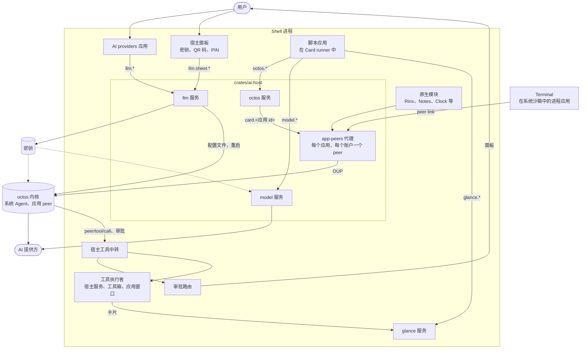

# OctoSense 中的 AI 服务

[English](ai-services.md) | 简体中文

本文介绍 Shell 中助手的各个组成部分：octos 内核服务、AI 提供商与密钥的存放位置、应用调用的服务（`octos`、`model`、`glance`）以及系统工具箱。文中说明信任模型，最后介绍如何在本地运行和测试这一切。本文以 README 的[关键概念](../README.zh-CN.md#关键概念)为基础。内部实现见 [architecture.zh-CN.md](architecture.zh-CN.md)；应用开发者只需读 OctoSense App Flow（原 Design Flow）的 [AI-SERVICES 指南](https://github.com/OctoSense-org/OctoSense-App-Flow/blob/main/docs/AI-SERVICES.zh-CN.md)。

## 各个组成部分



[`crates/ai-host`](../crates/ai-host/README.md) 是两个 Shell 共同调用的唯一入口。启动时，`start(Host::platform(data_dir))` 配置内核、安装宿主策略，并注册 `llm` 和 `model` 服务；在托管了内核的 Shell 中还会注册 `octos` 服务。在原生模块的 `create` 前后，`offer` 和 `finish` 向新实例提供注入的助手服务，只有 Rinx 领取它。`shutdown` 停止内核。

在这张图之外，可选的 AppCard 原型自己打开内核连接；桌面端的 AI 面板（Makepad 的 `aichat`）则经由 Makepad 的 AI 服务总线调用应用的工具。

### 内核服务

每个 Shell 运行一个 octos 内核，作为 [`crates/kernel`](../crates/kernel/README.zh-CN.md) 中的一项服务。第一个使用方连接时它才启动，内核从哪里来由 `launch.rs` 决定：

| 平台 | 内核 | core 目录 |
| --- | --- | --- |
| 桌面端 | 子进程（`serve --stdio`）：`OCTOS_APP_CORE_BIN` 指定的二进制；否则是 Shell 旁随附、回执中的版本与固定版本一致的 `octos-kernel`；都没有就没有内核 | `~/.octosense/octos-home/.octos` |
| Android | 子进程：APK 中的 `liboctos.so` | `<应用数据目录>/octos-home/.octos` |
| OpenHarmony | 在 Shell 进程内（`octos_cli::embedded::serve_io`） | `<应用数据目录>/octos-home/.octos` |
| iOS | 没有：提供方会被保存，但没有应用能获得助手 | – |

桌面端只会从用户自己的 `~/octos-home/.octos` 复制一次提供方设置，从不往那里写入。重启与空闲停止见 [architecture.zh-CN.md 第 1 节](architecture.zh-CN.md#octos-内核)。

### AI providers 与 `llm` 宿主服务

**AI providers**（`os.ai-providers`，[`apps/ai-providers/bundle`](../apps/ai-providers/bundle)）是用户选择助手所用模型的地方：从 octos 的模型目录中选一个主模型和若干备用模型。有 PIN 保护的 `OCTOS1E` QR 码可以把它们迁移到另一台设备。这个应用是普通的脚本应用，没有 Agent。它的特权部分是 **`llm` 宿主服务**（[`apps/ai-providers/host-service`](../apps/ai-providers/host-service/README.md)）：

- 它写入内核的配置文件 `<core 目录>/profiles/_main.json`，然后重启内核。
- 密钥、PIN 和 QR 码只出现在它的宿主面板上。只有面板能调用 `llm.sheet.*`；应用只看到掩码后的状态，例如 `"set ••••1234"`。
- 它只服务系统应用（`os.*`），也没有任何接收提示词的方法：`llm.test` 只发送固定的 “ping”。

密钥存放在内核读取它们的地方（`vault.rs`）：macOS 上在登录钥匙串中（服务名 `octos`），桌面 Linux 上在 `<core 目录>/secrets/<ENV>`（权限 0600），Windows、Android、iOS 和 OpenHarmony 上则直接写在配置文件里（其中类 Unix 系统上权限为 0600）。`OCTOSENSE_LLM_VAULT=file` 让所有平台都把密钥留在配置文件中，[本地运行](#本地运行与测试)就是这样做的。

## 信任模型

| 规则 | 代码如何保证 |
| --- | --- |
| **密钥留在 Shell。** | 只有 `llm` 服务写入密钥；内核和 `model` 服务读取它们。没有哪个 `octos.*` 调用携带密钥，app-peers 约定中也没有存放密钥的字段（`ModelInfo`）。 |
| **机密只在宿主面板上输入。** | App Hub 只接受来自宿主面板的 `<family>.sheet.*` 调用，从不接受应用发来的。脚本应用中的密码输入框不起作用，App Hub 的准入检查也会拒绝声明了此类输入框的应用包。 |
| **应用从不使用内核协议。** | 应用只能经由 app-peers 代理访问自己的 Agent，代理在每次调用上标注应用的身份。 |
| **最小权限，按精确名称。** | 应用得到的 `octos.*` 服务，必须是它声明了、确实存在、并且宿主授予了的。`octos.` 或 `octos.admin` 不授予任何权限（`crates/app-peers/src/contract.rs`、`hosted.rs`）。 |
| **审批属于用户。** | 应用的 peer 提出的每一次审批都交给 Shell 的审批路由；应用只收到 `approval/handled_by_host`。系统 Agent 不能批准。开发者模式只能由用户打开，它会批准所覆盖应用经路由的调用（[判定顺序](architecture.zh-CN.md#5-审批)）。 |
| **邮件只有在用户确认确切内容后才会发出。** | 没有哪个 Agent 工具能发送邮件，`mail.send` 也会拒绝。宿主的审阅界面展示确切的发件人、收件人、主题和正文，只有亲手点按其中的 Approve & Send 才能授权发送：Android 上触摸屏幕，macOS 上用鼠标或触控板点击（在 macOS 上**未验证**，还没有实际发送过邮件）。合成输入和远程输入都会被拒绝，开发者模式和常设规则也不能批准（`mail_review.rs`，[可组合的邮件卡片](mail-composable-cards.zh-CN.md)）。 |
| **每一轮都带着来源。** | Shell 把这一轮由谁发起标注在它的工具调用和审批上（[见下文](#调用)）。 |
| **记忆和文件属于一个应用、一个账户。** | 每个 peer 有自己的记忆命名空间 `app/<app>/acct-<hash>`，最多只能访问自己账户的文件夹。 |

工具如何声明、授予和中转，见 [architecture.zh-CN.md 第 4 节](architecture.zh-CN.md#4-工具与授权)。

## 各类应用目前能用什么

有四类应用拥有 Agent：通过注入服务的 Rinx；通过 peer link 的其他带 Agent 的原生应用（App Hub、Calculator、Clock、Notes、Reminders、Weather 和 Terminal，见 [architecture.zh-CN.md](architecture.zh-CN.md#应用与它自己的-agent)）；除 AI providers 以外的系统脚本应用；以及商店脚本应用。**部分可用**表示在所注明的限制内可用；**–** 表示不适用。

| | Rinx | 其他原生应用 | 系统脚本应用 | 商店脚本应用 |
| --- | --- | --- | --- | --- |
| 用户允许后拥有 Agent | 可用，在 Rinx 打开且已登录期间 | 可用，在应用打开期间 | 可用，获准后即准备，此后每次启动时也会准备 | 可用，前提是应用包声明了 Agent（`octos.*`、`agent` 块或 `tools.json`）；获准后即准备，此后每次启动时也会准备 |
| 应用自己的界面与 Agent 对话 | 部分可用：`OctosAppService` 只用于小程序的私有上下文；用户在 “Ask Rinx” 面板中对话 | 可用：`OctosPeer`，但随附的应用只用它提供工具 | 应用声明 Agent 且用户同意后可用；具体 UI 接入各不相同 | 可用：[`octos` 服务](#脚本应用与-octos-服务) |
| Agent 使用应用自己的工具 | 尚未支持：它的工具只服务于 AI 面板 | 可用：只读工具，在已打开的窗口中运行 | 可用：在应用的宿主服务或 Shell 的通知服务上运行 | `host_method` 路由到经审阅的宿主服务。声明 `requires: ["script-tools-v1"]` 后，`implemented_by: "app"` 在已打开的完整应用 VM 中调用 `app_tool(name, call_id)`；应用关闭时返回 `app_not_running`（见[分派导读](architecture-walkthrough.zh-CN.md#7-把工具追到-rust-代码)） |
| 每一轮都附带 `AGENT.md` 和技能 | – | – | 可用（邮件两者都附带，日历只附带 `AGENT.md`） | 可用 |
| 由事件启动 Agent | 尚未支持 | 尚未支持 | 部分可用：只有邮件的新邮件触发器 | 部分可用：新的 Gmail 邮件，前提是应用已准入、当前 Google 连接有 `mail.read` scope、已获 Agent 同意，且 `agent` 块设置了 `background: true` 并列出 `<应用短名>.new_message`；应用短名是应用 id 的最后一段，所以 Inbox Assistant 列出的是 `inbox.new_message`（见[导读第 6 节](architecture-walkthrough.zh-CN.md#6-用户在哪里对话)） |
| glance 屏幕上的卡片 | 尚未支持 | 尚未支持 | 以已准入发布者的身份可用；邮件的卡片可以带回复草稿 | 以已准入发布者的身份可用 |
| 就自己的卡片与 Agent 对话 | 尚未支持 | 尚未支持 | 可用：Card / Chat（邮件回复为 Email / Chat） | 可用：Card / Chat |
| 一次性模型调用 | – | – | 可用，检查应用/账户作用域与预算（相册在用） | 可用，检查应用/账户作用域与预算 |
| 系统工具箱 | 未使用¹ | 未使用¹ | 宿主提供相应工具后，按 `agent.tools` 的精确名称选择¹ | 默认商店工具列表不提供¹ |
| 为 Agent 选择模型 | 尚未支持² | 尚未支持² | 尚未支持² | 尚未支持² |

¹ 只在带 `toolbox-peers` feature 的构建中提供，仍需 Agent 同意和工具授权。脚本应用在 `agent.tools` 中选择精确工具名，但准入还要求宿主提供该名称。默认商店工具列表不含工具箱工具；写入名称不能绕过准入。`research`/`crawl` 能力声明不授予工具。

² 每个 Agent 都使用 AI providers 中设置的提供方；Shell 不读取 manifest 的 `model.needs`。

内核工具要授予，不会继承：Rinx 的 Agent 保留 octos 的文件、记忆和网页工具，脚本应用的 Agent 只保留 `ask_user_question`（App Hub 唯一准入的内核工具），其他原生应用的 Agent 一个也没有。

没有哪个 Agent 会自行在设备之外采取行动。邮件的 Agent 会起草回复（`mail.propose_reply`、`mail.suggest_reply`）并提议发送（`mail.propose_send`），但它没有发送工具：由用户在宿主的审阅界面上发送（[信任模型](#信任模型)）。

## 脚本应用与 `octos` 服务

脚本应用通过 `octos` 宿主服务的四个调用与自己的 Agent 对话，这个服务由 `ContainedOctos` 提供（[`crates/ai-host/src/contained.rs`](../crates/ai-host/src/contained.rs)）。只要 Shell 托管了内核就会注册它，即使同意闸门关闭也照样注册，好让应用得知自己为何被拒绝。一个应用的所有调用都交给同一个 peer `card.<应用 id>`：它代表 `device`，在保存账户的应用（如邮件）中则代表已登录的账户。“Ask &lt;app&gt;” 面板和系统 Agent 使用的也是这个 peer。

### 同意闸门

`Policy::contained_gate`（[`crates/ai-host/src/lib.rs`](../crates/ai-host/src/lib.rs)）这道闸门决定一次调用能否到达 peer。默认是 `Consent`：用户还没有做出决定的应用第一次调用时，Shell 显示首次使用面板（[`approvals/consent.rs`](../crates/shell/src/approvals/consent.rs)），说明 Agent 可以读取和使用什么、模型在哪里运行。用户允许之前，调用都会被拒绝。用户的答复保存在 OctoSense home 的 `approvals/consent.json` 中。`OCTOSENSE_CONTAINED_APPS=1`（`Everyone`）在开发时跳过这个面板，`0`（`Off`）则拒绝所有调用。

设置中列出每个应用的 Agent，各带一个关闭开关。关闭后，它的 peer 立即被释放；被拒绝的应用会一直保持拒绝，直到用户在那里重新打开它。开发者模式会为它覆盖的应用跳过这个面板。

### 调用

已准入应用声明 Agent 并获用户同意后，可以使用下列四个公开 `octos.*` 方法。`capabilities` 中省略某个方法不会拒绝它；`contained::declared` 检查应用是否选择启用 Agent，代理拒绝未知方法。账户及宿主配置目录检查仍然有效。这些调用作用于应用的对话，也就是它的 peer 上用户的通道（[一个应用 Agent，两条通道](../README.zh-CN.md#一个应用-agent两条通道)）：

| 调用 | 参数 | 返回（`r.data`） |
| --- | --- | --- |
| `octos.session.open` | `{}` | `{open: true, model, …}`；`model` 给出提供方和模型的名称，从不包含密钥 |
| `octos.session.history` | `{}` | 对话的 `messages`：两条通道按时间合并，每条消息都带有 `lane` 和说话者 |
| `octos.turn.start` | `{text, trigger?, from?}`，`text` 最多 32 KiB | 这一轮结束后返回 `{turn_id, text, speaker, lane}` |
| `octos.turn.interrupt` | `{}` | `{interrupted, turns}`：两条通道上正在运行的回合都会停止 |

`trigger` 说明这一轮由什么发起：`person`（应用声称是用户发起的）、`app`、`schedule` 或 `background`（应用自己的运行），或者带 `from` 的 `incoming`（别人发来的内容）。不填时，这一轮记为 `unknown`，最不受信任（`crates/app-peers/src/contract.rs` 中的 `TurnTrigger`）。对话记录会把 `person` 的回合标为用户的话，但审批规则把它当作应用自己的运行：只有 Shell 的 “Ask &lt;app&gt;” 面板能为用户作证。卡片里的对话虽然由 Shell 绘制，也算作应用自己的运行。常设规则会跳过 `incoming` 和 `unknown` 的运行，除非某条规则明确选择包含它们。

每个应用同一时间只运行一轮，一轮超过 180 秒，代理就会中断它。脚本应用收不到推送的事件，所以它读取 `octos.session.history`，其中也包含系统 Agent 的回合。没有任何参数能携带审批决定。App Flow 的指南中有[最小调用示例](https://github.com/OctoSense-org/OctoSense-App-Flow/blob/main/docs/AI-SERVICES.zh-CN.md#最小调用示例与不可用状态)。

### 错误

| `r.error` | 原因 |
| --- | --- |
| `This app has not opted in to an assistant` | 已准入应用未选择启用 Agent；公开 API 的存在不会为应用自动创建 Agent。 |
| `no service answers "octos" on this device` | Shell 没有托管内核（iOS）。 |
| `Waiting for the person to allow this app's agent (OctoSense asks the first time)` | 用户尚未同意，或已拒绝。 |
| `The assistant is turned off for apps on this device` | 闸门为 `Off`。 |
| `Unsupported Octos arguments`、`Provide text (at most 32 KiB)` | 参数超出上表的规则。 |
| `Add an account in the app before using its assistant` | 应用保存账户，但还没有账户。 |
| `This app already has an assistant turn running` | 上一轮还在运行时又发起了一轮。 |
| `no octos kernel: …` | 桌面端没有内核二进制（[见下文](#本地运行与测试)）。 |

App Flow 的[错误](https://github.com/OctoSense-org/OctoSense-App-Flow/blob/main/docs/AI-SERVICES.zh-CN.md#错误)一表说明了应用对每种情况应当显示什么。

## 一次性模型调用：`model` 服务

有些工作只需要一个有边界的回答，而不是一个 Agent；相册就用它把照片归成回忆。已准入应用调用 `model.complete {task, input, schema, class?, allow_urls?}`，或者用 `model.budget` 查看自己的预算（[`complete/`](../apps/ai-providers/host-service/src/complete/mod.rs)）：

- 它绕过内核：服务读取同一份配置文件和密钥，自己调用提供方。模型只看到固定的指令、任务、schema 和输入。
- `class` 为 `fast`（默认）或 `strong`。宿主按用户设定的顺序尝试提供方，同类的优先。应用只知道回答的是哪一类，从不知道提供方、模型或密钥。
- 回复必须是能通过 `schema` 校验的 JSON，最多 16 KiB，而且除非设置了 `allow_urls`，不能含有 URL。不合格的回复会重试一次，仍不合格就拒绝。
- 每个应用的预算默认为每分钟 6 次调用，每个 UTC 日 100 次调用和 100,000 个 token，记录在 `<apps root>/.host/model/ledger.json` 中，位于所有应用的 jail 之外。
- 拒绝的形式是 `<code>: <sentence>`，`code` 为 `capability`、`no_provider`、`rate`、`budget`、`bad_request`、`invalid_output`、`too_large` 或 `provider` 之一。

`model` 声明说明用途；调用仍检查准入、账户作用域和预算。保留的 `capability` 错误码表示调用方未准入，不表示缺少声明。

App Flow 的[一次性模型调用](https://github.com/OctoSense-org/OctoSense-App-Flow/blob/main/docs/AI-SERVICES.zh-CN.md#一次性模型调用model)给出了调用示例。

## 系统工具箱

系统工具箱（[`crates/toolbox`](../crates/toolbox/README.md)）让应用 Agent 做有边界的调研，而不是自己操作浏览器：它提供固定的 OctoScript 工作流模板，以及搜索、读取网页和抓取的工具，Shell 把它们作为归属于 `toolbox` 的宿主工具提供（[`toolbox_peers.rs`](../crates/ai-host/src/toolbox_peers.rs)）。

- **选择哪些工具。** 脚本应用在 `agent.tools` 中写出精确名称：`workflow.run`、`workflow.fork`、`toolbox.search`、`toolbox.web_read` 或 `toolbox.deep_crawl`。顶层 `research` 对象限制资源范围；爬取还要求 `max_depth` 和 `max_pages` 为正数。能力声明既不授予这些工具，也不会拒绝已选择的工具。原生模块保留单独审阅的工具选择。
- **何时提供。** 只有带 `toolbox-peers` feature 的构建才有（手机端的默认构建有，桌面端没有），仍需 Agent 同意与工具授权。准入先检查每个请求名称是否在宿主提供的工具列表中。默认商店列表不含工具箱工具；Shell 可为特定的经审核系统应用扩展列表。通过准入的脚本应用共用精确选择的执行路径，但准入时可申请的工具列表不同。系统 Agent 一个也拿不到。
- **预算与结果。** 模板经由 `model` 服务调用模型，因此与应用共用预算；结果写入 `<apps root>/.host/toolbox/<app>`，应用无法伪造。

准入边界由 App Hub 的 [`HostLimits::default().offered_tools`](https://github.com/OctoSense-org/OctoSense-App-Hub/blob/8347a489141c0e24cab564883db7c4592935a8b2/crates/app-contract/src/policy.rs#L47) 和 [`resolve_agent`](https://github.com/OctoSense-org/OctoSense-App-Hub/blob/8347a489141c0e24cab564883db7c4592935a8b2/crates/app-policy/src/policy.rs#L84) 实现。[`set_agent_tool_offer`](https://github.com/OctoSense-org/OctoSense-App-Hub/blob/8347a489141c0e24cab564883db7c4592935a8b2/crates/appstore/src/system.rs#L50) 只扩展随宿主发布的系统应用列表。准入之后，[`grant_manifest`](../crates/shell/src/host_tools/toolbox.rs) 调用 [`ToolboxGrant::for_manifest`](../crates/ai-host/src/toolbox_peers.rs) 保留精确选择和范围；同意与共享仍由中继检查。

## glance 卡片

已准入应用通过 `glance` 服务（[`crates/shell/src/glance.rs`](../crates/shell/src/glance.rs)）把卡片发布到 glance 面板（桌面端）或 glance 页面（手机端）：`glance.publish`、`glance.withdraw` 和 `glance.list`。Shell 从调用方取得发布者，从不读取参数中的发布者；它把卡片绑定到发布时的账户，每个应用每分钟最多发布 6 次。信息流可滚动浏览所有保留卡片，不再按每个应用的卡片数量设限。源码、data 与降级后 UI 内容按负载字节预算保留：每应用 8 MiB、合计 32 MiB；容量紧张时淘汰优先级较低的旧卡片，同时接收新的发布。系统应用的 Agent 通过自己的工具发布卡片：`<app>.notify` 用模型写的文字填充固定的卡片模板；邮件的 `mail.publish_card` 检查模型编写的卡片，并在提供 `draft_id` 时把它绑定到宿主保存的回复草稿。

手机上的 glance 列表只显示摘要，不运行生成的界面。打开卡片会显示它的工作区，再次打开时状态依旧：手机上全屏，桌面端居中。发布者有 Agent 时，工作区有 Card / Chat 标签页，即使卡片没有声明 `sys.chat`；邮件回复则是 Email / Chat，共用一份保存的草稿。工作区见 README 的[卡片与提问](../README.zh-CN.md#卡片与提问)；邮件的草稿、审阅和测试见[可组合的邮件卡片](mail-composable-cards.zh-CN.md)。

## 本地运行与测试

除 `--plan` 外，下面的命令都**未验证**。

### 桌面端：使用临时的内核与配置

1. 在仓库根目录构建桌面内核。这个脚本从 `Cargo.lock` 读取 octos 版本，在它自己的 `target/octos-kernel/` 中构建，不会动到其他检出；`--plan` 只打印步骤，不执行。

   ```sh
   python3 tools/kernel-artifact.py --host --plan
   python3 tools/kernel-artifact.py --host
   ```

2. 用独立的状态目录、core 目录和文件密钥库运行桌面端，这样不会动到 `~/.octosense`、`~/octos-home` 和登录钥匙串：

   ```sh
   T=$(mktemp -d)
   OCTOS_APP_CORE_BIN="$PWD/target/octos-kernel/target/release/octos" \
   OCTOS_APP_CORE_DIR=$T/octos-home/.octos \
   OCTOSENSE_HOME=$T/state OCTOSENSE_APP_DATA=$T/apps \
   OCTOSENSE_LLM_VAULT=file OCTOSENSE_MAIL_VAULT=file \
     cargo run --release -p octosense
   ```

   日志中会出现 `octos: kernel service ready (starts on first use), core dir …`。没有 `OCTOS_APP_CORE_BIN` 时，桌面端使用 Shell 旁随附的 `octos-kernel`（用 `python3 tools/kernel-artifact.py --host --stage target/release` 放到那里）；两者都没有时，日志会说明没有内核，AI providers 仍会保存提供方。

3. 打开 AI providers（Start → Settings → AI providers），添加一个模型及其密钥。配置文件是 `$T/octos-home/.octos/profiles/_main.json`；使用文件密钥库时密钥就在其中，用完后请删除 `$T`。
4. 与助手对话：F8 打开系统对话；在首次使用面板上允许某个应用的 Agent 之后，就能在该应用的 “Ask &lt;app&gt;” 面板中与它对话。你自己的脚本应用通过 [`octos` 服务](#脚本应用与-octos-服务)访问它的 Agent，此时请保持 `OCTOSENSE_CONTAINED_APPS` 未设置。AppCard（`--features app-appcard`）是另一个使用方。

**隐藏窗口。** 加上 `MAKEPAD_HIDE_WINDOWS=1 MAKEPAD_REMOTE=<port>`，即可通过远程控制桥操作 Shell 而不占用屏幕（[桌面端 README § 远程控制桥](../desktop/README.zh-CN.md#远程控制桥)）。`desktop/scripts/ai_providers_remote.sh` 以这种方式端到端运行 AI providers，使用假密钥并禁止出站 HTTPS；`desktop/scripts/glance_remote.sh` 以同样的隐藏方式操作 glance 面板。

**测试**（在仓库根目录）：

```sh
cargo test --locked -p octosense-kernel                              # 使用替身内核
cargo test --locked -p octosense-app-peers --features octos-core,ws  # broker，脚本化内核
cargo test --locked -p octosense-ai-host --features octos-core,llm
cargo test --locked -p octosense-shell --lib approvals              # 路由、规则、审批面板、同意、联系人
# 真实内核（按第 1 步构建）：
OCTOS_CORE_TEST_KERNEL=/path/to/octos cargo test --locked -p octosense-kernel --test real_kernel -- --test-threads=1 --nocapture
OCTOS_APP_PEERS_TEST_KERNEL=/path/to/octos cargo test --locked -p octosense-app-peers --features octos-core --test real_kernel
```

### 手机

- **Android（Home）** 把内核打包为 `liboctos.so`。`rom/scripts/build-home.py` 构建 APK 对（见 [phone/README.zh-CN.md](../phone/README.zh-CN.md)），其中使用 [`tools/kernel-artifact.py`](../tools/kernel-artifact.py) 按锁定的 octos 版本构建内核。内核在首次使用时启动。
- 在 OctoSense Settings → Accounts → AI providers 中配置提供方，或者导入桌面端的代码（Show QR for phone），可以用相机、图片或粘贴文本，并输入它的 PIN。
- OpenHarmony 和 iOS：见[内核服务](#内核服务)。

## 源码位置

| 内容 | 位置 |
| --- | --- |
| 入口、宿主策略、`offer` | [`crates/ai-host/src/lib.rs`](../crates/ai-host/src/lib.rs) |
| 内核服务 | [`crates/kernel/src`](../crates/kernel/src)（`launch.rs`、`router.rs`、`system_tools.rs`） |
| 应用 peer：约定、代理、Shell 一侧 | [`crates/app-peers/src`](../crates/app-peers/src)（`contract.rs`、`broker.rs`、`hosted.rs`） |
| `octos` 服务 | [`crates/ai-host/src/contained.rs`](../crates/ai-host/src/contained.rs) |
| `llm` 与 `model` 服务、密钥库 | [`apps/ai-providers/host-service/src`](../apps/ai-providers/host-service/src)（`lib.rs`、`vault.rs`、`complete/`） |
| 哪些应用有 Agent，以及何时准备 | [`crates/shell/src/apps.rs`](../crates/shell/src/apps.rs)（`agent_apps`）、[`crates/shell/src/agents.rs`](../crates/shell/src/agents.rs) |
| 邮件草稿与发送审阅 | [`apps/mail/host-service/src/drafts.rs`](../apps/mail/host-service/src/drafts.rs)、[`crates/shell/src/mail_review.rs`](../crates/shell/src/mail_review.rs) |
| 其他 | [architecture.zh-CN.md § 源码位置](architecture.zh-CN.md#源码位置) |
