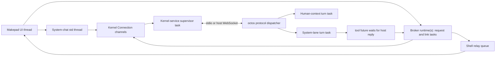

# Code walkthrough: from an app window to an agent turn

English | [简体中文](architecture-walkthrough.zh-CN.md)

This is a reading path for a Rust developer who knows structs, traits and functions but is new to OctoSense and agents. It follows OctoSense `c19da8d` and its Cargo-pinned octos `ae230ce0`, inspected on 2026-10-01. The [architecture reference](architecture.md) explains the broader design; this tutorial follows calls and ownership in the implementation. An ADR describes a decision, not proof that all its steps execute today.

## 1. Give each name one meaning

| Name | Meaning in this walkthrough |
| --- | --- |
| OctoSense | The desktop/Home shell, apps and their host services. The ROM packages Home with Android platform components. |
| Makepad | Rust UI/event/rendering framework. A widget tree is updated by its event loop. |
| Splash / Makepad Script | The script VM and UI language used by contained `main.splash` apps. This is not the separate Octoscript L0 parser. |
| Octoscript and Octoscript-Makepad | The L0 card language/checker/lowering and its Makepad integration, alongside runtime support for apps. L0 `.card` content and a contained `main.splash` program follow different loading paths. |
| octos | The agent kernel: model calls, turns, tools, transcripts, memory and peer coordination. It is not an operating-system kernel. |
| Agent | A configured model-driven worker: it reads messages, calls available tools, consumes their results and produces an answer. Model output does not itself perform an app operation. |
| Session / turn | A session identifies a conversation and its state. A turn is one execution responding to input; it can include several model requests and tool calls. |
| Peer / request context | A peer is a durable cooperating agent identity. A context is another session belonging to that peer, with its own transcript, workspace and child memory namespace. |
| Tool / host service | A tool is an operation offered to the model. A host service is Rust code called by an app or tool executor. Exposing one API does not automatically expose the other. |
| `AGENTS.md` / `AGENT.md` | Repository contributor instructions / an app-bundle agent-instructions artifact. The bundle artifact is admitted by App Hub, but is not yet loaded into the shell peer's prompt. |

For the other repositories, continue with [Design Flow](https://github.com/OctoSense-org/OctoScript-App-Design-Flow), [App Hub](https://github.com/OctoSense-org/OctoSense-App-Hub), [Octoscript-Makepad](https://github.com/OctoSense-org/Octoscript-Makepad) and [octos](https://github.com/octos-org/octos). Their detailed tours are [Design Flow](https://github.com/OctoSense-org/OctoScript-App-Design-Flow/blob/main/docs/CODE-WALKTHROUGH.md), [App Hub](https://github.com/OctoSense-org/OctoSense-App-Hub/blob/main/docs/CODE-WALKTHROUGH.md), [framework](https://github.com/OctoSense-org/Octoscript-Makepad/blob/main/docs/architecture-walkthrough.md) and [octos integration](https://github.com/octos-org/octos/blob/main/docs/octosense-integration-walkthrough.md) (companion documentation changes must be published before these new links resolve on GitHub). Read each repository's own lock: a nearby checkout's `main` may differ from the revision this shell uses.

## 2. Start at the executable, then follow the app host

Open [desktop/src/main.rs](../desktop/src/main.rs), [phone/src/main.rs](../phone/src/main.rs), then [crates/shell/src/lib.rs](../crates/shell/src/lib.rs). Desktop and Home are two packages linking the shared shell. The phone also supplies Settings and platform integration. The ROM does not supply a second Rust agent architecture: it packages Home and privileged Android services.

The launch choices come from [native-apps.json](../native-apps.json), [AppRegistry in apps.rs](../crates/shell/src/apps.rs) and each packaging's `system-apps.json`:

| What you launch | Follow the code | What is actually running |
| --- | --- | --- |
| Native Rust module, such as Reference or Rinx | [module_host.rs](../crates/shell/src/module_host.rs): module creation, scoped handles, assistant/storage offers | Rust code and UI in the shell process; each instance gets a script isolate. The isolate does not isolate arbitrary Rust memory. |
| Native process app, currently desktop Terminal where supported | [clients.rs](../crates/shell/src/clients.rs), [hub.rs](../crates/shell/src/hub.rs), [process-apps](../crates/process-apps/src/lib.rs) | A child executable renders frames and exchanges input/AI-bus messages over the authenticated Makepad hub. This is separate from the octos protocol connection. |
| Contained script app | App Hub's `CARD_MODULE`, reached through `apps.rs` | The Card runner admits the bundle and makes a restricted, nested Splash VM; capabilities limit access to host services and platform APIs. No Rust executable is compiled per bundle. |
| L0 glance card | [glance.rs](../crates/shell/src/glance.rs), [glance_chat.rs](../crates/shell/src/glance_chat.rs) | Checked card content lowered/rendered by the runtime, with host-provided data and chat. The card is not another peer. |

Read the product tutorials for command details: [desktop](../desktop/README.md), [Home](../phone/README.md), [ROM](../rom/README.md), and [system apps](../apps/README.md). A minimal developer route is below. **The launch/build commands in this block are source-checked but unverified in this review; no visible app or device was launched.** Run from this repository root:

```sh
python3 tools/setup.py --hub /path/to/existing-clones
python3 tools/setup.py --check --cargo
cargo run --release -p octosense
# An opt-in, in-process Rust example:
MAKEPAD_WM_TEST_APP=reference cargo run --release -p octosense --features app-reference -- --module reference
# A shell with the kernel integration; point at a binary built from Cargo.toml's octos rev:
OCTOS_APP_CORE_BIN=/path/to/pinned/octos \
  cargo run --release -p octosense --features octos-core
```

The AI providers host-owned sheet must also configure a provider/model before a real conversation can run. A Rust build does not provision those credentials. `OCTOS_APP_CORE_BIN` names a file; this kernel launcher does not search `PATH`. For automated UI work use the existing hidden-window instructions in the product README.

For a script app, Design Flow's `tools/octo` wraps App Hub's `card-host` and `hub` commands. It is a Python development CLI, unrelated to the octos kernel. `card-host` exercises the contained UI and policy; it does not install the shell's Mail, Calendar, provider or peer services. Use a shell to test those integrations. Do not interpret successful `hub check` as a successful agent turn.

## 3. Find who owns the kernel

Read [ai-host/src/lib.rs](../crates/ai-host/src/lib.rs), then [kernel/src/lib.rs](../crates/kernel/src/lib.rs), [launch.rs](../crates/kernel/src/launch.rs), [kernel.rs](../crates/kernel/src/kernel.rs) and [router.rs](../crates/kernel/src/router.rs).

1. The shell calls `ai_host::start`, registering host services and configuring the kernel source. `model.complete` is a one-shot provider request; it does not create a peer or run a tool loop.
2. The first authorized consumer calls `Core::connect`. It obtains a logical `Connection`; subsequent consumers share the same kernel generation.
3. `launch::resolve` selects a desktop child (`OCTOS_APP_CORE_BIN` or an explicit program), Android's executable packaged as `liboctos.so`, or an embedded OpenHarmony service. iOS has no kernel here.
4. `kernel::supervise` owns the running process/task and frame pump. `Router` correlates consumer request IDs and session events over the one physical protocol connection.
5. The protocol is OUP, JSON-RPC messages and asynchronous notifications. Ordinary mode uses newline-delimited JSON over stdio. Enabling Talk to Octos selects a host-managed loopback WebSocket; it does not start an extra kernel for each client.
6. Provider changes restart the generation. Consumers must reconnect and rebind. Dropping a Rust `Connection` is not deleting the peer's saved memory.

The privileged Android service in the ROM is a different use of the word “agent”: it performs permitted platform operations through the Android bridge. It does not run the system LLM conversation.

## 4. Follow a system-chat message

Open [system_chat/mod.rs](../crates/shell/src/system_chat/mod.rs), [session.rs](../crates/shell/src/system_chat/session.rs), [link.rs](../crates/shell/src/system_chat/link.rs), and [system_tools.rs](../crates/kernel/src/system_tools.rs).

The assistant pane sends a `Command` to its worker. The `Driver` opens `_main:api:octosense#system`, reads history and starts a turn. Incoming events update a chat model, and `SignalToUI` wakes the Makepad event loop to draw a snapshot. The UI is not awaiting the model on its drawing thread.

The system agent is a session on the `_main` profile. The host narrows its kernel tools using `session/tool_list/set`; `SYSTEM_AGENT_TOOLS` includes `peer_list`, `peer_send_input`, `peer_gather` and `peer_respond`. Its normal command-execution route, if the person enables it, is the shell's `terminal.run` tool and approval UI. It is not octos's builtin `shell` tool.

[agents.rs](../crates/shell/src/agents.rs) adds two useful host tools: `agents.list` discovers app agents and their availability; `agents.ask` requests first-use consent. `agents.ask` is not a universal app-to-system chat API, and the model cannot grant consent itself.

## 5. Prepare one app peer, then give it two lanes

Read [app-peers/src/contract.rs](../crates/app-peers/src/contract.rs) before the much larger [broker.rs](../crates/app-peers/src/broker.rs). The traits explain the boundary:

- `OctosAppService`: the scoped assistant handle an app receives.
- `OctosContext`: a conversation/request handle. `call(ContextOp, EventSink)` starts work and delivers `ContextEvent`s.
- `ContextSpec`: host-authenticated account, instance and granted service names.
- `Broker`: the shell's implementation, holding connection, peer, contexts and in-flight requests behind `Arc<Inner>`.

A native module receives its handle through [hosted.rs](../crates/app-peers/src/hosted.rs) and [injection.rs](../crates/app-peers/src/injection.rs). A contained app reaches the same broker through [contained.rs](../crates/ai-host/src/contained.rs). A script agent is eligible when its manifest declares assistant services, an `agent` block, or the bundle carries `tools.json`. Eligibility still requires a kernel, consent and an active account where applicable.

`card.os.news` is the broker's app identity, not necessarily the kernel's generated peer slug. `peer/prepare` returns that slug, the peer session and a host credential; use the returned values. Peers are keyed by app and account. Accountless apps use `device`; Mail uses the host-reported signed-in account. `ensure_peer` resumes the recorded peer, verifies its namespace, and registers tools before a turn can run.

```mermaid
sequenceDiagram
    participant H as Human
    participant S as System agent session
    participant K as octos
    participant B as Shell broker
    participant A as App peer session
    participant C as App conversation context
    S->>K: peer_send_input(peer, task)
    K->>B: peer/input notification
    B->>B: check account, consent, tool registration; queue input
    B->>K: turn/start on peer session, with input id
    K->>A: execute system lane turn
    H->>B: Ask app: ContextOp::Turn
    B->>K: peer/context/open with share_history; turn/start
    K->>C: execute human lane turn
    A-->>K: completed turn / peer result
    K-->>S: blackboard result available to peer_gather
    C-->>B: streamed events and completion
    B-->>H: app conversation / in-card chat reply
```

The app peer session is the **system lane**. `open_conversation` creates a request context with `share_history` for a **human lane**. They have separate transcripts and turn state; bounded recent text from the other lane is supplied read-only. Multiple human surfaces may create separate conversation contexts of the same peer. `open_context` is the non-sharing path for per-client work, such as Rinx mini apps. A request context is its own kernel session, but is not another app peer.

The broker's `driver_of` and `take_over` handle multiple native instances sharing a peer: one broker drives the system-lane input queue. This prevents every open app window from independently running the same `peer/input`. Human-context work is separate and can run while that queue's current turn is active.

## 6. Where a person talks, and where the answer goes

| Surface | Implementation and behavior |
| --- | --- |
| System assistant pane, F8 | `system_chat`: system session; routes app questions raised during system-delegated work here too. |
| “Ask <app>”, Shift+F8 | [app_chat/mod.rs](../crates/shell/src/app_chat/mod.rs): `agents::conversation`, subscription to both lanes and merged history. Send starts the person's context turn. |
| An app's own native chat | Injected `OctosAppService::open_conversation`; the app renders its events. |
| A script app's own chat | Exact granted `octos.session.open`, `octos.session.history`, `octos.turn.start`, `octos.turn.interrupt` calls through `host.request`. Today's News/Mail/Calendar agents can be shell-driven without their script declaring these calls. |
| A published card's chat | `sys.chat` → [l0-chat](../crates/l0-chat/src/lib.rs) and [glance_chat.rs](../crates/shell/src/glance_chat.rs). Publisher checks bind it to the card's owning app. |

Phone touch navigation does not yet expose an equivalent control to open the Ask-app panel; app-owned chat and published-card chat are separate surfaces. The Ask-app panel's Stop interrupts the human lane; “Stop the system agent's task” targets the other lane. The lower-level conversation `ContextOp::Interrupt` is broader and can interrupt both: do not assume all Stop surfaces call the same method. Hiding the Ask panel keeps its context/subscription; changing app or revoking access closes it.

The shell stamps a composer action as `TurnTrigger::Person`. A script can supply `trigger`/`from` with `octos.turn.start`, but its `trigger: "person"` becomes `AppSaysPerson`: a transcript label is not proof of a trusted human gesture and cannot unlock human-initiated approval rules.

An app agent's structured tool result returns to that app turn, not directly to whichever UI happens to be focused. Final human-context events go back through that context's event sink; a system-delegated turn makes its result available on the peer blackboard for the system agent to gather and summarize.

## 7. Trace a tool to actual Rust code

Read [host_tools/script_apps.rs](../crates/shell/src/host_tools/script_apps.rs), [relay.rs](../crates/shell/src/host_tools/relay.rs), and [app-peers/host_tools.rs](../crates/app-peers/src/host_tools.rs).

For a concrete example, follow Calendar's `calendar.events`:

1. [tools.json](../apps/calendar/bundle/tools.json) declares its schema, risk, sharing and implementation. App Hub validates/digests the bundle.
2. `script_apps::from_bundle` loads admitted declarations; `install` adds them to the relay catalog and installs a `HostServiceExecutor`.
3. The peer's driving broker registers the exact tool roster with `peer/tools/register`. A model can now request that declared tool.
4. octos emits `peer/tool/call`. The broker stamps the actual caller/account/context and passes it to the shell's `ToolHost`.
5. `Relay::handle` checks authorization, consent, account state, input schema, size and call budgets. Required approvals are resolved through the shell.
6. The executor invokes the Calendar host service as the **owning app**, which reads [Calendar's store](../apps/calendar/host-service/src/lib.rs). The reply queue returns the outcome; output schema/size are checked and `ToolReply` sends at most one `peer/tool/result`.
7. The model consumes that JSON result and continues its turn. It may answer in text or call another granted tool.

The declaration is not the implementation. `implemented_by: "host-service"` works only where the service exists and the owner may call it. `implemented_by: "app"` is admitted metadata, but the Card runner's script executor is not implemented; it returns unavailable. Neither a copied `tools.json` nor a successful gate check creates missing service code.

## 8. What “access the app's data” actually means

There are several stores, with separate ownership:

| Data | How an app agent reaches it |
| --- | --- |
| App account folder | [app_storage](../crates/shell/src/app_storage/mod.rs) and `ToolHost::agent_workspace` bind a new peer's cwd to the permitted folder. Kernel file tools still need grants. |
| Account text files from a request context | [files.rs](../crates/shell/src/host_tools/files.rs): shell-owned `files.list/read/search`, currently Unix only, only with consent and an available workspace. They are bounded, reject symlink traversal and hide sibling contexts. They are not SQLite query APIs. |
| Human conversation's parent account folder | `read_parent` is requested only where `storage.agent_workspace: "account"` allows it. Parent is read-only; context writes stay in its own folder. Plain client contexts do not get this automatically. |
| Host-service database or remote account | A specific declared tool, implemented by the owning host service. Workspace access does not mount every host database or grant remote credentials. |
| Agent transcript and memory | octos session/context and `app/<broker-app-id>/acct-<tag>` namespaces. These are separate from the app's business data. |
| Secrets | Host-owned secret store/sheets; not the agent workspace or script state. |

For example, Calendar keeps `calendar/events.json` under its host directory and exposes operations through `calendar.*`. News exposes `news.list` and `news.read`. Mail's current agent declaration exposes **only `mail.notify`**; the Mail UI's ability to list messages or send mail does not mean the model has those tools. The older AppCard personal-data importer is not automatically synchronized with current Mail's store.

Account directory names use a SHA-256-derived tag; peer memory names use the broker's FNV-derived tag. These are compatibility identifiers, not interchangeable paths. Sign-out suspends access and retains data; account removal/uninstall additionally requests `peer/purge`, retrying busy peers. A peer's saved workspace cannot silently change on resume.

## 9. Cross-app work and asking for help

Three operations are easy to confuse:

**Delegation:** the system agent uses `peer_send_input` to ask an existing app peer to do work, then gathers its answer. The shell remains responsible for driving that app turn. The peer is not a newly spawned process.

**Calling another app's API as a tool:** `Catalog::owner_of` resolves an owner; `may_call` requires an existing declaration plus `shareable: true` and a grant for that caller (outside explicit developer-mode rules). Script manifests request dotted names through `agent.tools`; native entries use their reviewed grants. Admission is a separate prerequisite: App Hub `HostLimits.offered_tools` must offer a requested name; its default does not offer arbitrary names such as `mail.send`. A relay implementation does not override that gate. The relay calls the owner's executor without having to ask the owner's model. The receiving app's data remains behind that executor. Current owner resolution covers native namespaces, toolbox namespaces and `os.<namespace>`; it is not an arbitrary installed-store-app discovery mechanism.

**A question or system facility:** an app agent can call a granted `ask_user_question`. [questions/mod.rs](../crates/shell/src/questions/mod.rs) routes it according to the initiating turn: system chat for a system-delegated turn, app conversation for a human/app turn. A person answers on a shell surface. This is not a way for a script to obtain system-agent privileges. octos has peer-supervision mechanisms, but the shell does not give every contained app a general `ask_system_agent` API or unrestricted peer tools. Likewise the [system toolbox](../crates/toolbox/README.md) supplies granted Rust tools/workflows; calling it is not talking to the system-agent conversation.

The system agent's `peer_respond` capability is not permission to approve an app's action for the person. Tool approvals and human questions have distinct protocol messages and host-owned answer handles. Prompt deadlines deny/decline unanswered prompts; they never turn silence into consent.

## 10. Map the architecture to Rust execution

An `async fn` returns a future; polling it advances work until it must wait. A Tokio task is a scheduled future. An OS thread runs many task polls. A persisted session or peer can outlive every task currently handling it.

| Layer | Actual execution model | Source |
| --- | --- | --- |
| Makepad shell | UI event loop; widget drawing, event dispatch and host-tool relay pump | `module_host.rs`, `host_tools/mod.rs` |
| System chat | An ordinary `std::thread`; commands and snapshots; `link::poll_for` uses a waker/unpark to poll kernel receive | `system_chat/mod.rs`, `link.rs` |
| Shell kernel service | Lazily built Tokio runtime: **2 worker threads**, **8 MiB stacks**. One generation supervisor task owns transport and process lifecycle, with auxiliary I/O tasks | `kernel/src/lib.rs::Inner::runtime`, `kernel.rs::supervise` |
| App broker | **Each `Broker::new` builds a runtime with 1 worker thread**. Link pump, request futures, retries and deadline tasks run there. Multiple brokers may share one durable peer | `app-peers/src/broker.rs` |
| Embedded OpenHarmony kernel | `serve_io` is spawned on the host runtime over `tokio::io::duplex`; no child executable | `kernel.rs::start` |
| octos OUP turn | Active-turn admission precedes a spawned `run_standalone_turn`; its agent/model processing and progress/heartbeat use further tasks | pinned octos `crates/octos-cli/src/api/ui_protocol_transport.rs` |
| octos transport output | WebSocket has an async writer task; embedded/stdio uses a bounded synchronous queue and an ordinary writer thread. Transport variants are not identical | same octos file |
| Host service / file executor | Depends on the service: UI pump, callback/reply queues, worker threads for blocking operations. Not universally a Tokio task per service or app | `host_tools/files.rs`, App Hub `services.rs`, app host services |



Read `mpsc` as a many-sender mailbox, `oneshot` as one correlated answer, and `watch` as the latest lifecycle/readiness state. In the broker, request IDs map replies to `oneshot` senders; its link loop uses `tokio::select!` for outbound and inbound traffic. The kernel supervisor selects control messages, kernel output and process exit. `Arc` shares ownership, `Weak` avoids keeping a dropped broker/context alive, and generation/epoch checks reject replies from an obsolete account or connection.

The broker's synchronous `bind`/`host_request` wrappers wait for channel replies: do not call such blocking interfaces from a rendering callback. Async model I/O can overlap across sessions; synchronous filesystem work still needs the existing worker boundary. “One peer per app/account” is an identity and isolation rule, **not one Tokio task or thread per agent**.

## 11. Verify one boundary at a time

These checks were run for this documentation review:

- Runtime setup with the existing clone hub, followed by `python3 tools/setup.py --check --cargo`: passed.
- `python3 tools/native_apps.py --check` and `python3 -m unittest discover -s rom/tests -p test_no_local_paths.py`: passed.
- Changed Markdown relative-file links and `git diff --check` across the five documentation worktrees: passed.
- `cargo test --locked -p octosense-kernel -p octosense-app-peers --features octosense-app-peers/octos-core,octosense-app-peers/ws`: passed the unit and scripted-connector suites. Real-kernel test functions early-return unless their binary environment variables are supplied; this review did not supply them and does **not** claim those integrations passed.

Use [broker tests](../crates/app-peers/tests/broker.rs) as executable examples: `a_persons_message_runs_while_the_system_agents_input_runs`, `a_lane_stop_leaves_the_other_lane_running`, `a_kernel_without_shared_history_is_refused_for_the_conversation`, and `removing_an_account_purges_its_recorded_peer_and_drops_the_record`. They demonstrate actual protocol behavior without a paid model. [Shell relay scenario tests](../crates/shell/src/host_tools/scenario_tests.rs) show caller/tool/approval boundaries; they were read, not executed in this review.

Desktop GUI launch, real-provider turns, Android/OpenHarmony/iOS builds, ROM image builds and flashing are **unverified in this review**. `AGENT.md` prompt loading, automatic bundle triggers/skills, arbitrary script-implemented agent tools and a general app-to-system-agent RPC remain implementation gaps. Do not turn an architectural example into a claimed working workflow without checking its declarations and executor.
