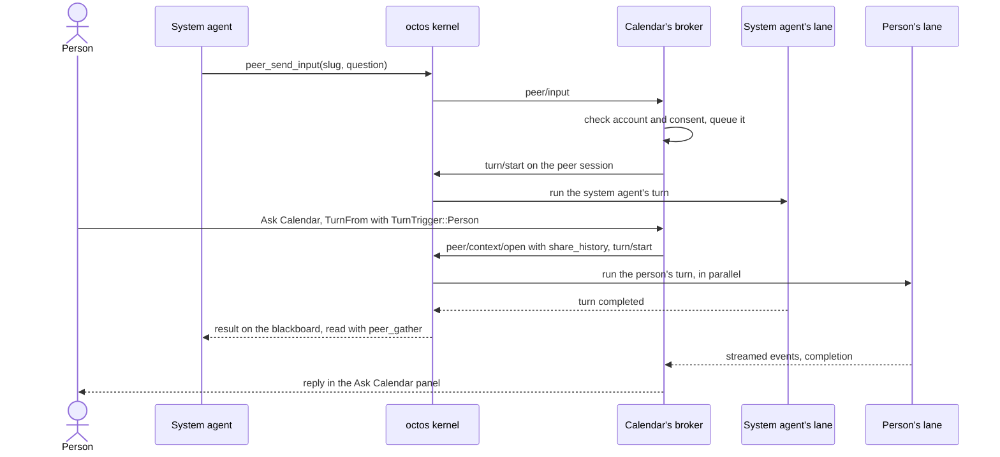
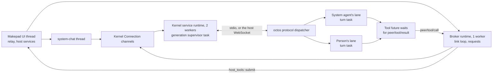

# Code walkthrough: from an app window to an agent turn

English | [简体中文](architecture-walkthrough.zh-CN.md)

This is the reading path through OctoSense's agent code. It follows one question from the window where the person types it, through the shell and the octos kernel, to the Rust that answers it. Each step names the file and symbol to open, what to look for, and why it matters. The concepts are in the README's [key concepts](../README.md#key-concepts); the full reference is [architecture.md](architecture.md).

The question is **"What is on my calendar today?"**, and Calendar is a system script app. The person can ask the system agent, which delegates it to Calendar's agent in the **system agent's lane**, or ask Calendar's agent directly, in its "Ask Calendar" panel or a Calendar card's Chat tab, in the **person's lane**. Both routes can end in the same tool call, `calendar.events`, and each answer returns to the conversation that asked. Either needs a kernel, a provider and the person's consent.

## 1. Start at the executable

[desktop/src/main.rs](../desktop/src/main.rs) only calls `octosense_shell::octosense_main!()`; [phone/src/main.rs](../phone/src/main.rs) makes the same call around an `App` that adds the Settings app. In [crates/shell/src/lib.rs](../crates/shell/src/lib.rs), `App::handle_startup` sets up the agent machinery in a fixed order:

| Call | What it sets up |
| --- | --- |
| `app_storage::init` | Every app's folders and the secrets root ([§8](#8-where-the-data-lives)) |
| `ai_host::start` | The kernel's configuration and the AI services ([§3](#3-find-who-owns-the-kernel)) |
| `dev_mode::init`, `approvals::init` | Developer mode, then the approval router |
| `host_tools::init` | The shell as every broker's tool host, with the relay ([§7](#7-trace-a-tool-to-rust-code)) |
| `system_chat::init` | The system agent's grants, before the kernel first starts |
| `agents::start` | A thread that prepares the peer of every script app the person allowed ([§5](#5-prepare-a-peer-and-give-it-two-lanes)), and Mail's collection/delivery threads |

The order is the point: the router and the relay exist before any agent can call a tool. If the person allowed Calendar's agent in an earlier run, `agents::start` prepares its peer at once, and that first connection starts the kernel.

## 2. See how an app is hosted

Where an app runs decides how it reaches its agent and where its tools execute. [native-apps.json](../native-apps.json) declares each native app's hosting, and `AppRegistry::hosting` in [apps.rs](../crates/shell/src/apps.rs) resolves it for each launch.

| Kind | Open | Look for |
| --- | --- | --- |
| Native module (Rinx, Notes, Calculator, …) | [module_host.rs](../crates/shell/src/module_host.rs) | One Splash isolate per instance. Every call into a module runs under `catch_unwind` (`contain`), so a panic closes the app, not the shell. |
| Process app (the Terminal and Task, in a checkout build) | [clients.rs](../crates/shell/src/clients.rs), [hub.rs](../crates/shell/src/hub.rs) | The hub admits a child's socket only with the secret its launch read on stdin; `sandbox_policy` builds the OS sandbox. |
| Script app (Calendar, Mail, every store app) | `system_card_apps` in `apps.rs`, then App Hub's `CARD_MODULE` | The `card` module, the Card runner, hosts every system and installed app, one isolate per instance. |

`system_card_apps` makes Calendar's launcher row and, the first time, registers the shell's host services (`register_host_services`). Calendar's `calendar` capability grants its contained UI access to the owning service. Month/day views, the editor and Calendar-owned tools all read and write `.host/calendar/events.json`. The app's Glance event card is a projection of that record; its in-card **Open Calendar** action uses the publication-bound `event/<id>` route to open that same event in Calendar. Cross-app agent calls still require the separate grants described below.

To run the desktop, follow its README's [Build and run](../desktop/README.md#build-and-run), which stages the pinned kernel with `python3 tools/kernel-artifact.py --host --stage target/release`.

Ordinary connected apps use the same Card runner. GitHub Notes, Inbox Assistant and Google Calendar declare `auth` plus a business service, and `storage.accounts: true`. The host binds their peer to the selected opaque connection. Follow the [OAuth/service walkthrough](../crates/oauth-service/README.md) for sign-in, explicit `host_method` tool mappings, durable Gmail events and admitted Glance templates. These apps use provider data rather than the built-in Calendar file; live provider/device acceptance is still pending.

## 3. Find who owns the kernel

One service owns the kernel, and every consumer connects to it. Read these in order:

1. **`ai_host::start`** ([ai-host/src/lib.rs](../crates/ai-host/src/lib.rs)) configures the kernel and starts nothing. It also registers the `octos` service, which gives script apps their peers, and `model`, which makes one-shot model calls with no peer or tools.
2. **`Core::connect`** ([kernel/src/lib.rs](../crates/kernel/src/lib.rs)): the first connection starts a kernel *generation*, and later ones attach to it. When the last one detaches the kernel stops, unless Talk to Octos is on. After a provider change, `restart` ends the generation and consumers reconnect.
3. **`launch::resolve`** ([launch.rs](../crates/kernel/src/launch.rs)): a `serve --stdio` child on the desktop (`OCTOS_APP_CORE_BIN`, or the packaged `octos-kernel` whose receipt names the pinned revision) and on Android (`liboctos.so`), `serve_io` inside the shell on OpenHarmony, nothing on iOS.
4. **`supervise`** ([kernel.rs](../crates/kernel/src/kernel.rs)): one task per generation owns the process and the frame pump. Before any consumer's frame, it sets the system agent's exact tool list (`session/tool_list/set`).
5. **`Router`** ([router.rs](../crates/kernel/src/router.rs)): consumers, such as the system chat and Calendar's broker, share one stream. Each request gets a kernel-unique id and its response goes to its sender only; each notification goes to the consumers that opened its session.

## 4. Follow a system-chat message

Open [system_chat/mod.rs](../crates/shell/src/system_chat/mod.rs), then [session.rs](../crates/shell/src/system_chat/session.rs) and [link.rs](../crates/shell/src/system_chat/link.rs):

- `spawn` starts the `system-chat` thread, which owns a `session::Driver`. The UI thread sends it `Command`s; the thread wakes the UI with `SignalToUI` when the chat changes.
- The `Driver` opens `SYSTEM_SESSION` (`_main:api:octosense#system`) and sends each message as `turn/start`. After every connect it registers the system agent's host tools on its link (`peer/tools/register` without a `peer`).
- `link::poll_for` polls the kernel with a waker that unparks the thread, so the chat needs no Tokio runtime. It stays connected only while its pane is open or a turn runs.

The system agent's kernel tools (`SYSTEM_AGENT_TOOLS` in [kernel/src/system_tools.rs](../crates/kernel/src/system_tools.rs)) do not read a calendar. Its separately registered host tools now include explicitly granted `calendar.events`, `calendar.add_event` and `calendar.notify`, so a bounded request can run directly. For work needing Calendar's own reasoning/context, it can still delegate. Two host tools from [agents.rs](../crates/shell/src/agents.rs), answered by the system chat itself (`agents::call`), get it there:

- `agents.list` returns every app with an agent, whether the person allowed it, and its peer slug.
- `agents.ask` shows Calendar's first-use sheet if the person has not decided, and holds the call until they answer and the peer is ready; then it returns the slug.

The system agent passes the slug, never the app id `os.calendar`, to `peer_send_input`. Its approvals go to the router, batched per turn; the pane never approves anything.

## 5. Prepare a peer and give it two lanes

Read [app-peers/src/contract.rs](../crates/app-peers/src/contract.rs), everything an app sees, before the much larger [broker.rs](../crates/app-peers/src/broker.rs):

- `OctosAppService`: one app instance's scoped service. `open_conversation` opens the person's lane, `open_context` a private context (Rinx's mini apps).
- `OctosContext::call(ContextOp, EventSink)`: one operation, whose events end with one `Complete`.
- `ContextSpec` (the account and granted services) and `TurnTrigger` (what started a turn), both stamped by the host ([§6](#6-where-the-person-talks)).

**Calendar's peer.** A script app's peer belongs to the `octos` host service in [ai-host/src/contained.rs](../crates/ai-host/src/contained.rs). `contained::prepare` (from `agents::prepare`) and `contained::conversation` (from the "Ask Calendar" panel) share one broker, `card.os.calendar`, built by `hosted::launch` ([hosted.rs](../crates/app-peers/src/hosted.rs)). Calendar keeps no accounts, so the broker acts for `device`. `Broker::ensure_peer` then:

1. sends `peer/prepare` with the memory namespace `app/card.os.calendar/acct-<tag>`, `resume: true` and, for a new peer, the account folder as its workspace (`ToolHost::agent_workspace`);
2. refuses a kernel that did not honor that namespace;
3. keeps the peer's host token in a `PeerRecord` and opens the peer session, `…#peer-<slug>`: the system agent's lane;
4. registers the app's tools (`register_tools`, [§7](#7-trace-a-tool-to-rust-code)). A peer whose registration fails runs no turn.

When a native app has two windows, only the oldest instance's broker drives the peer (`Broker::drives`; `take_over` when it closes). Calendar's one broker always drives: it registers the tools and takes the system agent's inputs. Its `on_peer_input` checks the account and consent (`ToolHost::admit_input`), answers `peer/input/reject` when it refuses, and otherwise starts the turn on the peer session, one at a time.

**The person's lane.** Each conversation handle gets a new request context, opened with `share_history` (`open_handle`), plus `read_parent` when the app declares `storage.agent_workspace: "account"` (`context_reads_account`).



**Native apps** reach a broker of the same kind through the [peer link](../crates/shell/src/peer_link/mod.rs), over a process app's hub socket or the channel a module's `OctosPeer::open` parked (`claim_peer_links`). The shell takes the app's identity from the socket or instance, never from a frame.

## 6. Where the person talks

Every surface but the system chat opens the person's lane:

| Where the person types | Code to open |
| --- | --- |
| System chat | `system_chat/session.rs`: the system session ([§4](#4-follow-a-system-chat-message)) |
| "Ask &lt;app&gt;" panel | [app_chat/mod.rs](../crates/shell/src/app_chat/mod.rs): `agents::conversation`, then `ContextOp::TurnFrom { trigger: TurnTrigger::Person }` |
| A native app's own chat, through the injected service | `OctosAppService::open_conversation`. Rinx uses only `open_context`, for its mini apps' private contexts. |
| Another native app's chat | Makepad's `OctosPeer` over the peer link: `octos.session.open` without a `client` ([peer_link/link.rs](../crates/shell/src/peer_link/link.rs)) |
| A script app's own chat | `host.request("octos.turn.start")`, served by `contained.rs` for the names its manifest declares |
| A card's Chat tab, or a card that declares `sys.chat` | [glance_chat.rs](../crates/shell/src/glance_chat.rs) and [l0-chat](../crates/l0-chat/src/lib.rs) |

**Card workspaces** ([in-card chat](../README.md#in-card-chat)). [glance_sheet.rs](../crates/shell/src/glance_sheet.rs) shows an opened card full screen on the phone, centred on the desktop. If the publisher has an agent and the card declares no chat, `L0Session::for_card` ([glance_card.rs](../crates/shell/src/glance_card.rs)) adds a host-owned `WorkspaceChat` behind Card / Chat tabs. `chat_submit` sends each turn through `glance_chat::perform_bound` to the account that published the card (`agents::conversation_for_account`), with the card's data and local state as context (`ContextKind::Card`), never as tools. Mail's reply cards show Email / Chat over one saved draft; a Chat turn carries a one-use token (`drafts::issue_chat_edit`) that lets `mail.suggest_reply` save the edit ([Composed Mail cards](mail-composable-cards.md)).

Not yet: no shipped app opens the person's lane from its own UI; the shell's panel and cards are the way in.

The trigger decides how far approvals trust a turn. Only the shell's own surfaces, the "Ask &lt;app&gt;" panel and the system chat, stamp `TurnTrigger::Person`; an in-process module could through the injected service, but none does. An app's `"trigger": "person"` becomes `AppSaysPerson` (`TurnTrigger::from_args`), which the relay hands the router as an app run (`trigger_of` in `host_tools/relay.rs`); a card's chat gets the same stamp. Rinx's mini apps send a bare `ContextOp::Turn`, which is `Unknown`; standing rules skip it. Mail's new-mail events ([agent_events.rs](../crates/shell/src/agent_events.rs)) run in this lane as `TurnTrigger::Incoming`; no other app has events yet.

For "Ask Calendar", the reply streams back through the context's `EventSink`, and the panel's follower (`OctosContext::subscribe`) hears both lanes. Not yet: a script app gets no pushed events; its `octos.turn.start` returns the finished reply.

Stop works per lane: the panel's Stop ends only the person's turn (`app_chat::stop`), and the system agent's turn has its own control (`stop_system_agent`). `ContextOp::Interrupt` on a conversation ends both, since the person owns the device.

## 7. Trace a tool to Rust code

Follow `calendar.events` from its declaration to the file it reads:

1. **Declared** in [apps/calendar/bundle/tools.json](../apps/calendar/bundle/tools.json): its schemas, `risk: "read"`, `implemented_by: "host-service"`, and `shareable: true` (a caller still needs an explicit grant).
2. **Loaded** by `from_bundle` in [host_tools/script_apps.rs](../crates/shell/src/host_tools/script_apps.rs), through App Hub's digest-checking loader. `install` adds the tools to the relay's catalog, with a `HostServiceExecutor` for `os.calendar`.
3. **Registered** by `register_tools` in `broker.rs`, with what `ShellToolHost::declarations` ([host_tools/mod.rs](../crates/shell/src/host_tools/mod.rs)) returns.
4. **Called.** octos sends `peer/tool/call` on the registering link. The broker stamps the account, context and caller into a `HostToolCall` ([app-peers/src/host_tools.rs](../crates/app-peers/src/host_tools.rs)), which `ShellToolHost::tool_call` queues for the host relay. The UI normally pumps it; Android Mail jobs can pump the same synchronized relay without a window.
5. **Checked** by `Relay::handle` ([relay.rs](../crates/shell/src/host_tools/relay.rs)): the grant, consent, a signed-out account, the arguments' size and `input_schema`, then the caller's budget (by default 32 calls a turn and 1000 a day).
6. **Run.** `HostServiceExecutor::execute` dispatches a `ServiceCall` to App Hub's service registry as `os.calendar`, with no sheet. `CalendarService::call` ([apps/calendar/host-service/src/lib.rs](../apps/calendar/host-service/src/lib.rs)) loads `<apps root>/.host/calendar/events.json` and filters it by `from`, `to` and `limit`.
7. **Answered.** `script_apps::poll` takes the reply from App Hub's queue, `checked_reply` (in `relay.rs`) checks it against `output_schema` and a size cap, and the `ToolReply` sends `peer/tool/result` once.

`calendar.events` only reads, so nobody is asked. `calendar.remove_event` (`destructive`, `confirm: host`) is gated in octos first: the kernel raises a `host_tool` approval, which the broker hands to `ToolHost::host_tool_approval`, and only an approved call arrives.

The relay routes every call by the tool's owner:

| Owner | Executor |
| --- | --- |
| Script app, `implemented_by: "host-service"` | `HostServiceExecutor`: the app's host service (`calendar`, `mail`, `news`), or the shell's notice service for `<app>.notify` |
| Script app, `implemented_by: "app"` | None yet: the call is refused `app_tool_unavailable` |
| Native app | Its open instance: `OctosPeer::serve_tools` on its peer link, else its AI bus service ("Open … first" when closed). An executor from `OctosAppService::set_tool_executor` comes first. |
| `terminal.run` (system agent only) | The visible Terminal, over the AI bus, after a sheet with the exact command |
| `files.list`, `files.read`, `files.search`, `dev.run` | The shell itself |
| The toolbox (feature `toolbox-peers`) | The toolbox's executor |

### Approval order

First-use consent, a tool grant and a per-call approval are separate checks. For an approval, `Router::request` in [approvals/router.rs](../crates/shell/src/approvals/router.rs) tries, in order:

1. the external client's own prompt, for that client's turns;
2. developer mode, for the apps it covers;
3. the owning app's sheet, for a `confirm: app` tool (refused after `app_wait_s`, 120 seconds, if the app registers none);
4. a live sheet, for calls that must always ask: `auto_approvable: false`, an unknown outcome, an external connection;
5. the person's standing rules;
6. otherwise, a shell sheet with the exact arguments.

Decisions are audited in `logs/approvals-audit.jsonl`, and the deadlines are `DEFAULT_PROMPT_DEADLINE` (10 minutes) and `EXPIRY_GRACE` (30 seconds) in `app-peers/src/host_tools.rs`. The system agent cannot approve: octos refuses its `peer_respond` for approvals. What each step means is in [architecture.md §5](architecture.md#5-approvals).

Sending mail never reaches this router. `mail.propose_send` only prepares the exact message; the host's review in the card (`mail_review.rs`) calls `drafts::approve_and_send` only after a physical touch (`trusted_user_gesture`, Android only for now), and developer mode cannot stand in for it.

## 8. Where the data lives

An app's data lives in several stores, each with one owner:

| Data | Where | How an agent reaches it |
| --- | --- | --- |
| The account folder | `apps/<app id>/accounts/<account hash>/`, or `accounts/device/` ([app_storage/mod.rs](../crates/shell/src/app_storage/mod.rs)) | It is the peer's workspace, fixed when the peer is created. The person's lane runs in its own `contexts/<id>/` and reads the folder through `read_parent` or the host's `files.*` tools ([files.rs](../crates/shell/src/host_tools/files.rs): Unix only; 128 KiB a read, 500 entries, 100 matches). |
| A host service's data | App Hub's host directory, `<apps root>/.host/`: Calendar's events, Mail's messages and reply drafts (`drafts.rs`) | Only through that service's tools; no workspace includes it. |
| Transcripts and memory | octos, under the namespace `app/<app>/acct-<tag>` | The agent's own. `<tag>` is an FNV-1a hash (`account_tag`); the folder name is a different, SHA-256 hash (`account_hash`). |
| Secrets | App secrets: the keychain on macOS and iOS (indexed in `<home>/secrets/<app id>/`), elsewhere files there. Provider keys: the macOS keychain, elsewhere files under the kernel's core directory (owner-only, except on Windows) | Never. `app_storage::check` refuses a workspace that contains or links to them. |

`agent_workspace_in` ([host_tools/mod.rs](../crates/shell/src/host_tools/mod.rs)) gives the folder to every native app with `octos.*` services, even one that declares `storage.agent_workspace: "none"`, and to every script app that does not. Calendar's agent gets `apps/os.calendar/accounts/device/`, but its events are not there: `calendar.events` reads them from `.host/calendar/events.json` and hands the model JSON.

Signing out suspends the peer, whose calls are then answered `signed_out`. Removing the account or uninstalling the app erases it with `peer/purge` ([purge.rs](../crates/app-peers/src/purge.rs)).

## 9. Cross-app work and asking for help

Three operations are easy to confuse.

**Delegation.** The system agent asks an app's agent with `peer_send_input` ([§4](#4-follow-a-system-chat-message)), and the shell starts that turn on the existing peer. No process is spawned.

**Calling another app's tool directly.** This skips the owning app's model, so the relay allows it only when all of these hold:

1. The owner declares the tool `shareable: true` and has an executor for it.
2. The caller is granted it: by a dotted name in a script app's `agent.tools`, or by `agent.grants` in a native app's `native-apps.json` entry. `Catalog::may_call` checks this.
3. For a script bundle, App Hub's admission offers the name (`HostLimits.offered_tools`).
4. `Catalog::owner_of` finds the owner from the namespace: the toolbox, the native app of that id, or else the system app `os.<namespace>`.

Calendar shares `calendar.events`, `calendar.add_event` and `calendar.notify`; Mail requests exactly those in its manifest and the system agent has a separate explicit grant. Loading Mail also loads Calendar's admitted catalog and executor, without launching a Calendar peer or window. Mail reads the confirmed email, resolves its date/timezone, reads Calendar, adds with a stable retry key, verifies the saved event and publishes a Calendar-owned card. Scheduling requires a human request or explicit provisioned policy. Named timezones survive device timezone differences; this writes local Calendar storage, not Google Calendar. News shares `news.list` and `news.read`. Not yet: `owner_of` never resolves to a store app, so store apps cannot share tools.

**Asking for help.** [questions/mod.rs](../crates/shell/src/questions/mod.rs) routes an agent's `ask_user_question` by the turn's origin: to the system chat for a `peer/input` turn, to the app's conversation otherwise. Only the person answers, on a shell surface. System facilities reach an app's agent only as granted tools, such as the [toolbox](../crates/toolbox/README.md)'s workflows. Not yet: an app cannot start a conversation with the system agent; `OctosAppService` has no call for it.

## 10. Map the architecture to Rust execution

A peer is stored state and a turn is a group of Tokio tasks in octos; threads belong to services, not agents ([why it stays light](../README.md#why-it-stays-light-on-memory-and-cpu)).

| Layer | How it runs | Where to look |
| --- | --- | --- |
| Shell UI | The Makepad UI thread: drawing, events, and `host_tools::pump` with the relay | `lib.rs`, `host_tools/mod.rs` |
| Mail events | Two `std::thread`s: independent collection and serialized delivery with per-event retries. Android permits them while foregrounded or inside a bounded OS job. | `agent_events.rs`, `mail_background.rs` |
| Android Mail job | A Java JobService worker loads the same Rust host without an Activity and pumps its synchronized relay; one network-constrained periodic job, no second kernel or peer. | `phone/src/android_mail.rs`, `MailJobService.java`, `runtime_host.rs` |
| System chat | One `std::thread`, polling the kernel with `link::poll_for` | `system_chat/mod.rs`, `link.rs` |
| Kernel service | One Tokio runtime, built on first use: 2 workers, 8 MiB stacks; one supervisor task per generation | `kernel/src/lib.rs` `Inner::runtime`, `kernel.rs` `supervise` |
| App broker | A runtime per `Broker::new`, with 1 worker: the link loop, requests, retries, deadlines | `app-peers/src/broker.rs` |
| Host services | Called on the caller's thread by App Hub's `services::dispatch`: for a tool call, the relay pump caller (UI or Android Mail job), where Calendar answers. Mail (`work` threads, `mail-fetch`) and News (`news-fetch`) run network work on their own threads. | `script_apps.rs`, `apps/*/host-service/` |
| octos, desktop and Android | Its own process, on Tokio's default runtime: one worker per CPU core (`ServeCommand::execute`) | octos `crates/octos-cli/src/commands/serve.rs` |
| octos, OpenHarmony | `serve_io` on the kernel service's runtime, over `tokio::io::duplex` | `kernel.rs` `start` |
| An octos turn | A spawned task behind a `oneshot` start barrier, then `run_standalone_turn` and its own tasks | octos `crates/octos-cli/src/api/ui_protocol_transport.rs` |



For "Ask Calendar", octos's `handle_turn_start_with_accept` spawns the person's turn task, and its `calendar.events` future waits while the call crosses to the UI thread and back.

Three channel kinds recur: `oneshot` for one answer (a request's reply, a turn's start), `mpsc` for a mailbox (the supervisor's `Ctl` messages) and `watch` for the latest state (a generation's readiness). The broker's link loop and the supervisor are both `tokio::select!` loops, and the account generation and `link_epoch` checks drop replies meant for an old account or connection.

`Broker::bind`, `Broker::host_request` and `OctosAppService::prepare` block their caller for up to a minute, so call them off the UI thread.

## 11. Tests

[crates/app-peers/tests/broker.rs](../crates/app-peers/tests/broker.rs) drives the broker against a scripted kernel; its test names state the protocol's rules. Start with `a_persons_message_runs_while_the_system_agents_input_runs`, `a_lane_stop_leaves_the_other_lane_running`, `a_kernel_without_shared_history_is_refused_for_the_conversation` and `removing_an_account_purges_its_recorded_peer_and_drops_the_record`. [host_tools/scenario_tests.rs](../crates/shell/src/host_tools/scenario_tests.rs) runs the same two-lane story with a test News app end to end against the pinned octos and a scripted model; its header says how to run it.

Run the unit and scripted-connector tests from the repository root:

```sh
cargo test --locked -p octosense-kernel -p octosense-app-peers \
  --features octosense-app-peers/octos-core,octosense-app-peers/ws
```

The real-kernel tests (`crates/app-peers/tests/real_kernel.rs` and the scenario tests) print a note and pass when no kernel binary is set, so a green run is not integration evidence; the [app-peers README](../crates/app-peers/README.md#testing) shows how to give them one. Visible UI, real providers and devices need runs of their own.

Walkthroughs of the other repositories, at fixed revisions: [Design Flow](https://github.com/OctoSense-org/OctoScript-App-Design-Flow/blob/218b25d2460d64f843932f67d419467618464fb9/docs/CODE-WALKTHROUGH.md), [App Hub](https://github.com/OctoSense-org/OctoSense-App-Hub/blob/0d5b47a2ae9eb98020feca26b7c895a3cf797dc1/docs/CODE-WALKTHROUGH.md), [Octoscript-Makepad](https://github.com/OctoSense-org/OctoScript-Makepad/blob/2cc5ef37d7d6a3d2992673389ce74488f7bb2d87/docs/architecture-walkthrough.md) and [octos](https://github.com/octos-org/octos/blob/056173e85b150e387805fc307fe231064ac1ed35/docs/octosense-integration-walkthrough.md).
