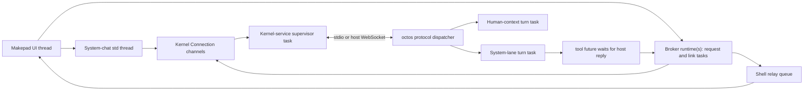

# Code walkthrough: from an app window to an agent turn

English | [简体中文](architecture-walkthrough.zh-CN.md)

This walkthrough follows a message from an app window through the shell, agent kernel and tool executor. Start here if you know Rust but are new to OctoSense or agents. The [architecture reference](architecture.md) describes the design; this guide follows implementation calls and ownership. Read dependency versions from [Cargo.toml](../Cargo.toml) and [native-runtime.lock.json](../native-runtime.lock.json). ADRs record decisions; remaining implementation work is listed in §11.

We will use one question throughout: **“What is on my calendar today?”** On desktop, a person can ask the system assistant to delegate it to Calendar, or ask Calendar directly through “Ask Calendar”. Both routes can reach `calendar.events`, but their answers return to different conversations. This is an illustrative tool path: it requires a configured kernel/provider and consent, and the model chooses whether to call the tool.

## 1. Give each name one meaning

| Name | Meaning in this walkthrough |
| --- | --- |
| OctoSense | The desktop/Home shell, apps and their host services. The ROM packages Home with Android platform components. |
| Makepad | Rust UI/event/rendering framework. A widget tree is updated by its event loop. |
| Splash / Makepad Script | The script VM and UI language used by contained `main.splash` apps. This is not the separate Octoscript L0 parser. |
| Octoscript and Octoscript-Makepad | The L0 card language/checker/lowering and its Makepad integration, alongside runtime support for apps. L0 `.card` content and a contained `main.splash` program follow different loading paths. |
| octos | The agent kernel: model calls, turns, tools, transcripts, memory and peer coordination. It is not an operating-system kernel. |
| Agent | A configured model-driven worker: it reads messages, calls available tools, consumes their results and produces an answer. Model output does not itself perform an app operation. |
| Session / turn | A session identifies a conversation and its state. A turn is one execution responding to input; it can include several model requests and tool calls. |
| Peer / request context | A peer is a durable cooperating agent identity. A context is another session belonging to that peer, with its own transcript, workspace and a separate memory area under the peer’s namespace. |
| Tool / host service | A tool is an operation offered to the model. A host service is Rust code called by an app or tool executor. Exposing one API does not automatically expose the other. |
| `AGENTS.md` / `AGENT.md` | Repository contributor instructions / an app-bundle agent-instructions artifact. The bundle artifact is admitted by App Hub, but is not yet loaded into the shell peer's prompt. |

The companion code tours cover [Design Flow](https://github.com/OctoSense-org/OctoScript-App-Design-Flow/blob/218b25d2460d64f843932f67d419467618464fb9/docs/CODE-WALKTHROUGH.md), [App Hub](https://github.com/OctoSense-org/OctoSense-App-Hub/blob/19bb52d402e80e89e085dea989615e3ec612d359/docs/CODE-WALKTHROUGH.md), [Octoscript-Makepad](https://github.com/OctoSense-org/OctoScript-Makepad/blob/fb29b6b1cb6e16f38d99a8aef60431a9565dfd59/docs/architecture-walkthrough.md) and [octos](https://github.com/octos-org/octos/blob/82900bf149d3a53016c1c1492ffc075d2d4fb0ed/docs/octosense-integration-walkthrough.md). These links select published documentation revisions; runtime versions remain controlled by each consumer's dependency pins.

## 2. Start at the executable, then follow the app host

Open [desktop/src/main.rs](../desktop/src/main.rs), [phone/src/main.rs](../phone/src/main.rs), then [crates/shell/src/lib.rs](../crates/shell/src/lib.rs). Desktop and Home are two packages linking the shared shell. The phone also supplies Settings and platform integration. The ROM does not supply a second Rust agent architecture: it packages Home and privileged Android services.

The launch choices come from [native-apps.json](../native-apps.json), [AppRegistry in apps.rs](../crates/shell/src/apps.rs) and each packaging's `system-apps.json`:

| What you launch | Follow the code | What is actually running |
| --- | --- | --- |
| Native Rust module, such as Reference or Rinx | [module_host.rs](../crates/shell/src/module_host.rs): module creation, scoped handles, assistant/storage offers | Rust code and UI in the shell process; each instance gets a script isolate. The isolate does not isolate arbitrary Rust memory. |
| Native process app, currently desktop Terminal where supported | [clients.rs](../crates/shell/src/clients.rs), [hub.rs](../crates/shell/src/hub.rs), [process-apps](../crates/process-apps/src/lib.rs) | A child executable exchanges frames, input and AI-bus messages over the authenticated Makepad hub socket. An `octos_peer` envelope on that socket also supports its assistant link; see §5. Shipped process apps currently request no `agent.octos` services. |
| Contained script app | App Hub's `CARD_MODULE`, reached through `apps.rs` | The Card runner admits the bundle and makes a restricted, nested Splash VM; capabilities limit access to host services and platform APIs. No Rust executable is compiled per bundle. |
| Glance card | [glance.rs](../crates/shell/src/glance.rs), [glance_chat.rs](../crates/shell/src/glance_chat.rs) | An L0/L1 `source` card is checked and lowered with host data; a Splash `script` card runs interactive handlers under its publisher's policy. `notify` adds a toast/shade entry. UI dismissal calls `glance::dismiss`; apps use `glance.withdraw`. Chat reaches the publisher's peer. |

Read the product tutorials for command details: [desktop](../desktop/README.md), [Home](../phone/README.md), [ROM](../rom/README.md), and [system apps](../apps/README.md). A minimal developer route is below. **Launch/build recipes below are unverified; platform prerequisites are in the product READMEs.** Run from this repository root:

```sh
python3 tools/setup.py --hub /path/to/existing-clones
python3 tools/setup.py --check --cargo
cargo run --release -p octosense
# An opt-in, in-process Rust example:
MAKEPAD_WM_TEST_APP=reference cargo run --release -p octosense --features app-reference -- --module reference
# A shell with the kernel integration; point at a binary built from Cargo.toml's octos rev:
OCTOS_APP_CORE_BIN=/path/to/pinned/octos \
  cargo run --release -p octosense --features octos-core
```

The AI providers host-owned sheet must also configure a provider/model before a real conversation can run. A Rust build does not provision those credentials. `OCTOS_APP_CORE_BIN` names a file; this kernel launcher does not search `PATH`. For automated UI work use the existing hidden-window instructions in the product README.

For a script app, Design Flow's Python `tools/octo` CLI wraps App Hub's `card-host` and `hub` commands. Run a bundle with `tools/octo run /path/to/bundle` from the Design Flow checkout (unverified launch recipe). The standalone runner exercises contained UI and policy. Use a shell to test Mail, Calendar, provider and peer services; those are registered by the shell. A `hub check` pass validates the bundle's admission contract.

## 3. Find who owns the kernel

Read [ai-host/src/lib.rs](../crates/ai-host/src/lib.rs), then [kernel/src/lib.rs](../crates/kernel/src/lib.rs), [launch.rs](../crates/kernel/src/launch.rs), [kernel.rs](../crates/kernel/src/kernel.rs) and [router.rs](../crates/kernel/src/router.rs).

1. The shell calls `ai_host::start`, registering host services and configuring the kernel source. `model.complete` is a one-shot provider request; it does not create a peer or run a tool loop.
2. The first authorized consumer calls `Core::connect`. It obtains a logical `Connection`; subsequent consumers share the same kernel generation.
3. `launch::resolve` selects a desktop child (`OCTOS_APP_CORE_BIN` or an explicit program), Android's executable packaged as `liboctos.so`, or an embedded OpenHarmony service. iOS has no kernel here.
4. `kernel::supervise` owns the running process/task and frame pump. `Router` correlates consumer request IDs and session events over the one physical protocol connection.
5. The protocol is OUP, JSON-RPC messages and asynchronous notifications. Ordinary mode uses newline-delimited JSON over stdio. Enabling Talk to Octos selects a host-managed loopback WebSocket; it does not start an extra kernel for each client.
6. Provider changes restart the generation. Consumers must reconnect and rebind. A peer's memory outlives any `Connection`.

The privileged Android service in the ROM is a different use of the word “agent”: it performs permitted platform operations through the Android bridge. It does not run the system LLM conversation.

## 4. Follow a system-chat message

Open [system_chat/mod.rs](../crates/shell/src/system_chat/mod.rs), [session.rs](../crates/shell/src/system_chat/session.rs), [link.rs](../crates/shell/src/system_chat/link.rs), and [system_tools.rs](../crates/kernel/src/system_tools.rs).

The assistant pane sends a `Command` to its worker. The `Driver` opens `_main:api:octosense#system`, reads history and starts a turn. Incoming events update a chat model, and `SignalToUI` wakes the Makepad event loop to draw a snapshot.

The system agent is a session on the `_main` profile. The host narrows its kernel tools using `session/tool_list/set`; `SYSTEM_AGENT_TOOLS` includes `peer_list`, `peer_send_input`, `peer_gather` and `peer_respond`. Its normal command-execution route, if the person enables it, is the shell's `terminal.run` tool and approval UI. It is not octos's builtin `shell` tool.

[agents.rs](../crates/shell/src/agents.rs) adds two useful host tools: `agents.list` discovers app agents and their availability; `agents.ask` opens first-use consent and waits for a ready peer slug—the identifier issued by the kernel for that peer. On success the system agent uses `peer_send_input` to submit the task; the ask call itself only prepares access. The person controls first-use consent.

## 5. Prepare one app peer, then give it two lanes

Read [app-peers/src/contract.rs](../crates/app-peers/src/contract.rs) before the much larger [broker.rs](../crates/app-peers/src/broker.rs). The traits explain the boundary:

- `OctosAppService`: the scoped assistant handle an app receives.
- `OctosContext`: a conversation/request handle. `call(ContextOp, EventSink)` starts work. The event sink is the callback that receives progress, replies and completion as `ContextEvent`s.
- `ContextSpec`: host-authenticated account, instance and granted service names.
- `Broker`: the shell adapter that connects app requests to the kernel. It holds the connection, peer, contexts and in-flight requests behind `Arc<Inner>`.

A native module receives its handle through [hosted.rs](../crates/app-peers/src/hosted.rs) and [injection.rs](../crates/app-peers/src/injection.rs). A contained app reaches the same broker through [contained.rs](../crates/ai-host/src/contained.rs). A script agent is eligible when its manifest declares assistant services, an `agent` block, or the bundle carries `tools.json`. Eligibility still requires a kernel, consent and an active account where applicable.

Native process clients use [peer_link](../crates/shell/src/peer_link/mod.rs): `OctosPeer` messages share the authenticated hub socket in an `octos_peer` envelope. The shell derives the app/instance from the launched client, checks the exact `native-apps.json` `agent.octos` grants and consent, then forwards session/history/turn/interrupt operations to that app's broker.

An in-process module can use the same client through a parked link claimed by `module_host`. The injected `OctosAppService` is another adapter to this broker.

Process death cancels outstanding work and closes request contexts while keeping the durable peer; uncertain writes return `outcome_unknown`.

`card.os.news` is the broker's app identity, not necessarily the kernel's generated peer slug. `peer/prepare` returns that slug, the peer session and a host credential; use the returned values. Peers are keyed by app and account. Accountless apps use `device`; Mail uses the host-reported signed-in account. `ensure_peer` resumes the recorded peer, verifies its namespace, and registers tools before a turn can run.

In the Calendar example, delegation runs on the system lane; “Ask Calendar” runs on a human lane. The **blackboard** below is the kernel’s shared record of peer work and results, which the system agent can read with `peer_gather`.

```mermaid
sequenceDiagram
    participant H as Human
    participant S as System agent session
    participant K as octos
    participant B as Shell broker
    participant A as App peer session
    participant C as App conversation context
    S->>K: peer_send_input(peer, task)
    K->>B: peer/input notification
    B->>B: check account, consent, tool registration; queue input
    B->>K: turn/start on peer session, with input id
    K->>A: execute system lane turn
    H->>B: Ask app: ContextOp::Turn
    B->>K: peer/context/open with share_history; turn/start
    K->>C: execute human lane turn
    A-->>K: completed turn / peer result
    K-->>S: blackboard result available to peer_gather
    C-->>B: streamed events and completion
    B-->>H: app conversation / in-card chat reply
```

The app peer session is the **system lane**. `open_conversation` creates a request context with `share_history` for a **human lane**. They have separate transcripts and turn state; bounded recent text from the other lane is supplied read-only. Multiple human surfaces may create separate conversation contexts of the same peer. `open_context` is the non-sharing path for per-client work, such as Rinx mini apps. A request context is its own kernel session, but is not another app peer.

The broker's `driver_of` and `take_over` handle multiple native instances sharing a peer: one broker drives the system-lane input queue. This prevents every open app window from independently running the same `peer/input`. Human-context work is separate and can run while that queue's current turn is active.

## 6. Where a person talks, and where the answer goes

| Surface | Implementation and behavior |
| --- | --- |
| System assistant pane, F8 | `system_chat`: system session; routes app questions raised during system-delegated work here too. |
| “Ask <app>”, Shift+F8 | [app_chat/mod.rs](../crates/shell/src/app_chat/mod.rs): `agents::conversation`, subscription to both lanes and merged history. Send starts the person's context turn. |
| An app's own native chat | Injected `OctosAppService::open_conversation`; the app renders its events. |
| A script app's own chat | Exact granted `octos.session.open`, `octos.session.history`, `octos.turn.start`, `octos.turn.interrupt` calls through `host.request`. The shipped system-app agents are shell-driven without their scripts declaring these calls. |
| A published card's chat | `sys.chat` → [l0-chat](../crates/l0-chat/src/lib.rs) and [glance_chat.rs](../crates/shell/src/glance_chat.rs). Publisher checks bind it to the card's owning app. |

The shipped `<app>.notify`, `calendar.notify` and `calendar.agenda` templates contain no `sys.chat`; their agents are reached through “Ask <app>”. The `OCTOSENSE_GLANCE_DEMO=mail` demonstration card has chat but uses canned replies (`glance_chat::HostResponder`). The card-chat route above applies to a card that declares `sys.chat`.

Phone touch navigation does not yet expose a control to open the Ask-app panel. App-owned chat and published-card chat remain separate surfaces.

Stopping work depends on the entry point:

| Action | What it interrupts |
| --- | --- |
| Ask-app panel’s Stop | The human lane |
| “Stop the system agent’s task” | The system lane |
| Lower-level `ContextOp::Interrupt` | Can interrupt both lanes |

Hiding the Ask panel keeps its context and subscription. Changing app or revoking access closes them.

The shell stamps a composer action as `TurnTrigger::Person`. A script can supply `trigger`/`from` with `octos.turn.start`, but its `trigger: "person"` becomes `AppSaysPerson`: a transcript label is not proof of a trusted human gesture and cannot unlock human-initiated approval rules.

An app agent's structured tool result returns to that app turn, not directly to whichever UI happens to be focused. Final human-context events go back through that context's event sink; a system-delegated turn makes its result available on the peer blackboard for the system agent to gather and summarize.

## 7. Trace a tool to actual Rust code

Read [host_tools/script_apps.rs](../crates/shell/src/host_tools/script_apps.rs), [relay.rs](../crates/shell/src/host_tools/relay.rs), and [app-peers/host_tools.rs](../crates/app-peers/src/host_tools.rs).

For a concrete example, follow Calendar's `calendar.events`:

1. [tools.json](../apps/calendar/bundle/tools.json) declares its schema, risk, sharing and implementation. App Hub validates/digests the bundle.
2. `script_apps::from_bundle` loads admitted declarations; `install` adds them to the relay catalog and installs a `HostServiceExecutor`.
3. The peer's driving broker registers the exact tool roster with `peer/tools/register`. A model can now request that declared tool.
4. octos emits `peer/tool/call`. The broker stamps the actual caller/account/context and passes it to the shell's `ToolHost`.
5. `Relay::handle` checks authorization, consent, account state, input schema, size and call budgets. Approval-gated calls enter the router described below.
6. The executor invokes the Calendar host service as the **owning app**, which reads [Calendar's store](../apps/calendar/host-service/src/lib.rs). The reply queue returns the outcome; output schema/size are checked and `ToolReply` sends at most one `peer/tool/result`.
7. The model consumes that JSON result and continues its turn. It may answer in text or call another granted tool.

The declaration is not the implementation. `implemented_by: "host-service"` works only where the service exists and the owner may call it. `implemented_by: "app"` is admitted metadata, but the Card runner's script executor is not implemented; it returns unavailable. Neither a copied `tools.json` nor a successful gate check creates missing service code.

The executor depends on the tool's owner. [host_tools/mod.rs](../crates/shell/src/host_tools/mod.rs) collects calls from broker threads into an inbox; the UI event loop pumps that inbox and queues replies.

| Tool route | Executor boundary |
| --- | --- |
| Contained app, `implemented_by: "host-service"` | `HostServiceExecutor` invokes the admitted owner's Rust service. |
| Native module | Its `OctosAppService::set_tool_executor` callback handles the call. |
| Native process | `peer_link` sends a tool request to the client over its authenticated hub socket; registration and grants are still required. |
| System `terminal.run` | The shell types an approved command into the visible Terminal through its AI bus; enabled by the Command execution setting. |
| `files.list/read/search` | Shell executor over the caller's permitted account workspace, on Unix. |
| `dev.run` | Shell executor available to peers covered by developer mode. |
| Toolbox tools | Registered toolbox executor/workflow, behind the `toolbox-peers` feature and the app's grants. |

### Approval order

First-use agent consent, tool grants and per-call approval are separate checks. For an approval request, [approvals/router.rs](../crates/shell/src/approvals/router.rs) applies this order:

1. An external client's turn stays with that client: the shell neither answers nor expires its prompts.
2. Developer mode approves requests for the apps it covers, including `auto_approvable: false` and `confirm: app`.
3. A `confirm: app` tool goes to its owning app's registered confirmation sheet, with the caller shown. Standing rules do not answer it. If no sheet registers before `app_wait_s`, the request is refused.
4. Requests marked `auto_approvable: false`, unknown outcomes, and calls classified as external connections require the person.
5. The person's standing rules may decide eligible requests. Incoming-content runs are skipped unless a rule explicitly includes them.
6. Otherwise, a shell confirmation sheet asks the person; calls from one system task may be batched.

Each decision is delivered once and recorded in an owner-only audit log; automatic decisions also produce a notice. A held host-connection request expires as denied after `OCTOSENSE_PROMPT_DEADLINE_SECS` (default ten minutes). The host-tool audit stores an argument digest rather than raw arguments. A model's text answer or `peer_respond` cannot approve a tool call.

## 8. What “access the app's data” actually means

There are several stores, with separate ownership:

| Data | How an app agent reaches it |
| --- | --- |
| App account folder | [app_storage](../crates/shell/src/app_storage/mod.rs) and `ToolHost::agent_workspace` bind a new peer's cwd to the permitted folder. Kernel file tools still need grants. |
| Account text files from a request context | [files.rs](../crates/shell/src/host_tools/files.rs): shell-owned `files.list/read/search`, currently Unix only, only with consent and an available workspace. They are bounded, reject symlink traversal and hide sibling contexts. They are not SQLite query APIs. |
| Human conversation's parent account folder | `read_parent` is requested only where `storage.agent_workspace: "account"` allows it. Parent is read-only; context writes stay in its own folder. Plain client contexts do not get this automatically. |
| Host-service database or remote account | A specific declared tool, implemented by the owning host service. Workspace access does not mount every host database or grant remote credentials. |
| Agent transcript and memory | octos session/context and `app/<broker-app-id>/acct-<tag>` namespaces. These are separate from the app's business data. |
| Secrets | Host-owned secret store/sheets; not the agent workspace or script state. |

For the Calendar question, the executor reads `calendar/events.json` under Calendar’s host directory through `calendar.events`. The model receives the service’s result; it does not open the file itself. Other app tools have narrower scopes:

| App | Current data/tool boundary |
| --- | --- |
| News | `news.list`, `news.read` and `news.notify` |
| Mail | **Only `mail.notify`**; the UI’s read/send APIs are not agent tools |
| Photos, Maps, Camera, YouTube | Only their own `<app>.notify`, publishing a shared notice card through [glance_notice.rs](../crates/shell/src/glance_notice.rs) |
| AI providers | No app agent |

The older AppCard personal-data importer is not automatically synchronized with current Mail’s store.

Account directory names use a SHA-256-derived tag; peer memory names use the broker's FNV-derived tag. These are compatibility identifiers, not interchangeable paths. Sign-out suspends access and retains data; account removal/uninstall additionally requests `peer/purge`, retrying busy peers. A peer's saved workspace cannot silently change on resume.

## 9. Cross-app work and asking for help

Three operations are easy to confuse:

**Delegation:** the system agent uses `peer_send_input` to ask an existing app peer to do work, then gathers its answer. The shell remains responsible for driving that app turn. The peer is not a newly spawned process.

**Calling another app’s API as a tool:** this skips the owning app’s model and invokes its executor directly. For example, another app could call a shared Calendar tool only when all of these prerequisites hold:

1. The tool has a declaration with `shareable: true` and an executable handler.
2. The caller has a grant. Script manifests request dotted names in `agent.tools`; native apps use their reviewed grants. `may_call` checks these rules, with explicit developer-mode exceptions.
3. For a script bundle, App Hub admission—the check that the host accepts the bundle—allows the name through `HostLimits.offered_tools`.
4. `Catalog::owner_of` can resolve the owner, so the relay can call that owner’s executor.

The executor controls access to the receiving app’s data. Current owner resolution covers native namespaces, toolbox namespaces and `os.<namespace>`; it does not discover arbitrary installed store apps. Default admission does not offer arbitrary names such as `mail.send`, and Mail does not currently implement that agent tool. A relay route alone cannot make it callable.

**A question or system facility:** an app agent can call a granted `ask_user_question`. [questions/mod.rs](../crates/shell/src/questions/mod.rs) routes it by the initiating turn: system chat for system-delegated work, app conversation for a human/app turn. The person answers on a shell surface. Apps receive system facilities as explicitly granted tools, such as [toolbox](../crates/toolbox/README.md) workflows. A general app-to-system-agent conversation RPC remains unimplemented. `peer_respond` handles peer coordination; approval messages have separate host-owned answer handles.

## 10. Map the architecture to Rust execution

A peer is persisted identity and state. A **Tokio task** is an async computation scheduled on a runtime’s worker threads; waiting for I/O lets that worker run another ready task. A turn uses several tasks, and the peer survives their completion.

Follow the direct “Ask Calendar” question across those boundaries:

1. The Makepad UI submits a context request to Calendar’s broker.
2. The broker’s runtime sends `turn/start` through a shared kernel `Connection`; the kernel-service supervisor carries it across the transport.
3. octos spawns a turn orchestration task. It waits at a start barrier until the active-turn registry accepts it, then starts agent processing.
4. If the model calls `calendar.events`, its tool future waits while the broker and shell relay deliver the request to Calendar’s host service. The returned data lets the model continue; reply events travel back to the human context and wake the UI.

These are scheduling boundaries, not a new thread or process for every peer. Use this table to locate their owners:

| Layer | Actual execution model | Source |
| --- | --- | --- |
| Makepad shell | UI event loop; widget drawing, event dispatch and host-tool relay pump | `module_host.rs`, `host_tools/mod.rs` |
| System chat | An ordinary `std::thread`; commands and snapshots; `link::poll_for` uses a waker/unpark to poll kernel receive | `system_chat/mod.rs`, `link.rs` |
| Shell kernel service | Lazily built Tokio runtime: **2 worker threads**, **8 MiB stacks**. One generation supervisor task owns transport and process lifecycle, with auxiliary I/O tasks | `kernel/src/lib.rs::Inner::runtime`, `kernel.rs::supervise` |
| App broker | **Each `Broker::new` builds a runtime with 1 worker thread**. Link pump, request futures, retries and deadline tasks run there. Multiple brokers may share one durable peer | `app-peers/src/broker.rs` |
| Embedded OpenHarmony kernel | `serve_io` is spawned on the host runtime over `tokio::io::duplex`; no child executable | `kernel.rs::start` |
| octos OUP turn | A spawned orchestration task waits on a `oneshot` start barrier until active-turn admission succeeds; `run_standalone_turn` then spawns agent processing and auxiliary tasks | pinned octos `crates/octos-cli/src/api/ui_protocol_transport.rs` |
| octos transport output | WebSocket has an async writer task; embedded/stdio uses a bounded synchronous queue and an ordinary writer thread. Transport variants are not identical | same octos file |
| Host service / file executor | Depends on the service: UI pump, callback/reply queues, worker threads for blocking operations. Not universally a Tokio task per service or app | `host_tools/files.rs`, App Hub `services.rs`, app host services |



Read `mpsc` as a many-sender mailbox, `oneshot` as one correlated answer, and `watch` as the latest lifecycle/readiness state. In the broker, request IDs map replies to `oneshot` senders; its link loop uses `tokio::select!` for outbound and inbound traffic. The kernel supervisor selects control messages, kernel output and process exit. `Arc` shares ownership, `Weak` avoids keeping a dropped broker/context alive, and generation/epoch checks reject replies from an obsolete account or connection.

The broker's synchronous `bind`/`host_request` wrappers wait for channel replies: do not call such blocking interfaces from a rendering callback. Async model I/O can overlap across sessions; synchronous filesystem work still needs the existing worker boundary. One peer per app and account is an identity rule. The number of tasks and worker threads follows the runtimes and active operations above.

### Follow App Studio from the agent to a working app

App Studio adds shell-owned tools to the existing system or app agent while developer mode covers that caller. Their [declarations and executor](../crates/shell/src/host_tools/studio.rs) use the same relay, audit and cancellation path as other host tools. A system call uses the workspace confirmed by `session/open`; an app call uses the broker-confirmed peer workspace, narrowed to its own `contexts/<id>/` for a human conversation. Arguments cannot replace that identity or choose an output directory.

An agent can write a fresh `manifest.json` and `main.splash` with its normal file tools, then follow this sequence:

| Tool | What it does |
| --- | --- |
| `studio.bundle_check {bundle_path}` | Copies bounded files from the conversation workspace, computes the digest and admits a private developer snapshot. It leaves the author's files unchanged. |
| `studio.open {bundle_path}` | Opens a visible preview with disposable app state; returns `instance_id`. |
| `studio.inspect {instance_id, offset?}` | Returns a PNG `path`, a compact page of widget selectors and checks, and `snapshot_path` for full diagnostic JSON. |
| `studio.input {instance_id, widget_id, action, …}` | Sends a real `tap`, `text` or `scroll` event to an inspected widget. Text uses `text`; scrolling uses `delta_y`. |
| `studio.close {instance_id}` | Closes the app and discards preview state. |
| `studio.install {bundle_path}` | Records a local developer install, visible in Home. Open it with `studio.open {app_id}` or its launcher tile; its own state survives closing and reopening. |

The first full-app path accepts offline, storage-only `main.splash` bundles under `dev.studio.*`. These apps have no agent of their own, account access, network or host-service grants. A bundle may contain an original launcher icon, but in-screen resource routes are not supported yet. In [studio_bundles.rs](../crates/shell/src/host_tools/studio_bundles.rs), admission limits the bundle to 128 files/directories, eight directory levels and 2 MiB total, with at most 512 KiB per file and 64 KiB for `main.splash`. The resolved policy allows at most 1 MiB of private app storage, five million script instructions and a 16 MiB heap; a lower manifest limit remains lower.

A developer install is separate from App Hub's signed catalog. Its host-private receipt binds the admitted bytes to the authoring app, account, session, context and `DevTag`. The tag identifies the developer profile and the activation that authorized it. Opening an installed app rechecks its receipt and digest. Ending that grant removes its launcher availability and stops its running instance. Another conversation cannot inspect, control or replace it. One installed app runs in one instance at a time, avoiding concurrent writes to its state.

Now follow the Rust execution boundaries:

1. The host executor runs bounded file reads and admission on a worker thread, then queues an `OpenSpec` or instrument request. It waits for a reply channel without blocking Makepad's UI thread.
2. The shell drains the launch queue into a normal window-manager client. [StudioModule](../crates/shell/src/studio/module.rs) creates the [StudioApp](../crates/shell/src/studio/apps.rs) widget and owns its shutdown. Splash evaluates the source after the private jail and admitted limits are installed. Preview writes stay in a disposable jail; installed writes stay in that app's persistent jail.
3. The UI thread builds a Makepad `WidgetTree` rooted at that app alone. Inspection reads its real rectangles and control state; input resolves a visible, enabled widget and follows the event path. Duplicate names have unique `selector` values. GPU readback uses the shell's shared ticket router; PNG compression runs on the heavy worker pool. The reply returns to the same agent call.

The model receives at most 3,800 UTF-8 bytes from `studio.inspect`. `snapshot.widgets` lists visible non-Splash widgets with exact `selector` values; pass one as `studio.input.widget_id`, rather than guessing a button's painted label. Long text/value fields carry `text_truncated` or `value_truncated`. If `next_offset` is an integer, call inspect again with that `offset` to read the next page. Each call observes the current UI, so page through a stable app state. `snapshot.checks` summarizes the pass result and finding/error counts.

The `snapshot_path` file contains the full original result, including all widgets, rectangles, geometry, tree and findings, plus the PNG path. This pretty-printed JSON is limited to 1 MiB and stored alongside the PNG in the caller's conversation workspace; `read_file` can retrieve bounded line ranges. Full diagnostics stay available without pushing selectors beyond the kernel's 4 KiB model-visible tool-output limit.

The Android HTTP remote instrument is unavailable at this pin. Studio uses its underlying Makepad widget APIs in process, scoped to its own app. The current checks detect empty geometry, clipped text and small buttons; they do not prove the app's behavior or overall UX. App inspection returns `settled: false`: it captures a current frame without claiming that an arbitrary interactive script has finished changing. The agent can call `view_image` on the returned PNG and then test the app's behavior with further inputs.

`studio.render` remains the separate L0 glance path: relative `source_path`, optional `data_path` and `dark`, with 16/32 KiB source/data limits. It uses the actual glance width and 72–440 point height bounds, a zero-quota disposable jail, and no network or host capabilities. Three matching readbacks after shader readiness produce `settled: true`; chat and image resources are explicitly unsupported. Both capture paths cap PNGs at 5 MiB and check cancellation, foreground state and the developer grant. UI requests have a 20-second deadline inside the host's 25-second wait and normal 30-second kernel call deadline.

None of this creates an agent peer or assigns one Tokio task to each app. The existing agent invokes a host tool; Rust workers handle files and encoding, and the UI thread owns widgets and GPU submission.

A fresh Task Planner authored by DeepSeek V4 Flash passed **129 tool calls on a physical OnePlus 6**: task entry/completion/filtering, disposable preview state, separate installed state, close/reopen, process restart, exact Chinese text input and scrolling. The harness did not modify app source or storage directly. Portrait app and keyboard visual review passed, with generous spacing and separate shell overlay/status-bar observations; malformed-storage/save-failure fault injection remains pending. See the [validation report](studio/oneplus6-validation.md), [ADR 0006](adr/0006-app-studio-on-the-phone.md) and the [fresh-app brief](studio/task-planner-brief.md). The `mod.studio` toolbox adapter, image generation/comparison, richer asset routes and public publishing are not implemented by this slice.

## 11. Tests and remaining implementation

[Broker tests](../crates/app-peers/tests/broker.rs) provide executable protocol examples: `a_persons_message_runs_while_the_system_agents_input_runs`, `a_lane_stop_leaves_the_other_lane_running`, `a_kernel_without_shared_history_is_refused_for_the_conversation`, and `removing_an_account_purges_its_recorded_peer_and_drops_the_record`. [Shell relay scenario tests](../crates/shell/src/host_tools/scenario_tests.rs) cover caller/tool/approval boundaries. Start with these when changing a conversation or executor path.

Run the unit and scripted-connector tests from the repository root:

```sh
cargo test --locked -p octosense-kernel -p octosense-app-peers \
  --features octosense-app-peers/octos-core,octosense-app-peers/ws
```

Optional real-kernel tests return early when their binary environment variables are absent; see the [app-peers test instructions](../crates/app-peers/README.md) before treating those as integration evidence. Visible UI, real-provider conversations and device behavior require separate runs.

Remaining implementation work includes bundle `AGENT.md` prompt loading, automatic bundle triggers/skills, script-implemented agent tool dispatch and a general app-to-system-agent conversation RPC. Follow declarations through their executor before building a workflow around one of these paths.
