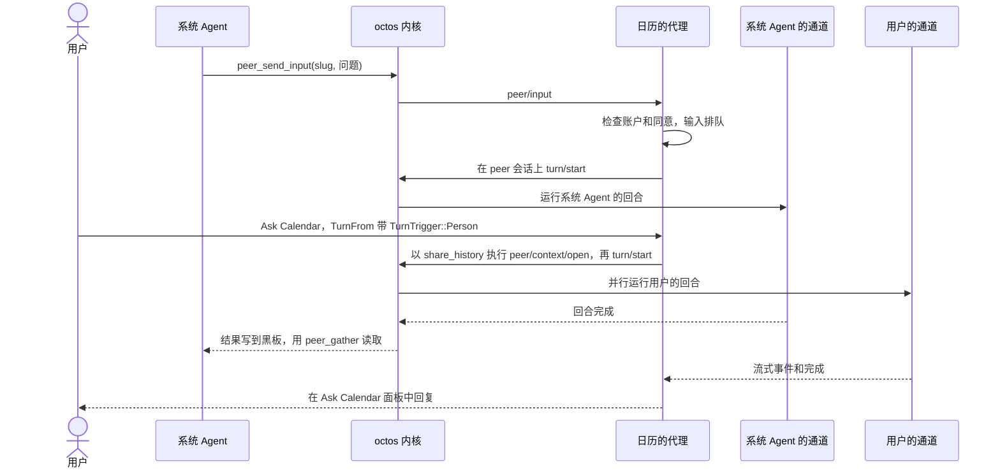
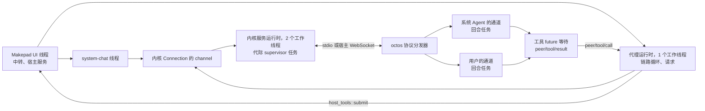

# 代码导读：从应用窗口到 Agent 回合

[English](architecture-walkthrough.md) | 简体中文

这是阅读 OctoSense Agent 代码的路线。它跟着一个问题，从用户输入它的窗口出发，经过 Shell 和 octos 内核，一直走到回答它的 Rust 代码。每一步都说明要打开哪个文件和符号、在那里看什么，以及为什么重要。概念见 README 的[关键概念](../README.zh-CN.md#关键概念)；完整参考见 [architecture.zh-CN.md](architecture.zh-CN.md)。

这个问题是 **“我今天有哪些日程？”**，日历是一个系统脚本应用。用户可以问系统 Agent，由它委派给日历的 Agent，在**系统 Agent 的通道**里处理；也可以直接问日历的 Agent，在它的 “Ask Calendar” 面板或日历卡片的 Chat 标签页里，走**用户的通道**。两条路线最后都可能调用同一个工具 `calendar.events`，答案各自回到提问的那段对话。两者都需要内核、提供方和用户的同意。

## 1. 从可执行入口开始

[desktop/src/main.rs](../desktop/src/main.rs) 只调用 `octosense_shell::octosense_main!()`；[phone/src/main.rs](../phone/src/main.rs) 做同样的调用，只是外面包了一个加入设置应用的 `App`。在 [crates/shell/src/lib.rs](../crates/shell/src/lib.rs) 中，`App::handle_startup` 按固定顺序搭起 Agent 相关的部件：

| 调用 | 建立什么 |
| --- | --- |
| `app_storage::init` | 每个应用的文件夹和机密根目录（[第 8 节](#8-数据存放在哪里)） |
| `ai_host::start` | 内核的配置和 AI 服务（[第 3 节](#3-找到内核的所有者)） |
| `dev_mode::init`、`approvals::init` | 先是开发者模式，再是审批路由 |
| `host_tools::init` | 让 Shell 成为每个代理的工具宿主，连同中转（[第 7 节](#7-把工具追到-rust-代码)） |
| `system_chat::init` | 系统 Agent 的授权，在内核第一次启动之前交给它 |
| `agents::start` | 一个线程，为用户已允许的每个脚本应用准备 peer（[第 5 节](#5-准备-peer给它两条通道)），以及邮件的收取和投递线程 |

顺序正是关键：在任何 Agent 能调用工具之前，审批路由和中转就已经存在。如果用户在之前的运行中已经允许了日历的 Agent，`agents::start` 会立即准备它的 peer，而这第一个连接就会启动内核。

## 2. 看应用如何被托管

应用在哪里运行，决定了它如何连到自己的 Agent，以及它的工具在哪里执行。[native-apps.json](../native-apps.json) 声明每个原生应用的托管方式，[apps.rs](../crates/shell/src/apps.rs) 中的 `AppRegistry::hosting` 在每次启动时据此决定。

| 类型 | 打开 | 看什么 |
| --- | --- | --- |
| 原生模块（Rinx、Notes、Calculator 等） | [module_host.rs](../crates/shell/src/module_host.rs) | 每个实例一个 Splash 隔离环境。对模块的每次调用都在 `catch_unwind` 下运行（`contain`），所以 panic 只关闭这个应用，不会拖垮 Shell。 |
| 进程应用（源码检出构建中的 Terminal 和 Task） | [clients.rs](../crates/shell/src/clients.rs)、[hub.rs](../crates/shell/src/hub.rs) | hub 只接纳出示了本次启动从 stdin 读到的密钥的子进程 socket；`sandbox_policy` 构建系统沙箱。 |
| 脚本应用（日历、邮件、所有商店应用） | `apps.rs` 中的 `system_card_apps`，然后是 App Hub 的 `CARD_MODULE` | `card` 模块，也就是 Card runner，托管所有系统应用和已安装应用，每个实例一个隔离环境。 |

`system_card_apps` 生成日历的启动器条目，并在第一次时注册 Shell 的宿主服务（`register_host_services`）。日历的 `calendar` 声明披露服务用途；隔离 UI 以已准入应用身份调用，受服务实际身份和数据规则约束。月历、按日列表、编辑器及日历 Agent 工具共用 `.host/calendar/events.json`。Glance 日程卡片是同一记录的投影，卡片内的 **Open Calendar** 按钮通过绑定在发布记录中的 `event/<id>` 路由，在真实日历应用中打开该日程。跨应用 Agent 调用仍须下文的独立授权。

运行方法见桌面端 README 的[构建与运行](../desktop/README.zh-CN.md#构建与运行)，其中用 `python3 tools/kernel-artifact.py --host --stage target/release` 准备锁定版本的内核。

连接账户的普通应用也使用同一个 Card runner。GitHub Notes、Inbox Assistant、Google Calendar 声明 `auth`、所用的数据服务族（`github`、`gmail` 或 `gcalendar`）及 `storage.accounts: true`；宿主把每个应用的 peer 绑定到它当前的连接，应用只看到不透明的连接句柄。登录、显式 `host_method` 工具映射、持久化 Gmail 事件与已准入的 Glance 模板见 [OAuth 指南](../crates/oauth-service/README.zh-CN.md)。Google Calendar 读取用户的 Google 日历，而不是内置日历的 `events.json`。真实 GitHub 和 Google 账户的登录已在 macOS 上通过；GitHub 写入、Gmail 发信和设备验收仍待完成。

## 3. 找到内核的所有者

只有一个服务拥有内核，所有使用方都连接到它。按以下顺序阅读：

1. **`ai_host::start`**（[ai-host/src/lib.rs](../crates/ai-host/src/lib.rs)）配置内核，但什么都不启动。它还注册了为脚本应用提供 peer 的 `octos` 服务，以及 `model` 服务，后者做不涉及 peer 和工具的一次性模型调用。
2. **`Core::connect`**（[kernel/src/lib.rs](../crates/kernel/src/lib.rs)）：第一个连接启动一个内核代际（generation），之后的连接加入它。最后一个连接断开时内核停止，除非 Talk to Octos 处于打开状态。提供方变化后，`restart` 结束当前代际，使用方重新连接。
3. **`launch::resolve`**（[launch.rs](../crates/kernel/src/launch.rs)）：桌面端（`OCTOS_APP_CORE_BIN`，或收据与锁定版本一致的打包 `octos-kernel`）和 Android（`liboctos.so`）上，是运行 `serve --stdio` 的子进程；OpenHarmony 上，是在 Shell 内运行的 `serve_io`；iOS 上没有内核。
4. **`supervise`**（[kernel.rs](../crates/kernel/src/kernel.rs)）：每个代际一个任务，持有进程和帧泵送。在任何使用方的帧到达内核之前，它先设定系统 Agent 的精确工具列表（`session/tool_list/set`）。
5. **`Router`**（[router.rs](../crates/kernel/src/router.rs)）：所有使用方（比如系统对话和日历的代理）共用一条流。每个请求得到一个内核内唯一的 id，响应只回给发出请求的使用方；每条通知只发给打开了对应会话的使用方。

## 4. 跟踪一条系统对话消息

打开 [system_chat/mod.rs](../crates/shell/src/system_chat/mod.rs)，然后是 [session.rs](../crates/shell/src/system_chat/session.rs) 和 [link.rs](../crates/shell/src/system_chat/link.rs)：

- `spawn` 启动 `system-chat` 线程，它持有一个 `session::Driver`。UI 线程向它发送 `Command`；对话有变化时，这个线程用 `SignalToUI` 唤醒界面。
- `Driver` 打开 `SYSTEM_SESSION`（`_main:api:octosense#system`），把每条消息作为 `turn/start` 发出。每次连接后，它都在自己的链路上注册系统 Agent 的宿主工具（不带 `peer` 的 `peer/tools/register`）。
- `link::poll_for` 用一个会唤醒（unpark）该线程的 waker 轮询内核，所以系统对话不需要 Tokio 运行时。只有在面板打开或有回合运行时，它才保持连接。

系统 Agent 的内核工具（[kernel/src/system_tools.rs](../crates/kernel/src/system_tools.rs) 中的 `SYSTEM_AGENT_TOOLS`）没有一个能读日历。它单独注册的宿主工具现已显式获授 `calendar.events`、`calendar.add_event`、`calendar.notify`，简单请求可以直接执行；需要日历自身上下文或判断时仍可委派。[agents.rs](../crates/shell/src/agents.rs) 中的两个宿主工具帮它做到这一点，它们由系统对话自己应答（`agents::call`）：

- `agents.list` 返回每个有 Agent 的应用、用户是否允许了它，以及它的 peer slug。
- `agents.ask` 在用户还没决定时显示日历的首次使用面板，并一直挂起这次调用，直到用户回答、peer 准备好；然后返回 slug。

系统 Agent 把这个 slug（而不是应用 id `os.calendar`）传给 `peer_send_input`。它的审批交给审批路由，按回合合并；系统对话的面板从不批准任何东西。

## 5. 准备 peer，给它两条通道

先读 [app-peers/src/contract.rs](../crates/app-peers/src/contract.rs)，它就是应用能看到的全部；再读大得多的 [broker.rs](../crates/app-peers/src/broker.rs)：

- `OctosAppService`：一个应用实例的作用域服务。`open_conversation` 打开用户的通道，`open_context` 打开私有上下文（Rinx 的小程序）。
- `OctosContext::call(ContextOp, EventSink)`：一次操作，它的事件以且仅以一个 `Complete` 结束。
- `ContextSpec`（账户和已授权的服务）与 `TurnTrigger`（是什么启动了这一回合），都由宿主标注（[第 6 节](#6-用户在哪里对话)）。

**日历的 peer。** 脚本应用的 peer 属于 [ai-host/src/contained.rs](../crates/ai-host/src/contained.rs) 中的 `octos` 宿主服务。`contained::prepare`（由 `agents::prepare` 调用）和 `contained::conversation`（由 “Ask Calendar” 面板调用）共用同一个代理 `card.os.calendar`，它由 `hosted::launch`（[hosted.rs](../crates/app-peers/src/hosted.rs)）构建。日历不区分账户，所以代理代表 `device` 行事。接着，`Broker::ensure_peer`：

1. 发送 `peer/prepare`，带上记忆命名空间 `app/card.os.calendar/acct-<tag>` 和 `resume: true`，对新 peer 还把账户文件夹设为它的工作区（`ToolHost::agent_workspace`）；
2. 如果内核没有采用这个命名空间，就拒绝它；
3. 把 peer 的宿主 token 保存在 `PeerRecord` 中，并打开 peer 会话 `…#peer-<slug>`，也就是系统 Agent 的通道；
4. 注册应用的工具（`register_tools`，[第 7 节](#7-把工具追到-rust-代码)）。注册失败的 peer 不运行任何回合。

原生应用开着两个窗口时，只有最早实例的代理驱动 peer（`Broker::drives`；它关闭时由 `take_over` 接替）。日历只有一个代理，总是由它注册工具、接收系统 Agent 的输入。它的 `on_peer_input` 检查账户和同意（`ToolHost::admit_input`），需要拒绝时回复 `peer/input/reject`，否则在 peer 会话上启动这一回合，一次一个。

**用户的通道。** 每个对话句柄都得到一个新的请求上下文，以 `share_history` 打开（`open_handle`）；如果应用声明了 `storage.agent_workspace: "account"`，还会加上 `read_parent`（`context_reads_account`）。



**原生应用**通过 [peer link](../crates/shell/src/peer_link/mod.rs) 连到同一种代理：进程应用经由它的 hub socket，模块经由它的 `OctosPeer::open` 暂存的 channel（`claim_peer_links`）。Shell 从 socket 或实例确定应用的身份，从不采信帧里的说法。

## 6. 用户在哪里对话

除了系统对话，每个入口打开的都是用户的通道：

| 用户在哪里输入 | 要打开的代码 |
| --- | --- |
| 系统对话 | `system_chat/session.rs`：系统会话（[第 4 节](#4-跟踪一条系统对话消息)） |
| “Ask &lt;app&gt;” 面板 | [app_chat/mod.rs](../crates/shell/src/app_chat/mod.rs)：`agents::conversation`，然后是 `ContextOp::TurnFrom { trigger: TurnTrigger::Person }` |
| 原生应用自己的对话（经注入的服务） | `OctosAppService::open_conversation`。Rinx 只用 `open_context`，供小程序的私有上下文使用。 |
| 其他原生应用的对话 | Makepad 的 `OctosPeer`，经由 peer link：不带 `client` 的 `octos.session.open`（[peer_link/link.rs](../crates/shell/src/peer_link/link.rs)） |
| 脚本应用自己的对话 | `host.request("octos.turn.start")`，由 `contained.rs` 为已准入应用应答，并检查 Agent 同意与当前账户 |
| 卡片的 Chat 标签页，或声明了 `sys.chat` 的卡片 | [glance_chat.rs](../crates/shell/src/glance_chat.rs) 和 [l0-chat](../crates/l0-chat/src/lib.rs) |

**卡片工作区**（[卡内对话](../README.zh-CN.md#卡内对话)）。[glance_sheet.rs](../crates/shell/src/glance_sheet.rs) 显示打开的卡片：手机上全屏，桌面端居中。如果发布者有 Agent，而卡片没有声明对话，`L0Session::for_card`（[glance_card.rs](../crates/shell/src/glance_card.rs)）会在 Card / Chat 标签页后面加上宿主拥有的 `WorkspaceChat`。`chat_submit` 把每一轮经由 `glance_chat::perform_bound` 发往发布这张卡片的账户（`agents::conversation_for_account`），卡片的数据和本地状态只作为上下文（`ContextKind::Card`），从不作为工具。邮件回复卡片则用 Email / Chat 共用一份保存的草稿；Chat 的每一轮都带着一个一次性令牌（`drafts::issue_chat_edit`），让 `mail.suggest_reply` 能保存这次修改（[可组合的邮件卡片](mail-composable-cards.zh-CN.md)）。

尚未实现：还没有随附的应用从自己的界面打开用户的通道；入口是 Shell 的面板和卡片。

触发方式决定了审批在多大程度上信任一个回合。只有 Shell 自己的界面（“Ask &lt;app&gt;” 面板和系统对话）才会标注 `TurnTrigger::Person`；进程内模块本可以经注入的服务这样做，但目前都没有。应用说 `"trigger": "person"` 时，会被记为 `AppSaysPerson`（`TurnTrigger::from_args`），中转把它作为应用发起的运行交给审批路由（`host_tools/relay.rs` 中的 `trigger_of`）；卡内对话也得到同样的标注。不带触发方式的 `ContextOp::Turn`（Rinx 的小程序就这样发送）是 `Unknown`，常设规则会跳过它。邮件的新邮件事件（[agent_events.rs](../crates/shell/src/agent_events.rs)）以 `TurnTrigger::Incoming` 在这条通道里运行，已安装 Gmail 应用的新邮件事件（[connected_events.rs](../crates/shell/src/connected_events.rs)）也一样。已安装应用的这类事件，Shell 只在以下条件同时满足时才交付：

- 用户已允许它的 Agent；
- 它安装的这个版本在当前的本地签名目录中仍是已准入状态（见[第 7 节](#7-把工具追到-rust-代码)中的撤回检查）；
- 它已准入的 `agent` 块设置了 `background: true`，并列出触发器 `<应用短名>.new_message`，其中应用短名是应用 id 的最后一段（Inbox Assistant 的触发器是 `inbox.new_message`）；
- 收集器验证已准入应用；`auth` 和 `gmail` 披露用途，不授权事件投递；
- 它当前的 Google 连接可以读取 Gmail。

其他应用还没有事件。

对于 “Ask Calendar”，回复经由上下文的 `EventSink` 流回，面板的跟随者（`OctosContext::subscribe`）能收到两条通道的事件。尚未实现：脚本应用收不到推送的事件，它的 `octos.turn.start` 返回的是完整的回复。

停止按通道进行：面板上的“停止”只结束用户的回合（`app_chat::stop`），系统 Agent 的回合有自己的控件（`stop_system_agent`）。对一段对话执行 `ContextOp::Interrupt` 会同时结束两条通道，因为设备归用户所有。

## 7. 把工具追到 Rust 代码

从声明一直跟到它读取的文件，看 `calendar.events` 走过的路：

1. **声明**于 [apps/calendar/bundle/tools.json](../apps/calendar/bundle/tools.json)：它的 schema、`risk: "read"`、`implemented_by: "host-service"`，标为 `shareable: true`（调用者仍须显式授权）。
2. **加载**：[host_tools/script_apps.rs](../crates/shell/src/host_tools/script_apps.rs) 中的 `from_bundle` 通过 App Hub 会核对摘要的加载器读取它。`install` 把工具加入中转的目录，并为 `os.calendar` 安装一个 `HostServiceExecutor`。
3. **注册**：`broker.rs` 中的 `register_tools` 用 `ShellToolHost::declarations`（[host_tools/mod.rs](../crates/shell/src/host_tools/mod.rs)）返回的声明进行注册。
4. **调用**：octos 在注册它的那条链路上发送 `peer/tool/call`。代理把账户、上下文和调用方标注进一个 `HostToolCall`（[app-peers/src/host_tools.rs](../crates/app-peers/src/host_tools.rs)），由 `ShellToolHost::tool_call` 排队交给宿主中转。通常由 UI 驱动中转；Android 邮件后台任务也能在没有窗口时驱动同一个同步的中转。
5. **检查**：`Relay::handle`（[relay.rs](../crates/shell/src/host_tools/relay.rs)）检查授权、同意、账户是否已退出登录、参数大小和 `input_schema`，然后是调用方的预算（默认每轮 32 次、每天 1000 次）。
6. **运行**：`HostServiceExecutor::execute` 以 `os.calendar` 的身份，把一个 `ServiceCall` 分派到 App Hub 的服务注册表，不弹出任何面板。`CalendarService::call`（[apps/calendar/host-service/src/lib.rs](../apps/calendar/host-service/src/lib.rs)）读取 `<apps root>/.host/calendar/events.json`（`<apps root>` 指 OctoSense 主目录下的 `apps/` 文件夹），按 `from`、`to` 和 `limit` 过滤。
7. **应答**：`script_apps::poll` 从 App Hub 的队列取回回复，`checked_reply`（在 `relay.rs` 中）按 `output_schema` 和大小上限检查它，`ToolReply` 只发送一次 `peer/tool/result`。

`calendar.events` 只读，所以不会询问任何人。`calendar.remove_event`（`destructive`、`confirm: host`）则先由 octos 把关：内核发起一个 `host_tool` 审批，代理把它交给 `ToolHost::host_tool_approval`，只有获批的调用才会到达。

Agent 调用最终映射到 `glance.publish` 时（包括 `inbox.notify` 等别名），执行器拒绝原始 `script`、混合模板与源码的参数，以及可执行或 L1 源码。Agent 可以选择已审核应用包内的模板并提供 `initial` 数据对象，或提交合法的纯声明 L0。Glance 在渲染前仍验证模板所在的已准入应用包、发布者与账户身份及资源上限；能力族仅作披露。这一限制针对模型生成的发布内容；已准入前台应用仍可运行自身经过审核的 Splash 实现。

已安装应用的 Agent 还要求该精确版本持续满足准入条件。加载指导文本、提供工具及接受系统 Agent 输入时都会读取当前本地签名目录。代理还会在每次实际发送 `turn/start` 前检查 `ToolHost::admit_turn`，包括缓存对话、排队输入与重试；中转在执行前再次检查工具所有者与调用应用，包括等待审批后恢复执行的情况。撤回在下一次获取目录后生效，缓存的 peer 也不能绕过。Gmail 分发器随后释放不可用的 peer，保留未完成事件以便之后经授权重试。用户之前保存的同意不会改变；应用不可用不等于用户拒绝。

App Hub 界面、Agent 准入、Glance 隔离环境和后端注册监听器统一使用宿主选择的
`CatalogChannel`。旧签名目录使用 `catalog.json`，GitHub 证明通道使用
`catalog-v2.json`，应用准入前必须验证其证明。只要应用库已有 v2 缓存，就继续使用
v2；证明无效或所选缓存缺失都会报错，不会回退读取旧目录。在官方 v2 验收完成前，
默认仍使用旧通道；运维者可设置 `OCTOSENSE_HUB_CATALOG=github-v2` 选择新通道。
两个缓存文件名及各自的 `.lock` 文件名均属于宿主，不能作为应用存储 ID。
通道切换或缓存更新会让后端监听器重新检查已连接应用，每次调用的准入检查仍会执行。
如果已验证的新目录无法保存，Agent 和 Glance 也会遵守当前进程记录的最高已验证序号，
拒绝使用较旧的缓存，直到新目录成功保存。

中转按工具的所有者分派每一次调用：

| 所有者 | 执行器 |
| --- | --- |
| 脚本应用，`implemented_by: "host-service"` | `HostServiceExecutor`：应用的宿主服务（`calendar`、`mail`、`news`）、应答 `<app>.notify` 的 Shell 通知服务，或商店应用的工具在 `host_method` 中指定的共享服务（`github`、`gmail`、`gcalendar`、`glance`）。对 `github`、`gmail` 和 `gcalendar`，它还会注入该应用当前的连接。 |
| 脚本应用，`implemented_by: "app"` | `ScriptAppExecutor` 将调用排入 App Hub 已准入的完整应用运行器；其 `app_tool(name, call_id)` 钩子在 UI 线程运行，与界面共享现有 Splash VM 和存储沙箱。应用关闭时返回 `app_not_running`。 |
| 原生应用 | 它已打开的实例：经由 peer link 上的 `OctosPeer::serve_tools`，否则经由它的 AI bus 服务（应用没打开时回答 “Open … first”）。用 `OctosAppService::set_tool_executor` 安装的执行器优先。 |
| `terminal.run`（仅系统 Agent） | 先由面板展示确切的命令，再经 AI bus 输入到可见的 Terminal |
| `files.list`、`files.read`、`files.search`、`dev.run` | Shell 自己 |
| 工具箱（`toolbox-peers` feature） | 工具箱的执行器 |

脚本工具包声明 `requires: ["script-tools-v1"]`。调用者不能通过参数选择 VM、文件系统路径、应用身份或所有者账户。中转验证授权和 schema，运行器再次验证实际运行包中的工具声明。只有完整应用实例持有工具，速览卡片中的应用副本不持有。关闭、取消、账户切换和有界期限会使待处理结果失效。处理函数使用 `mod.app_tools.request`、`complete`、`fail` 和 `active`；详见 App Hub 的[脚本 ABI](https://github.com/OctoSense-org/OctoSense-App-Hub/blob/main/docs/PUBLISHING.zh-CN.md#脚本工具执行script-tools-v1)。首版不启动已关闭应用或后台 VM，也不能伪造原生人工确认。既有系统应用的宿主服务执行方式保持不变。手机和真实模型验收在实际执行前仍为未验证。

### 审批顺序

首次同意、工具授权和逐次调用的审批是相互独立的检查。对一次审批，[approvals/router.rs](../crates/shell/src/approvals/router.rs) 中的 `Router::request` 依次尝试：

1. 外部客户端自己的提示，用于该客户端的回合；
2. 开发者模式，用于它覆盖的应用；
3. 所属应用自己的面板，用于 `confirm: app` 的工具（应用没有注册面板时，`app_wait_s` 即 120 秒后拒绝）；
4. 实时面板，用于必须每次都问的调用：`auto_approvable: false`、结果未知、来自外部连接；
5. 用户的常设规则；
6. 否则由 Shell 面板展示确切参数。

决定会写入 `logs/approvals-audit.jsonl` 审计日志；时限就是 `app-peers/src/host_tools.rs` 中的 `DEFAULT_PROMPT_DEADLINE`（10 分钟）和 `EXPIRY_GRACE`（30 秒）。系统 Agent 不能批准：octos 拒绝它用 `peer_respond` 回答审批。每一步的含义见 [architecture.zh-CN.md 第 5 节](architecture.zh-CN.md#5-审批)。

发送邮件从不经过这个审批路由。`mail.propose_send` 只准备确切的邮件内容；卡片里宿主自己的审阅界面（`mail_review.rs`）只有在用户亲手点按之后才调用 `drafts::approve_and_send`。亲手点按指 Android 上触摸屏幕，或 macOS 上用鼠标或触控板点击，按下和释放都必须可信（`trusted_user_gesture`）。合成输入和远程输入都会被拒绝，开发者模式也不能代替这一步。macOS 路径**未验证**：还没有在 macOS 上实际发送过邮件。

## 8. 数据存放在哪里

应用的数据分几处存放，每处各有一个所有者：

| 数据 | 位置 | Agent 如何访问 |
| --- | --- | --- |
| 账户文件夹 | `apps/<app id>/accounts/<account hash>/`，或 `accounts/device/`（[app_storage/mod.rs](../crates/shell/src/app_storage/mod.rs)） | 它是 peer 的工作区，在 peer 创建时固定。用户的通道运行在自己的 `contexts/<id>/` 中，通过 `read_parent` 或宿主的 `files.*` 工具读取账户文件夹（[files.rs](../crates/shell/src/host_tools/files.rs)：仅限 Unix；每次读取最多 128 KiB，列目录最多 500 项，搜索最多 100 条匹配）。 |
| 宿主服务的数据 | App Hub 的宿主目录 `<apps root>/.host/`：日历的日程，邮件的邮件和回复草稿（`drafts.rs`）；`oauth/` 下是已连接账户的元数据（`connections.json`）、Gmail 草稿与事件状态、Google Calendar 缓存，以及运维者可选提供的注册文件：替换构建内 OAuth 客户端注册的 `clients.json`，和登记应用自有后端的 `backends.json` | 只能通过该服务的工具访问（没有工具开放这些注册文件）；任何工作区都不包含它。 |
| 对话记录和记忆 | octos 中，命名空间 `app/<app>/acct-<tag>` | 归 Agent 自己。`<tag>` 是 FNV-1a 哈希（`account_tag`）；文件夹名则是另一种哈希，SHA-256（`account_hash`）。 |
| 机密 | 应用机密：macOS 和 iOS 上存入钥匙串（索引在 `<home>/secrets/<app id>/`），其他平台是该文件夹中的文件。AI 提供方密钥：macOS 上存入钥匙串，其他平台存入内核核心目录下的文件（除 Windows 外仅所有者可读）。OAuth token：macOS 和 iOS 上存入钥匙串，Android 上存成用 Android Keystore 密钥加密的文件，Windows 和 Linux 上存入系统凭据服务（`oauth-service/src/host.rs`） | 永远不能访问。`app_storage::check` 会拒绝任何包含或链接到机密的工作区。 |

`agent_workspace_in`（[host_tools/mod.rs](../crates/shell/src/host_tools/mod.rs)）把账户文件夹交给每个拥有 `octos.*` 服务的原生应用，即使它声明了 `storage.agent_workspace: "none"`；也交给每个没有这样声明的脚本应用。日历的 Agent 得到 `apps/os.calendar/accounts/device/`，但日程不在那里：`calendar.events` 从 `.host/calendar/events.json` 读取日程，再把 JSON 交给模型。

退出登录会挂起 peer，之后它的调用都会得到 `signed_out`。删除账户或卸载应用会用 `peer/purge`（[purge.rs](../crates/app-peers/src/purge.rs)）清除它。

## 9. 跨应用协作与求助

有三种操作容易混淆。

**委派。** 系统 Agent 用 `peer_send_input` 请应用的 Agent 做事（[第 4 节](#4-跟踪一条系统对话消息)），由 Shell 在现有的 peer 上启动那一回合。不会启动新进程。

**直接调用另一个应用的工具。** 这会绕过拥有该工具的应用的模型，所以只有以下条件全部满足时，中转才允许：

1. 所有者把工具声明为 `shareable: true`，并且有对应的执行器。
2. 调用方获得了授权：脚本应用在 `agent.tools` 中写上带点的名称，原生应用在 `native-apps.json` 条目的 `agent.grants` 中声明。`Catalog::may_call` 检查这一点。
3. 对脚本应用包，App Hub 的准入提供了这个名称（`HostLimits.offered_tools`）。
4. `Catalog::owner_of` 能从命名空间找到所有者：工具箱、同名的原生应用，否则是系统应用 `os.<namespace>`。

日历共享 `calendar.events`、`calendar.add_event`、`calendar.notify`；Mail 的 manifest 恰好申请这三项，系统 Agent 则有单独的显式授权。加载 Mail 时也加载已准入的日历目录和执行器，无需启动日历 peer 或窗口。Mail 读取已确认的邮件、解析日期与时区、先查日历，再用稳定重试键添加，验证保存结果并发布归属日历的卡片。安排日程须有用户请求或明确配置的策略。具名时区不受设备时区差异影响；这写入本地日历，并非 Google Calendar。新闻共享 `news.list` 和 `news.read`。尚未实现：`owner_of` 从不解析到商店应用，所以商店应用还不能共享工具。

**求助。** [questions/mod.rs](../crates/shell/src/questions/mod.rs) 按回合的来源路由 Agent 的 `ask_user_question`：`peer/input` 回合的问题进系统对话，其余的进应用的对话。只有用户能回答，而且只能在 Shell 界面上回答。系统设施只以获授权的工具的形式提供给应用的 Agent，例如[工具箱](../crates/toolbox/README.md)的工作流。尚未实现：应用不能与系统 Agent 发起对话，`OctosAppService` 没有这样的调用。

## 10. 映射到 Rust 的实际执行模型

peer 是存储的状态，回合是 octos 中的一组 Tokio 任务；线程属于服务，而不属于 Agent（[为什么它省内存、省算力](../README.zh-CN.md#为什么它省内存省算力)）。

| 层 | 如何运行 | 去哪里看 |
| --- | --- | --- |
| Shell 界面 | Makepad 的 UI 线程：绘制、事件，以及运行中转的 `host_tools::pump` | `lib.rs`、`host_tools/mod.rs` |
| Mail 事件 | 两个 `std::thread`：独立收取与串行投递，各事件独立退避。Android 仅在前台或有时限的系统任务内允许执行。 | `agent_events.rs`、`mail_background.rs` |
| 已连接账户的 Gmail 事件 | 一个 `std::thread`，名为 `connected-inbox-events`，在 Android 上只在前台或有时限的系统任务内运行。它每 300 秒轮询一次每个获准的（应用，连接）；仍有事件待处理时每 2 秒一次，失败后等 60 秒。每个事件的回合在该应用的 peer 上运行，限时 180 秒。 | `connected_events.rs` |
| Android Mail 后台任务 | Java JobService 工作线程无需 Activity 即可加载同一个 Rust 宿主，驱动同步的工具中继；一个要求联网的周期任务，不创建第二个内核或对等代理。 | `phone/src/android_mail.rs`、`MailJobService.java`、`runtime_host.rs` |
| 系统对话 | 一个 `std::thread`，用 `link::poll_for` 轮询内核 | `system_chat/mod.rs`、`link.rs` |
| 内核服务 | 一个首次使用时才创建的 Tokio 运行时：2 个工作线程，8 MiB 栈；每个代际一个 supervisor 任务 | `kernel/src/lib.rs` 的 `Inner::runtime`、`kernel.rs` 的 `supervise` |
| 应用代理 | 每次 `Broker::new` 创建一个运行时，1 个工作线程：链路循环、请求、重试、时限 | `app-peers/src/broker.rs` |
| 宿主服务 | 由 App Hub 的 `services::dispatch` 在调用方的线程上调用：工具调用时就是中转泵调用线程（UI 或 Android Mail 任务），日历在那里应答。邮件（`work` 线程、`mail-fetch`）和新闻（`news-fetch`）把网络工作放到自己的线程上。已连接账户服务（`auth`、`github`、`gmail`、`gcalendar`）为每个请求的网络工作单独开一个线程。 | `script_apps.rs`、`apps/*/host-service/`、`crates/oauth-service/` |
| 桌面端和 Android 上的 octos | 独立进程，使用 Tokio 的默认运行时：每个 CPU 核心一个工作线程（`ServeCommand::execute`） | octos 的 `crates/octos-cli/src/commands/serve.rs` |
| OpenHarmony 上的 octos | `serve_io` 运行在内核服务的运行时上，经由 `tokio::io::duplex` 通信 | `kernel.rs` 的 `start` |
| 一个 octos 回合 | 一个 spawn 出来的任务，先在 `oneshot` 启动屏障处等待，然后运行 `run_standalone_turn` 及其自己的任务 | octos 的 `crates/octos-cli/src/api/ui_protocol_transport.rs` |



对于 “Ask Calendar”，octos 的 `handle_turn_start_with_accept` spawn 出用户的回合任务；它的 `calendar.events` future 一直等待，直到调用在 UI 线程走完一个来回。

三种 channel 反复出现：`oneshot` 传递一个回答（请求的回复、回合的启动），`mpsc` 是邮箱（supervisor 的 `Ctl` 消息），`watch` 保存最新状态（代际是否就绪）。代理的链路循环和 supervisor 都是 `tokio::select!` 循环；账户代际和 `link_epoch` 检查会丢弃发给旧账户或旧连接的回复。

`Broker::bind`、`Broker::host_request` 和 `OctosAppService::prepare` 会阻塞调用方最多一分钟，所以不要在 UI 线程上调用它们。

### 从 Agent 调用跟到 App Studio 中可运行的应用

开发者模式覆盖当前调用方时，App Studio 会向已有的系统或应用 Agent 提供 Shell 所有的工具。[工具声明与执行器](../crates/shell/src/host_tools/studio.rs)沿用宿主工具的 relay、审计与取消路径。系统调用使用 `session/open` 确认的 workspace；应用调用使用 broker 确认的 peer workspace，人类对话进一步限定到自己的 `contexts/<id>/`。工具参数不能替换调用身份，也不能选择任意输出目录。

Agent 可先用普通文件工具从头编写 `manifest.json` 和 `main.splash`，再执行以下步骤：

| 工具 | 行为 |
| --- | --- |
| `studio.bundle_check {bundle_path}` | 从当前对话 workspace 复制大小受限的文件，计算摘要，对宿主私有副本做开发者准入；作者的文件不变。 |
| `studio.open {bundle_path}` | 打开可见预览，使用可丢弃的应用状态，返回 `instance_id`。 |
| `studio.inspect {instance_id, offset?}` | 返回 PNG `path`、一页精简的控件 selector 与检查摘要，以及完整诊断 JSON 的 `snapshot_path`。 |
| `studio.input {instance_id, widget_id, action, …}` | 向检查到的控件发送真实 `tap`、`text` 或 `scroll` 事件。输入文字用 `text`，滚动用 `delta_y`。 |
| `studio.close {instance_id}` | 关闭应用，丢弃预览状态。 |
| `studio.install {bundle_path}` | 登记本地开发者安装，在 Home 中显示。随后可用 `studio.open {app_id}` 或启动器图块打开；应用自己的状态在关闭、重开后保留。 |
| `studio.uninstall {app_id}` | 删除调用方自己的一个开发者安装：收据、快照、应用数据和所有者记录。该应用仍有实例打开时拒绝。 |

首个完整应用路径接受 `dev.studio.*` 命名空间下的离线、仅存储权限 `main.splash` 包。应用本身没有 Agent、账户访问和 `net` 模块，每个 `host.request` 都会被拒绝；准入的指令预算只是声明，真正强制的是存储 jail、配额和内存上限。准入还会拒绝含有 URL 或 `{{assets}}` 路径的 `main.splash`：隔离环境只是不提供 `net` 模块，图片或视频仍可能通过其来源地址访问网络。包中可携带原创启动器图标，但暂不支持屏幕内的资源加载路径。[studio_bundles.rs](../crates/shell/src/host_tools/studio_bundles.rs)把包限制为 128 个文件/目录、八层目录、总计 2 MiB；单文件最多 512 KiB，`main.splash` 最多 64 KiB。解析后的策略最多允许 1 MiB 私有应用存储、五百万脚本指令和 16 MiB 堆；清单中更低的限制仍然生效。

开发者安装独立于 App Hub 的签名目录。宿主私有收据把准入后的字节绑定到作者所属的应用、账户、session、context 与 `DevTag`。该标记记录开发者 profile 和授予权限的那次启用。打开已安装应用时会重新检查收据和摘要；授权结束后，应用从启动器可用列表移除，运行中的实例停止。另一个对话不能检查、操控或替换它。同一已安装应用只允许一个实例运行，避免同时写入其状态。

再沿着 Rust 的执行边界阅读：

1. 宿主执行器在工作线程读取受限文件并做准入，然后将 `OpenSpec` 或检查请求入队。它通过回复 channel 等待结果，不阻塞 Makepad UI 线程。
2. Shell 把启动队列中的请求变成普通窗口管理器 client。[StudioModule](../crates/shell/src/studio/module.rs)创建 [StudioApp](../crates/shell/src/studio/apps.rs) 控件并负责关闭。Splash 在私有 jail 与准入限制设置完毕后才求值源码。预览写入可丢弃的 jail；安装后的写入保存在该应用自己的持久 jail。
3. UI 线程以该应用为根构建 Makepad `WidgetTree`。检查读取真实矩形与控件状态；输入先定位可见、启用的控件，再走事件路径。重名控件有唯一的 `selector` 值。GPU 读回复用 Shell 的 ticket 路由，PNG 压缩运行在重型工作线程池；结果回到原来的 Agent 工具调用。

`studio.inspect` 返回给模型的内容最多为 3,800 个 UTF-8 字节。`snapshot.widgets` 列出可见的非 Splash 控件及其准确 `selector`；把该值传给 `studio.input.widget_id`，不要猜测按钮显示文字就是控件 ID。较长的 text/value 会附带 `text_truncated` 或 `value_truncated` 标记。若 `next_offset` 是整数，用该值作为 `offset` 再调用 inspect 获取下一页。每次调用都观察当前 UI，因此翻页时应保持应用状态稳定。`snapshot.checks` 汇总是否通过以及发现项和错误数量。

`snapshot_path` 指向完整原始结果文件，包含所有控件、矩形、geometry、tree、检查详情和 PNG 路径。该 JSON 按行缩进，最多 1 MiB，与 PNG 一起存入调用方的对话 workspace；可用 `read_file` 按有限行数读取。这样既保留完整诊断，也避免重要 selector 被内核对模型工具结果的 4 KiB 截断隐藏。

当前 pin 在 Android 上没有 HTTP 远程 instrument。Studio 直接在进程内调用底层 Makepad 控件 API，范围限定为自身应用。现有检查能发现空几何信息、文字裁切与过小按钮，不能据此证明功能或整体 UX。应用检查返回 `settled: false`：它捕获当前帧，不声称任意交互脚本已经停止变化。Agent 可用 `view_image` 查看返回的 PNG，再发送输入测试实际行为。

`studio.render` 仍是独立的 L0 glance 路径：参数为相对 `source_path`、可选 `data_path` 和 `dark`，源码/数据上限为 16/32 KiB。它使用真实 glance 宽度与 72–440 点高度范围，临时 jail 配额为零，没有网络或宿主能力。着色器就绪且连续三次读回一致后返回 `settled: true`；聊天与图像资源明确返回不支持。两条截图路径都把 PNG 限制为 5 MiB，并检查取消、前台状态与开发者授权。UI 请求期限为 20 秒，处于宿主 25 秒等待和内核默认 30 秒工具期限之内。

这些操作不会创建 Agent peer，也不是每个应用对应一个 Tokio task。已有 Agent 调用宿主工具，Rust 工作线程负责文件与编码，UI 线程持有控件并提交 GPU 工作。

DeepSeek V4 Flash 从头编写的 Task Planner 已在**真实 OnePlus 6 上通过 129 次工具调用**，覆盖任务输入、完成与筛选、预览状态丢弃、独立安装状态、关闭重开、进程重启、准确的中文输入及滚动。测试工具没有直接修改应用源码或存储。竖屏应用与键盘视觉评审已通过；间距较宽，Shell 浮层和状态栏另有观察记录。损坏存储与保存失败的故障注入仍待完成，详见[验收报告](studio/oneplus6-validation.md)。见 [ADR 0006](adr/0006-app-studio-on-the-phone.md) 和[新应用需求](studio/task-planner-brief.md)。本次实现不包含 `mod.studio` 工具箱适配器、图像生成/比较、更完整的资源路径或公开发布。合并 `main` 之后，一个由 Claude 从头编写的 Task Planner 在一部普通小米手机上通过了同样的验收流程（在最终代码上共 134 次工具调用）；另一项由请求队列驱动的检查则覆盖了应用数据的所有权、`studio.uninstall` 和开发者授权结束后的行为（见[再次验证](studio/xiaomi-revalidation.md)）。

## 11. 测试

[crates/app-peers/tests/broker.rs](../crates/app-peers/tests/broker.rs) 让代理对接一个脚本化的内核，它的测试名本身就写明了协议的规则。可以先看 `a_persons_message_runs_while_the_system_agents_input_runs`、`a_lane_stop_leaves_the_other_lane_running`、`a_kernel_without_shared_history_is_refused_for_the_conversation` 和 `removing_an_account_purges_its_recorded_peer_and_drops_the_record`。[host_tools/scenario_tests.rs](../crates/shell/src/host_tools/scenario_tests.rs) 用锁定版本的 octos 和一个脚本化的模型，用一个测试用的新闻应用端到端地跑完同样的两条通道场景；运行方法写在它的文件头部。

在仓库根目录运行单元测试和脚本化连接器测试：

```sh
cargo test --locked -p octosense-kernel -p octosense-app-peers \
  --features octosense-app-peers/octos-core,octosense-app-peers/ws
```

真实内核测试（`crates/app-peers/tests/real_kernel.rs` 和场景测试）在没有设置内核二进制时会打印一条说明并直接通过，所以测试全部通过不能当作集成证据；[app-peers README（英文）](../crates/app-peers/README.md#testing)说明了如何给它们提供内核。可见界面、真实提供方和设备上的行为需要另外运行。

其他仓库的导读（固定版本）：[OctoSense App Flow](https://github.com/OctoSense-org/OctoSense-App-Flow/blob/218b25d2460d64f843932f67d419467618464fb9/docs/CODE-WALKTHROUGH.md)（原 Design Flow）、[App Hub](https://github.com/OctoSense-org/OctoSense-App-Hub/blob/d2ca3a30ce06b0b1390cff305520962731baa1f8/docs/CODE-WALKTHROUGH.md)、[OctoScript-Makepad](https://github.com/OctoSense-org/OctoScript-Makepad/blob/2cc5ef37d7d6a3d2992673389ce74488f7bb2d87/docs/architecture-walkthrough.md) 和 [octos](https://github.com/octos-org/octos/blob/056173e85b150e387805fc307fe231064ac1ed35/docs/octosense-integration-walkthrough.md)。
