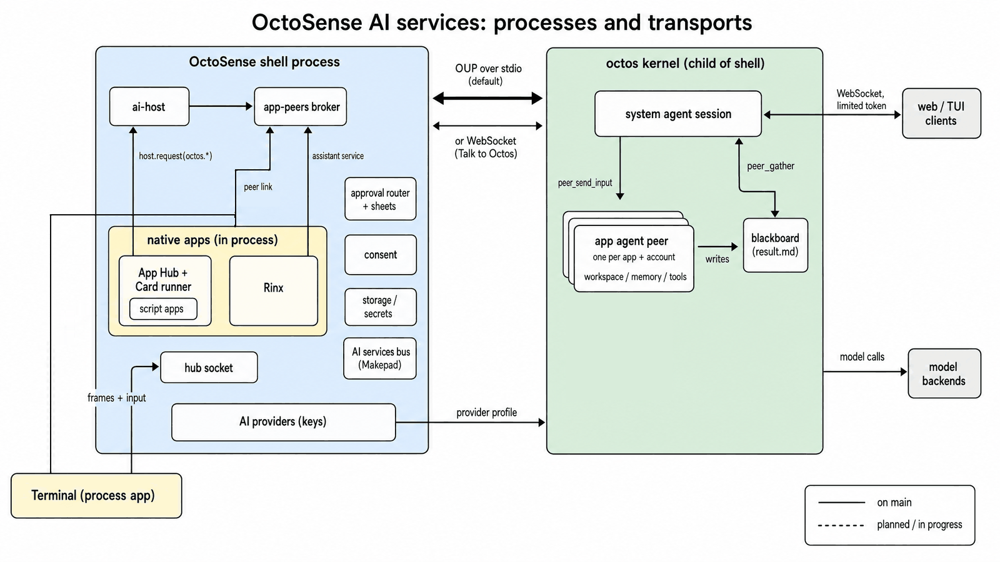
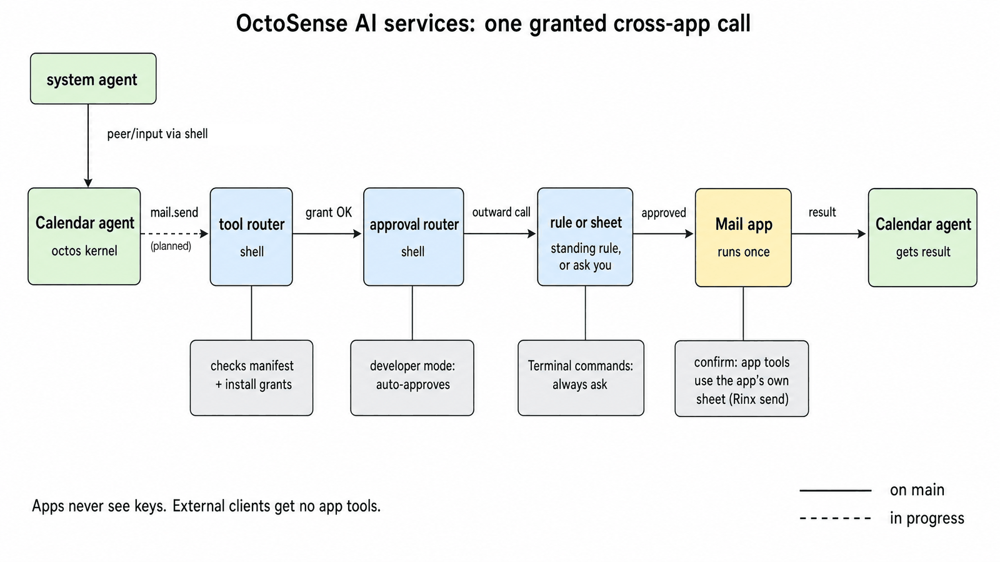
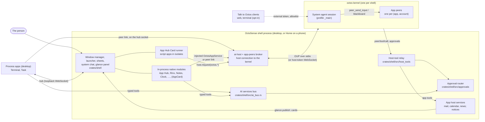
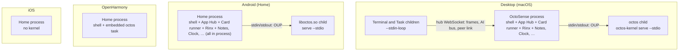
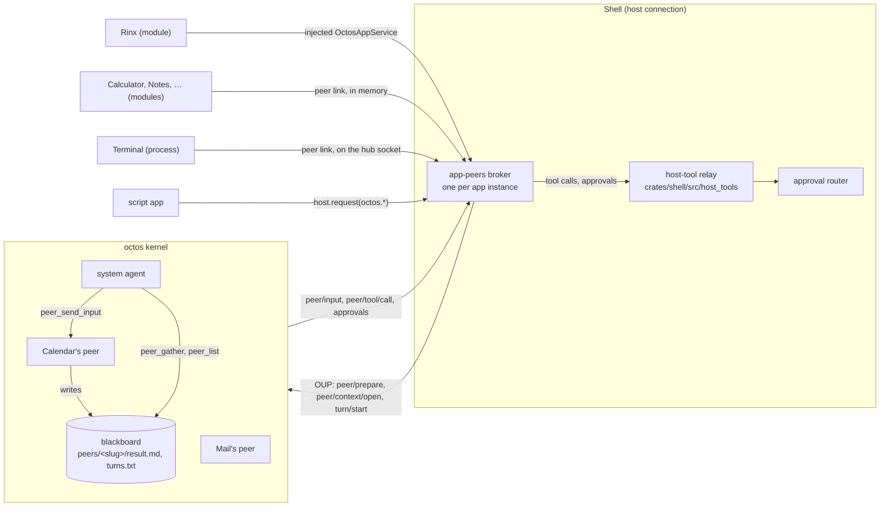
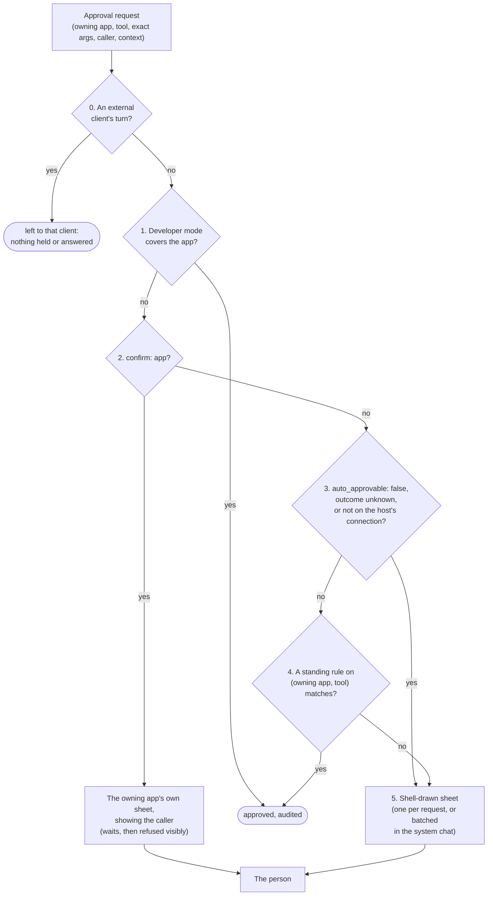
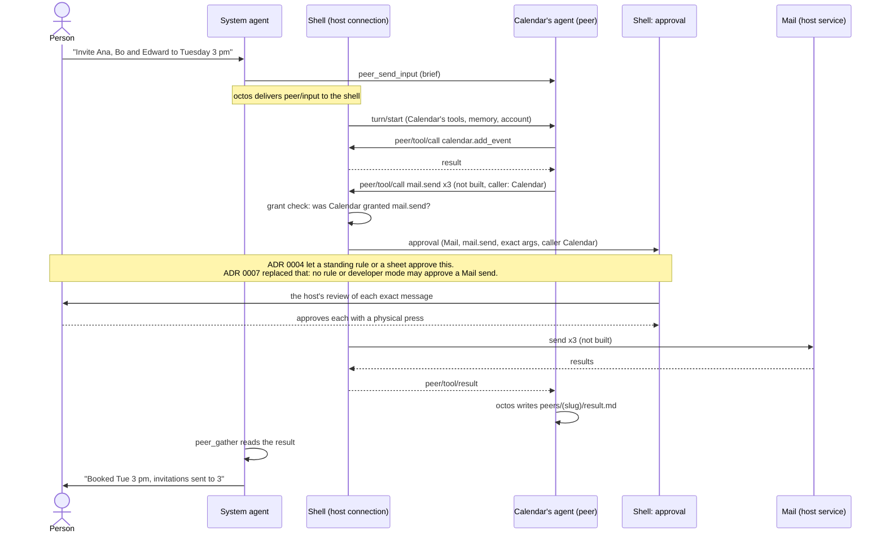

# OctoSense architecture

English | [简体中文](architecture.zh-CN.md)

This is the full picture of how OctoSense is built, with the code behind each part. It assumes the README's [Key concepts](../README.md#key-concepts) and [How it fits together](../README.md#how-it-fits-together). [ai-services.md](ai-services.md) covers what each kind of app can call and how to run the AI services locally, and the [code walkthrough](architecture-walkthrough.md) reads the code in order.

The decisions behind it are these ADRs:

- [ADR 0001](adr/0001-one-octosense-repository.md): one repository
- [ADR 0002](adr/0002-event-driven-app-agents.md): event-driven app agents (Proposed, partly built)
- [ADR 0003](adr/0003-shared-octos-client-access.md): Talk to Octos
- [ADR 0004](adr/0004-native-apps-hosting-and-peers.md): native apps, app agents, cross-app work and approvals
- [ADR 0007](adr/0007-composable-mail-action-cards.md): Mail cards with drafts, chat and host-approved sending (in progress)
- [ADR 0010](adr/0010-shared-oauth-and-connected-apps.md): shared OAuth and connected apps (in progress; live sign-in passed on macOS; GitHub writes, Gmail sends and device acceptance pending)

The text describes the code as it is; what is not built yet is marked **Not yet** or **Planned**.

## Contents

- [The big picture](#the-big-picture)
- [1. Processes per platform](#1-processes-per-platform)
- [2. Agents](#2-agents)
- [3. Communication](#3-communication)
- [4. Tools and grants](#4-tools-and-grants)
- [5. Approvals](#5-approvals)
- [6. Storage and secrets](#6-storage-and-secrets)
- [7. Trust boundaries and isolation](#7-trust-boundaries-and-isolation)
- [8. Worked example: emailing a meeting invite](#8-worked-example-emailing-a-meeting-invite)
- [Where the code and the ADRs disagree](#where-the-code-and-the-adrs-disagree)
- [Source map](#source-map)

## The big picture





<details><summary>Text version (Mermaid)</summary>



</details>

Every agent is a session in the one kernel, and every call from an agent to an app's tools, like every approval, passes through the shell. [Section 8](#8-worked-example-emailing-a-meeting-invite) follows the call in the second picture.

## 1. Processes per platform

### The shell

There is one shell process per device: the desktop (`desktop/`, package `octosense`) or Home on a phone (`phone/`, package `octosense-home`), both built from `crates/shell` ([ADR 0001](adr/0001-one-octosense-repository.md)). It owns the window manager, the launcher, the host sheets, the approval router, app storage and the kernel's host connection.

### The octos kernel

The kernel is a shell service, at most one per shell, in [`crates/kernel`](../crates/kernel/README.md) (package `octosense-kernel`), reached through [`crates/ai-host`](../crates/ai-host/README.md). `launch::resolve` (`crates/kernel/src/launch.rs`) decides how it runs:

| Platform | Kernel |
| --- | --- |
| Desktop (macOS; Windows and Linux untested) | A child, `serve --stdio`: the shell's `Options::program`, else `$OCTOS_APP_CORE_BIN`, else the packaged `octos-kernel` beside the shell if its receipt names the pinned octos revision. The shell never searches `PATH`. |
| Android | A child: the APK's `liboctos.so serve --stdio`, built by [`tools/kernel-artifact.py`](../tools/kernel-artifact.py) |
| OpenHarmony | In process: `octos_cli::embedded::serve_io`, because a HAP may not exec |
| iOS | None |

Its lifecycle (`crates/kernel/src/lib.rs`, `kernel.rs`):

- **On demand.** The first `connect()` starts the kernel, and later consumers join that generation. A new generation waits until the old kernel has released its data directory.
- **Restart.** After a provider change, the `llm` host service calls `restart()`. Connections end with `CloseReason::Restarted`, and consumers reconnect.
- **Idle stop.** With Talk to Octos off, the kernel stops when its last connection closes. Each live broker holds one, so the kernel stays up while any app agent is prepared.
- **Exit and crash.** The kernel reads EOF on stdin when the shell exits or crashes. A kernel crash ends every connection with `CloseReason::Exited`, and the next `connect()` starts a new kernel ([What a kernel crash means](#what-a-kernel-crash-means)).

### Native apps: in process or their own process

Native apps are reviewed, first-party Rust crates declared only in [`native-apps.json`](../native-apps.json). `tools/native_apps.py` generates `crates/shell/src/native_apps.rs` and the Cargo entries from it, and CI runs it with `--check`.

| App | macOS, Windows | Linux | Phones | Desktop / phone build (`shells`) | Agent |
| --- | --- | --- | --- | --- | --- |
| App Hub (store, Card runner) | module | module | module | default / default | peer link |
| Rinx | module | module | module | default / default | injected service |
| Terminal | **process** | **process** with Vulkan and Wayland, else module | module | default / off | peer link; `terminal.run` is the system agent's |
| Calculator, Clock, Notes, Reminders, Weather | module | module | module | default / default | peer link |
| Sheets, Reference | module | module | module | opt-in / `mobile-apps` | – |
| Task (no module) | **process** | **process** | – | off / off; the desktop catalog starts it | – |
| AppCard | module | module | module | opt-in / opt-in | its own kernel connection |

`AppRegistry::hosting` (`crates/shell/src/apps.rs`) decides at each launch. Builds without processes (native mobile, wasm) make every linked app a module, as App Hub and Settings always are. Elsewhere a linked native app follows its entry (`manifest_default`), unless switched in `wm/apps.splash` under the OctoSense home or by `--module <id>`. It becomes a process only where it can be built from a checkout or found beside the shell. Task has no module, so it runs as a process even on Linux without Vulkan.

Release packages ship only `octosense` and the kernel, so there the Terminal runs in process: its own agent has only its read tools, the system agent gets no `terminal.run`, and Task is absent. **Not yet:** process apps in release packages. Rinx stays a module; ADR 0004 §2 lets a reviewed change to its `hosting` move it.

**Process hosting** (`crates/shell/src/clients.rs`, `hub.rs`). In a checkout, the shell builds the app from the workspace, held to its `Cargo.lock` and outside any sandbox. It then starts the binary itself, under the app's sandbox, with `--stdin-loop`; an installed shell starts the binary beside its own. The child joins the shell's hub, a loopback WebSocket on the first free port in 8765–8784, with a one-time secret it reads from its stdin. Catalog apps outside `native-apps.json` (Browser, Files and other upstream Makepad apps) run without a sandbox. A process app that dies leaves its tile closed with a Restart (`ClientSlot::stops_in_place`).

**In-process hosting** (`crates/shell/src/module_host.rs`) gives each module instance its own Splash isolate and storage namespace, but its Rust code shares the shell's memory. Every call into a module runs under `catch_unwind` (`contain`). A panic fails the instance, answers its in-flight tool calls "outcome unknown" unless they only read, and shows a Restart. A panic during unwinding, `panic = "abort"` and FFI stay out of reach.

### Script apps

System and store apps run in App Hub's Card runner (`CARD_MODULE`), one isolate per instance with a file jail and a quota, and reach the shell only through `host.request` for granted families. `desktop/system-apps.json` and `phone/system-apps.json` list each shell's system apps.



## 2. Agents

Every agent is a session in the one kernel, not a process. The README introduces [both kinds](../README.md#the-system-agent-and-the-app-agents) and [maps them to threads](../README.md#why-it-stays-light-on-memory-and-cpu).

### The system agent

The system agent is the session `_main:api:octosense#system` (`SYSTEM_SESSION` in `crates/kernel/src/network.rs`). The person talks to it in the system chat (`crates/shell/src/system_chat/`), which runs on its own thread and connects only while its pane is open or a turn runs.

Its kernel tools are exactly `SYSTEM_AGENT_TOOLS` (`crates/kernel/src/system_tools.rs`): the four `peer_*` tools, files in its own workspace, `ask_user_question` and media viewing, memory, `web_search`, `web_fetch` and `tool_search`. It never gets `peer_handoff`, `peer_close` or octos's shell ([enforcement](#the-system-agents-tool-set)).

The system chat registers host tools on the session (`ShellSystemHost::declarations` in `system_chat/session.rs`):

- `agents.list` and `agents.ask` (declared in `crates/shell/src/agents.rs`): always.
- `agents.provision` and `agents.status` (also in `agents.rs`): for Mail only, in builds with App Hub or native mobile ([Mail events](mail-agent-events.md)).
- `terminal.run`: while Setup's Command execution is on and the Terminal runs as a sandboxed process (`system_chat/grants.rs`, `terminal_target`).
- Each native app's `agent.system_tools`: when this build links the app or can start it as a process. A closed app answers "Open &lt;App&gt; first".

octos lists only prepared peers, so the shell tells the system agent the rest: a note with its turn when the apps' agents change, and `agents.list` with each app's agent, state and peer slug. `agents.ask` shows the first-use sheet and holds the call until the person answers and, for a script app, the peer is ready. The system agent never approves anything; `peer_respond` answers only questions.

### App agents

An app agent is a host-owned octos peer for one (app, account), owned by the system agent's session (octos UPCR-2026-034) and driven by a broker (`crates/app-peers/src/broker.rs`). Its memory namespace is `app/<app>/acct-<tag>`, and the broker refuses a kernel that does not confirm it. Its workspace is the account's folder ([section 6](#6-storage-and-secrets)), and its host token sits in a record under `<core dir>/../app-peers`, owner-only on Unix. The broker registers its tools after every `peer/prepare` and reconnect; a peer whose registration fails runs no turn.

A script app's peer is `card.<app id>` (`crates/ai-host/src/contained.rs`). Apps without accounts act for `device`; Mail acts for the account signed in last, and a connected app for its active connection ([Connected accounts](#connected-accounts)). `apps::agent_apps` decides which apps have an agent, and an app granted nothing gets no broker.

- A script app's peer is prepared once the agent is allowed and at each startup (`agents::start`), so `peer_list` shows it while the app is closed.
- A native app's peer belongs to its open instance. With several instances, the oldest drives it and the next takes over (`driver_of`, `take_over`).
- Signing out suspends the account: its contexts close, its tool calls get `signed_out`, and no `peer/input` turn starts. Signing in resumes the same peer.

### Two lanes

The system agent's lane is the peer's own session. The person's lane is a request context opened with `share_history` (`open_conversation`), new for each handle, where the person's turns (origin `person`) and the app's own (origin `app`) run ([One app agent, two lanes](../README.md#one-app-agent-two-lanes)). Each turn starts with a read-only view of the other lane's recent text: by default the last 20 rows within 16 KiB, plus any turn still running.

The trigger decides how approvals treat a turn. The Ask panel sends `ContextOp::TurnFrom { trigger: TurnTrigger::Person }`. A bare `ContextOp::Turn` counts as `Unknown`, the least trusted, and a script's `trigger: "person"` becomes `AppSaysPerson`, which the relay treats as the app's own run (`trigger_of`). Plain request contexts (`open_context`, used for Rinx's mini apps) share no history and are fenced to `contexts/<id>/`.

### The "Ask &lt;app&gt;" panel

The shell draws the person's lane for every app with an agent (`crates/shell/src/app_chat/`), in the system chat's pane: beside the system chat on the desktop, full screen on a phone.

- **Open** needs the agent allowed (the first-use sheet asks first) and, for a native app, the app open, because its peer belongs to its window.
- **Send** starts a person turn, even while the system agent's lane runs, or answers the app agent's open question.
- **Stop** ends only the person's turn; "Stop the system agent's task" ends the other lane's. Stop on the approval sheet or question card, or `octos.turn.interrupt` on an app's conversation, ends both.
- **Questions** from the app's conversation appear in the panel while it is open, otherwise on the shell's question card.
- **Close** hides the panel but keeps its context until the panel opens for another app, the agent is turned off, or the peer goes away.

### What a kernel crash means

All agents live in the one kernel, so a crash stops them all mid-turn. The shell and its apps keep running, and apps see their assistant as unavailable. Tool calls on the dead link end without running. Sessions, blackboards, memory and peer bindings are on disk, so after the next `connect()` the brokers resume their peers with the stored host tokens.

## 3. Communication



### OUP between the kernel and its clients

OUP is JSON-RPC 2.0, `octos-ui/v1alpha1` (octos [`api/OCTOS_UI_PROTOCOL_V1_SPEC_2026-04-24.md`](https://github.com/octos-org/octos/blob/39e22d457c47df57d7c7c9fa64539979c9da93fd/api/OCTOS_UI_PROTOCOL_V1_SPEC_2026-04-24.md)). By default it runs one frame per line over the child's stdin and stdout, and every consumer in the shell shares that stream. `crates/kernel/src/router.rs` gives each request a kernel-unique id, returns each reply to its own consumer, and sends each notification to the consumers that named its session.

**Talk to Octos** ([ADR 0003](adr/0003-shared-octos-client-access.md); octos [`docs/HOST_MANAGED_SERVE.md`](https://github.com/octos-org/octos/blob/39e22d457c47df57d7c7c9fa64539979c9da93fd/docs/HOST_MANAGED_SERVE.md)) restarts the kernel, on the desktop and Android, as `serve --host 127.0.0.1 --host-managed`; on Unix the shell passes it a listener bound once. Two tokens reach the kernel on its stdin, never in its environment.

The host token stays in the shell and reaches everything. The external token goes to a paired web client (by one-time code) or to a terminal client of the same user (`client-connection.json`, owner-only on Unix). It opens only `/api/ui-protocol/ws`, as `_main`, for the system conversation and the client's own turns: no `peer/*` method, no app peer, and only octos's fixed `EXTERNAL_TURN_TOOLS`.

### System and app agents inside the kernel

octos's peer tools ([`crates/octos-agent/src/tools/`](https://github.com/octos-org/octos/tree/39e22d457c47df57d7c7c9fa64539979c9da93fd/crates/octos-agent/src/tools)) work at depth 1: a peer cannot create, steer or close another peer.

- **To an app agent:** `peer_send_input`, at most 64 KiB, from the peer's originator only. octos hands that turn to the shell ([below](#how-the-shell-runs-the-system-agents-input)).
- **Back:** the blackboard, the only channel between peers. Each peer turn writes `peers/<slug>/result.md` and a line in `turns.txt`, which the system agent reads with `peer_gather` and `peer_list`.
- **Questions:** the broker hands each `ask_user_question` to `crates/shell/src/questions/`, which routes it by its turn's origin ([Questions](../README.md#questions)).

### How the shell runs the system agent's input

octos delivers the system agent's input to the connection that drives the peer, as `peer/input {peer, session_id, input_id, turn_id, text}`. The broker starts the turn itself with the kernel's turn id, so the turn has the app's tools, memory and approvals ([How the system agent and an app agent talk](../README.md#how-the-system-agent-and-an-app-agent-talk)).

The broker answers `peer/input/reject`, with a reason, when the agent is not allowed, the account is signed out, the workspace was refused, or the turn fails to start (`ShellToolHost::admit_input`). The kernel runs one turn per session and queues none, so the broker queues the system agent's inputs per peer and starts them one at a time. With 8 waiting, the next is refused `busy`. The person's lane never waits in that queue.

### An app and its own agent

An app never speaks OUP and never sees the host token, and the shell stamps the app's identity on every call ([How an app uses its agent](../README.md#how-an-app-uses-its-agent)). There are three paths:

| Path | Used by | How it works |
| --- | --- | --- |
| Peer link (`crates/shell/src/peer_link/`) | App Hub, Calculator, Clock, Notes, Reminders, Weather, Terminal | Makepad's `OctosPeer` client. A process app's link rides its hub socket. A module's `OctosPeer::open` parks an in-memory channel, which `module_host` claims for that instance and the shell serves as the same frames (`peer_link::module_connected`). `serve_tools` answers the agent's tool calls. |
| Injected service | Rinx | `ai_host::offer` before the module's `create`, and `injection::claim` inside it, give the instance a scoped `OctosAppService` (`open_conversation`, `open_context`). |
| `host.request("octos.*")` | store apps | The Card runner's `octos` host service (`crates/ai-host/src/contained.rs`): only the services the manifest declares, after first-use consent. |

On the peer link, the socket or module instance is the identity, and a call's account, context and client come from the shell's records of the contexts the app opened. When a process dies, its outstanding calls fail (`outcome_unknown` unless they only read), and the peer stays.

Rinx, at its pinned tag, uses the injected service only for its mini apps' contexts. The person reaches its agent in the "Ask Rinx" panel; Rinx's own assistant tools are on the AI services bus, and its agent declares no tools. Script apps get no pushed events: `octos.turn.start` returns the collected reply, and `octos.session.history` returns both lanes merged by time (**Not yet:** streaming). No system app declares `octos.*`; the shell drives their agents.

### The AI services bus

The bus is Makepad's other AI model: one central conversation, the desktop's AI pane (`aichat`), calls typed tools that apps register with a risk level. The shell's half, `crates/shell/src/ai_bus.rs`, stamps each app's frames with its endpoint, forwards registrations to the pane, routes the pane's calls, answers the `os` service itself, and holds `confirm: host` calls for the approval router. OctoSense uses it for the pane, for Rinx's assistant tools, and as the relay's route to a native app's tools when the app has no executor or peer link; `terminal.run` always takes it. App agents do not use the bus: it carries no account, context or caller.

## 4. Tools and grants

The manifest declares, the person grants at install, and the shell enforces on every call (ADR 0004 §12). A script app declares its tools in `tools.json`; a native app declares its agent in its `native-apps.json` entry (`agent.octos`, `tools`, `own_tools`, `system_tools`, `grants`, `generic_tools`, `budget`, `tool_policy`). The README's [What an app gives its agent](../README.md#what-an-app-gives-its-agent) explains most of them. `tool_policy` sets a tool's confirmation: the Terminal's `run` is `confirm: host` with `auto_approvable: false`, so no standing rule ever answers it.

| Source | Declared in | Runs on | Today |
| --- | --- | --- | --- |
| The app's own tools, `<app>.<tool>` | `tools.json`; `agent.tools` | the app's host service, the notice service, a shared service its `host_method` names, or the app's window | `own_tools` narrows the Terminal's to its two read tools; Mail's agent drafts and proposes replies but has no tool that sends |
| octos's kernel tools | plain names in `agent.tools`; `agent.generic_tools` | octos | script apps only `ask_user_question`; Rinx files, memory and web; other native agents none |
| `files.list`, `files.read`, `files.search` | the shell, on consented peers with a workspace (Unix) | the shell, over the caller's account folder | at most 128 KiB a read, 500 entries a listing, 100 matches a search |
| Other apps' shareable tools | dotted names in `agent.tools`; `agent.grants` | the owning app, through the relay | News shares `news.list` and `news.read`; no app asks for one yet |
| The toolbox (`toolbox.*`, `workflow.*`) | the `research` and `crawl` capabilities | the shell ([`crates/toolbox`](../crates/toolbox/README.md)), feature `toolbox-peers`, default on phones | no app declares either yet |
| `dev.run` | developer mode | the shell (`host_tools/dev_run.rs`) | covered apps only |

An app's `AGENT.md` and skills are not tools: the broker sends their text with every turn as host guidance (`crates/app-peers/src/guidance.rs`).

### The relay

The relay (`crates/shell/src/host_tools/`) takes every `peer/tool/call` from the brokers and the system chat, on the UI thread:

1. **Authorize** by (owning app, tool) and caller: an app's own agent may call its own tools, another app's agent only the tools granted to it (`Catalog::may_call`), and the system agent only its host tools. Missing consent or a suspended account refuses the call.
2. **Check** the arguments (at most 64 KiB) against `input_schema`, and charge the caller's budget: 32 calls a turn and 1000 a day unless `agent.budget` says otherwise.
3. **Route** to the owning app's executor (`HostServiceExecutor`, or a module's `set_tool_executor`), else its peer link, else its AI bus service. A `confirm: host` tool also served on the bus skips the link.
4. **Confirm** a `confirm: app` call: acknowledge it to the kernel, then hand it to the owner's sheet ([section 5](#5-approvals)).
5. **Answer once,** checked against `output_schema` (at most 256 KiB); nothing runs after a cancel. Each call is audited, with a digest of its arguments, in `logs/tool-calls.jsonl`.

A script app's `implemented_by: "host-service"` tool runs on its namespace's host service, as the app, if the app was granted that family or owns it as a system app. The shell's `NoticeService` answers `<app>.notify` for Photos, Maps, YouTube and Camera. **Not yet:** `implemented_by: "app"` has no executor; a call to such a tool is refused `app_tool_unavailable`.

A store app's tool can instead map to a shared service with `host_method`, as Inbox Assistant's `inbox.message` maps to `gmail.message`. App Hub admits only the methods on its reviewed list, `SHARED_HOST_METHODS`: GitHub, Gmail and Google Calendar reads, Gmail draft edits and new-mail event decisions, and `glance.*`. Each needs its family's capability, `private_data: true` and at least its listed risk. The executor runs the method only if the app was granted its family, and for `github`, `gmail` and `gcalendar` it injects the app's active connection (`host_tools/script_apps.rs`). No method on the list opens a host sheet, so no tool can sign in, commit, save an event or send ([Connected accounts](#connected-accounts)).

### The system agent's tool set

Before every kernel start, `enforce` (`crates/kernel/src/system_tools.rs`) writes the `_main` profile's `tool_policy`, denying octos's shell (`group:runtime`) and `peer_close` to every session. It replaces only a policy OctoSense wrote, and if it fails, no kernel starts. Then each start sets the system session's tools to `SYSTEM_AGENT_TOOLS` with octos's durable, host-only `session/tool_list/set`, which narrows every turn on the session; host tools are registered beside it. App peers get exactly their granted `generic_tools`.

### What an agent puts on the glance screen

The glance service (`crates/shell/src/glance.rs`) publishes every card as the calling app, under the account the host records, and only with the app's `glance` grant. An app may publish at most 6 times a minute. Both phone and desktop scroll all retained cards; neither a four-card publisher quota nor a six-row feed cutoff applies. Retained payloads have an 8 MiB per-app and 32 MiB overall budget. Under pressure, lower-priority older cards retire while the new valid publication remains available; the owning services retain their drafts and source mail. `mail.publish_card` can also bind a card to one of Mail's saved drafts, and a bound card cannot move to another account, email or draft.

On `main`, a card that an agent publishes is narrower. An agent's tool call that resolves to `glance.publish`, such as Inbox Assistant's `inbox.notify`, must name a template from the app's admitted bundle with an `initial` object, or send valid L0 source. Executable Splash (`script`), L1 source and mixed payloads are refused (`check_agent_publication` in `host_tools/script_apps.rs`). The app's own UI can still publish its reviewed Splash. `desktop-v0.1.0-beta.2` has no such check and accepts an agent's `script` card.

On a phone, the glance feed draws compact summaries and runs no generated UI (`mobile_pages.rs`). Tapping a summary expands it into a resident full-screen workspace (`glance_sheet.rs`), and a notification opens its card's workspace directly; on the desktop the workspace opens centred. A publisher with an agent gets Card / Chat tabs even when its card declares no `sys.chat` (`WorkspaceChat` in `glance_card.rs`), and a Mail reply card gets Email / Chat over one saved draft. [Composed Mail cards](mail-composable-cards.md#shared-workspaces-for-all-card-publishers) has the details. The README describes the card templates under [How the system agent and an app agent talk](../README.md#how-the-system-agent-and-an-app-agent-talk), and the cards' own policy and in-card chat under [Cards and questions](../README.md#cards-and-questions).

### Connected accounts

A store app can use the person's GitHub or Google account, or sign the person in to its own backend, without an OctoSense account ([ADR 0010](adr/0010-shared-oauth-and-connected-apps.md)). [`crates/oauth-service`](../crates/oauth-service/README.md) implements the OAuth flows, the GitHub, Google and backend adapters and the connection store. `register_host_services` (`crates/shell/src/apps.rs`) registers its four host services: `auth` for sign-in and the app's connections, and `github`, `gmail` and `gcalendar` for GitHub and Google data. The crate's README lists their methods.

- **Declaration.** The app declares `auth`, each data family it uses (`github`, `gmail`, `gcalendar`) and `storage.accounts: true`. With `auth` alone, the app can still sign the person in for identity only (GitHub's `read:user`; Google's `openid`, `email` and `profile`), but it gets no GitHub or Google data: the host refuses any other scope whose family the app was not granted (`register_host_services`).
- **Identity.** The app sees only an opaque connection handle. Its peer acts for its active connection (`app_storage/lifecycle.rs`), so each connected account has its own agent.
- **Configuration.** The OAuth client registrations belong to the host, never to an app. A distributor compiles them into its build from build variables such as `OCTOSENSE_GITHUB_CLIENT_ID` (`crates/oauth-service/src/registration.rs`); `desktop-v0.1.0-beta.2` downloads have none. An operator can replace the whole set with `clients.json` in App Hub's host directory, `<apps root>/.host/oauth/clients.json`, where `<apps root>` is `<octosense home>/apps` ([section 6](#6-storage-and-secrets)); a provider the file leaves out is turned off. Without a registration for the provider, sign-in fails with "GitHub sign-in is unavailable in this build. Check for an OctoSense update or contact its distributor." (or the same message naming Google). On beta.2, a missing `clients.json` gives "OAuth is not configured" instead.
- **The app's own backend.** `auth.connect` with `{"provider":"backend","scopes":["app.session"]}` signs the person in to the app's own server, and `auth.backend.me` returns the identity that server verified (`crates/oauth-service/src/host_backend.rs`). Only the operator registers a backend, in `<apps root>/.host/oauth/backends.json`; a bundle cannot. The server's login page opens in a host-owned WebView on macOS and on Android 9 or later. On Windows and Linux, and on macOS with `"presentation":"browser"`, it opens in the browser instead (`presentation` in `host.rs`). iOS has no backend sign-in.
- **Events.** `connected_events.rs` starts an installed Gmail app's agent on new mail ([walkthrough §6](architecture-walkthrough.md#6-where-the-person-talks)).

Writes and sends need a host sheet or review ([section 5](#5-approvals)), and the OAuth tokens stay in the platform's credential store ([section 6](#6-storage-and-secrets)).

## 5. Approvals

A grant lets an agent have a tool; an approval lets this call, with these exact arguments, run. Reads and in-app actions run once granted, while destructive or outward calls need the person, live or by a standing rule. Only the person approves (ADR 0004 §8). The router covers agent tool calls only: what the person does in an app or its cards is the app's own action.

The approval router (`crates/shell/src/approvals/router.rs`) decides in this order:



0. **An external client's turn** is left to that client; the router only posts a notice.
1. **Developer mode** approves everything for the apps it covers, `auto_approvable: false` and `confirm: app` included, on the host's own connection.
2. **`confirm: app`** goes to the owning app's sheet, which shows the caller. An app with no registered sheet gets 120 seconds, then a visible refusal.
3. **The person, always,** for `auto_approvable: false` tools such as Terminal commands, unknown outcomes, and calls not on the host's connection.
4. **Standing rules** on (owning app, tool), whoever calls. Runs started by incoming content or an unknown trigger skip them unless a rule opts in.
5. **A shell-drawn sheet** with the owning app, tool, exact arguments and any calling app. The system agent's approvals for one request can share one sheet.

**Mail sending** never goes through the router. Mail's own composer (`mail.review_send`) and its reply cards end in one host-owned review of the exact message, drawn by the shell inside the card (`crates/shell/src/mail_review.rs`); Mail's agent can only propose a send (`mail.propose_send`). Only a trusted press and release of the review's Approve & Send control sends, and only a physical press is trusted: a tap on Android or a click on macOS. Developer mode and standing rules cannot authorize a send, and `mail.send` answers only `approval_required`. [Composed Mail cards](mail-composable-cards.md) describes the flow.

Two reviewed Makepad patches establish that trust (`tools/runtime-patches/`): `makepad-trusted-user-input.patch` for Android touchscreens, and `makepad-desktop-trusted-input.patch` for macOS pointer events that come from the HID source and that no other process posted. Synthetic and remote input are refused, and so is a native callback that runs inside their dispatch. Input on Windows or Linux, and accessibility input, cannot approve a send. The macOS path is **unverified**: no real message has been sent from a Mac.

**Connected-account writes and sends** do not go through the router either. A GitHub commit (`github.review_save`) or a Google Calendar write (`gcalendar.review_save`) opens a host review of the exact change, and only its Approve & Save control saves it. A Gmail send (`gmail.draft.review`) opens the host's review of the exact reply, and only its Approve & Send control sends. On `main`, all three reviews are native (`crates/shell/src/connected_review.rs`) and accept only a trusted physical press and release, and each approval works once (`crates/oauth-service/src/host_api.rs`, `host_inbox.rs`). `desktop-v0.1.0-beta.2` checks for a physical press only on the Gmail send; its GitHub and Calendar saves use a host sheet that does not check how Approve & Save was pressed. An agent cannot open any of these screens: its tool calls reach the services with `may_prompt: false` (`host_tools/script_apps.rs`). The platform table in the [OAuth service README](../crates/oauth-service/README.md#current-delivery-boundary) shows where the physical press is supported and what is verified.

**Standing rules** (`approvals/rules.rs`) can require recipients in contacts or in the thread, no attachments, a person's trigger, or count and amount limits; a fact that cannot be read fails the condition. A rule made from a sheet is capped at 20 uses a day by default, the everything-for-one-app rule lasts at most 60 minutes, and one tap turns all rules off. Only the person creates rules. "Recipients in contacts" uses Mail's data only after the person allows it (`approvals/contacts.rs`).

**Developer mode** (`crates/shell/src/dev_mode.rs`) is turned on only by the person: in Settings, with a typed phrase or the phone's developer-options gesture, or at launch with `OCTOSENSE_DEV_MODE` or `--dev-grant-all`. Release builds take only the flag, and store builds never turn it on.

It covers all apps or the ones the person chose. Outside a developer profile it ends after 8 hours or at restart. While it is on, the shell shows a banner, audits every call in `logs/dev-audit.jsonl` and adds `dev.run` to the covered apps' peers. It never reaches external clients and cannot send mail.

**Inputs.** The router gets the kernel's `host_tool` approvals through the relay; every other approval on an app's peer or contexts, as that app agent's call (the app hears only `approval/handled_by_host`); the system chat's approvals; and the AI pane's calls to `confirm: host` tools.

**Deadlines.** A request the shell holds expires after 10 minutes: it is denied, never approved, and stays visible until dismissed. If its turn is still running 30 seconds later, the broker interrupts it. External clients' requests never expire in the shell.

**Audit.** Each decision is one line in `logs/approvals-audit.jsonl`, with a digest of the arguments rather than the arguments.

**First-use consent** (`approvals/consent.rs`) shows what an agent may read and use and where its model runs. A native module (`consent_for_module`) or a script app (`consent_for_contained`) gets its agent only after the person allows it.

## 6. Storage and secrets

Every app gets one host-owned layout, declared in its manifest's `storage` block and computed only by the shell (`crates/shell/src/app_storage/`, ADR 0004 §11):

```
<octosense home>/apps/<app id>/            the app's jail (App Hub's jail root; a native app's sandbox root)
    accounts/<account hash>/               one per account ("device" when the app has none):
                                            the account's data = that account's agent workspace
    common/                                app data not tied to an account
    cache/                                 evictable, not backed up
<octosense home>/secrets/<app id>/         host-owned: tokens, keys, passwords, encryption stores
```

- **The OctoSense home** is the platform's app data directory on a phone, else `~/.octosense` (`crates/shell/src/octosense/paths.rs`). Symlinked components are refused, and on Unix the directories are 0700.
- **The account hash** is 128 bits of a domain-separated SHA-256 of the normalized account id (`account_hash`). It names every account folder, so changing it needs a migration.
- **The `storage` block** (`accounts`, `agent_workspace`, `max_bytes`, `cache_max_bytes`; `external` for native apps) is read from `native-apps.json` at startup and from a script app's manifest at install and launch (`app_storage/lifecycle.rs`). Mail declares `accounts: true`.
- **Secrets** are never under `apps/` (`app_storage/secrets.rs`). macOS and iOS keep them in the keychain; elsewhere each key is a file in `secrets/<app id>/`, owner-only (0600) on Unix. Script apps reach theirs only through host services and host sheets.
- **Connected accounts' OAuth tokens** never reach an app. macOS and iOS keep them in the keychain, Android in files encrypted with an Android Keystore key, and Windows and Linux in the OS credential service, with no plaintext fallback (`crates/oauth-service/src/host.rs`). The connection metadata and the operator's optional `clients.json` and `backends.json` are in `<apps root>/.host/oauth/`.
- **The startup check** (`app_storage/check.rs`) refuses a workspace that is a symlink, or that links into or contains the secrets, until a later start finds it clean. Nothing is deleted.

Rinx (through `OctosAppService::set_account`), Mail's host service and the `auth` service report accounts. Removing an account deletes its folder; uninstalling deletes the app's jail, secrets and keychain items. Then the shell asks octos to `peer/purge` each recorded peer (`crates/app-peers/src/purge.rs`), which erases its transcripts, memory and blackboard. The account stays suspended (`secrets/.host/suspended.json`) until it is added again, with a new agent.

The kernel's core dir, `~/.octosense/octos-home/.octos` on the desktop and `<app data dir>/octos-home/.octos` on a phone (`crates/kernel/src/dirs.rs`), holds its profile, sessions, blackboards and memory. Provider keys belong to the `llm` host service ([ai-services.md](ai-services.md#ai-providers-and-the-llm-host-service)). **Planned:** Rinx, which does not claim this storage yet, moves its data under `apps/rinx/` (ADR 0004 §11).

## 7. Trust boundaries and isolation

```
 person ── host sheets (keys, PINs, approvals) ──┐
                                                 v
 +------------------------ shell process (trusted) -------------------------+
 |  holds: host token, peer host tokens, provider keys (via llm), secrets   |
 |  checks every call: grants, consent, approvals, budgets, audit           |
 |   +------------------+   +------------------------------------------+    |
 |   | native modules   |   | Card runner: script apps in isolates     |    |
 |   | reviewed, same   |   | (jail, quota, host.request by grant)     |    |
 |   | memory: trusted  |   +------------------------------------------+    |
 |   +------------------+                                                   |
 +-------|------------------------------------------|-----------------------+
         | hub (loopback), secret per launch        | OUP, host token
 +-------v----------+                      +--------v--------------------+
 | process apps     |                      | octos kernel                |
 | (OS sandbox:     |                      |  workspace fence per peer   |
 |  macOS, Linux)   |                      |  external clients: allowlist|
 +------------------+                      +-----------------------------+
```

| Boundary | What holds it |
| --- | --- |
| Script app ↔ shell | The Card runner's isolate, jail and quota; `host.request` only for granted families |
| Native module ↔ shell | Nothing in memory: review of first-party code, and panic containment |
| Process app ↔ shell | Its own address space and an OS sandbox: Seatbelt on macOS, Landlock and seccomp on Linux. **Not yet:** Windows. |
| App ↔ kernel | No app speaks OUP or sees the host token |
| Peer ↔ peer | octos gives each peer its own workspace (overlaps refused), memory namespace and transcript |
| Agent ↔ secrets | Secrets outside every jail and workspace; the startup check |
| Agent ↔ Mail delivery | No agent tool or generated card sends: only the host's review of the exact message, approved by a physical press; synthetic and remote input are refused |
| Agent ↔ connected accounts | The app and its agent hold only a connection handle. No tool signs in, commits, saves an event or sends: each needs a host sheet or review. On `main`, approving any of them takes a trusted physical press; on `desktop-v0.1.0-beta.2`, only a Gmail send does |
| External client ↔ kernel | The external token, method and tool allowlists, `Host` and `Origin` checks |

**The process sandbox** (`crates/shell/src/sandbox/`) is built from the entry's `sandbox` and `storage` blocks. It closes the person's home and volumes except the app's jail, its secrets folder and its reviewed `external` grants (the Terminal's `home:rw`), and keeps everything the next build reads or runs read-only. `network: none` leaves only the hub's port, `processes: false` forbids fork and exec, and the app inherits only an allow-list of the shell's environment, never a key or token.

**What the shell checks** on each tool call is the relay's list ([section 4](#the-relay)); a script app's own `octos.*` calls are held to exact service names, 32 KiB of text and 2 MiB replies. **What nobody can check** is what a native app's code does inside its own tool, or why it starts a turn; review and, for process apps, the sandbox are the controls.

## 8. Worked example: emailing a meeting invite

This is ADR 0004's original sketch of cross-app work: Calendar's real `calendar.add_event`, then a cross-app `mail.send`. The Mail half is **not built**, and ADR 0007 has replaced how it would be approved: no standing rule or developer mode may approve a Mail send, and each message needs the host's review and a physical press ([section 5](#5-approvals)). The diagram keeps the sketch's relay path and marks what ADR 0007 replaced. [Composed Mail cards](mail-composable-cards.md) describes how Mail sends today.



- The system agent asks about ambiguity ("two Edwards?") rather than guessing. If Calendar's agent is not allowed yet, `agents.ask` shows the first-use sheet first.
- `calendar.add_event` is `act`, so it runs without a sheet. Calendar ships on the desktop and the phone.
- The grant would use the existing mechanism: `mail.send` as a dotted name in Calendar's `agent.tools`, granted at install. Mail declares no such tool.
- ADR 0004 had the approval router decide each send, so a standing rule such as "recipients in my contacts" could approve it, and otherwise each invitation got its own sheet. ADR 0007 replaced that for Mail: whoever proposes a send, it ends in the host's review of the exact message ([section 5](#5-approvals)). Mail's agent can only propose a send (`mail.propose_send`).
- Mail's host service sends with the account the person signed in to; the password never reaches the agent. Its `mail.send` method now answers only `approval_required`.
- A send with an unknown outcome is never repeated automatically; a retry needs a fresh review and approval.
- **Not yet:** Calendar's window cannot list events; `calendar.notify` can put the event on the glance screen.

## Where the code and the ADRs disagree

Each item is an ADR decision that the code at HEAD does not follow.

1. **Native agents with `agent_workspace: "none"` still get a workspace.** ADR 0004 §11 says such an agent reads no files. But `host_tools::agent_workspace_in` gives every native app with `octos.*` services its account folder as the peer's workspace, whatever `agent_workspace` declares, and the shell registers `files.*` on every peer with a workspace (Unix). So App Hub, Calculator, Clock, Notes, Reminders, Weather and the Terminal get a folder and `files.*`. The declaration applies only to script apps and to the person's lane's read-only view of the folder (`context_reads_account`).
2. **Older peers and two hashes.** ADR 0004 §11 makes the account folder every peer's workspace. A peer recorded without one resumes with the account folder if octos accepts it, else with its kernel-provisioned workspace. The folder name (SHA-256) and the memory tag (FNV-1a, `account_tag`) are still two hashes of one normalized account.
3. **App secrets in a platform vault.** ADR 0004 §11 asks for the OS keychain where there is one. Only macOS and iOS use it. Windows, Linux, Android and OpenHarmony keep each key in a plain file, owner-only (0600) on all but Windows.
4. **Rate limits and background policy.** ADR 0004 §3 lists both among the relay's checks; the relay enforces budgets only.
5. **After the fact.** ADR 0004 §8 promises a send queue with an undo window, and auto-approvals audited with their arguments. There is no queue or undo, and the audit keeps a digest.
6. **Per-client file grants.** ADR 0004 §11 narrows the host read tools by per-client grants; no manifest field declares them yet.
7. **Rinx.** ADR 0004 §9 confirms Rinx's send tool on its own `confirm: app` sheet, §11 moves its data under `apps/rinx/`, and §13 lets developer mode override every app's sheet. At its pinned tag Rinx declares no agent tools, registers no sheet with the router, keeps its own data folder, and its send sheet still asks in developer mode.
8. **The Windows sandbox.** ADR 0004 §3 gives Windows process apps an AppContainer. It is not built, so they run with the person's rights. The system agent gets no `terminal.run` there, but other callers can still type into the Terminal (item 11).
9. **Process apps in release packages.** ADR 0004 §2 ships their binaries; release packages ship only `octosense` and the kernel (`desktop/packaging/release.json`).
10. **Mail sending.** ADR 0004 §8 lets a standing rule answer an outward call such as `mail.send`, and §13 lets developer mode override every approval. The code follows ADR 0007 instead: a Mail send needs the host's review and a physical press whatever the rules or developer mode say, and ADR 0004 does not mention the exception.
11. **Only the system agent's `terminal.run` checks the sandbox.** ADR 0004 §10 lets the Terminal's AI type commands only while the Terminal runs as its own sandboxed process. The system agent's `terminal.run` checks that (`sandbox::launch_sandboxed`); nothing else does. A process Terminal offers the desktop's AI pane its own `run` either way, and in developer mode the host-tool relay grants `terminal.run` to every covered app agent. So on Windows, which has no sandbox yet, the pane can type into an unsandboxed Terminal behind the approval router, and in developer mode so can those agents. Release packages have no AI pane. The in-process Terminal does follow the ADR, because the shell announces its module's read-only manifest. `host_executor` in `crates/shell/src/module_host.rs` swaps in an executor that would also answer `run`, but nothing sends it `run`: the pane calls only the tools a manifest declares, and the shell's own calls (`AiBus::shell_call`) check the same manifest.

## Source map

| What | Where |
| --- | --- |
| Native app manifest, generator, generated table | [`native-apps.json`](../native-apps.json), [`tools/native_apps.py`](../tools/native_apps.py), [`crates/shell/src/native_apps.rs`](../crates/shell/src/native_apps.rs) |
| Hosting, host services, which apps have an agent | [`crates/shell/src/apps.rs`](../crates/shell/src/apps.rs) |
| Process apps, the hub, sandboxes | [`crates/shell/src/clients.rs`](../crates/shell/src/clients.rs), [`hub.rs`](../crates/shell/src/hub.rs), [`sandbox/`](../crates/shell/src/sandbox/mod.rs) |
| In-process modules, panic containment | [`crates/shell/src/module_host.rs`](../crates/shell/src/module_host.rs) |
| Kernel service, Talk to Octos, frame router, the system agent's tools | [`crates/kernel/src/`](../crates/kernel/README.md) (`launch.rs`, `lib.rs`, `kernel.rs`, `dirs.rs`, `network.rs`, `router.rs`, `system_tools.rs`) |
| Shell AI entry point; script apps' `octos` service; the module peer link | [`crates/ai-host/src/`](../crates/ai-host/README.md) (`lib.rs`, `contained.rs`, `module_peer.rs`) |
| App peers: contract, broker, launch, injection, guidance, purge | [`crates/app-peers/src/`](../crates/app-peers/README.md) |
| The system agent's host tools; Mail's events | [`crates/shell/src/agents.rs`](../crates/shell/src/agents.rs), [`agent_events.rs`](../crates/shell/src/agent_events.rs), [`system_chat/grants.rs`](../crates/shell/src/system_chat/grants.rs) |
| Connected accounts: OAuth and the `auth`, `github`, `gmail` and `gcalendar` services; installed apps' Gmail events and the native review of their saves and sends | [`crates/oauth-service/`](../crates/oauth-service/README.md), [`crates/shell/src/connected_events.rs`](../crates/shell/src/connected_events.rs), [`connected_review.rs`](../crates/shell/src/connected_review.rs) |
| The system chat and the "Ask &lt;app&gt;" panel | [`crates/shell/src/system_chat/`](../crates/shell/src/system_chat/mod.rs), [`app_chat/`](../crates/shell/src/app_chat/mod.rs) |
| The peer link | [`crates/shell/src/peer_link/`](../crates/shell/src/peer_link/mod.rs) |
| Host-tool relay, executors, host read tools, `dev.run`, toolbox | [`crates/shell/src/host_tools/`](../crates/shell/src/host_tools/mod.rs), [`crates/toolbox`](../crates/toolbox/README.md) |
| AI services bus | [`crates/shell/src/ai_bus.rs`](../crates/shell/src/ai_bus.rs) |
| Agents' questions | [`crates/shell/src/questions/`](../crates/shell/src/questions/mod.rs) |
| Approvals, consent, contacts, audit | [`crates/shell/src/approvals/`](../crates/shell/src/approvals/mod.rs) |
| Developer mode | [`crates/shell/src/dev_mode.rs`](../crates/shell/src/dev_mode.rs) |
| App storage, secrets, startup check, accounts | [`crates/shell/src/app_storage/`](../crates/shell/src/app_storage/mod.rs) |
| Glance cards and the in-card chat | [`crates/shell/src/glance.rs`](../crates/shell/src/glance.rs), [`glance_notice.rs`](../crates/shell/src/glance_notice.rs), [`glance_card.rs`](../crates/shell/src/glance_card.rs), [`crates/l0-chat`](../crates/l0-chat/README.md) |
| System apps, their tools and host services | [`desktop/system-apps.json`](../desktop/system-apps.json), [`phone/system-apps.json`](../phone/system-apps.json), `apps/<app>/bundle/tools.json`, `apps/<app>/host-service/` |

Code outside this repository, at the revisions `Cargo.toml` pins:

| What | Where |
| --- | --- |
| Makepad: the `OctosPeer` client; each native app's agent code | [`libs/ai/services/src/peer.rs`](https://github.com/OctoSense-org/makepad/blob/68d1f4ecc111daa90c50530e77df3245f05fc2cf/libs/ai/services/src/peer.rs), `apps/<app>/src/view.rs` |
| The Terminal's own-agent link (Makepad #100) | [`apps/terminal/src/module.rs`](https://github.com/OctoSense-org/makepad/blob/68d1f4ecc111daa90c50530e77df3245f05fc2cf/apps/terminal/src/module.rs) |
| octos: the lanes' shared history (20 rows, 16 KiB); `peer_send_input` (64 KiB) | [`crates/octos-cli/src/peers/shared_history.rs`](https://github.com/octos-org/octos/blob/39e22d457c47df57d7c7c9fa64539979c9da93fd/crates/octos-cli/src/peers/shared_history.rs), [`crates/octos-agent/src/tools/peer_send_input.rs`](https://github.com/octos-org/octos/blob/39e22d457c47df57d7c7c9fa64539979c9da93fd/crates/octos-agent/src/tools/peer_send_input.rs) |
| octos: host-managed serve, app peers, peer host tools | [`docs/HOST_MANAGED_SERVE.md`](https://github.com/octos-org/octos/blob/39e22d457c47df57d7c7c9fa64539979c9da93fd/docs/HOST_MANAGED_SERVE.md), [UPCR-2026-034](https://github.com/octos-org/octos/blob/39e22d457c47df57d7c7c9fa64539979c9da93fd/docs/OCTOS_UI_PROTOCOL_CHANGE_REQUEST_UPCR_2026_034_HOST_APP_PEERS.md), [UPCR-2026-035](https://github.com/octos-org/octos/blob/39e22d457c47df57d7c7c9fa64539979c9da93fd/docs/OCTOS_UI_PROTOCOL_CHANGE_REQUEST_UPCR_2026_035_PEER_HOST_TOOLS.md), [UPCR-2026-036](https://github.com/octos-org/octos/blob/39e22d457c47df57d7c7c9fa64539979c9da93fd/docs/OCTOS_UI_PROTOCOL_CHANGE_REQUEST_UPCR_2026_036_HOST_MANAGED_SERVE.md) |
| App Hub: the kernel tools a script app may keep (`KERNEL_TOOLS`) | [`crates/app-policy/src/policy.rs`](https://github.com/OctoSense-org/OctoSense-App-Hub/blob/d2ca3a30ce06b0b1390cff305520962731baa1f8/crates/app-policy/src/policy.rs) |
| App Hub: the shared-service methods a tool may map to (`SHARED_HOST_METHODS`) | [`crates/app-policy/src/agent.rs`](https://github.com/OctoSense-org/OctoSense-App-Hub/blob/d2ca3a30ce06b0b1390cff305520962731baa1f8/crates/app-policy/src/agent.rs) |
| App Hub: its own agent's read tools | [`crates/app-hub-app/src/ai.rs`](https://github.com/OctoSense-org/OctoSense-App-Hub/blob/d2ca3a30ce06b0b1390cff305520962731baa1f8/crates/app-hub-app/src/ai.rs) |
