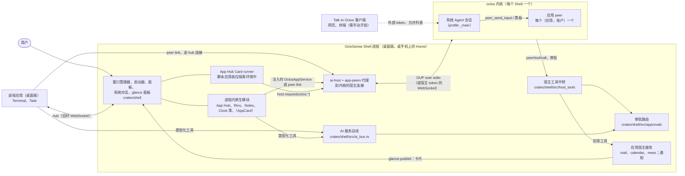
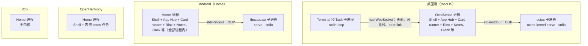
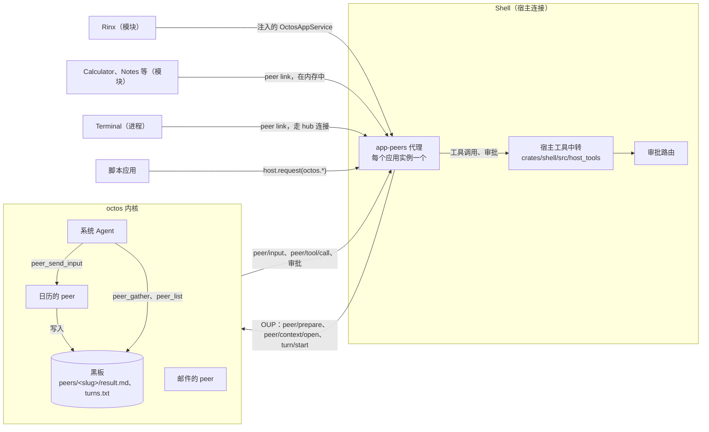
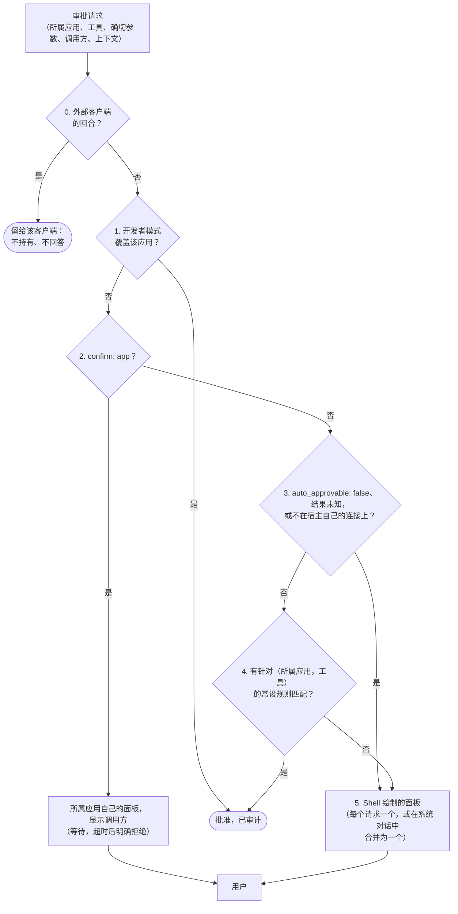
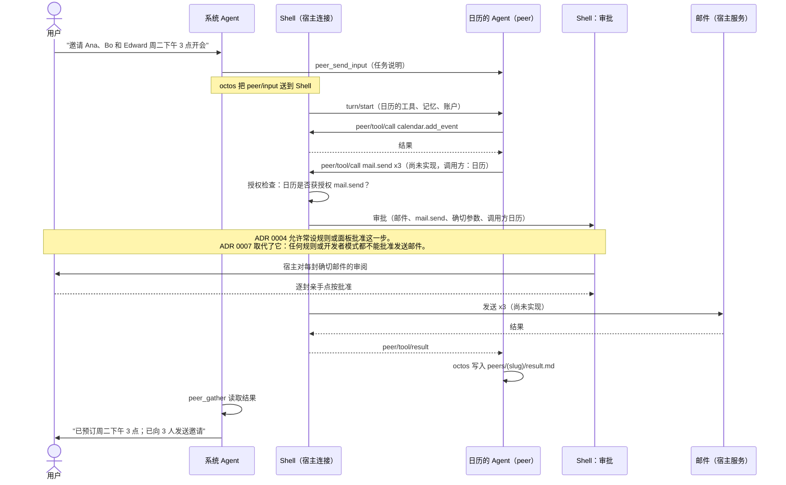

# OctoSense 架构

[English](architecture.md) | 简体中文

本文完整说明 OctoSense 是怎样构建的，并给出每个部分背后的代码。阅读前请先了解 README 的[关键概念](../README.zh-CN.md#关键概念)和[整体如何运作](../README.zh-CN.md#整体如何运作)。各类应用能调用什么、如何在本地运行 AI 服务，见 [ai-services.zh-CN.md](ai-services.zh-CN.md)；想按顺序读源码，请看[代码导读](architecture-walkthrough.zh-CN.md)。

背后的决策是以下 ADR：

- [ADR 0001](adr/0001-one-octosense-repository.md)（英文）：一个仓库
- [ADR 0002](adr/0002-event-driven-app-agents.md)（英文）：事件驱动的应用 Agent（Proposed，部分已实现）
- [ADR 0003](adr/0003-shared-octos-client-access.md)（英文）：Talk to Octos
- [ADR 0004](adr/0004-native-apps-hosting-and-peers.md)（英文）：原生应用、应用 Agent、跨应用协作与审批
- [ADR 0007](adr/0007-composable-mail-action-cards.zh-CN.md)：带草稿、对话和宿主审批发送的邮件卡片（进行中）
- [ADR 0010](adr/0010-shared-oauth-and-connected-apps.zh-CN.md)：共享 OAuth 与连接账户的应用（进行中；真实账户登录已在 macOS 上通过；GitHub 写入、Gmail 发信和设备验收待完成）

正文描述代码的现状；尚未实现的部分标为**尚未实现**或**规划中**。

## 目录

- [全局](#全局)
- [1. 各平台的进程](#1-各平台的进程)
- [2. Agent](#2-agent)
- [3. 通信](#3-通信)
- [4. 工具与授权](#4-工具与授权)
- [5. 审批](#5-审批)
- [6. 存储与机密](#6-存储与机密)
- [7. 信任边界与隔离](#7-信任边界与隔离)
- [8. 完整示例：用邮件发送会议邀请](#8-完整示例用邮件发送会议邀请)
- [代码与 ADR 不一致之处](#代码与-adr-不一致之处)
- [源码位置](#源码位置)

## 全局


<details><summary>文字版（Mermaid）</summary>



</details>

每个 Agent 都是同一个内核中的一个会话；Agent 对应用工具的每一次调用，和每一次审批一样，都要经过 Shell。[第 8 节](#8-完整示例用邮件发送会议邀请)会沿着第二张图里的那次调用走一遍。

## 1. 各平台的进程

### Shell

每台设备一个 Shell 进程：桌面端（`desktop/`，package `octosense`）或手机上的 Home（`phone/`，package `octosense-home`），两者都由 `crates/shell` 构建（[ADR 0001](adr/0001-one-octosense-repository.md)，英文）。它拥有窗口管理器、启动器、宿主面板、审批路由、应用存储，以及内核的宿主连接。

### octos 内核

内核是一项 Shell 服务，每个 Shell 至多一个，位于 [`crates/kernel`](../crates/kernel/README.zh-CN.md)（package `octosense-kernel`），通过 [`crates/ai-host`](../crates/ai-host/README.md) 访问。`launch::resolve`（`crates/kernel/src/launch.rs`）决定它如何运行：

| 平台 | 内核 |
| --- | --- |
| 桌面端（macOS；Windows 和 Linux 未经测试） | 子进程，`serve --stdio`：依次取 Shell 的 `Options::program`、`$OCTOS_APP_CORE_BIN`、Shell 旁随附的 `octos-kernel`（仅当其收据记录的正是锁定的 octos 版本时）。Shell 从不搜索 `PATH`。 |
| Android | 子进程：APK 中的 `liboctos.so serve --stdio`，由 [`tools/kernel-artifact.py`](../tools/kernel-artifact.py) 构建 |
| OpenHarmony | 进程内：`octos_cli::embedded::serve_io`，因为 HAP 不能 exec |
| iOS | 无 |

生命周期（`crates/kernel/src/lib.rs`、`kernel.rs`）：

- **按需启动。** 第一次 `connect()` 启动内核，之后的使用方加入同一代内核。新一代内核要等旧内核释放数据目录后才启动。
- **重启。** 提供方变化后，`llm` 宿主服务调用 `restart()`。所有连接以 `CloseReason::Restarted` 结束，使用方重新连接。
- **空闲停止。** Talk to Octos 关闭时，最后一个连接关闭，内核就停止。每个存活的代理都持有一个连接，所以只要有应用 Agent 已准备好，内核就一直运行。
- **退出与崩溃。** Shell 退出或崩溃时，内核会在 stdin 上读到 EOF。内核崩溃会以 `CloseReason::Exited` 结束所有连接，下一次 `connect()` 启动新的内核（见[内核崩溃意味着什么](#内核崩溃意味着什么)）。

### 原生应用：进程内还是独立进程

原生应用是经过审查的第一方 Rust crate，只在 [`native-apps.json`](../native-apps.json) 中声明。`tools/native_apps.py` 据此生成 `crates/shell/src/native_apps.rs` 和 Cargo 条目，CI 以 `--check` 运行它。

| 应用 | macOS、Windows | Linux | 手机 | 桌面端 / 手机构建（`shells`） | Agent |
| --- | --- | --- | --- | --- | --- |
| App Hub（商店、Card runner） | 模块 | 模块 | 模块 | default / default | peer link |
| Rinx | 模块 | 模块 | 模块 | default / default | 注入的服务 |
| Terminal | **进程** | 有 Vulkan 和 Wayland 时为**进程**，否则为模块 | 模块 | default / off | peer link；`terminal.run` 归系统 Agent |
| Calculator、Clock、Notes、Reminders、Weather | 模块 | 模块 | 模块 | default / default | peer link |
| Sheets、Reference | 模块 | 模块 | 模块 | opt-in / `mobile-apps` | – |
| Task（没有模块） | **进程** | **进程** | – | off / off；由桌面端应用目录启动 | – |
| AppCard | 模块 | 模块 | 模块 | opt-in / opt-in | 自己的内核连接 |

`AppRegistry::hosting`（`crates/shell/src/apps.rs`）在每次启动应用时做决定。在没有进程的构建中（原生移动端、wasm），每个链接的应用都是模块，App Hub 和 Settings 则始终是模块。其他情况下，链接的原生应用按它的条目托管（`manifest_default`），除非在 OctoSense 主目录下的 `wm/apps.splash` 中切换过，或用 `--module <id>` 指定。只有能从源码检出构建、或在 Shell 旁找到二进制时，它才作为进程运行。Task 没有模块，所以即使在没有 Vulkan 的 Linux 上也作为进程运行。

发布包只附带 `octosense` 和内核，所以在发布包中 Terminal 在进程内运行：它自己的 Agent 只有只读工具，系统 Agent 也拿不到 `terminal.run`；发布包中也没有 Task。**尚未实现：**在发布包中附带进程应用。Rinx 仍是模块；ADR 0004 §2 允许通过一次经审查的 `hosting` 修改把它改为进程。

**进程托管**（`crates/shell/src/clients.rs`、`hub.rs`）。在源码检出中，Shell 先从工作区构建应用，按其 `Cargo.lock` 锁定版本，且不在任何沙箱中；然后它自己在应用的沙箱中启动二进制，带上 `--stdin-loop`；已安装的 Shell 则启动自身旁边的二进制。子进程从 stdin 读取一次性密钥，凭它接入 Shell 的 hub：一个回环 WebSocket，端口是 8765–8784 中第一个空闲的端口。不在 `native-apps.json` 中的应用目录应用（Browser、Files 和其他上游 Makepad 应用）没有沙箱。进程应用意外退出时，它的磁贴保留，显示为已关闭并提供“重启”（`ClientSlot::stops_in_place`）。

**进程内托管**（`crates/shell/src/module_host.rs`）为每个模块实例提供独立的 Splash 隔离环境和存储命名空间，但模块的 Rust 代码与 Shell 共享内存。对模块的每次调用都在 `catch_unwind` 下运行（`contain`）。panic 会使该实例失败，把它进行中的工具调用答复为“结果未知”（只读调用除外），并显示“重启”。正在展开时再次 panic、`panic = "abort"` 构建以及 FFI 不在保护范围内。

### 脚本应用

系统应用和商店应用运行在 App Hub 的 Card runner（`CARD_MODULE`）中：每个实例一个隔离环境，带文件 jail 和配额，只能通过 `host.request` 访问已授权的服务族。`desktop/system-apps.json` 和 `phone/system-apps.json` 列出各个 Shell 的系统应用。



## 2. Agent

每个 Agent 都是同一个内核中的会话，而不是进程。README 介绍了[这两类 Agent](../README.zh-CN.md#系统-agent-与应用-agent)，并说明了它们[如何对应到线程](../README.zh-CN.md#为什么它省内存省算力)。

### 系统 Agent

系统 Agent 是会话 `_main:api:octosense#system`（`crates/kernel/src/network.rs` 中的 `SYSTEM_SESSION`）。用户在系统对话（`crates/shell/src/system_chat/`）中与它交谈；系统对话运行在自己的线程上，只在面板打开或有回合运行时才保持连接。

它的内核工具恰好是 `SYSTEM_AGENT_TOOLS`（`crates/kernel/src/system_tools.rs`）：四个 `peer_*` 工具、自己工作区里的文件、`ask_user_question` 和媒体查看、记忆、`web_search`、`web_fetch` 以及 `tool_search`。它永远拿不到 `peer_handoff`、`peer_close` 或 octos 自带的 shell（见[如何强制执行](#系统-agent-的工具集)）。

系统对话在这个会话上注册宿主工具（`system_chat/session.rs` 中的 `ShellSystemHost::declarations`）：

- `agents.list` 和 `agents.ask`（在 `crates/shell/src/agents.rs` 中声明）：始终提供。
- `agents.provision` 和 `agents.status`（同样在 `agents.rs` 中）：只供邮件使用，且只在带 App Hub 或原生移动端的构建中（见[邮件事件](mail-agent-events.zh-CN.md)）。
- `terminal.run`：Setup 中的 Command execution 打开、且 Terminal 作为沙箱进程运行时（`system_chat/grants.rs`，`terminal_target`）。
- 各原生应用的 `agent.system_tools`：本构建链接了该应用，或能把它作为进程启动时。应用没打开时，调用会回答 “Open &lt;App&gt; first”。

octos 只列出已准备好的 peer，所以其余情况由 Shell 告诉系统 Agent：应用的 Agent 一有变化，就在它的回合里附上一段说明；`agents.list` 给出每个应用的 Agent、它的状态和 peer slug。`agents.ask` 弹出首次使用面板，并一直挂起这次调用，直到用户作答；对脚本应用，还要等到 peer 准备好。系统 Agent 从不批准任何东西；`peer_respond` 只回答问题。

### 应用 Agent

应用 Agent 是宿主拥有的 octos peer，对应一个（应用，账户），归系统 Agent 的会话所有（octos UPCR-2026-034），由一个代理驱动（`crates/app-peers/src/broker.rs`）。它的记忆命名空间是 `app/<app>/acct-<tag>`，内核若不确认这个命名空间，代理就拒绝该内核。它的工作区是账户文件夹（见[第 6 节](#6-存储与机密)），宿主 token 保存在 `<core dir>/../app-peers` 下的一条记录中，在 Unix 上仅所有者可读写。每次 `peer/prepare` 和重新连接之后，代理都会注册它的工具；注册失败的 peer 不运行任何回合。

脚本应用的 peer 名为 `card.<app id>`（`crates/ai-host/src/contained.rs`）。不区分账户的应用以 `device` 身份行事；邮件以最近登录的账户行事，连接账户的应用以它当前的连接行事（见[已连接账户](#已连接账户)）。哪些应用有 Agent 由 `apps::agent_apps` 决定；没有任何授权的应用得不到代理。

- 脚本应用的 peer 在 Agent 获准时准备好，此后每次启动时（`agents::start`）也会准备，所以即使应用关着，`peer_list` 也能看到它。
- 原生应用的 peer 属于它已打开的实例。同时打开多个实例时，最早的那个驱动 peer，它关闭后由下一个接管（`driver_of`、`take_over`）。
- 退出登录会挂起该账户：它的上下文关闭，工具调用得到 `signed_out`，也不会启动 `peer/input` 回合。重新登录会恢复同一个 peer。

### 两条通道

系统 Agent 的通道是 peer 自己的会话。用户的通道是一个以 `share_history` 打开的请求上下文（`open_conversation`），每个句柄新开一个；用户的回合（来源 `person`）和应用自己发起的回合（来源 `app`）都在这里运行（见[一个应用 Agent，两条通道](../README.zh-CN.md#一个应用-agent两条通道)）。每个回合开始时，都会以只读方式看到另一条通道最近的文字：默认最近 20 条，总长不超过 16 KiB，另加对方正在运行的回合。

回合由什么触发，决定了审批如何对待它。“Ask” 面板发送 `ContextOp::TurnFrom { trigger: TurnTrigger::Person }`。不带触发来源的 `ContextOp::Turn` 算作 `Unknown`，信任度最低；脚本声称的 `trigger: "person"` 会变成 `AppSaysPerson`，中转把它当作应用自己的运行（`trigger_of`）。普通请求上下文（`open_context`，用于 Rinx 小程序）不共享历史，并被限制在 `contexts/<id>/` 中。

### “Ask &lt;app&gt;” 面板

Shell 为每个有 Agent 的应用绘制用户的通道（`crates/shell/src/app_chat/`），用的是系统对话的面板：桌面端在系统对话旁边，手机上全屏显示。

- **打开**需要 Agent 已获准（首次使用面板会先询问）；对原生应用，还需要应用已打开，因为它的 peer 属于它的窗口。
- **发送**开始一个用户回合，即使系统 Agent 的通道正在运行也可以；如果应用的 Agent 有未回答的问题，输入的文字就是回答。
- **停止**只结束用户的回合；“Stop the system agent's task” 结束另一条通道的回合。审批面板或问题卡片上的停止，以及在应用对话上调用 `octos.turn.interrupt`，会同时结束两条通道的回合。
- **问题**：来自应用对话的问题在面板打开时显示在面板中，否则显示在 Shell 的问题卡片上。
- **关闭**只隐藏面板，保留它的上下文，直到面板为另一个应用打开、Agent 被关闭，或 peer 消失。

### 内核崩溃意味着什么

所有 Agent 都在同一个内核里，所以一次崩溃会让它们全部在回合中途停下。Shell 和应用继续运行，应用看到助手不可用。断开的连接上的工具调用直接结束，不会执行。会话、黑板、记忆和 peer 绑定都保存在磁盘上，所以下一次 `connect()` 之后，代理会用保存的宿主 token 恢复各自的 peer。

## 3. 通信



### 内核与客户端之间的 OUP

OUP 是 JSON-RPC 2.0，`octos-ui/v1alpha1`（octos [`api/OCTOS_UI_PROTOCOL_V1_SPEC_2026-04-24.md`](https://github.com/octos-org/octos/blob/39e22d457c47df57d7c7c9fa64539979c9da93fd/api/OCTOS_UI_PROTOCOL_V1_SPEC_2026-04-24.md)）。默认情况下，它在子进程的 stdin 和 stdout 上每行一帧，Shell 中所有使用方共用这条流。`crates/kernel/src/router.rs` 为每个请求分配内核内唯一的 id，把每个回复只交给发出请求的使用方，并把每条通知发给提到过该会话的使用方。

**Talk to Octos**（[ADR 0003](adr/0003-shared-octos-client-access.md)，英文；octos [`docs/HOST_MANAGED_SERVE.md`](https://github.com/octos-org/octos/blob/39e22d457c47df57d7c7c9fa64539979c9da93fd/docs/HOST_MANAGED_SERVE.md)）在桌面端和 Android 上把内核重启为 `serve --host 127.0.0.1 --host-managed`；在 Unix 上，Shell 把一个只绑定一次的监听套接字传给它。两个 token 都通过内核的 stdin 传入，从不放进环境变量。

宿主 token 留在 Shell 中，可以访问一切。外部 token 交给已配对的网页客户端（凭一次性配对码），或同一用户的终端客户端（`client-connection.json`，在 Unix 上仅所有者可读写）。它只能打开 `/api/ui-protocol/ws`，以 `_main` 身份访问系统对话和客户端自己的回合：没有 `peer/*` 方法，碰不到应用 peer，只有 octos 固定的 `EXTERNAL_TURN_TOOLS`。

### 内核中的系统 Agent 与应用 Agent

octos 的 peer 工具（[`crates/octos-agent/src/tools/`](https://github.com/octos-org/octos/tree/39e22d457c47df57d7c7c9fa64539979c9da93fd/crates/octos-agent/src/tools)）只有一层：peer 不能创建、操纵或关闭另一个 peer。

- **发给应用 Agent：**`peer_send_input`，最多 64 KiB，只有 peer 的发起者能发。octos 把这一轮交给 Shell（见[下文](#shell-如何运行系统-agent-的输入)）。
- **回传：**黑板，peer 之间唯一的通道。每个 peer 回合都会写入 `peers/<slug>/result.md`，并在 `turns.txt` 中加一行，系统 Agent 用 `peer_gather` 和 `peer_list` 读取。
- **提问：**代理把每个 `ask_user_question` 交给 `crates/shell/src/questions/`，由它按回合的来源分发（见[提问](../README.zh-CN.md#提问)）。

### Shell 如何运行系统 Agent 的输入

octos 把系统 Agent 的输入以 `peer/input {peer, session_id, input_id, turn_id, text}` 的形式送到驱动该 peer 的连接上。代理用内核给出的回合 id 自己启动这一轮，所以这一轮带着应用的工具、记忆和审批（见[系统 Agent 如何与应用 Agent 通信](../README.zh-CN.md#系统-agent-如何与应用-agent-通信)）。

如果 Agent 未获准、账户已退出登录、工作区被拒绝，或这一轮启动失败，代理会回复 `peer/input/reject` 并说明原因（`ShellToolHost::admit_input`）。内核每个会话同时只运行一轮，也不排队，所以代理为每个 peer 维护一个系统 Agent 输入队列，逐个启动。已有 8 个在等待时，新的输入会以 `busy` 被拒绝。用户的通道从不在这个队列里等待。

### 应用与它自己的 Agent

应用从不直接使用 OUP，也看不到宿主 token；Shell 会在每次调用上标注应用的身份（见[应用如何使用自己的 Agent](../README.zh-CN.md#应用如何使用自己的-agent)）。共有三条路径：

| 路径 | 使用者 | 工作方式 |
| --- | --- | --- |
| Peer link（`crates/shell/src/peer_link/`） | App Hub、Calculator、Clock、Notes、Reminders、Weather、Terminal | Makepad 的 `OctosPeer` 客户端。进程应用的链接走它的 hub 连接。模块的 `OctosPeer::open` 先暂存一条内存中的通道，`module_host` 把它认领给打开它的实例，Shell 再以同样的帧提供服务（`peer_link::module_connected`）。`serve_tools` 应答 Agent 的工具调用。 |
| 注入的服务 | Rinx | 在模块 `create` 之前调用 `ai_host::offer`，在 `create` 中调用 `injection::claim`，实例由此得到一个限定范围的 `OctosAppService`（`open_conversation`、`open_context`）。 |
| `host.request("octos.*")` | 商店应用 | Card runner 的 `octos` 宿主服务（`crates/ai-host/src/contained.rs`）：只限 manifest 声明的服务，并需首次使用同意。 |

在 peer link 上，身份就是那个套接字或模块实例；一次调用的账户、上下文和客户端，来自 Shell 对该应用所开上下文的记录。进程退出时，它未完成的调用失败（除只读调用外均为 `outcome_unknown`），peer 保留。

Rinx 在其锁定的版本中，只把注入的服务用于小程序的上下文。用户通过 “Ask Rinx” 面板与它的 Agent 对话；Rinx 自己的助手工具在 AI 服务总线上，它的 Agent 不声明任何工具。脚本应用收不到推送事件：`octos.turn.start` 返回汇总后的回复，`octos.session.history` 返回按时间合并的两条通道（**尚未实现：**流式事件）。没有系统应用声明 `octos.*`；它们的 Agent 由 Shell 驱动。

### AI 服务总线

总线是 Makepad 的另一种 AI 模型：一个中心对话，即桌面端的 AI 面板（`aichat`），调用应用按风险级别注册的类型化工具。Shell 这一半（`crates/shell/src/ai_bus.rs`）给每个应用的帧标上它的端点，把注册转发给面板，路由面板的调用，自己应答 `os` 服务，并把 `confirm: host` 的调用留给审批路由决定。OctoSense 用它承载 AI 面板和 Rinx 的助手工具；当原生应用既没有执行器也没有 peer link 时，中转也经它调用该应用的工具；`terminal.run` 始终走总线。应用 Agent 不用总线：它不携带账户、上下文或调用方。

## 4. 工具与授权

manifest 声明，用户在安装时授权，Shell 在每次调用时强制执行（ADR 0004 §12）。脚本应用在 `tools.json` 中声明工具；原生应用在 `native-apps.json` 的条目中声明它的 Agent（`agent.octos`、`tools`、`own_tools`、`system_tools`、`grants`、`generic_tools`、`budget`、`tool_policy`）。其中大部分字段的含义见 README 的[应用要给 Agent 提供什么](../README.zh-CN.md#应用要给-agent-提供什么)。`tool_policy` 设定工具由谁确认：Terminal 的 `run` 是 `confirm: host` 且 `auto_approvable: false`，所以任何常设规则都不会替用户批准它。

| 来源 | 声明于 | 运行在 | 现状 |
| --- | --- | --- | --- |
| 应用自己的工具，`<app>.<tool>` | `tools.json`；`agent.tools` | 应用的宿主服务、通知服务、`host_method` 指定的共享服务，或应用的窗口 | `own_tools` 把 Terminal 的工具限定为两个只读工具；邮件的 Agent 能起草和提议回复，但没有能发送的工具 |
| octos 的内核工具 | `agent.tools` 中不带点的名称；`agent.generic_tools` | octos | 脚本应用只有 `ask_user_question`；Rinx 有文件、记忆和网页工具；其他原生 Agent 没有 |
| `files.list`、`files.read`、`files.search` | Shell，注册在已获同意、有工作区的 peer 上（Unix） | Shell，作用于调用方的账户文件夹 | 每次读取最多 128 KiB，每次列出最多 500 项，每次搜索最多 100 个匹配 |
| 其他应用可共享的工具 | `agent.tools` 中带点的名称；`agent.grants` | 所属应用，经中转 | 新闻共享 `news.list` 和 `news.read`；还没有应用申请 |
| 工具箱（`toolbox.*`、`workflow.*`） | `research` 和 `crawl` 能力 | Shell（[`crates/toolbox`](../crates/toolbox/README.md)），需 `toolbox-peers` feature，手机上默认开启 | 还没有应用声明 |
| `dev.run` | 开发者模式 | Shell（`host_tools/dev_run.rs`） | 仅限所覆盖的应用 |

应用的 `AGENT.md` 和技能不是工具：代理把它们的文字作为宿主指导随每一轮发送（`crates/app-peers/src/guidance.rs`）。

### 中转

中转（`crates/shell/src/host_tools/`）在 UI 线程上处理代理和系统对话送来的每一个 `peer/tool/call`：

1. **授权**，按（所属应用，工具）和调用方：应用自己的 Agent 可以调用自己的工具，其他应用的 Agent 只能调用授予它的工具（`Catalog::may_call`），系统 Agent 只能调用它的宿主工具。未获同意或账户已挂起时，调用会被拒绝。
2. **检查**参数（最多 64 KiB）是否符合 `input_schema`，并从调用方的预算中扣除：除非 `agent.budget` 另有规定，每轮 32 次、每天 1000 次。
3. **路由**到所属应用的执行器（`HostServiceExecutor`，或模块的 `set_tool_executor`）；没有执行器就走它的 peer link，再没有就走它的 AI 总线服务。应用同时在总线上提供的 `confirm: host` 工具不走 peer link。
4. **确认** `confirm: app` 调用：先向内核确认收到，再交给所属应用的面板（见[第 5 节](#5-审批)）。
5. **只回答一次**，结果要符合 `output_schema`（最多 256 KiB）；取消之后什么都不再运行。每次调用都会连同参数摘要记录到 `logs/tool-calls.jsonl`。

脚本应用中 `implemented_by: "host-service"` 的工具，以该应用的身份在其命名空间对应的宿主服务上运行，前提是应用获授了该服务族，或该服务族就是这个系统应用自己的。Shell 的 `NoticeService` 为相册、地图、YouTube 和相机应答 `<app>.notify`。**尚未实现：**`implemented_by: "app"` 没有执行器，调用这类工具会得到 `app_tool_unavailable`。

商店应用的工具也可以用 `host_method` 映射到共享服务，例如 Inbox Assistant 的 `inbox.message` 映射到 `gmail.message`。App Hub 只准入经审查的列表 `SHARED_HOST_METHODS` 中的方法：GitHub、Gmail 和 Google Calendar 的读取，Gmail 草稿编辑和新邮件事件处理，以及 `glance.*`。每个方法都要求声明对应服务族的能力和 `private_data: true`，风险等级也不能低于列表规定的等级。执行器只在应用获授该服务族时运行这个方法；对 `github`、`gmail` 和 `gcalendar`，它还会注入应用当前的连接（`host_tools/script_apps.rs`）。列表中没有任何方法会打开宿主面板，所以任何工具都不能登录、提交、保存日程或发送（见[已连接账户](#已连接账户)）。

### 系统 Agent 的工具集

每次启动内核之前，`enforce`（`crates/kernel/src/system_tools.rs`）都会写入 `_main` profile 的 `tool_policy`，对所有会话禁用 octos 的 shell（`group:runtime`）和 `peer_close`。它只替换 OctoSense 自己写的策略；写入失败时，内核不会启动。随后每次启动，都会用 octos 持久的、仅宿主可用的 `session/tool_list/set` 把系统会话的工具设为 `SYSTEM_AGENT_TOOLS`，这会限定该会话上的每一个回合；宿主工具注册在它旁边。应用 peer 只得到授予它的 `generic_tools`。

### Agent 往 glance 屏幕上放什么

glance 服务（`crates/shell/src/glance.rs`）以调用方应用的身份、在宿主记录的账户下发布每张卡片，而且只在应用有 `glance` 授权时才发布。一个应用每分钟最多发布 6 次。手机和桌面都能滚动浏览所有保留卡片，不再限制每应用四张卡片或信息流六行。保留负载的预算为每应用 8 MiB、合计 32 MiB；容量紧张时淘汰优先级较低的旧卡片，但保留新的有效发布；所属服务继续保存草稿和原邮件。`mail.publish_card` 还能把卡片绑定到邮件已保存的某份草稿上；绑定后的卡片不能再换到别的账户、邮件或草稿。

在 `main` 上，Agent 的工具调用若最终映射到 `glance.publish`（例如 Inbox Assistant 的 `inbox.notify`），必须指定应用已准入应用包中的模板并提供 `initial` 对象，或者提交合法的 L0 源码。可执行的 Splash（`script`）、L1 源码以及混合的参数都会被拒绝（`host_tools/script_apps.rs` 中的 `check_agent_publication`）。应用自己的界面仍可发布它经过审核的 Splash。`desktop-v0.1.0-beta.2` 没有这项检查，会接受 Agent 发布的 `script` 卡片。

在手机上，glance 列表只绘制紧凑的摘要，不运行任何生成的界面（`mobile_pages.rs`）。点按摘要会把它展开成常驻的全屏工作区（`glance_sheet.rs`），通知则直接打开它对应卡片的工作区；在桌面端，工作区居中打开。有 Agent 的发布者即使卡片没有声明 `sys.chat`，也会得到 Card / Chat 两个标签（`glance_card.rs` 中的 `WorkspaceChat`）；邮件的回复卡片则在同一份已保存的草稿上提供 Email / Chat。细节见[组合式邮件卡片](mail-composable-cards.zh-CN.md#所有发布者共用的卡片工作区)。卡片模板见 README 的[系统 Agent 如何与应用 Agent 通信](../README.zh-CN.md#系统-agent-如何与应用-agent-通信)，卡片自己的策略和卡内对话见[卡片与提问](../README.zh-CN.md#卡片与提问)。

### 已连接账户

商店应用不需要 OctoSense 账户，就能使用用户的 GitHub 或 Google 账户，或让用户登录应用自己的后端（[ADR 0010](adr/0010-shared-oauth-and-connected-apps.zh-CN.md)）。[`crates/oauth-service`](../crates/oauth-service/README.zh-CN.md) 实现了 OAuth 协议、GitHub、Google 和后端的适配器以及连接存储。`register_host_services`（`crates/shell/src/apps.rs`）注册它的四个宿主服务：`auth` 负责登录和应用的连接，`github`、`gmail`、`gcalendar` 提供 GitHub 和 Google 的数据。各服务的方法见该 crate 的 README。

- **声明。**应用声明 `auth`、它用到的每个数据服务族（`github`、`gmail`、`gcalendar`），以及 `storage.accounts: true`。只声明 `auth` 时，应用仍能让用户仅为确认身份而登录（GitHub 的 `read:user`；Google 的 `openid`、`email` 和 `profile`），但拿不到任何 GitHub 或 Google 数据：其他 scope 所属的服务族若未获授，宿主一律拒绝（`register_host_services`）。
- **身份。**应用只看到不透明的连接句柄。它的 peer 以它当前的连接行事（`app_storage/lifecycle.rs`），所以每个已连接账户都有自己的 Agent。
- **配置。**OAuth 客户端注册归宿主所有，从不由应用提供。发行方在构建时通过构建变量（例如 `OCTOSENSE_GITHUB_CLIENT_ID`）把注册编译进宿主（`crates/oauth-service/src/registration.rs`）；`desktop-v0.1.0-beta.2` 的下载包不含任何注册。运维者可以用 App Hub 宿主目录中的 `clients.json`（`<apps root>/.host/oauth/clients.json`，其中 `<apps root>` 即 `<octosense home>/apps`，见[第 6 节](#6-存储与机密)）替换整套注册；文件中没有列出的服务商随之停用。缺少某个服务商的注册时，登录会失败并提示“GitHub sign-in is unavailable in this build. Check for an OctoSense update or contact its distributor.”（Google 的提示相同，只是换成 Google）。在 beta.2 上，缺少 `clients.json` 时提示的则是“OAuth is not configured”。
- **应用自己的后端。**`auth.connect` 带上 `{"provider":"backend","scopes":["app.session"]}`，就能让用户登录应用自己的服务器；`auth.backend.me` 返回该服务器验证过的身份（`crates/oauth-service/src/host_backend.rs`）。后端只能由运维者在 `<apps root>/.host/oauth/backends.json` 中注册，应用包无法注册。在 macOS 和 Android 9 及以上版本上，服务器的登录页面显示在宿主拥有的 WebView 中；在 Windows 和 Linux 上，或在 macOS 上指定 `"presentation":"browser"` 时，改在浏览器中打开（见 `host.rs` 中的 `presentation`）。iOS 不支持后端登录。
- **事件。**新邮件到达时，`connected_events.rs` 启动已安装 Gmail 应用的 Agent（见[代码导读第 6 节](architecture-walkthrough.zh-CN.md#6-用户在哪里对话)）。

写入和发送都要经过宿主面板或审阅界面（见[第 5 节](#5-审批)），OAuth token 保存在平台的凭据库中（见[第 6 节](#6-存储与机密)）。

## 5. 审批

授权让 Agent 拥有某个工具；审批让这一次、带着这些确切参数的调用得以运行。读取和应用内操作获授权后即可运行；破坏性或对外的调用则需要用户，要么当场确认，要么由常设规则批准。只有用户能批准（ADR 0004 §8）。审批路由只管 Agent 的工具调用：用户在应用或其卡片中所做的事，是应用自己的操作。

审批路由（`crates/shell/src/approvals/router.rs`）按以下顺序决定：



0. **外部客户端的回合**交给该客户端；审批路由只发一条通知。
1. **开发者模式**批准所覆盖应用的一切，包括 `auto_approvable: false` 和 `confirm: app`，但只在宿主自己的连接上。
2. **`confirm: app`** 交给所属应用自己的面板，面板会显示调用方。没有注册面板的应用有 120 秒时间，之后调用被明确拒绝。
3. **总是交给用户：**`auto_approvable: false` 的工具（例如 Terminal 的命令）、结果未知的调用，以及不在宿主连接上的调用。
4. **常设规则**，按（所属应用，工具）匹配，不论调用方是谁。由收到的内容或未知来源触发的运行会跳过规则，除非某条规则明确纳入。
5. 否则由 **Shell 绘制的面板**列出所属应用、工具、确切参数和调用方应用（如有）。系统 Agent 为同一请求发起的审批可以合并到一个面板中。

**发送邮件**从不经过审批路由。邮件自己的写信界面（`mail.review_send`）和它的回复卡片，最终都进入同一个由宿主拥有的确切邮件审阅界面，由 Shell 绘制在卡片内（`crates/shell/src/mail_review.rs`）；邮件的 Agent 只能提议发送（`mail.propose_send`）。只有对审阅界面上 Approve & Send 控件的一次可信按下和释放才会发送，而且只有亲手点按才可信：Android 上触摸屏幕，macOS 上用鼠标或触控板点击。开发者模式和常设规则都不能授权发送，`mail.send` 只会回答 `approval_required`。流程见[组合式邮件卡片](mail-composable-cards.zh-CN.md)。

这种信任来自两个经审查的 Makepad 补丁（`tools/runtime-patches/`）：`makepad-trusted-user-input.patch` 针对 Android 触摸屏，`makepad-desktop-trusted-input.patch` 针对来自 HID 源、且不是由其他进程投递（post）的 macOS 指针事件。合成输入和远程输入都会被拒绝，在其分发过程中运行的原生回调也不例外。Windows 和 Linux 上的任何输入以及无障碍输入，都不能批准发送。macOS 路径**未验证**：还没有在 macOS 上实际发送过邮件。

**已连接账户的写入和发送**也不经过审批路由。GitHub 提交（`github.review_save`）或 Google Calendar 写入（`gcalendar.review_save`）会打开宿主对确切改动的审阅界面，只有其中的 Approve & Save 控件才能保存。Gmail 发信（`gmail.draft.review`）会打开宿主对确切回复的审阅界面，只有其中的 Approve & Send 控件才能发送。在 `main` 上，这三种审阅界面都是原生的（`crates/shell/src/connected_review.rs`），只接受可信的亲手点按（按下和释放都必须可信），每次批准只能用一次（`crates/oauth-service/src/host_api.rs`、`host_inbox.rs`）。`desktop-v0.1.0-beta.2` 只在 Gmail 发信时检查是否亲手点按；它的 GitHub 和 Calendar 保存使用宿主面板，不检查 Approve & Save 是怎样按下的。Agent 打不开其中任何一个界面：它的工具调用以 `may_prompt: false` 到达服务（`host_tools/script_apps.rs`）。哪些平台支持亲手点按、哪些已经验证，见 [OAuth 服务 README](../crates/oauth-service/README.zh-CN.md#当前交付边界) 中的平台表。

**常设规则**（`approvals/rules.rs`）可以要求收件人在联系人中或在本线程中、没有附件、由用户触发，或限定次数和金额；读不到所需事实的条件视为不满足。从面板创建的规则默认每天最多使用 20 次，“该应用的一切请求”这条最宽的规则最多持续 60 分钟，一次点按即可关闭所有规则。只有用户能创建规则。“收件人在联系人中”只有在用户允许后才使用邮件的数据（`approvals/contacts.rs`）。

**开发者模式**（`crates/shell/src/dev_mode.rs`）只能由用户打开：在设置中输入确认短语，或在手机上使用开发者选项手势；也可以在启动时使用 `OCTOSENSE_DEV_MODE` 或 `--dev-grant-all`。发布构建只接受该启动参数，商店构建永远不能打开。

它覆盖全部应用或用户选定的应用。不在开发者专用的主目录中时，它在 8 小时后或重启时结束。开启期间，Shell 显示横幅，把每次调用审计到 `logs/dev-audit.jsonl`，并给所覆盖应用的 peer 添加 `dev.run`。它永远不作用于外部客户端，也不能发送邮件。

**输入。**审批路由接收经中转送来的内核 `host_tool` 审批；应用 peer 或其上下文上的其他所有审批，作为该应用 Agent 的调用（应用只会收到 `approval/handled_by_host`）；系统对话的审批；以及 AI 面板对 `confirm: host` 工具的调用。

**时限。**Shell 持有的请求 10 分钟后过期：它被拒绝，绝不会被批准，并一直显示到用户关掉为止。如果 30 秒后这一轮仍在运行，代理会中断它。外部客户端的请求在 Shell 中永不过期。

**审计。**每个决定都是 `logs/approvals-audit.jsonl` 中的一行，记录的是参数摘要，而不是参数本身。

**首次使用同意**（`approvals/consent.rs`）展示 Agent 能读取和使用什么、模型在哪里运行。原生模块（`consent_for_module`）或脚本应用（`consent_for_contained`）要等用户允许后才能得到它的 Agent。

## 6. 存储与机密

每个应用都有一套由宿主拥有的目录布局，在其 manifest 的 `storage` 块中声明，只由 Shell 计算（`crates/shell/src/app_storage/`，ADR 0004 §11）：

```
<octosense home>/apps/<app id>/            应用的 jail（App Hub 的 jail 根目录；原生应用的沙箱根目录）
    accounts/<account hash>/               每个账户一个（应用不区分账户时为 "device"）：
                                            该账户的数据 = 该账户 Agent 的工作区
    common/                                不属于任何账户的应用数据
    cache/                                 可清除，不备份
<octosense home>/secrets/<app id>/         宿主拥有：token、密钥、密码、加密存储
```

- **OctoSense 主目录**在手机上是平台提供的应用数据目录，其他情况下是 `~/.octosense`（`crates/shell/src/octosense/paths.rs`）。路径中出现符号链接会被拒绝；在 Unix 上，这些目录的权限是 0700。
- **账户哈希**是对规范化后的账户 id 做带域分隔的 SHA-256，取其 128 位（`account_hash`）。每个账户文件夹都以它命名，所以修改它需要迁移。
- **`storage` 块**（`accounts`、`agent_workspace`、`max_bytes`、`cache_max_bytes`；原生应用另有 `external`）在启动时从 `native-apps.json` 读取，脚本应用则在安装和每次启动时从其 manifest 读取（`app_storage/lifecycle.rs`）。邮件声明了 `accounts: true`。
- **机密**从不放在 `apps/` 下（`app_storage/secrets.rs`）。macOS 和 iOS 把它们存入钥匙串；其他平台每个密钥一个文件，放在 `secrets/<app id>/` 中，在 Unix 上仅所有者可读写（0600）。脚本应用只能通过宿主服务和宿主面板接触自己的机密。
- **已连接账户的 OAuth token** 从不交给应用。macOS 和 iOS 上存入钥匙串，Android 上存成用 Android Keystore 密钥加密的文件，Windows 和 Linux 上存入系统凭据服务，没有明文回退（`crates/oauth-service/src/host.rs`）。连接元数据，以及运维者可选提供的 `clients.json` 和 `backends.json`，都位于 `<apps root>/.host/oauth/`。
- **启动检查**（`app_storage/check.rs`）拒绝本身是符号链接、或链接到机密、或包含机密的工作区，直到之后某次启动发现它已干净。不会删除任何东西。

Rinx（通过 `OctosAppService::set_account`）、邮件的宿主服务和 `auth` 服务会报告账户变化。删除账户会删除它的文件夹；卸载会删除应用的 jail、机密和钥匙串条目。然后 Shell 请 octos 对每个记录在案的 peer 执行 `peer/purge`（`crates/app-peers/src/purge.rs`），清除它的对话记录、记忆和黑板。该账户保持挂起（`secrets/.host/suspended.json`），直到再次添加，届时会得到一个新的 Agent。

内核的 core 目录在桌面端是 `~/.octosense/octos-home/.octos`，在手机上是 `<app data dir>/octos-home/.octos`（`crates/kernel/src/dirs.rs`），存放内核的 profile、会话、黑板和记忆。提供方密钥归 `llm` 宿主服务管理（见 [ai-services.zh-CN.md](ai-services.zh-CN.md#ai-providers-与-llm-宿主服务)）。**规划中：**Rinx 目前还不认领这套存储，之后会把数据移到 `apps/rinx/` 下（ADR 0004 §11）。

## 7. 信任边界与隔离

```
 用户 ── 宿主面板（密钥、PIN、审批）──┐
                                      v
 +------------------------ Shell 进程（可信） ------------------------------+
 |  持有：宿主 token、peer 宿主 token、提供方密钥（经 llm）、机密           |
 |  每次调用都检查：授权、同意、审批、预算、审计                            |
 |   +------------------+   +------------------------------------------+    |
 |   | 原生模块         |   | Card runner：脚本应用各在隔离环境中      |    |
 |   | 经审查，与 Shell |   | （jail、配额、按授权 host.request）      |    |
 |   | 共享内存：可信   |   +------------------------------------------+    |
 |   +------------------+                                                   |
 +-------|------------------------------------------|-----------------------+
         | hub（回环），每次启动一个密钥            | OUP，宿主 token
 +-------v----------+                      +--------v--------------------+
 | 进程应用         |                      | octos 内核                  |
 | （系统沙箱：     |                      |  每个 peer 的工作区围栏     |
 |  macOS、Linux）  |                      |  外部客户端：允许列表       |
 +------------------+                      +-----------------------------+
```

| 边界 | 由什么保证 |
| --- | --- |
| 脚本应用 ↔ Shell | Card runner 的隔离环境、jail 和配额；`host.request` 只能访问已授权的服务族 |
| 原生模块 ↔ Shell | 内存上没有隔离：靠对第一方代码的审查，以及模块边界的 panic 捕获 |
| 进程应用 ↔ Shell | 独立的地址空间和系统沙箱：macOS 上是 Seatbelt，Linux 上是 Landlock 和 seccomp。**尚未实现：**Windows。 |
| 应用 ↔ 内核 | 没有应用直接使用 OUP，也没有应用看得到宿主 token |
| peer ↔ peer | octos 为每个 peer 提供独立的工作区（拒绝重叠）、记忆命名空间和对话记录 |
| Agent ↔ 机密 | 机密在所有 jail 和工作区之外；启动检查 |
| Agent ↔ 邮件投递 | 没有任何 Agent 工具或生成的卡片能发送：只有用户在宿主的审阅界面上亲手点按批准确切的邮件后才发送；合成输入和远程输入都会被拒绝 |
| Agent ↔ 已连接账户 | 应用和它的 Agent 只持有连接句柄。没有任何工具能登录、提交、保存日程或发送：这些都需要宿主面板或审阅界面。在 `main` 上，批准其中任何一项都需要可信的亲手点按；在 `desktop-v0.1.0-beta.2` 上，只有 Gmail 发信需要 |
| 外部客户端 ↔ 内核 | 外部 token、方法与工具允许列表、`Host` 和 `Origin` 检查 |

**进程沙箱**（`crates/shell/src/sandbox/`）根据条目的 `sandbox` 和 `storage` 块构建。它封闭用户的主目录和各个卷，只开放应用的 jail、它的机密文件夹和经审查的 `external` 授权（例如 Terminal 的 `home:rw`），并让下一次构建要读取或运行的一切保持只读。`network: none` 只留下 hub 的端口，`processes: false` 禁止 fork 和 exec；应用只继承 Shell 环境变量中允许列表内的那些，从不包括密钥或 token。

**Shell 检查什么：**每次工具调用的检查就是中转的那份列表（见[第 4 节](#中转)）；脚本应用自己的 `octos.*` 调用则限定为确切的服务名、32 KiB 的文字和 2 MiB 的回复。**谁都无法检查的**，是原生应用在自己的工具里做了什么，或者它为什么发起一轮；对此靠审查，对进程应用还有沙箱。

## 8. 完整示例：用邮件发送会议邀请

这是 ADR 0004 对跨应用协作的最初设想：先调用日历已有的 `calendar.add_event`，再跨应用调用 `mail.send`。邮件这一半**尚未实现**，而且 ADR 0007 已经改变了它的批准方式：任何常设规则或开发者模式都不能批准发送邮件，每封邮件都需要用户在宿主的审阅界面上亲手点按（见[第 5 节](#5-审批)）。下图保留这个设想中的中转路径，并标出被 ADR 0007 取代的部分。邮件现在如何发送，见[组合式邮件卡片](mail-composable-cards.zh-CN.md)。



- 系统 Agent 遇到歧义会先问（“有两个 Edward？”），而不是去猜。如果日历的 Agent 还没获准，`agents.ask` 会先弹出首次使用面板。
- `calendar.add_event` 是 `act`，所以无需面板即可运行。桌面端和手机都附带日历。
- 授权会沿用现有机制：`mail.send` 作为日历 `agent.tools` 中一个带点的名称，在安装时授予。邮件并没有声明这个工具。
- ADR 0004 让审批路由决定每次发送，所以像“收件人都在我的联系人中”这样的常设规则可以批准它，否则每封邀请各有一个面板。ADR 0007 为邮件取代了这一做法：不论谁提议发送，最终都进入宿主对确切邮件的审阅（见[第 5 节](#5-审批)）。邮件的 Agent 只能提议发送（`mail.propose_send`）。
- 邮件的宿主服务用用户登录的账户发送；密码永远不会到达 Agent。它的 `mail.send` 方法现在只会回答 `approval_required`。
- 结果未知的发送绝不会自动重发；重试需要重新审阅并批准。
- **尚未实现：**日历的窗口还不能列出日程；`calendar.notify` 可以把日程放到 glance 屏幕上。

## 代码与 ADR 不一致之处

下面每一项都是一个 ADR 决定，而 HEAD 上的代码没有照做。

1. **声明了 `agent_workspace: "none"` 的原生 Agent 仍有工作区。**ADR 0004 §11 说这样的 Agent 不读取任何文件。但 `host_tools::agent_workspace_in` 会给每个拥有 `octos.*` 服务的原生应用分配账户文件夹作为 peer 的工作区，不管 `agent_workspace` 声明了什么；而 Shell 会在每个有工作区的 peer 上注册 `files.*`（Unix）。所以 App Hub、Calculator、Clock、Notes、Reminders、Weather 和 Terminal 都有一个文件夹和 `files.*`。这项声明只在两处起作用：脚本应用，以及用户的通道能否只读地查看该文件夹（`context_reads_account`）。
2. **旧 peer 与两种哈希。**ADR 0004 §11 让账户文件夹成为每个 peer 的工作区。记录中没有工作区的 peer，若 octos 接受，就以账户文件夹恢复，否则以内核当初分配的工作区恢复。文件夹名（SHA-256）和记忆标签（FNV-1a，`account_tag`）仍是对同一个规范化账户的两种哈希。
3. **平台密钥库中的应用机密。**ADR 0004 §11 要求在有系统钥匙串的平台上使用它。只有 macOS 和 iOS 用了钥匙串。Windows、Linux、Android 和 OpenHarmony 把每个密钥存成普通文件，除 Windows 外都仅所有者可读写（0600）。
4. **频率限制与后台策略。**ADR 0004 §3 把两者列为中转的检查项；中转只执行预算。
5. **事后控制。**ADR 0004 §8 承诺提供带撤销窗口的发送队列，并在审计中记录自动批准的参数。目前既没有队列也没有撤销，审计只保存参数摘要。
6. **按客户端的文件授权。**ADR 0004 §11 按应用的按客户端授权来收窄宿主读取工具；目前还没有 manifest 字段能声明这类授权。
7. **Rinx。**ADR 0004 §9 让 Rinx 的发送工具在它自己的 `confirm: app` 面板上确认，§11 把它的数据移到 `apps/rinx/` 下，§13 让开发者模式覆盖每个应用的面板。在其锁定的版本中，Rinx 不声明任何 Agent 工具，不向审批路由注册面板，仍使用自己的数据文件夹，而且在开发者模式下它的发送面板仍会询问。
8. **Windows 沙箱。**ADR 0004 §3 为 Windows 上的进程应用提供 AppContainer。它还没有实现，所以这些应用以用户的权限运行。系统 Agent 在 Windows 上拿不到 `terminal.run`，但其他调用方仍能向 Terminal 输入命令（第 11 条）。
9. **发布包中的进程应用。**ADR 0004 §2 要求附带它们的二进制；发布包只附带 `octosense` 和内核（`desktop/packaging/release.json`）。
10. **发送邮件。**ADR 0004 §8 允许常设规则回答 `mail.send` 这类对外调用，§13 允许开发者模式覆盖所有审批。代码遵循的是 ADR 0007：不论常设规则或开发者模式怎么说，发送邮件都需要用户在宿主的审阅界面上亲手点按；ADR 0004 没有提到这个例外。
11. **只有系统 Agent 的 `terminal.run` 检查沙箱。**ADR 0004 §10 只允许 Terminal 的 AI 在 Terminal 作为独立的沙箱进程运行时输入命令。系统 Agent 的 `terminal.run` 会检查这一点（`sandbox::launch_sandboxed`），其他路径都不检查。进程形式的 Terminal 无论沙箱是否生效，都会把自己的 `run` 提供给桌面端的 AI 面板；在开发者模式下，宿主工具中转还会把 `terminal.run` 授予所覆盖的每个应用 Agent。所以在还没有沙箱的 Windows 上，AI 面板能经审批路由向没有沙箱的 Terminal 输入命令，开发者模式下这些 Agent 也能。发布包里没有 AI 面板。进程内的 Terminal 符合 ADR，因为 Shell 公布的是它模块自带的只读 manifest。`crates/shell/src/module_host.rs` 中的 `host_executor` 换上了一个也能执行 `run` 的执行器，但没有调用会把 `run` 发给它：AI 面板只调用 manifest 声明过的工具，Shell 自己的调用（`AiBus::shell_call`）也按同一份 manifest 检查。

## 源码位置

| 内容 | 位置 |
| --- | --- |
| 原生应用清单、生成器、生成的表 | [`native-apps.json`](../native-apps.json)、[`tools/native_apps.py`](../tools/native_apps.py)、[`crates/shell/src/native_apps.rs`](../crates/shell/src/native_apps.rs) |
| 托管方式、宿主服务、哪些应用有 Agent | [`crates/shell/src/apps.rs`](../crates/shell/src/apps.rs) |
| 进程应用、hub、沙箱 | [`crates/shell/src/clients.rs`](../crates/shell/src/clients.rs)、[`hub.rs`](../crates/shell/src/hub.rs)、[`sandbox/`](../crates/shell/src/sandbox/mod.rs) |
| 进程内模块、panic 捕获 | [`crates/shell/src/module_host.rs`](../crates/shell/src/module_host.rs) |
| 内核服务、Talk to Octos、帧路由、系统 Agent 的工具 | [`crates/kernel/src/`](../crates/kernel/README.zh-CN.md)（`launch.rs`、`lib.rs`、`kernel.rs`、`dirs.rs`、`network.rs`、`router.rs`、`system_tools.rs`） |
| Shell 的 AI 入口；脚本应用的 `octos` 服务；模块的 peer link | [`crates/ai-host/src/`](../crates/ai-host/README.md)（`lib.rs`、`contained.rs`、`module_peer.rs`） |
| 应用 peer：契约、代理、启动、注入、指导、清除 | [`crates/app-peers/src/`](../crates/app-peers/README.md) |
| 系统 Agent 的宿主工具；邮件的事件 | [`crates/shell/src/agents.rs`](../crates/shell/src/agents.rs)、[`agent_events.rs`](../crates/shell/src/agent_events.rs)、[`system_chat/grants.rs`](../crates/shell/src/system_chat/grants.rs) |
| 已连接账户：OAuth 以及 `auth`、`github`、`gmail`、`gcalendar` 服务；已安装应用的 Gmail 事件，以及保存和发信的原生审阅界面 | [`crates/oauth-service/`](../crates/oauth-service/README.zh-CN.md)、[`crates/shell/src/connected_events.rs`](../crates/shell/src/connected_events.rs)、[`connected_review.rs`](../crates/shell/src/connected_review.rs) |
| 系统对话和 “Ask &lt;app&gt;” 面板 | [`crates/shell/src/system_chat/`](../crates/shell/src/system_chat/mod.rs)、[`app_chat/`](../crates/shell/src/app_chat/mod.rs) |
| peer link | [`crates/shell/src/peer_link/`](../crates/shell/src/peer_link/mod.rs) |
| 宿主工具中转、执行器、宿主读取工具、`dev.run`、工具箱 | [`crates/shell/src/host_tools/`](../crates/shell/src/host_tools/mod.rs)、[`crates/toolbox`](../crates/toolbox/README.md) |
| AI 服务总线 | [`crates/shell/src/ai_bus.rs`](../crates/shell/src/ai_bus.rs) |
| Agent 的提问 | [`crates/shell/src/questions/`](../crates/shell/src/questions/mod.rs) |
| 审批、同意、联系人、审计 | [`crates/shell/src/approvals/`](../crates/shell/src/approvals/mod.rs) |
| 开发者模式 | [`crates/shell/src/dev_mode.rs`](../crates/shell/src/dev_mode.rs) |
| 应用存储、机密、启动检查、账户 | [`crates/shell/src/app_storage/`](../crates/shell/src/app_storage/mod.rs) |
| glance 卡片和卡内对话 | [`crates/shell/src/glance.rs`](../crates/shell/src/glance.rs)、[`glance_notice.rs`](../crates/shell/src/glance_notice.rs)、[`glance_card.rs`](../crates/shell/src/glance_card.rs)、[`crates/l0-chat`](../crates/l0-chat/README.zh-CN.md) |
| 系统应用及其工具和宿主服务 | [`desktop/system-apps.json`](../desktop/system-apps.json)、[`phone/system-apps.json`](../phone/system-apps.json)、`apps/<app>/bundle/tools.json`、`apps/<app>/host-service/` |

本仓库之外的代码，按 `Cargo.toml` 锁定的版本：

| 内容 | 位置 |
| --- | --- |
| Makepad：`OctosPeer` 客户端；各原生应用的 Agent 代码 | [`libs/ai/services/src/peer.rs`](https://github.com/OctoSense-org/makepad/blob/32d6415fb7476345ad36ee4f98d6f844d1f07fd2/libs/ai/services/src/peer.rs)、`apps/<app>/src/view.rs` |
| Terminal 自己的 Agent 链接（Makepad #100） | [`apps/terminal/src/module.rs`](https://github.com/OctoSense-org/makepad/blob/32d6415fb7476345ad36ee4f98d6f844d1f07fd2/apps/terminal/src/module.rs) |
| octos：两条通道的共享历史（20 条，16 KiB）；`peer_send_input`（64 KiB） | [`crates/octos-cli/src/peers/shared_history.rs`](https://github.com/octos-org/octos/blob/39e22d457c47df57d7c7c9fa64539979c9da93fd/crates/octos-cli/src/peers/shared_history.rs)、[`crates/octos-agent/src/tools/peer_send_input.rs`](https://github.com/octos-org/octos/blob/39e22d457c47df57d7c7c9fa64539979c9da93fd/crates/octos-agent/src/tools/peer_send_input.rs) |
| octos：宿主管理的 serve、应用 peer、peer 宿主工具 | [`docs/HOST_MANAGED_SERVE.md`](https://github.com/octos-org/octos/blob/39e22d457c47df57d7c7c9fa64539979c9da93fd/docs/HOST_MANAGED_SERVE.md)、[UPCR-2026-034](https://github.com/octos-org/octos/blob/39e22d457c47df57d7c7c9fa64539979c9da93fd/docs/OCTOS_UI_PROTOCOL_CHANGE_REQUEST_UPCR_2026_034_HOST_APP_PEERS.md)、[UPCR-2026-035](https://github.com/octos-org/octos/blob/39e22d457c47df57d7c7c9fa64539979c9da93fd/docs/OCTOS_UI_PROTOCOL_CHANGE_REQUEST_UPCR_2026_035_PEER_HOST_TOOLS.md)、[UPCR-2026-036](https://github.com/octos-org/octos/blob/39e22d457c47df57d7c7c9fa64539979c9da93fd/docs/OCTOS_UI_PROTOCOL_CHANGE_REQUEST_UPCR_2026_036_HOST_MANAGED_SERVE.md) |
| App Hub：脚本应用可以保留的内核工具（`KERNEL_TOOLS`） | [`crates/app-policy/src/policy.rs`](https://github.com/OctoSense-org/OctoSense-App-Hub/blob/d2ca3a30ce06b0b1390cff305520962731baa1f8/crates/app-policy/src/policy.rs) |
| App Hub：工具可以映射到的共享服务方法（`SHARED_HOST_METHODS`） | [`crates/app-policy/src/agent.rs`](https://github.com/OctoSense-org/OctoSense-App-Hub/blob/d2ca3a30ce06b0b1390cff305520962731baa1f8/crates/app-policy/src/agent.rs) |
| App Hub：自身 Agent 的只读工具 | [`crates/app-hub-app/src/ai.rs`](https://github.com/OctoSense-org/OctoSense-App-Hub/blob/d2ca3a30ce06b0b1390cff305520962731baa1f8/crates/app-hub-app/src/ai.rs) |
