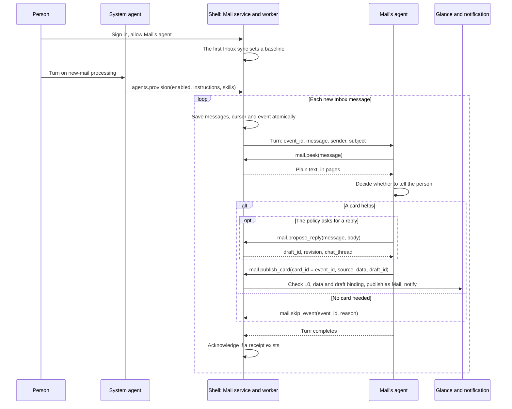

# Mail events and the app agent

English | [简体中文](mail-agent-events.zh-CN.md)

Mail's agent handles new mail without being asked. The shell syncs the Inbox independently of model turns, queues each new message as an event and starts a turn of Mail's agent, which reads the message and either posts a glance card, with a reply draft if the person's policy asks for one, or records why not. [Key concepts](../README.md#key-concepts) explains agents, lanes and cards.

## Turning it on

The person signs in to Mail on the shell's sheet, allows Mail's agent and asks the system agent to turn on new-mail processing. The system agent calls `agents.provision` with `enabled`, `instructions`, named `skills` text and an optional `poll_interval_secs` (30 to 3600 seconds, default 60). It cannot name an account: the shell binds the provision to the signed-in one and keeps it outside the agent's folder. Its instructions are appended to Mail's admitted `AGENT.md`, and a skill named like an admitted one replaces that skill's text; neither grants a tool. `enabled: false` turns processing off, and `agents.status` reports the settings, the queue and the last outcome.

Mail passwords and provider keys stay with the shell, but the mail the agent reads goes to the person's model provider.

## From new mail to a turn

Two threads run in the shell process: `incoming-mail-collector` syncs the Inbox, while `incoming-mail-agent` delivers queued events serially. The first sync of an account's Inbox only sets a baseline and queues nothing, as does a sync after an IMAP server renumbers the folder. After that, every Inbox sync (the worker's, the Mail window's or the agent's `mail.sync`) turns each new message into a pending event with a stable id. Messages, server cursor and events are saved in one atomic write and survive restarts.

The collector waits the configured poll interval after each fetch, even when events are pending or a model turn is running or failing. Delivery chooses the earliest eligible event, preserving queue order when deadlines tie. Each failed event gets its own retry delay: 30 seconds, doubling up to 15 minutes. Other eligible events can run during that delay, and a due retry cannot repeatedly jump ahead of older waiting work. Retry timers reset on process restart or a policy change; the durable events remain.

Each turn runs in the person's lane as the app's own (trigger `incoming`) and has 180 seconds. After an attempt, delivery waits one second before selecting another eligible event; collection has its own poll interval. A slow turn can delay other turns, but does not stop collection. Mail still serializes access to its store during a fetch; the UI status and delivery queue checks use a nonblocking lock.

`agents.status.runtime` separates collection from delivery: `last_poll_at` records the latest completed fetch attempt, `last_collection_success_at` the latest successful fetch, and `last_success_at` a successfully acknowledged event. `last_collection_error` and `last_delivery_error` clear only when their own stage succeeds. A successful fetch therefore does not hide a failed model turn. `last_receipt` is the most recent outcome from either thread.

## What the agent decides

Syncing and assessing mail do not themselves notify the person. The system agent can provision a selective policy: read the message, then notify only for personally relevant healthcare, shipping, schedules, school/work or family matters with an action, deadline or meaningful change. Routine automated alerts, newsletters and no-action updates should use `mail.skip_event`; a plain-notice fallback must obey the same importance gate. These are model instructions, not a deterministic host classifier.

The turn carries the event's ids, sender and subject as untrusted JSON, with Mail's guidance in a separate block. The triage skill has the agent read the message and settle the event:

| Tool | Use |
| --- | --- |
| `mail.peek` | Reads the message as plain text, up to 2,000 bytes a page, without marking it read. |
| `mail.propose_reply` | If the policy asks for a reply: creates or reuses a draft for the email, addressed by the host, and returns its `draft_id`. |
| `mail.publish_card` | Publishes a card the model wrote, with the event id as `card_id` and, for a reply, the `draft_id`. |
| `mail.notify` | The fallback when no valid card can be made: a plain notice, same `card_id`. |
| `mail.skip_event` | Records `no_action`, `duplicate` or `outside_policy`. |

The shell binds every Mail tool call to the signed-in account; that binding and the tool grants, not the guidance, limit the agent. No agent tool sends mail: `mail.propose_send` only prepares a proposal, and only the host's review, approved by a physical touch on an Android phone, authorizes SMTP, even in developer mode or under a standing rule.

## When an event is done

The worker acknowledges an event, removing it from the queue, only if the turn completed, the agent is still allowed for the same account, the provision is unchanged, and Mail's host service holds a receipt for that event id: a publication or a skip. Creating a draft is not one. If a fetch holds the mailbox lock after a successful turn, the worker retries the acknowledgement within the same deadline without asking the model again; consent and policy checks still apply. A final answer after a failed tool call leaves no receipt, so the event is retried. Turning processing off or withdrawing the agent closes the running turn within 250 ms and leaves its event pending.

Delivery is at least once: a failure between publishing and saving the receipt repeats the notification, but the same card id replaces any card still shown. An identical retry reuses the receipt silently; a corrected card republishes under the same id.

## Cards

A card from `mail.publish_card` is L0 only, with no expressions or script. The shell checks that each `sys.dataset` source declares a nonempty `fields` list with a value in `data` for every field, and that sources form no cycle. The check catches missing bindings, not wrong facts. The shell then publishes the card as Mail and notifies; tapping the notification opens that exact card, which the phone shows as a full-screen workspace.

With a `draft_id`, Mail's host service binds the card to the account, email, draft and chat thread, a binding the model can neither supply nor change. The card can then edit the reply (`sys.mail_draft`), chat about it (`sys.chat`) and open the host's review (`sys.mail_review`). [Composed Mail cards](mail-composable-cards.md#follow-one-reply-through-the-code) follows a reply from draft to SMTP.

The system agent's provision distinguishes automatic drafts from **Compose
reply**. Replyable important mail can include a draft immediately; automated or
no-reply mail can remain informational until the person taps Compose reply.
The host adds that action to incoming-email cards, resolves their original
message from the account's durable publication and message cache off the UI
thread, and asks the Mail agent to draft and republish the same card with
`draft_id` and `notify:false`. No generated data can supply the source identity.
A missing source produces an error instead of choosing another email.

Without `draft_id`, the card has generic Card/Chat and cannot edit a Mail draft.
After the agent attaches the draft, the host initializes the native Email/Chat
workspace in place, preserving unsubmitted chat input. The generated summary
should not duplicate those tabs or the composer. Mail chat also receives the
card id and current source/data when they fit its context budget, so the agent
can repair the publication without searching unrelated workspace files. Automated/no-reply messages
need a recipient warning; never invent an alternative address. A Compose reply
request authorizes draft creation only. Sending always requires physical host
approval. Older event cards use the same action if their original cached email
and publication receipt are still available.

Other mail that needs action gets working `Chip` buttons that switch local views (`state`, `event`, `when`), such as Show code, Details and Back. They only change what the card shows, and their labels must not claim to send, book or track. [`mail-shipping.card`](../crates/shell/resources/glance/mail-shipping.card) and [`mail-request.card`](../crates/shell/resources/glance/mail-request.card) show the syntax; their send, track and done states are demos.

## Limits

- On Android, an enabled, consented Mail account also registers a persisted, network-constrained JobScheduler job: a 15-minute period with a 5-minute flex window. Android may delay it for Doze, quotas or connectivity; this is periodic polling, not push. Force-stop prevents jobs until the person opens the app again. A job starts the same Rust host without an Activity, runs for at most four minutes, and can be stopped earlier by Android. No foreground-service status notification is used. See [ADR 0008](adr/0008-quiet-android-mail-jobs.md).
- Android keeps a bounded private outbox for Mail publications. Only cards published with `notify: true` produce native Android notifications, after the model applies the provisioned importance policy. Notification permission and channel settings still apply. Tapping a notification restores the original, validated card for its original active account; it cannot approve a reply. Draft-bound cards still read the authoritative saved draft. Other apps' cards remain in memory unless they have their own persistence.
- Mail keeps at most four live cards. A fifth card or notice is refused, and unless the agent skips that event, it remains pending and retries until a card is dismissed or expires (after 24 hours by default). Other events can still be assessed and skipped.
- Events queue even while processing is off, and only the worker removes them. Once 128 are waiting, every Inbox sync that finds new mail fails without moving the cursor, the Mail window's included, until processing drains the queue.
- Not yet: events for other apps, scheduled triggers, per-app model choice, kernel-native skills, the budget and Settings UI of [ADR 0002](adr/0002-event-driven-app-agents.md), and remote actions other than replying (the shell has no `sys.link` handler).

## Reading the code

1. [`incoming.rs`](../apps/mail/host-service/src/incoming.rs): the queue (`collect`, `skip_event`, `resolve_and_ack_try`) and the publication receipts (`publish_revision`, `publish_once`).
2. [`agent_events.rs`](../crates/shell/src/agent_events.rs): `provision`, `status` and the collector and delivery worker (`collector`, `worker`, `EventSchedule`, `process_event`, `deliver`).
3. [`script_apps.rs`](../crates/shell/src/host_tools/script_apps.rs): admitted guidance (`guidance`) and account binding (`scoped_args`).
4. [`guidance.rs`](../crates/app-peers/src/guidance.rs): the per-turn guidance, at most 16 KiB.
5. [`glance.rs`](../crates/shell/src/glance.rs): `publish_mail_l0_for` and `check_generated_data`.
6. [`mail_card.rs`](../crates/shell/src/mail_card.rs): a bound card's sources (`check_sources`); its `persistence.rs` restores bound cards.
7. [`mail_background.rs`](../crates/shell/src/mail_background.rs): execution leases, private outbox, account/expiry checks and notification restoration.
8. [`android_mail.rs`](../phone/src/android_mail.rs) and [`MailJobService.java`](../phone/resources/android/java/dev/makepad/octosense/MailJobService.java): headless JNI entry, bounded OS job and notification navigation. [`runtime_host.rs`](../crates/shell/src/runtime_host.rs) initializes shared services once; no second kernel or peer is created.

## How it was tested

On a OnePlus 6, with DeepSeek and MiniMax: the [new-mail test](testing/mail-events-2026-10-04.md) and the [card-button test](testing/mail-card-actions-2026-10-04.md). [Composed Mail cards](mail-composable-cards.md) records the reply-card checks.
