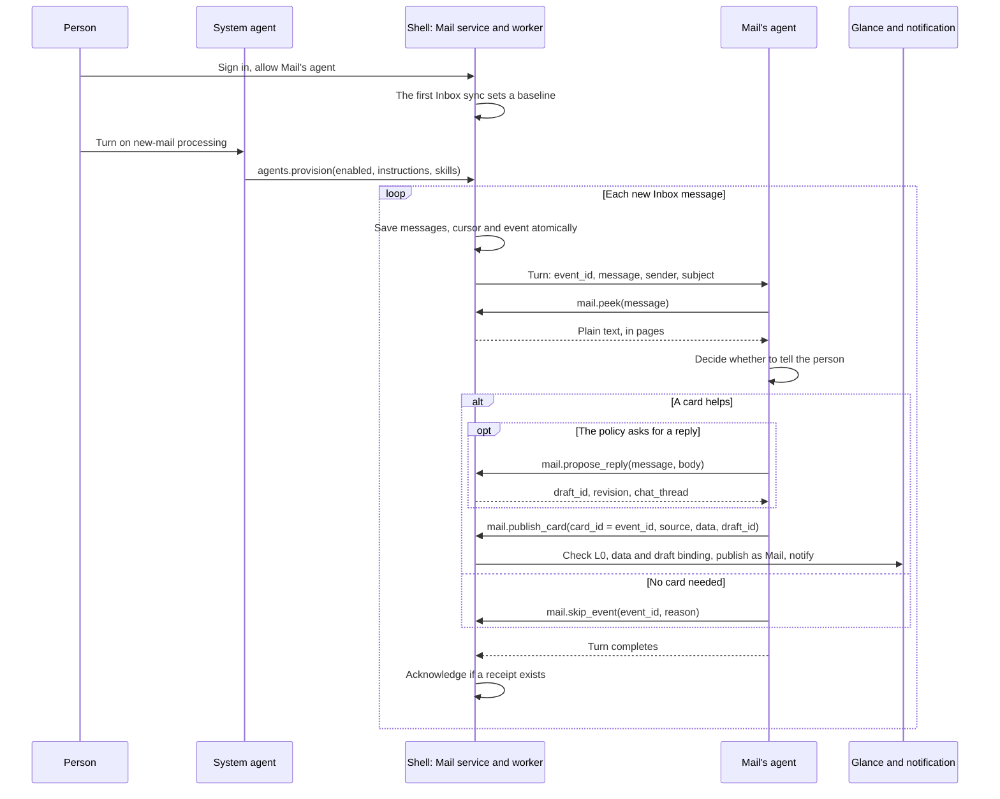

# Mail events and the app agent

English | [简体中文](mail-agent-events.zh-CN.md)

Mail's agent handles new mail without being asked. A worker in the shell syncs the Inbox, queues each new message as an event and starts a turn of Mail's agent, which reads the message and either posts a glance card, with a reply draft if the person's policy asks for one, or records why not. [Key concepts](../README.md#key-concepts) explains agents, lanes and cards.

## Turning it on

The person signs in to Mail on the shell's sheet, allows Mail's agent and asks the system agent to turn on new-mail processing. The system agent calls `agents.provision` with `enabled`, `instructions`, named `skills` text and an optional `poll_interval_secs` (30 to 3600 seconds, default 60). It cannot name an account: the shell binds the provision to the signed-in one and keeps it outside the agent's folder. Its instructions are appended to Mail's admitted `AGENT.md`, and a skill named like an admitted one replaces that skill's text; neither grants a tool. `enabled: false` turns processing off, and `agents.status` reports the settings, the queue and the last outcome.

Mail passwords and provider keys stay with the shell, but the mail the agent reads goes to the person's model provider.

## From new mail to a turn

The worker is one thread in the shell process. The first sync of an account's Inbox only sets a baseline and queues nothing, as does a sync after an IMAP server renumbers the folder. After that, every Inbox sync (the worker's, the Mail window's or the agent's `mail.sync`) turns each new message into a pending event with a stable id. Messages, server cursor and events are saved in one atomic write and survive restarts.

Each cycle takes the oldest event, syncing first when none is waiting. Its turn runs in the person's lane as the app's own (trigger `incoming`) and has 180 seconds. The worker then waits the poll interval or, after a failure, 30 seconds, doubling up to 15 minutes.

## What the agent decides

The turn carries the event's ids, sender and subject as untrusted JSON, with Mail's guidance in a separate block. The triage skill has the agent read the message and settle the event:

| Tool | Use |
| --- | --- |
| `mail.peek` | Reads the message as plain text, up to 2,000 bytes a page, without marking it read. |
| `mail.propose_reply` | If the policy asks for a reply: creates or reuses a draft for the email, addressed by the host, and returns its `draft_id`. |
| `mail.publish_card` | Publishes a card the model wrote, with the event id as `card_id` and, for a reply, the `draft_id`. |
| `mail.notify` | The fallback when no valid card can be made: a plain notice, same `card_id`. |
| `mail.skip_event` | Records `no_action`, `duplicate` or `outside_policy`. |

The shell binds every Mail tool call to the signed-in account; that binding and the tool grants, not the guidance, limit the agent. No agent tool sends mail: `mail.propose_send` only prepares a proposal, and only the host's review, approved by a physical touch on an Android phone, authorizes SMTP, even in developer mode or under a standing rule.

## When an event is done

The worker acknowledges an event, removing it from the queue, only if the turn completed, the agent is still allowed for the same account, the provision is unchanged, and Mail's host service holds a receipt for that event id: a publication or a skip. Creating a draft is not one. A final answer after a failed tool call leaves no receipt, so the event is retried. Turning processing off or withdrawing the agent closes the running turn within 250 ms and leaves its event pending.

Delivery is at least once: a failure between publishing and saving the receipt repeats the notification, but the same card id replaces any card still shown. An identical retry reuses the receipt silently; a corrected card republishes under the same id.

## Cards

A card from `mail.publish_card` is L0 only, with no expressions or script. The shell checks that each `sys.dataset` source declares a nonempty `fields` list with a value in `data` for every field, and that sources form no cycle. The check catches missing bindings, not wrong facts. The shell then publishes the card as Mail and notifies; tapping the notification opens that exact card, which the phone shows as a full-screen workspace.

With a `draft_id`, Mail's host service binds the card to the account, email, draft and chat thread, a binding the model can neither supply nor change. The card can then edit the reply (`sys.mail_draft`), chat about it (`sys.chat`) and open the host's review (`sys.mail_review`). [Composed Mail cards](mail-composable-cards.md#follow-one-reply-through-the-code) follows a reply from draft to SMTP.

Other mail that needs action gets working `Chip` buttons that switch local views (`state`, `event`, `when`), such as Show code, Details and Back. They only change what the card shows, and their labels must not claim to send, book or track. [`mail-shipping.card`](../crates/shell/resources/glance/mail-shipping.card) and [`mail-request.card`](../crates/shell/resources/glance/mail-request.card) show the syntax; their send, track and done states are demos.

## Limits

- The Mail window may be closed, but nothing runs while Android suspends or kills OctoSense, and notifications appear in OctoSense's own shade, not Android's.
- Glance cards live in memory, so a restart removes them, except draft-bound Mail cards, which the shell restores for the signed-in account without a new notification.
- Mail keeps at most four live cards. A fifth card or notice is refused, and unless the agent skips that event, it stays first in the queue until a card is dismissed or expires (after 24 hours by default).
- Events queue even while processing is off, and only the worker removes them. Once 128 are waiting, every Inbox sync that finds new mail fails without moving the cursor, the Mail window's included, until processing drains the queue.
- Not yet: events for other apps, scheduled triggers, per-app model choice, kernel-native skills, the budget and Settings UI of [ADR 0002](adr/0002-event-driven-app-agents.md), and remote actions other than replying (the shell has no `sys.link` handler).

## Reading the code

1. [`incoming.rs`](../apps/mail/host-service/src/incoming.rs): the queue (`collect`, `skip_event`, `resolve_and_ack_try`) and the publication receipts (`publish_revision`, `publish_once`).
2. [`agent_events.rs`](../crates/shell/src/agent_events.rs): `provision`, `status` and the worker (`poll`, `deliver`).
3. [`script_apps.rs`](../crates/shell/src/host_tools/script_apps.rs): admitted guidance (`guidance`) and account binding (`scoped_args`).
4. [`guidance.rs`](../crates/app-peers/src/guidance.rs): the per-turn guidance, at most 16 KiB.
5. [`glance.rs`](../crates/shell/src/glance.rs): `publish_mail_l0_for` and `check_generated_data`.
6. [`mail_card.rs`](../crates/shell/src/mail_card.rs): a bound card's sources (`check_sources`); its `persistence.rs` restores bound cards.
7. [`mobile_app.rs`](../crates/shell/src/mobile_app.rs): notification taps on the phone.

## How it was tested

On a OnePlus 6, with DeepSeek and MiniMax: the [new-mail test](testing/mail-events-2026-10-04.md) and the [card-button test](testing/mail-card-actions-2026-10-04.md). [Composed Mail cards](mail-composable-cards.md) records the reply-card checks.
