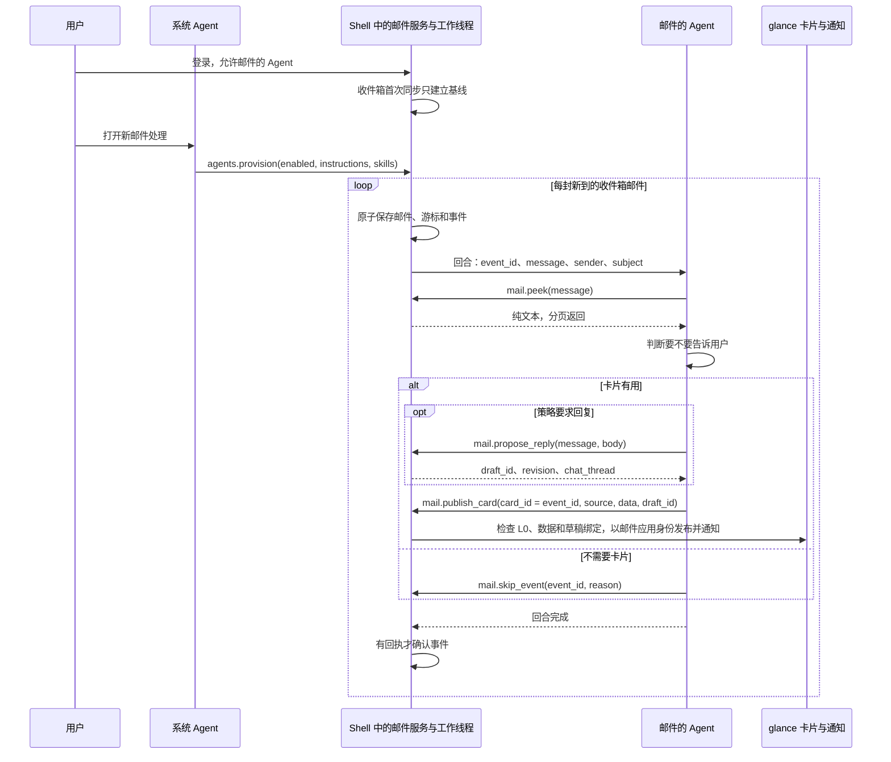

# 邮件事件与应用 Agent

[English](mail-agent-events.md) | 简体中文

邮件的 Agent 不用别人开口就能处理新邮件。Shell 中的一个工作线程同步收件箱，把每封新邮件记为一个事件排入队列，并为它启动邮件的 Agent 的一个回合；Agent 读完邮件，要么发布一张 glance 卡片（如果用户的策略要求回复，卡片会带一份回复草稿），要么记下不发的理由。Agent、通道和卡片的概念见[关键概念](../README.zh-CN.md#关键概念)。

## 开启

用户在 Shell 的面板上登录邮件账号、允许邮件的 Agent，再请系统 Agent 打开新邮件处理。系统 Agent 随即调用 `agents.provision`，参数为 `enabled`、`instructions`、具名的 `skills` 文本，以及可选的 `poll_interval_secs`（30 到 3600 秒，默认 60）。它不能指定账号：Shell 把这份配置绑定到当前登录的账号，并保存在 Agent 的文件夹之外。其中的 instructions 追加在邮件应用已接纳的 `AGENT.md` 之后；与已接纳技能同名的技能会替换那项技能的文本。两者都不授予任何工具。`enabled: false` 关闭处理，`agents.status` 报告配置、队列和最近一次的结果。

邮箱密码和模型提供方的密钥都留在 Shell 一侧，但 Agent 读到的邮件会发送给用户配置的模型提供方。

## 从新邮件到回合

工作线程只有一个，运行在 Shell 进程中。某个账号的收件箱第一次同步时只建立基线，不排入任何事件；IMAP 服务器给文件夹重新编号之后的那次同步也是如此。此后，每一次收件箱同步（工作线程的、邮件窗口的，或 Agent 自己调用的 `mail.sync`）都会把每封新邮件变成一个待处理事件，事件 id 固定不变。邮件、服务器游标和事件在一次原子写入中保存，重启后依然保留。

每个周期只处理一个事件，即最早的那个；没有待处理事件时先同步一次。它的回合在用户的通道中运行，算作应用自己的回合（触发方式为 `incoming`），限时 180 秒。之后工作线程等待一个轮询间隔；如果失败，则先等 30 秒，每次翻倍，最长 15 分钟。

## Agent 如何决定

回合以不可信 JSON 的形式带来事件的各个 id、发件人和主题，邮件应用的指导文本则放在另一个独立的块中。Agent 按照分拣技能读取邮件，然后用下面的工具了结这个事件：

| 工具 | 用途 |
| --- | --- |
| `mail.peek` | 以纯文本读取邮件，每页最多 2,000 字节，不会把邮件标为已读。 |
| `mail.propose_reply` | 如果策略要求回复：为这封邮件新建或复用一份草稿，收件人由宿主填写，并返回它的 `draft_id`。 |
| `mail.publish_card` | 发布模型编写的卡片，以事件 id 作为 `card_id`；如果是回复，再附上 `draft_id`。 |
| `mail.notify` | 生成不了有效卡片时的后备：一条普通通知，`card_id` 相同。 |
| `mail.skip_event` | 记录 `no_action`、`duplicate` 或 `outside_policy`。 |

Shell 把邮件应用的每一次工具调用都绑定到当前登录的账号；限制 Agent 的是这一绑定和工具授权，而不是指导文本。没有任何 Agent 工具能发送邮件：`mail.propose_send` 只准备一份发送提议，只有宿主的审核在 Android 手机上经实体触摸批准，才能授权 SMTP 发送；开发者模式或常设规则也绕不过去。

## 事件何时算处理完

只有在回合已经完成、Agent 对同一账号仍然获准、配置没有变化，并且邮件应用的宿主服务持有该事件 id 的回执（一次发布或一次跳过）时，工作线程才确认事件，把它移出队列。创建草稿不算回执。工具调用失败后给出的最终回答不会留下回执，所以事件会被重试。关闭处理或撤回对 Agent 的允许，会在 250 毫秒内关闭正在运行的回合，它的事件仍保持待处理。

投递至少一次：发布之后、保存回执之前出错，通知会重复，但相同的卡片 id 会替换仍在显示的卡片。完全相同的重试会沿用回执，不再通知；修正过的卡片会以同一个 id 重新发布。

## 卡片

`mail.publish_card` 发布的卡片只能是 L0：没有表达式，也没有脚本。Shell 会检查每个 `sys.dataset` 源都声明了非空的 `fields` 列表，并在 `data` 中为每个字段提供了值，还会检查各个源之间没有循环依赖。这项检查能发现缺失的绑定，发现不了错误的事实。之后 Shell 以邮件应用的身份发布卡片并发出通知；点按通知打开的正是这张卡片，手机上以全屏工作区显示。

带 `draft_id` 时，邮件应用的宿主服务把卡片绑定到账号、邮件、草稿和聊天线程，这个绑定，模型既不能提供，也不能更改。卡片随后可以编辑回复（`sys.mail_draft`）、就回复聊天（`sys.chat`），并打开宿主的审核（`sys.mail_review`）。一封回复从草稿到 SMTP 的路径见[组合 Mail 卡片](mail-composable-cards.zh-CN.md#沿代码追踪一封回复)。

其他需要用户处理的邮件，会得到能用的 `Chip` 按钮，在本地视图之间切换（`state`、`event`、`when`），例如 Show code、Details 和 Back。这些按钮只改变卡片显示的内容，名称也不能声称会发送、预约或追踪。[`mail-shipping.card`](../crates/shell/resources/glance/mail-shipping.card) 和 [`mail-request.card`](../crates/shell/resources/glance/mail-request.card) 展示了语法；其中的发送、追踪和完成状态只是演示。

## 限制

- 邮件窗口可以关闭，但 Android 挂起或终止 OctoSense 期间什么都不会运行；通知显示在 OctoSense 自己的通知栏里，而不是 Android 的通知栏。
- glance 卡片只保存在内存中，重启会清除它们；绑定草稿的邮件卡片例外，Shell 会为当前登录的账号恢复它们，且不再发出通知。
- 邮件最多保留四张有效卡片。第五张卡片或通知会被拒绝；除非 Agent 跳过该事件，它会留在队首，直到有卡片被关闭或过期（默认 24 小时后）。
- 关闭处理时事件仍会排队，而且只有工作线程会移除它们。积满 128 个后，凡是发现新邮件的收件箱同步都会失败且游标不会前移（包括邮件窗口的同步），直到处理消化掉队列。
- 尚未实现：其他应用的事件、定时触发、按应用选择模型、内核原生技能、[ADR 0002（英文）](adr/0002-event-driven-app-agents.md)中的预算与设置界面，以及回复之外的远端操作（Shell 没有 `sys.link` 的处理程序）。

## 阅读源码

1. [`incoming.rs`](../apps/mail/host-service/src/incoming.rs)：队列（`collect`、`skip_event`、`resolve_and_ack_try`）和发布回执（`publish_revision`、`publish_once`）。
2. [`agent_events.rs`](../crates/shell/src/agent_events.rs)：`provision`、`status` 和工作线程（`poll`、`deliver`）。
3. [`script_apps.rs`](../crates/shell/src/host_tools/script_apps.rs)：已接纳的指导文本（`guidance`）和账号绑定（`scoped_args`）。
4. [`guidance.rs`](../crates/app-peers/src/guidance.rs)：每个回合附带的指导文本，最多 16 KiB。
5. [`glance.rs`](../crates/shell/src/glance.rs)：`publish_mail_l0_for` 和 `check_generated_data`。
6. [`mail_card.rs`](../crates/shell/src/mail_card.rs)：绑定卡片的源（`check_sources`）；其中的 `persistence.rs` 负责恢复绑定卡片。
7. [`mobile_app.rs`](../crates/shell/src/mobile_app.rs)：手机上的通知点按。

## 测试情况

在 OnePlus 6 上用 DeepSeek 和 MiniMax 测试：见[新邮件测试](testing/mail-events-2026-10-04.zh-CN.md)和[卡片按钮测试](testing/mail-card-actions-2026-10-04.zh-CN.md)。回复卡片的检查记录在[组合 Mail 卡片](mail-composable-cards.zh-CN.md)中。
