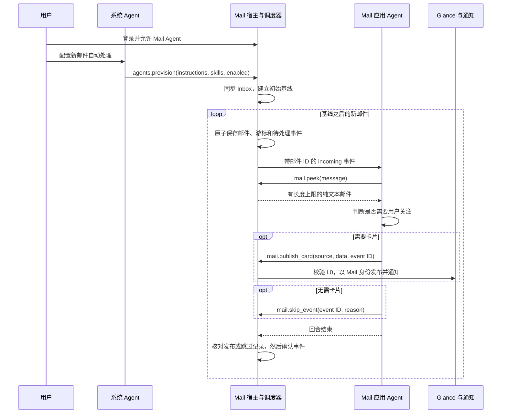

# 邮件事件与应用 Agent

[English](mail-agent-events.md) | 简体中文

Mail 可以处理 Inbox 新邮件，不需要用户逐封发送聊天请求。用户先在宿主登录面板中连接账户，
允许 Mail Agent，再让系统 Agent 配置自动处理。系统 Agent 用 `agents.provision`
设置指令、具名技能文本、启用状态和轮询间隔；`agents.status` 返回配置与处理状态。
模型提供方凭据和邮箱密码留在宿主中；Agent 读取的邮件文本会发送给所配置的模型。

轮询只作用于当前活动、已获用户许可且配置已启用的账户。首次同步和服务器 UID 重置只建立基线，
不会把历史邮件变成通知。待处理事件在重启后仍然保留。失败的回合保持待处理，并退避重试。
确认事件需要回合成功，并且宿主持久保存了发布记录或明确的 `mail.skip_event` 决策
（`no_action`、`duplicate` 或 `outside_policy`）。工具调用失败后给出的最终回答不满足这一条件。

按以下顺序阅读源码：

1. [`incoming.rs`](../apps/mail/host-service/src/incoming.rs) 串行处理 UI 和后台同步。
   邮件、游标和事件队列一次原子保存；队列满时不会推进游标丢失事件。
2. [`agent_events.rs`](../crates/shell/src/agent_events.rs) 在应用工作区之外保存绑定账户的
   配置，启动 incoming 回合，并在等待期间检查取消、授权撤销和账户变化。
   状态读取不会等待同步锁；队列繁忙时返回 `pending: null`、`queue_busy: true`。
   完成处理在同一次非阻塞服务锁中检查已保存的决策并确认事件；繁忙时重试，不冻结 UI。
3. [`script_apps.rs`](../crates/shell/src/host_tools/script_apps.rs) 加载已接纳的
   `AGENT.md`/技能文本，将 Mail 工具调用绑定到 broker 提供的账户。模型不能用参数选择
   另一个账户。`mail.folders`、`mail.list` 读缓存；`mail.sync` 分批刷新指定文件夹；
   `mail.peek` 读取纯文本且不标记已读。Peer 工作区不会挂载密码保险库或邮箱目录。
4. [`guidance.rs`](../crates/app-peers/src/guidance.rs) 为每轮快照宿主指令与技能**文本**，
   已存在的 peer 下一轮也会用新配置。指令和不可信请求放在两个独立序列化文本块中。
   这没有增加内核 system 消息角色，也没有安装原生技能；工具授权和账户检查才是可强制执行的边界。
5. [`glance.rs`](../crates/shell/src/glance.rs) 校验 L0 源码及具名数据集对象，以 Mail 身份发布。
   每个数据集必须声明非空字段列表并提供各字段的值；循环依赖会被拒绝。
   这能发现缺失绑定，但不能证明事实正确或布局好看。
   模型用稳定事件 ID 作为 `card_id`；已记录的发布结果阻止重复发布。若在发布后、记录前崩溃，
   通知仍可能重复，但相同卡片 ID 会替换卡片而非新增另一张。Glance 卡片本身目前只保存在内存，
   这些记录不会在进程重启后恢复可见卡片。
6. [`mobile_app.rs`](../crates/shell/src/mobile_app.rs) 保存每条通知对应的准确卡片键。
   点击通知会在 Glance 上打开该完整卡片；返回键或关闭按钮回到 Glance。
   卡片已移除时安全回退。卡片中独立的打开应用操作仍进入 Mail。

需要用户处理的邮件，生成卡片内部也应有可用控件。Mail 已接纳的技能现在要求使用声明式
L0 `Chip` 按钮、具名事件和本地视图状态，例如“配送详情”或“预约详情”，以及“返回”。
按钮必须展示该邮件中的事实，名称必须准确说明实际效果。正文里的建议、shell 的打开
Mail 控件，或名为“已发送”的本地状态，都不等于实现了邮件操作。
[物流](../crates/shell/resources/glance/mail-shipping.card)和
[请求](../crates/shell/resources/glance/mail-request.card)示例展示交互语法；其中模拟的
发送、追踪和完成状态不能冒充真实远端操作。从生成卡片发送邮件、预约或修改邮箱不在本实现范围内。
下述较早设备试验验证了发布和打开，没有验证卡片内按钮。后续
[配对按钮试验](testing/mail-card-actions-2026-10-04.zh-CN.md)保留较早布局失败，
并实际验证两个模型在手机完整卡片及 Glance 上的取件码→返回→详情→返回。

该共同场景是有取件码、无追踪网址的邮件：“显示取件码”和“取件详情”会展示
邮件提供的码、地点、截止时间及携带带照片证件的要求，两种视图都能返回。这些本地控件
实现了[邮件操作卡片计划](../apps/mail/docs/2026-10-01-email-action-card-plan.md)中
当前可支持的部分。计划中的外部 Track 操作仍是另外的工作：L0 虽然收录了 `sys.link`，
本 shell 并不执行其写操作。没有网址时不能编造链接或显示虚假的追踪成功页面。

当前 shell 有渲染限制：已通过校验的 `Chip(width: .fill)` 可能在 Fit 包装内收缩到不可见。
因此已接纳技能要求省略 width，使用自然宽度、纵向排列及短标签。这是渲染器限制，
不是非法 L0 token。[按钮后续试验](testing/mail-card-actions-2026-10-04.zh-CN.md)
分别记录布局失败、实际手机点击及尚未实现的远端操作范围。

处理期间 Mail 窗口可以关闭，但 OctoSense 进程必须存活。当前没有 Android JobScheduler/WorkManager、
前台服务或 Android NotificationManager 集成。通知显示在 OctoSense 自己的通知栏，
卡片显示在 Glance。不能承诺 Android 挂起或终止进程后仍会送达。

这里只实现 Mail 的 `mail.messages.new` 触发器。通用 cron、任意应用事件路由、每应用模型选择、
内核原生技能发现，以及 ADR 0002 剩余预算和 Settings 界面仍是后续工作。系统 Agent 的配置
补充应用已接纳的指令；邮件内容不能配置 Agent 或扩大工具权限。关闭配置或撤销 Agent
访问权会停止新回合并取消调度器的活动上下文。

验证：在 OnePlus 6 上，经 Gmail 投递的邮件触发了真实的 DeepSeek 和 MiniMax Mail 回合，
无需逐封提示。两个模型都跳过了普通简报，并发布了可读的物流和预约卡片（MiniMax 的卡片可从通知打开）；
一张数据绑定缺失的 MiniMax 卡片促成了生成数据校验。构建范围、原始产物和限制见
[测试记录](testing/mail-events-2026-10-04.zh-CN.md)。试验策略只处理主题以
`[OctoSense simulation]` 开头的邮件，其他邮件不读正文，直接跳过。
