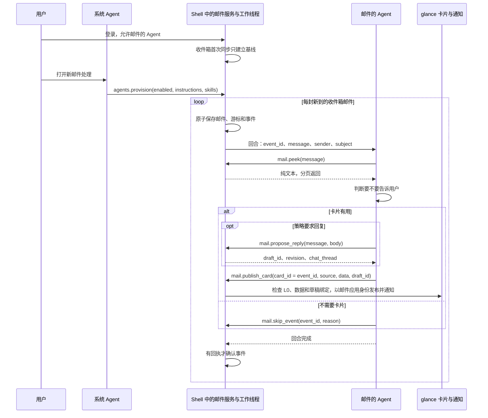

# 邮件事件与应用 Agent

[English](mail-agent-events.md) | 简体中文

邮件的 Agent 不用别人开口就能处理新邮件。Shell 独立于模型回合同步收件箱，把每封新邮件记为一个事件排入队列，并为它启动邮件的 Agent 的一个回合；Agent 读完邮件，要么发布一张 glance 卡片（如果用户的策略要求回复，卡片会带一份回复草稿），要么记下不发的理由。Agent、通道和卡片的概念见[关键概念](../README.zh-CN.md#关键概念)。

## 开启

用户在 Shell 的面板上登录邮件账号、允许邮件的 Agent，再请系统 Agent 打开新邮件处理。系统 Agent 随即调用 `agents.provision`，参数为 `enabled`、`instructions`、具名的 `skills` 文本，以及可选的 `poll_interval_secs`（30 到 3600 秒，默认 60）。它不能指定账号：Shell 把这份配置绑定到当前登录的账号，并保存在 Agent 的文件夹之外。其中的 instructions 追加在邮件应用已接纳的 `AGENT.md` 之后；与已接纳技能同名的技能会替换那项技能的文本。两者都不授予任何工具。`enabled: false` 关闭处理，`agents.status` 报告配置、队列和最近一次的结果。

邮箱密码和模型提供方的密钥都留在 Shell 一侧，但 Agent 读到的邮件会发送给用户配置的模型提供方。

## 从新邮件到回合

Shell 进程中有两个线程：`incoming-mail-collector` 同步收件箱，`incoming-mail-agent` 串行投递队列中的事件。某个账号的收件箱第一次同步时只建立基线，不排入任何事件；IMAP 服务器给文件夹重新编号之后的那次同步也是如此。此后，每一次收件箱同步（工作线程的、邮件窗口的，或 Agent 自己调用的 `mail.sync`）都会把每封新邮件变成一个待处理事件，事件 id 固定不变。邮件、服务器游标和事件在一次原子写入中保存，重启后依然保留。

每次收取结束后，收取线程等待配置的轮询间隔，即使队列非空、模型回合仍在运行或已经失败，也继续收取。投递线程选择最早到期的可处理事件；到期时间相同时保持队列顺序。每个失败事件独立退避：先等 30 秒，每次翻倍，最长 15 分钟。等待期间其他到期事件仍可处理，旧事件的重试也不会反复抢在更早等待的事件前面。进程重启或策略变更会重置重试计时，持久化事件不会丢失。

每个回合在用户通道中运行，算作应用自己的回合（触发方式为 `incoming`），限时 180 秒。每次投递尝试后等待一秒再选择下一个可执行事件；收取使用独立的轮询间隔。慢回合仍会延迟其他回合，但不会阻止收取。收取期间邮件服务仍串行访问存储；界面状态和投递队列检查使用非阻塞锁。

`agents.status.runtime` 分别报告收取与投递：`last_poll_at` 是最近一次已结束的收取尝试，`last_collection_success_at` 是最近一次成功收取，`last_success_at` 是最近一次成功确认事件。`last_collection_error` 和 `last_delivery_error` 仅在各自阶段成功后清除，成功收取不会掩盖模型回合失败。`last_receipt` 是两个线程中最近一次的结果。

## Agent 如何决定

同步和评估邮件本身不会通知用户。系统 Agent 可以配置选择性策略：先阅读，再仅对医疗、物流、日程、学校/工作或家庭事项中与用户有关且有操作、期限或重要变化的邮件通知。常规自动提醒、新闻订阅和无需操作的更新应使用 `mail.skip_event`；普通通知的后备路径也必须遵守同样的重要性门槛。这是模型指导文本，不是宿主中的确定性分类器。

回合以不可信 JSON 的形式带来事件的各个 id、发件人和主题，邮件应用的指导文本则放在另一个独立的块中。Agent 按照分拣技能读取邮件，然后用下面的工具了结这个事件：

| 工具 | 用途 |
| --- | --- |
| `mail.peek` | 以纯文本读取邮件，每页最多 2,000 字节，不会把邮件标为已读。 |
| `mail.propose_reply` | 如果策略要求回复：为这封邮件新建或复用一份草稿，收件人由宿主填写，并返回它的 `draft_id`。 |
| `mail.publish_card` | 发布模型编写的卡片，以事件 id 作为 `card_id`；如果是回复，再附上 `draft_id`。 |
| `mail.notify` | 生成不了有效卡片时的后备：一条普通通知，`card_id` 相同。 |
| `mail.skip_event` | 记录 `no_action`、`duplicate` 或 `outside_policy`。 |

Shell 把邮件应用的每一次工具调用都绑定到当前登录的账号；限制 Agent 的是这一绑定和工具授权，而不是指导文本。没有任何 Agent 工具能发送邮件：`mail.propose_send` 只准备一份发送提议，只有宿主的审核在 Android 手机上经实体触摸批准，才能授权 SMTP 发送；开发者模式或常设规则也绕不过去。

## 事件何时算处理完

只有在回合已经完成、Agent 对同一账号仍然获准、配置没有变化，并且邮件应用的宿主服务持有该事件 id 的回执（一次发布或一次跳过）时，工作线程才确认事件，把它移出队列。创建草稿不算回执。如果回合成功后收取线程仍占用邮箱锁，投递线程会在同一期限内重试确认，不再请求模型；账号、授权和策略检查仍然生效。工具调用失败后给出的最终回答不会留下回执，所以事件会被重试。关闭处理或撤回对 Agent 的允许，会在 250 毫秒内关闭正在运行的回合，它的事件仍保持待处理。

投递至少一次：发布之后、保存回执之前出错，通知会重复，但相同的卡片 id 会替换仍在显示的卡片。完全相同的重试会沿用回执，不再通知；修正过的卡片会以同一个 id 重新发布。

## 卡片

`mail.publish_card` 发布的卡片只能是 L0：没有表达式，也没有脚本。Shell 会检查每个 `sys.dataset` 源都声明了非空的 `fields` 列表，并在 `data` 中为每个字段提供了值，还会检查各个源之间没有循环依赖。这项检查能发现缺失的绑定，发现不了错误的事实。之后 Shell 以邮件应用的身份发布卡片并发出通知；点按通知打开的正是这张卡片，手机上以全屏工作区显示。

带 `draft_id` 时，邮件应用的宿主服务把卡片绑定到账号、邮件、草稿和聊天线程，这个绑定，模型既不能提供，也不能更改。卡片随后可以编辑回复（`sys.mail_draft`）、就回复聊天（`sys.chat`），并打开宿主的审核（`sys.mail_review`）。一封回复从草稿到 SMTP 的路径见[组合 Mail 卡片](mail-composable-cards.zh-CN.md#沿代码追踪一封回复)。

系统代理的配置区分自动草稿和 **Compose reply（撰写回复）**。可回复的重要邮件
可以自动附带草稿；自动发送或 no-reply 邮件则可以先保持信息卡片，等用户点击
Compose reply。宿主为新邮件事件卡片提供该操作，在后台线程根据账号的持久发布
记录和邮件缓存确定原邮件，再请 Mail 代理创建草稿，并用原卡片 id、`draft_id` 和
`notify:false` 重新发布。生成的数据不能指定原邮件身份；原邮件缺失时显示错误，
不会选择其他邮件。

缺少 `draft_id` 时，卡片只有通用 Card/Chat，无法编辑邮件草稿。代理附加草稿后，
宿主在原处初始化 Email/Chat 工作区，并保留尚未提交的聊天输入。生成的摘要不应
重复制作这些标签页或输入框。在上下文预算允许时，邮件聊天还附带卡片 id 和当前
源码/data，代理可以直接修复发布内容，无需搜索无关工作区文件。自动发送或 no-reply
邮件需要提醒用户检查收件人，
不得编造替代地址。Compose reply 只授权创建草稿；发送始终需要用户在宿主审核
界面上亲自确认。只要原邮件缓存和发布记录仍在，旧邮件事件卡片也支持该操作。

其他需要用户处理的邮件，会得到能用的 `Chip` 按钮，在本地视图之间切换（`state`、`event`、`when`），例如 Show code、Details 和 Back。这些按钮只改变卡片显示的内容，名称也不能声称会发送、预约或追踪。[`mail-shipping.card`](../crates/shell/resources/glance/mail-shipping.card) 和 [`mail-request.card`](../crates/shell/resources/glance/mail-request.card) 展示了语法；其中的发送、追踪和完成状态只是演示。

## 限制

- Android 为已启用且已授权的 Mail 账户注册持久化、要求联网的 JobScheduler 任务：周期 15 分钟，弹性窗口 5 分钟。Doze、配额和网络条件可能推迟执行；这是定期轮询，不是推送。强行停止应用后，必须由用户重新打开才会恢复任务。任务无需 Activity 即可启动同一个 Rust 宿主，每次最多四分钟，也可能被 Android 提前停止；无需前台服务常驻通知。见 [ADR 0008](adr/0008-quiet-android-mail-jobs.zh-CN.md)。
- Android 为 Mail 发布保存有上限的私有通知发件箱。模型根据已配置的重要性偏好作出决定后，只有 `notify: true` 的卡片才产生 Android 原生通知，仍受通知权限和频道设置限制。点击通知会为原始且当前有效的账户恢复原始、重新验证过的卡片，不能批准发送回复。绑定草稿的卡片仍读取权威的已保存草稿。其他应用卡片若无专用持久化能力，仍仅保存在内存中。
- 邮件最多保留四张有效卡片。第五张卡片或通知会被拒绝；除非 Agent 跳过该事件，它会保持待处理并重试，直到有卡片被关闭或过期（默认 24 小时后）；其他事件仍可评估和跳过。
- 关闭处理时事件仍会排队，而且只有工作线程会移除它们。积满 128 个后，凡是发现新邮件的收件箱同步都会失败且游标不会前移（包括邮件窗口的同步），直到处理消化掉队列。
- 尚未实现：其他应用的事件、定时触发、按应用选择模型、内核原生技能、[ADR 0002（英文）](adr/0002-event-driven-app-agents.md)中的预算与设置界面，以及回复之外的远端操作（Shell 没有 `sys.link` 的处理程序）。

## 阅读源码

1. [`incoming.rs`](../apps/mail/host-service/src/incoming.rs)：队列（`collect`、`skip_event`、`resolve_and_ack_try`）和发布回执（`publish_revision`、`publish_once`）。
2. [`agent_events.rs`](../crates/shell/src/agent_events.rs)：`provision`、`status` 和收取与投递线程（`collector`、`worker`、`EventSchedule`、`process_event`、`deliver`）。
3. [`script_apps.rs`](../crates/shell/src/host_tools/script_apps.rs)：已接纳的指导文本（`guidance`）和账号绑定（`scoped_args`）。
4. [`guidance.rs`](../crates/app-peers/src/guidance.rs)：每个回合附带的指导文本，最多 16 KiB。
5. [`glance.rs`](../crates/shell/src/glance.rs)：`publish_mail_l0_for` 和 `check_generated_data`。
6. [`mail_card.rs`](../crates/shell/src/mail_card.rs)：绑定卡片的源（`check_sources`）；其中的 `persistence.rs` 负责恢复绑定卡片。
7. [`mail_background.rs`](../crates/shell/src/mail_background.rs)：执行租约、私有通知发件箱、账户与到期检查、通知恢复。
8. [`android_mail.rs`](../phone/src/android_mail.rs) 和 [`MailJobService.java`](../phone/resources/android/java/dev/makepad/octosense/MailJobService.java)：无界面的 JNI 入口、有时限的系统任务与通知导航。[`runtime_host.rs`](../crates/shell/src/runtime_host.rs) 仅初始化一次共享服务，不创建第二个内核或对等代理。

## 测试情况

在 OnePlus 6 上用 DeepSeek 和 MiniMax 测试：见[新邮件测试](testing/mail-events-2026-10-04.zh-CN.md)和[卡片按钮测试](testing/mail-card-actions-2026-10-04.zh-CN.md)。回复卡片的检查记录在[组合 Mail 卡片](mail-composable-cards.zh-CN.md)中。
