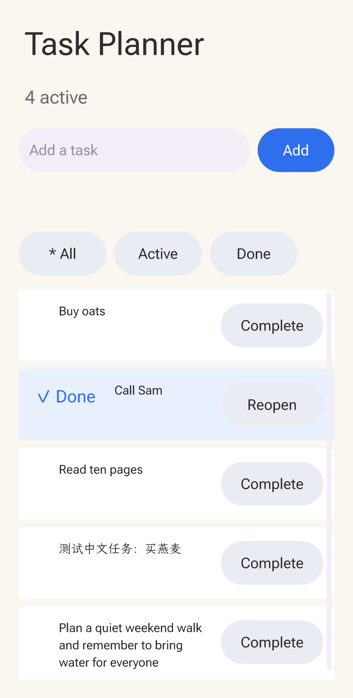
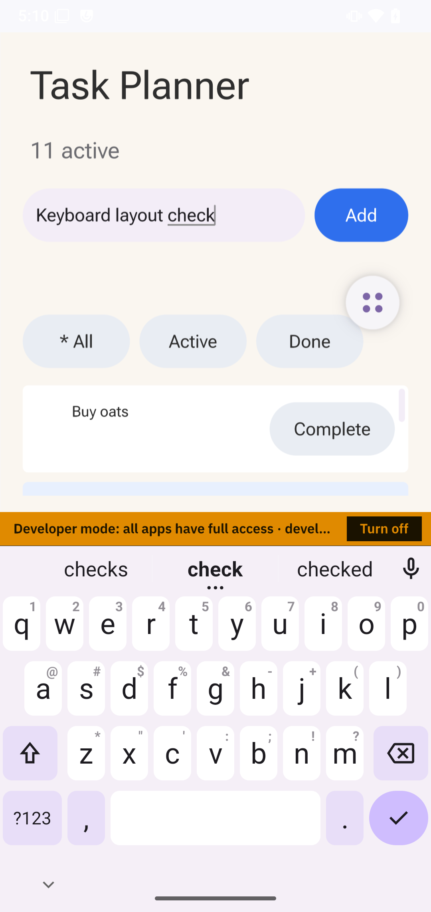

# App Studio: OnePlus 6 validation

A fresh Task Planner authored by DeepSeek V4 Flash passed physical-device functional testing and manual app visual review in the isolated `dev.makepad.octosense.studio` package. This validates the implemented local, offline app path; it does not complete ADR 0006's image-generation and editable-workflow design.

## Scope and provenance

The model authored `DESIGN.md`, the bundle manifest, `main.splash` and an original icon. The shared kernel drove Studio tools; five recorded `view_image` calls returned `shown_to_model: true`, followed by continued model work. That establishes image delivery and continuation, not perfect visual understanding. The independent [device harness](../../tools/studio-flow-device-test.py) then exercised the resulting bundle without directly modifying its source or app storage.

Evidence identifiers from the retained local run artifacts:

| Record | Digest |
| --- | --- |
| Admitted bundle, BLAKE3 | `7892501e8b69d752b002130879dde11af8f7c7e7b7e620a6854b97892fc95f3b` |
| Model transcript, SHA-256 | `2d35937d1165d22e9f1ee8a1509064afe33df7f311ee7e2b80420ff4af34e219` |
| Generation receipt, SHA-256 | `495461c440b451047bd32114a47ba69e778a9cb25eafdb72c1f99094fb0da6db` |
| Acceptance contract, SHA-256 | `58a2091f2593a231982f755f643559b9dc29649b8d657b67c4edc3d3cbf715` |

The functional run is `adr0006-task-planner-acceptance-v2`; the generation receipt is `adr0006-generated-app-final/generation-receipt.json`. These tests used the implementation working tree before final rebase/integration. They are evidence for that tested build and bundle, not a claim that a later rebased binary was rerun. Raw provider configuration, personal paths and device identifiers are not published here.

The final tools Python test run passed 105 tests before rebase. This supplements the device evidence; it does not replace it.

## Functional result

Version 2 completed **129 tool calls**. It verified task entry, completion, All/Active/Done filtering, disposable preview state, separate installed storage, installed close/reopen and process-restart persistence. Exact Chinese input survived reopening. Seven additional rows made a real scrollable list; the instrument reached the last row. The full diagnostic artifacts retained native widget values, geometry and screenshots while compact tool replies exposed usable selectors to the model.

The first harness run stopped after ten calls with “Add did not clear the text input.” This was a harness assertion error: Makepad exposes the placeholder as display text, while the editable `value` was empty. The corrected assertion requires the actual TextInput value. Version 2 retained the same admitted bundle digest; no app-source change was used to bypass the failure.

The model's earlier turn stopped at its 32-call host budget and explicitly left persistence, scrolling, Chinese glyphs and some visual checks unverified. The independent device run and manual review below supply those additional observations; the model's self-report alone is not the acceptance result.

## Manual visual review

Portrait app captures showed readable text, correct long-title wrapping, reachable bottom rows, readable Chinese glyphs, good app contrast and no unintended app overlap. A separate Android-wide screenshot showed the keyboard open: the input, Add button and filters remained above it, and the list viewport shrank correctly. App-only texture captures cannot establish keyboard presentation by themselves.

The UI is usable, with generous spacing that leaves only about one task row above the keyboard. Two shell observations are separate from the generated app: the floating four-dot overlay sits near the Done filter without obscuring its label, and white status-bar content has low contrast against the light background. This is a successful scoped review, not a claim of flawless UI.

The harness's machine-readable status remains `functional_passed_visual_review_required`; the subsequent manual review recorded here completes the observed portrait visual checks. Rotation/landscape behavior was not established.

## Retained review captures

These unmodified screenshots are from the pre-rebase device run described above.

## Remaining limits

Malformed saved JSON preservation and save-failure reporting were not fault-injected. This run does not claim a full-app developer-revocation fault test; earlier L0 denial/background tests cover a narrower path. The app remains a local `dev.studio.*` developer install, with no publisher signature or public catalog admission.

The `mod.studio` toolbox adapter, editable flow templates, image generation/comparison and rich in-screen asset routes remain unimplemented. See [ADR 0006](../adr/0006-app-studio-on-the-phone.md) for the implemented boundary and intended later work.
