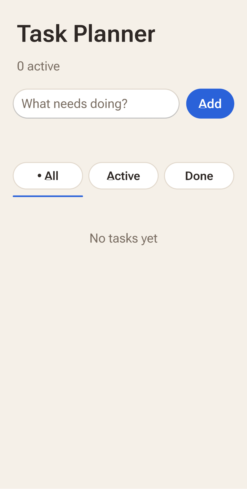
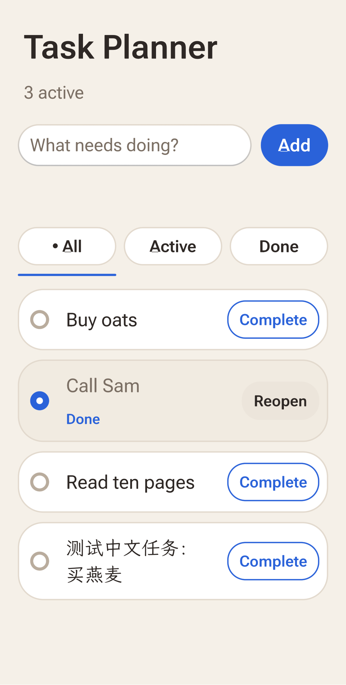
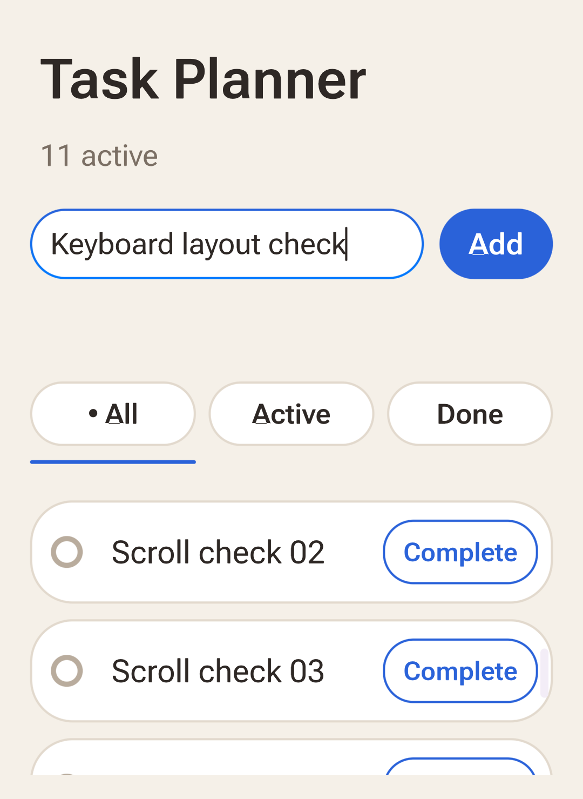

# App Studio re-validation on a stock Android phone

The rebased App Studio (branch `studio/313-rebase`, source `cde02171`, after the
merge of `main` `3bd15bad` and the review fixes) was re-run on a Xiaomi
23021RAAEG, Android 15, stock launcher, with OctoSense Home already installed
from the store beside it. Only the separate developer test package
`dev.makepad.octosense.studio` was installed and used; the installed Home, its
Bridge and the default launcher were untouched. The OnePlus 6 evidence in
[oneplus6-validation.md](oneplus6-validation.md) belongs to the pre-rebase
build and does not transfer; this run replaces it for the rebased code.

## Build

| Item | Value |
| --- | --- |
| Source | `cde02171` (clean tree), built with `--dev-mode --development --package-name dev.makepad.octosense.studio` and `MAKEPAD_FORCE_DEBUGGABLE=1`, so `run-as` works on a stock phone |
| Home APK, SHA-256 | `801296dccbaf5c843685ddf4816eb0408cc20557565b41830b71294ae1c1b034` |
| Developer mode | Provisioned in the test profile only (`files/.octosense/developer-profile` and `dev-mode.json`, scope `all`); the probe restores the previous state when it finishes |

## L0 render probe (`tools/studio-device-probe.py`)

All four cases passed: `denied` (no developer grant: refused), `light` and `dark`
(970×575 PNGs with different content, `25c462be…` and `0621af7c…`), and
`background`. This is the milestone 1 render evidence the earlier report did
not include.

## Task Planner acceptance (`tools/studio-flow-device-test.py`)

The authoring model was Claude Fable 5.1, run as a subagent of this session
from [task-planner-brief.md](task-planner-brief.md) with the acceptance
contract and App Flow's Splash documentation as its only references; the
Codex session's DeepSeek bundle of 3 October was not available on this machine.
The model's transcript and the bundle are kept outside the repository; their
hashes bind the run.

| Item | SHA-256 |
| --- | --- |
| Bundle digest (`studio.bundle_check`, BLAKE3 as App Hub computes it) | `72af424c6cc5f1fa1f665074df68a8e473ae530fa588e716e5badb8f77922ae7` |
| `main.splash` (10,251 bytes) | `cddbd51e4baf590e…` |
| Authorship transcript | `2b6e0f872d318643d612a13783dd144b9093fa97d3fc6ddca06c9415ab65ab02` |
| Generation receipt | `5435402c9b2d1df0a4e2584199cfb47238866fdc5128778ec1c342d14aeae233` |
| Acceptance contract | `58a2091f2593a231982f755f643559b9dc29649b8d657b67c4edc3d3d3cbf715` |

Result: `functional_passed_visual_review_required`, 2 minutes, **129 tool
calls, every one answered** (`studio.bundle_check` 1, `studio.open` 6,
`studio.inspect` 61, `studio.input` 55, `studio.close` 5, `studio.install` 1).
Checks passed: model bundle digest binding; preview interactions (empty state,
blank-title validation, three tasks added through native text input, complete,
All/Active/Done filters, reopen, controls at least 44 logical pixels high);
preview storage discarded on close and reopen; developer install with the
checked digest preserved; the installed app's interactions with storage
separate from the preview; close and reopen; persistence across a process
restart; the Chinese title `测试中文任务：买燕麦` entered natively and present
after reopen; native scrolling with seven extra rows; the long title. The
keyboard was observed open and owned by the test package. The two fault
checks (malformed `tasks.json` preserved, save failure reported) were not run;
they need isolated fault injection.

Visual review of the captures (readability, clipping, overlap, contrast,
orientation, multilingual glyphs, keyboard): passed. The screens are readable
with no clipping or overlap, portrait, the CJK title wraps over two lines, the
completed row shows a filled disc, a "Done" caption, a muted title and a
"Reopen" control, and with the keyboard open the field stays visible and the
list scrolls. One observation belongs to the shell, not the app: the bold
capital "A" ("Add", "All", "Active") renders with a small artifact at its
baseline on this device.

## Not covered

Fault injection; landscape; an app-peer caller (the harness runs as the system
session); the ROM capture path; a release build of Home.
